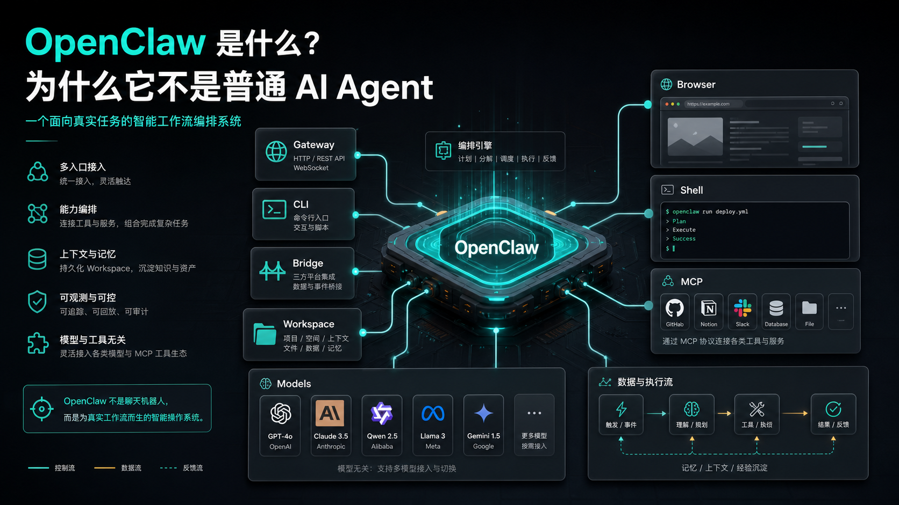
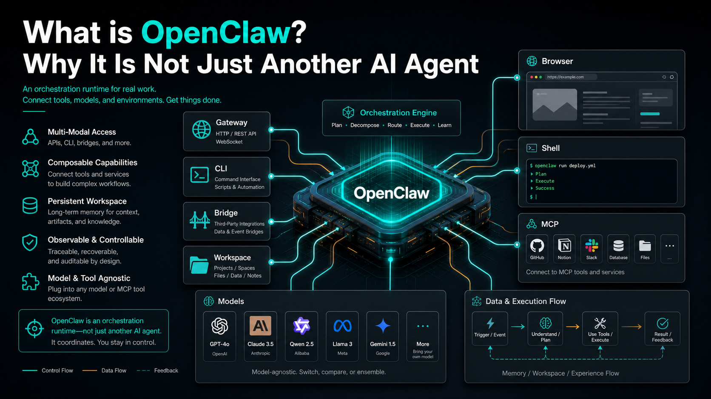

# OpenClaw 是什么？为什么它不是普通 AI Agent





这两年，AI Agent 这个词已经被用得太多了。

会聊天，叫 Agent。

会调用工具，叫 Agent。

会写代码，叫 Agent。

能打开浏览器点几下按钮，也叫 Agent。

于是很多人第一次看到 OpenClaw，也会自然地把它归到同一类东西里：一个更强一点的 AI 助手，一个能接模型、能跑命令、能操作浏览器的 Agent 框架。

但如果只这样理解 OpenClaw，其实就把它看小了。

OpenClaw 真正重要的地方，不是“它又做了一个 Agent”，而是它在回答一个更工程化的问题：

**当 AI Agent 真的要进入真实业务、真实系统、真实部署环境时，它应该怎么运行？**

这才是 OpenClaw 和普通 AI Agent 拉开差距的地方。

## 先说结论：OpenClaw 不是聊天机器人

OpenClaw 更适合被理解为一套 **AI Agent 运行平台**。

普通 AI Agent 的核心通常是：

```text
用户输入
  ↓
模型思考
  ↓
调用工具
  ↓
返回结果
```

这个流程没有问题，做 Demo 很快，也很容易让人看到效果。

但真实场景不会这么简单。

真实场景里，你会遇到这些问题：

- 用户请求可能来自网页、CLI、HTTP API、企业微信、Telegram 或自动任务
- 模型可能不止一个，要支持 OpenAI、Claude、Gemini、Qwen、MiniMax 或 OpenAI Compatible
- 工具可能不止浏览器，还包括 Shell、文件系统、MCP、数据库、内部接口和消息平台
- 任务执行需要工作区，需要文件，需要上下文，需要中间状态
- 出错以后不能只说“模型失败了”，而要能定位是哪一层失败
- 部署时要考虑 Docker、端口、权限、日志、环境变量和数据目录

普通 Agent 往往只关心“能不能完成这一次任务”。

OpenClaw 更关心“这个 Agent 能不能作为一个系统长期稳定运行”。

## 普通 Agent 最大的问题：演示很强，落地很难

很多 AI Agent Demo 看起来非常惊艳。

你告诉它：“帮我打开一个网站，查一下价格，然后整理成表格。”

它真的能打开浏览器，搜索网页，读取内容，最后输出结果。

但当你准备把这个能力放进实际业务里，就会发现麻烦来了。

比如你要做一个企业知识库助手。

一开始你可能觉得很简单：

```text
用户提问 → AI 回答
```

但真正做起来，流程会变成：

```text
用户提问
  ↓
识别用户身份
  ↓
判断权限
  ↓
检索知识库
  ↓
调用模型生成答案
  ↓
记录日志
  ↓
必要时触发人工处理
  ↓
把结果返回到企业微信或 Web 页面
```

这已经不是一个简单聊天窗口能解决的问题了。

你需要入口管理，需要工具管理，需要权限管理，需要日志，需要错误处理，需要部署方案，还需要让 Agent 能够访问自己的工作目录和外部系统。

这就是 OpenClaw 要解决的问题。

## OpenClaw 到底是什么

如果用一句话概括：

**OpenClaw 是一个把模型、工具、插件、浏览器、Shell、工作区和外部入口组织起来的 Agent Runtime。**

这里的关键词不是 Agent，而是 Runtime。

Agent 负责思考。

Runtime 负责让它能在真实环境里做事。

你可以把 OpenClaw 拆成几个关键部分来看：

```text
外部请求
  ↓
Gateway
  ↓
Agent 执行层
  ↓
模型 Provider / Tool / Plugin / Workspace
  ↓
浏览器、Shell、MCP、文件、消息平台、业务系统
```

它不是把所有能力揉成一个黑盒，而是把 Agent 运行过程拆成可理解、可配置、可扩展的模块。

这也是为什么学习 OpenClaw，不能只盯着“怎么问 AI 一个问题”。

你真正要学的是：

- 请求如何进入 OpenClaw
- OpenClaw 如何选择模型
- Agent 如何拿到工具
- Browser 和 Shell 如何参与执行
- Workspace 如何保存任务现场
- 插件如何扩展系统能力
- 出错时应该从哪里排查

这些东西组合在一起，才是 OpenClaw 的完整价值。

## 它为什么不是普通 AI Agent

### 1. 普通 Agent 面向对话，OpenClaw 面向执行

普通 Agent 的第一目标是回答用户。

OpenClaw 的第一目标是组织一次可执行的任务。

回答只是结果之一。

在 OpenClaw 里，模型不是单独工作的。它要和工具、浏览器、Shell、文件系统、插件、工作区一起协同。用户看到的是一句回复，但系统背后发生的可能是读取文件、执行命令、打开网页、调用 API、生成内容、写入工作区、返回结构化结果。

这就是“聊天体验”和“执行系统”的区别。

### 2. 普通 Agent 重模型，OpenClaw 重系统

很多 Agent 产品会把重点放在模型上：用了哪个大模型，推理有多强，上下文有多长。

这些当然重要。

但在真实业务中，模型只是其中一层。

如果没有稳定的工具层，模型再强也无法连接真实世界。

如果没有清晰的工作区，任务执行到一半就会丢状态。

如果没有可配置的 Provider，换模型、降级、代理、自建接口都会很痛苦。

如果没有插件机制，每接一个新平台都要重写一套。

OpenClaw 的思路是：模型负责智能，系统负责把智能落到具体动作里。

### 3. 普通 Agent 难部署，OpenClaw 从部署角度设计

普通 Agent Demo 往往是在本机跑起来就算成功。

但你要真放到服务器上，就会立刻遇到一堆细节：

- Docker 怎么安装
- docker-compose 怎么写
- 端口如何暴露
- workspace 放在哪里
- `.env` 怎么配置
- provider key 怎么保存
- dashboard 怎么登录
- doctor 怎么排错
- gateway 无响应怎么办

这些问题听起来琐碎，但它们决定了一个 Agent 能不能从玩具变成系统。

OpenClaw 的学习路线里专门有“环境部署”和“生产部署”两个阶段，原因就在这里。

### 4. 普通 Agent 难扩展，OpenClaw 把扩展作为核心能力

一个 Agent 只会聊天，价值有限。

它必须能接工具。

它必须能接业务系统。

它必须能接消息平台。

它必须能接企业内部接口。

OpenClaw 通过插件、MCP、Browser、Shell、Bridge 等能力，把 Agent 的边界往外推。

你可以让它操作网页，可以让它跑命令，可以让它对接企业微信、Telegram、WhatsApp，也可以让它连接你自己的业务系统。

所以 OpenClaw 不是一个固定形态的 Agent。

它更像一个可以不断加能力的 Agent 底座。

## 用一个例子理解 OpenClaw 的价值

假设你要做一个“企业微信自动问答助手”。

普通 Agent 的做法可能是：

```text
收到消息 → 发给大模型 → 返回答案
```

这个版本很快能跑，但也很快会出问题。

用户问公司制度，它可能胡说。

用户问没有权限的内容，它可能照样回答。

模型接口失败，它可能直接无响应。

管理员想看日志，你可能没有记录。

后面想接知识库、审批系统、数据库、工单系统，每一步都要重新补架构。

如果换成 OpenClaw 的思路，系统会更像这样：

```text
企业微信消息
  ↓
Gateway 接收请求
  ↓
识别用户与上下文
  ↓
进入 Workspace 保存任务现场
  ↓
调用 RAG / 内部 API / MCP 工具
  ↓
选择合适模型生成答案
  ↓
记录执行日志
  ↓
返回企业微信
```

这时 Agent 不再是一个“会聊天的模型”，而是一个被放进业务流程里的执行节点。

这就是 OpenClaw 的意义。

## 学 OpenClaw，千万别只学命令

很多人学一个新工具，习惯先找命令：

怎么启动？

怎么配置？

怎么接模型？

怎么装插件？

这些当然要学，但如果只学命令，很容易学成碎片。

学 OpenClaw 更好的方式，是先建立系统地图：

```text
入口层：CLI / Dashboard / HTTP API / 消息平台
调度层：Gateway / Bridge
执行层：Agent / Tool / Plugin
能力层：Model Provider / Browser / Shell / MCP
状态层：Workspace / 文件 / 日志 / 环境变量
部署层：Docker / Nginx / HTTPS / 多节点
业务层：机器人 / RAG / 数据分析 / SaaS
```

后面你看到任何配置项，都可以把它放回这张地图里。

比如：

- `providers` 属于模型接入层
- `.env` 属于环境配置层
- `workspace` 属于状态层
- `Browser` 属于工具能力层
- `Gateway` 属于请求调度层
- `doctor` 属于诊断排错层

这样学，OpenClaw 就不会是一堆命令和报错，而是一套可以逐步掌握的系统。

## 谁适合学习 OpenClaw

如果你只是想找一个 AI 聊天工具，OpenClaw 可能显得有点重。

但如果你有下面这些目标，它就非常值得学：

- 想把 AI Agent 部署到服务器或内网环境
- 想做企业微信、Telegram、WhatsApp 这类消息机器人
- 想让 Agent 自动操作浏览器或 Shell
- 想接入多个模型并自由切换
- 想把 Agent 和内部业务系统打通
- 想做 RAG、自动问答、数据分析或运营自动化
- 想把 Agent 能力产品化，甚至做成 SaaS

一句话：

**OpenClaw 适合那些不满足于“玩一玩 Agent”，而是想把 Agent 做成真实系统的人。**

## 常见误解

### 误解一：OpenClaw 就是另一个 Claude Code

Claude Code 更偏向代码开发助手。

OpenClaw 的范围更大，它关注的是 Agent 运行平台和工具生态。代码只是它可能处理的一类任务，不是全部。

### 误解二：OpenClaw 只是一个套壳 ChatGPT

如果只是套壳，就不需要 Gateway、Bridge、Workspace、Plugin、Browser、Shell、MCP 这些模块。

OpenClaw 的重点不是把模型包装成聊天界面，而是让模型能调用工具、进入流程、接入系统。

### 误解三：OpenClaw 只适合开发者

OpenClaw 确实需要一定工程理解，但它不只是给程序员写代码用的。

运营自动化、客服机器人、企业知识库、数据分析、内部流程助手，都可以建立在这类 Agent Runtime 之上。

区别只是：开发者负责搭系统，业务人员使用系统能力。

## 最后总结

OpenClaw 不是普通 AI Agent。

它不是简单地让 AI 多会几个工具，也不是给大模型套一个聊天界面。

它真正做的是把 AI Agent 放进一个工程化运行环境里，让它可以接模型、接工具、接浏览器、接 Shell、接插件、接工作区、接业务系统，最终变成一个可以部署、可以扩展、可以调试、可以产品化的执行平台。

普通 Agent 解决的是：

```text
AI 能不能帮我完成一次任务？
```

OpenClaw 解决的是：

```text
AI 能不能稳定地进入真实系统，长期帮我处理任务？
```

这就是两者的本质区别。

## 本节作业

完成下面几个小任务，不需要写代码，重点是把 OpenClaw 的系统感建立起来：

1. 用一句话写出你理解的 OpenClaw：它到底是聊天工具、代码助手，还是 Agent Runtime？
2. 画一张自己的 OpenClaw 系统地图，至少包含模型、工具、浏览器、Shell、插件、Workspace、Gateway。
3. 找一个你真实想自动化的场景，比如客服回复、网页后台检查、文件整理、数据分析，写出它需要哪些工具能力。
4. 对比一个普通聊天机器人和 OpenClaw，列出 3 个“普通聊天机器人做不到或很难稳定做到”的点。
5. 思考一个生产环境问题：如果 Agent 做错了动作，你希望系统在哪些环节能记录、限制或回滚？

## 下一节预告

下一节我们会继续拆 OpenClaw 的核心结构：Gateway、CLI、Bridge、Workspace。

只要这四个概念搞清楚，后面学习模型接入、插件系统、部署排错和企业实战，就会轻松很多。你会开始知道：用户的一句话进入 OpenClaw 后，到底经过哪些入口、调度和工作现场。
