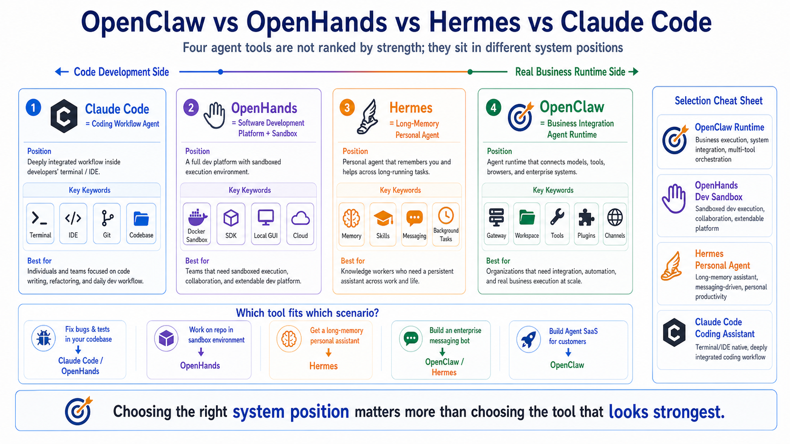

# OpenClaw vs OpenHands vs Hermes vs Claude Code



When people start learning AI agents, they often collapse very different tools into one bucket.

A tool writes code, so it is an agent.

A tool runs shell commands, so it is an agent.

A tool opens a browser, so it is an agent.

A tool supports MCP, plugins, memory, sub-tasks, or automation, so it is also an agent.

After a while, the vocabulary becomes foggy:

OpenClaw, OpenHands, Hermes, Claude Code, Codex, Cursor, Cline, MCP, Browser, Workspace, Runtime, Gateway.

They all seem to let AI "do things." But they are not solving the same problem.

This article is not a ranking.

The useful question is not:

```text
Which one is the strongest?
```

The useful question is:

```text
In what environment do I need AI to work, for whom, and for what kind of long-running task?
```

Once you ask that, the boundaries become much clearer.

Here is the short version:

```text
OpenClaw    = an Agent Runtime for real business systems and multi-entry integrations
OpenHands   = a sandboxed AI software development platform
Hermes      = a long-memory, self-growing personal and messaging agent
Claude Code = a mature agentic coding workflow for developers
```

You can call all of them agent tools.

But they sit in different places.

## A Quick Map

If you only ask whether the model can use tools, these systems look similar.

If you ask where the system boundary is, they separate quickly:

```text
                              AI Agent Tool Spectrum

Code development side                                      Real business runtime side
│                                                                                  │
│  Claude Code          OpenHands             Hermes              OpenClaw         │
│  coding assistant     dev platform/sandbox  personal agent      business runtime │
│                                                                                  │
└──────────────────────────────────────────────────────────────────────────────────┘

More coding efficiency  →  more execution control  →  more memory  →  more system integration
```

This does not mean Claude Code cannot automate business tasks.

It does not mean OpenClaw cannot write code.

It means their default design centers are different.

A tool's design center determines where it feels natural, and where it becomes awkward.

## Do Not Compare Agents by Model Support Alone

Beginners often compare these systems by asking:

"Does it support Claude?"

"Does it support GPT?"

"Can I use Gemini?"

Those questions matter, but they are not enough.

The model is only one layer of an agent system.

The deeper questions are:

```text
1. Entry: where does the user send tasks from?
2. Runtime: who owns the agent loop?
3. Workspace: where does the task execute?
4. Tools: what actions can the model call?
5. State: where are sessions, files, and memory persisted?
6. Permissions: how are risky actions approved?
7. Deployment: is this a personal tool, team service, or business platform?
8. Extension: how hard is it to add new tools, channels, and protocols?
```

So when we compare OpenClaw, OpenHands, Hermes, and Claude Code, the real question is not "which one can code?"

The real question is where each system belongs.

## OpenClaw: Not Just Coding, But Agent Runtime Integration

OpenClaw's keywords are:

```text
Gateway
Agent Loop
Workspace
Tools
Plugins
Channels
Long-running runtime
```

The closest mental model is an Agent Runtime.

OpenClaw is less concerned with one model response and more concerned with how a task enters the system, gets routed, executes, streams progress, persists state, and returns a result.

The flow looks like this:

```text
User / CLI / Dashboard / messaging platform
  ↓
Gateway
  ↓
Session / Workspace
  ↓
Agent Loop
  ↓
Model decision
  ↓
Tools / browser / shell / plugins
  ↓
Result delivery and persistence
```

OpenClaw's strength is not a single feature. Its strength is organizing these pieces into a runtime.

It can accept multiple entry points.

It uses a Gateway as the coordination center.

It gives the agent a Workspace.

It exposes tools, plugins, skills, browser control, shell execution, and MCP-style integrations.

It is useful when you want to turn an agent into a long-running business system.

Examples:

- a WeCom or Telegram bot
- an internal data assistant
- an automated browser-checking worker
- scheduled operations reports
- a knowledge-base maintenance assistant
- API and browser automation across internal systems
- a SaaS product built around agent capabilities

That is OpenClaw's core position.

It is not simply "the best coding tool."

It is a runtime that lets agents enter real systems.

### Where OpenClaw Fits Best

OpenClaw is a strong fit when you need:

```text
1. Multiple entry points: CLI, Dashboard, HTTP API, WeCom, Telegram, Slack
2. Multiple tools: Browser, Shell, Filesystem, Canvas, MCP, plugins
3. Long-running work: scheduled jobs, background tasks, message callbacks, monitoring
4. Enterprise integration: permissions, logs, deployment, internal networks, callbacks
5. Productization: turning agent behavior into a service or SaaS
```

### Where OpenClaw May Not Be the First Choice

If you only want to fix a bug, write tests, and create a PR in one repository, Claude Code or OpenHands may feel more direct.

If you want a personal assistant that remembers your habits and grows with you, Hermes may feel more natural.

OpenClaw's advantage is systemization.

Systemization is powerful, but it also means you need to understand Gateway, Workspace, tool policy, deployment, and security boundaries.

## OpenHands: AI Software Development Platform and Sandbox

OpenHands' keywords are:

```text
Software development agent
SDK
CLI
Local GUI
Cloud
Enterprise
Docker sandbox
Runtime / Sandbox
```

If OpenClaw asks:

```text
How does an agent connect to real business systems?
```

OpenHands asks:

```text
How can AI work like a developer inside a controlled environment?
```

OpenHands is an AI-driven development platform. It offers an SDK, CLI, local GUI, cloud product, and enterprise deployment path.

One of its most important ideas is sandboxed execution.

Software development agents often need to do risky and messy things:

- install dependencies
- run tests
- start servers
- change config files
- execute scripts
- retry after failures

Running all of that directly on the host can be dangerous.

OpenHands therefore emphasizes Docker Runtime or Sandbox execution. The agent acts inside an isolated environment, and observations return to the backend.

That is a very natural design for software development tasks.

### Where OpenHands Fits Best

OpenHands is a strong fit when you need:

```text
1. An agent to work inside a code repository
2. Docker sandboxing for command execution
3. A web GUI for observing the agent
4. Team software-development workflows
5. An SDK for building your own development agents
6. Cloud or Enterprise operation for development tasks
```

For example:

```text
Fix the mobile layout bug on the login page,
add a regression test,
run the test suite,
and summarize the changes.
```

That is a very OpenHands-shaped task.

The system can mount the repository, run commands in a sandbox, return observations, and keep iterating.

### Where OpenHands May Not Be the First Choice

If your core scenario is not software development but a multi-channel business bot, OpenHands is not the most natural entry point.

It can be extended and integrated, but its default mental model is still code, repositories, and sandboxed execution.

In short:

```text
OpenHands is closer to an AI software engineer workbench
than a native enterprise messaging gateway.
```

## Hermes: Long Memory, Messaging, and Self-Growth

Hermes Agent's keywords are:

```text
The agent that grows with you
CLI / TUI
Messaging Gateway
Skills
Memory
Toolsets
Cron
Background tasks
Self-improvement
```

Hermes and OpenClaw overlap in spirit.

Hermes has a CLI.

It has a messaging gateway.

It can connect to Telegram, Discord, Slack, WhatsApp, Signal, Email, and more.

It has tools, MCP integration, skills, memory, and background tasks.

So comparing Hermes with OpenClaw is reasonable.

But the design centers are different.

Hermes emphasizes:

```text
A personal agent that remembers, learns, and grows with you.
```

Its memory system, session search, external memory providers, skills, and background tasks make it attractive as a long-running personal assistant or messaging-based AI worker.

If you want an agent that gradually understands your preferences, history, projects, and work style, Hermes is designed in that direction.

### Where Hermes Fits Best

Hermes is a strong fit when you need:

```text
1. A personal long-running agent
2. A multi-platform messaging assistant
3. Memory, session search, and user profiles
4. Skills that accumulate workflows
5. Background tasks that report back through chat
6. A customizable agent that grows with use
```

For example:

```text
Check today's new issues in my project repositories,
rank them by priority,
send the ones that need me to Slack,
and remember that I avoid deployments on Monday mornings.
```

That mixes preference, memory, multiple channels, and tool execution. Hermes fits that style well.

### Hermes vs OpenClaw

I would separate them like this:

```text
Hermes feels like a long-memory personal agent.
OpenClaw feels like an agent runtime for business systems.
```

They overlap.

But when you need to reason about enterprise integration, Gateway behavior, Workspace design, plugin lifecycle, tool policy, remote calls, and SaaS transformation, OpenClaw is closer to the direction of this course.

When you care more about whether the agent remembers you and becomes more useful over time, Hermes is closer to that path.

## Claude Code: The Developer Coding Workflow

Claude Code's keywords are:

```text
Terminal
IDE
Codebase
File edits
Shell commands
Git workflows
MCP
Hooks
Subagents
Commercial coding agent
```

Claude Code is one of the easiest tools for developers to value immediately.

You open a project and run:

```bash
claude
```

Then you say:

```text
Inspect the authentication flow,
fix the login bug,
add tests,
run them,
and summarize the change.
```

Claude Code reads code, searches files, edits files, runs commands, sees errors, and continues.

That is its home ground.

The official docs describe it as an agentic coding tool that can read your codebase, edit files, run commands, and integrate with development tools across terminal, IDE, desktop, and browser surfaces.

It is not something you assemble from scratch.

It is a mature developer product.

### Where Claude Code Fits Best

Claude Code is a strong fit for:

```text
1. Daily coding
2. Bug fixes
3. Test writing
4. Code explanation
5. Refactoring
6. Git workflows
7. PR, CI, and issue tasks
8. MCP connections to internal tools
9. Finishing development tasks quickly
```

If you write code every day, it may be the fastest productivity win among the four.

It is close to where developers already work:

- terminal
- editor
- Git
- filesystem
- test commands
- repository context

### Where Claude Code May Not Be the Final Runtime

Claude Code is powerful, but it should not automatically be treated as the backend of your agent platform.

It can be scripted.

It can use MCP.

It can run in CI.

It can automate a lot.

But its product boundary is still the developer workflow.

If your system needs:

- a WeCom bot
- a multi-tenant agent SaaS
- a custom business gateway
- multi-channel message delivery
- durable background job queues
- complex permissions
- internal network deployment and failover

Claude Code may help you build the system, but it is not necessarily the system itself.

In one sentence:

```text
Claude Code is excellent for building systems.
It is not always the right runtime for the system you build.
```

## Core Comparison Table

This table is more useful than a ranking:

| Dimension | OpenClaw | OpenHands | Hermes | Claude Code |
|---|---|---|---|---|
| Core position | Agent Runtime / business integration platform | AI software development platform | Long-memory personal agent | Coding workflow agent |
| Default scenario | Channels, tools, plugins, business systems | Repositories, sandbox, development tasks | Messaging assistant, memory, background work | Terminal, IDE, Git, codebase |
| Entry surfaces | CLI, Dashboard, HTTP, messaging platforms | CLI, Local GUI, Cloud, SDK | CLI/TUI, messaging gateway | Terminal, IDE, Desktop, Web |
| Execution environment | Gateway + Workspace + tool policy | Docker / Process / Remote sandbox | Local agent + Gateway + toolsets | Claude Code local/cloud session |
| Strongest advantage | System integration and long-running work | Sandboxed development execution | Memory, skills, personal growth | Coding UX and developer speed |
| Typical tools | Browser, Shell, MCP, plugins, messaging | Shell, files, browser, dev plugins | Terminal, Browser, Memory, Skills, Cron | Files, Shell, Git, Web, MCP, Hooks |
| Best user | Agent product builders and enterprise automators | Teams running AI software engineering tasks | People who want a long-running personal AI worker | Developers writing code every day |
| Main risk | Runtime complexity and security boundaries | Docker/sandbox resource and config complexity | Permission, memory, and long-term state governance | Overfitting all workflows to one commercial tool |

You do not need to memorize the table.

Remember four phrases:

```text
OpenClaw: runtime
OpenHands: development sandbox
Hermes: long-memory personal agent
Claude Code: coding assistant
```

## Choose by Scenario

Good tool selection starts with the task, not the tool.

### Scenario 1: Fix a Complex Bug

You need to read code, run tests, inspect logs, edit files, and write a change summary.

Start with:

```text
Claude Code or OpenHands
```

If you are working locally and want fast interaction, Claude Code is comfortable.

If you want isolated execution, a web GUI, or cloud/enterprise management around development tasks, OpenHands fits well.

OpenClaw can help, but it is not optimized first for the single-repository coding loop.

### Scenario 2: Build a WeCom Customer Support Bot

The agent needs to receive messages, understand intent, query a knowledge base, call internal APIs, operate browser pages when needed, log activity, and return answers to a group chat.

Start with:

```text
OpenClaw or Hermes
```

If your priority is enterprise integration, Gateway behavior, Workspace design, plugins, deployment, and eventual SaaS transformation, OpenClaw fits the course path.

If your priority is a personal or small-team assistant with memory, skills, and messaging entry points, Hermes fits well.

Claude Code can help you build the bot, but it should not automatically become the bot runtime.

OpenHands can help you develop the code, but it is not naturally a messaging gateway.

### Scenario 3: Let AI Modify a Repository in a Sandbox

You do not want the agent directly touching your host machine.

You want it to install dependencies, run tests, and fix problems inside a container.

Start with:

```text
OpenHands
```

Its Docker Runtime and Sandbox model are designed for this.

Other systems can also be sandboxed, but OpenHands is very natural for "development task plus isolated execution."

### Scenario 4: Create an Assistant That Remembers You

You want the agent to remember:

- your preferences
- your schedule
- your past projects
- your common commands
- your disliked response style
- things you discussed last month

Start with:

```text
Hermes or OpenClaw
```

Hermes has a strong emphasis on memory, session search, external memory providers, and skills.

OpenClaw also has Workspace, Memory, Skills, and Plugins, and it can build long-term state inside a business runtime.

The difference is:

```text
Hermes feels more like personal long-term memory.
OpenClaw feels more like long-term context inside a business runtime.
```

### Scenario 5: Build an Agent SaaS

You want customers to create their own agents.

Each customer may have different models, tools, permissions, workspaces, and message channels.

Start with:

```text
OpenClaw
```

The hard problems are:

```text
multi-tenancy
permissions
gateway routing
tool policy
task tracking
callbacks
audit logs
deployment
recovery
billing
```

Those are runtime and platform problems, not just model problems.

Claude Code can help you write the SaaS.

OpenHands can help run development tasks.

Hermes can inspire long-memory agent design.

But the product itself needs an agent runtime and business platform architecture.

That is exactly where this OpenClaw course is heading.

## Common Misunderstandings

### Misunderstanding 1: Claude Code is strongest, so use it for everything

Claude Code is very strong, especially for development.

But strong does not mean it should be the runtime for every system.

A developer tool and a business runtime are different things.

You can use Claude Code to build OpenClaw plugins, implement a WeCom bot, or debug Docker configuration.

But the system that receives messages around the clock, queues work, calls tools, stores state, and enforces permissions still needs a runtime.

### Misunderstanding 2: OpenHands has a sandbox, so it is always safer than OpenClaw

That comparison is too simple.

OpenHands' Docker sandbox is important for development tasks.

But security is not only about containers.

Agent security also depends on:

- visible tools
- secret injection
- auditing
- prompt injection from external content
- approval gates
- logs and rollback
- network isolation

Different tools draw different boundaries. Do not judge only by one label.

### Misunderstanding 3: Hermes and OpenClaw are the same thing

They overlap: messaging entry points, tools, skills, memory, and background tasks.

But OpenClaw is easier to understand as a runtime, gateway, business integration, and productization platform.

Hermes is easier to understand as a personal agent with memory, self-growth, and messaging presence.

Overlap is not identity.

### Misunderstanding 4: OpenClaw is worse than OpenHands because it is not specialized for coding

That is a category mistake.

OpenHands is specialized for software development tasks. That is its strength.

OpenClaw is focused on connecting agents to real business systems.

One is closer to a developer workbench.

The other is closer to a runtime platform.

You would not say a database is worse than a frontend framework because it does not render React pages.

They live at different layers.

## A Simple Selection Cheat Sheet

If you still feel unsure, use this:

```text
I need AI to write code, fix bugs, and run tests:
  → Claude Code / OpenHands

I need AI to complete development tasks inside a sandbox:
  → OpenHands

I need a long-memory personal agent in chat:
  → Hermes

I need an agent connected to WeCom, browsers, APIs, internal systems, and long-running work:
  → OpenClaw

I want to build an Agent SaaS or enterprise automation platform:
  → OpenClaw as the runtime; Claude Code / OpenHands as development assistants
```

## Suggested Learning Order

If you are following this 90-day course, do not start by installing everything and jumping around.

A better order is:

```text
1. First understand OpenClaw's runtime mindset
2. Understand Gateway, Workspace, Agent Loop, and Tools
3. Use Claude Code and OpenHands as contrasts for coding tools vs runtime platforms
4. Study Hermes for memory, skills, messaging, and long-running personal agents
5. Return to OpenClaw and think about enterprise integration and productization
```

Do not learn tools as command lists.

The real skill is understanding:

```text
How different agent systems draw their boundaries,
and where each one belongs in a real business architecture.
```

## Final Summary

OpenClaw, OpenHands, Hermes, and Claude Code can all be called AI agent tools.

But they are not the same layer.

Claude Code is a strong coding agent inside developer workflows.

OpenHands is a sandboxed platform for AI software development tasks.

Hermes is a personal agent focused on memory, skills, messaging, and long-term growth.

OpenClaw is an Agent Runtime for real business systems, multiple entry points, tools, plugins, and long-running execution.

The point is not which one wins.

The point is:

```text
Claude Code helps you develop faster.
OpenHands helps you run development work in a sandbox.
Hermes helps you build a long-memory personal agent.
OpenClaw helps you connect agents to real business systems.
```

Choosing the right position matters more than choosing the tool that looks strongest.

## Lesson Homework

Use these exercises to train your agent-tool selection instincts:

1. Pick one real agent project you want to build. Decide whether it is mostly a coding task, a personal long-running assistant, or a business runtime.
2. Explain OpenClaw, OpenHands, Hermes, and Claude Code in one sentence each.
3. Draw a two-axis map: code development to business runtime, and one-shot task to long-term state. Place the four tools on it.
4. Write one scenario where Claude Code is excellent for development but should not be the final runtime.
5. Write one scenario where OpenClaw is better than a simple coding assistant because the task needs Gateway, Workspace, tool policy, and messaging entry points.

## Next Lesson Preview

The next lesson enters OpenClaw Skills: how to use an OpenClaw Skill.

The first four lessons focused on OpenClaw's system position, execution chain, and tool boundaries. Skills move one layer deeper. Once an agent has models and tools, a skill teaches it a repeatable way of working.

## References

- [OpenClaw Gateway architecture](https://docs.openclaw.ai/concepts/architecture)
- [OpenClaw Agent loop](https://docs.openclaw.ai/concepts/agent-loop)
- [OpenClaw Capabilities overview](https://docs.openclaw.ai/tools)
- [OpenHands Introduction](https://docs.openhands.dev/overview/introduction)
- [OpenHands Runtime Architecture](https://docs.openhands.dev/openhands/usage/architecture/runtime)
- [OpenHands Sandbox Overview](https://docs.openhands.dev/openhands/usage/sandboxes/overview)
- [Hermes Agent GitHub](https://github.com/NousResearch/hermes-agent)
- [Hermes Tools & Toolsets](https://hermes-agent.nousresearch.com/docs/user-guide/features/tools/)
- [Hermes Messaging Gateway](https://hermes-agent.nousresearch.com/docs/user-guide/messaging)
- [Hermes Persistent Memory](https://hermes-agent.nousresearch.com/docs/user-guide/features/memory/)
- [Claude Code Overview](https://code.claude.com/docs/en/overview)
- [How Claude Code works](https://code.claude.com/docs/en/how-claude-code-works)
- [Claude Code MCP](https://code.claude.com/docs/en/mcp)
