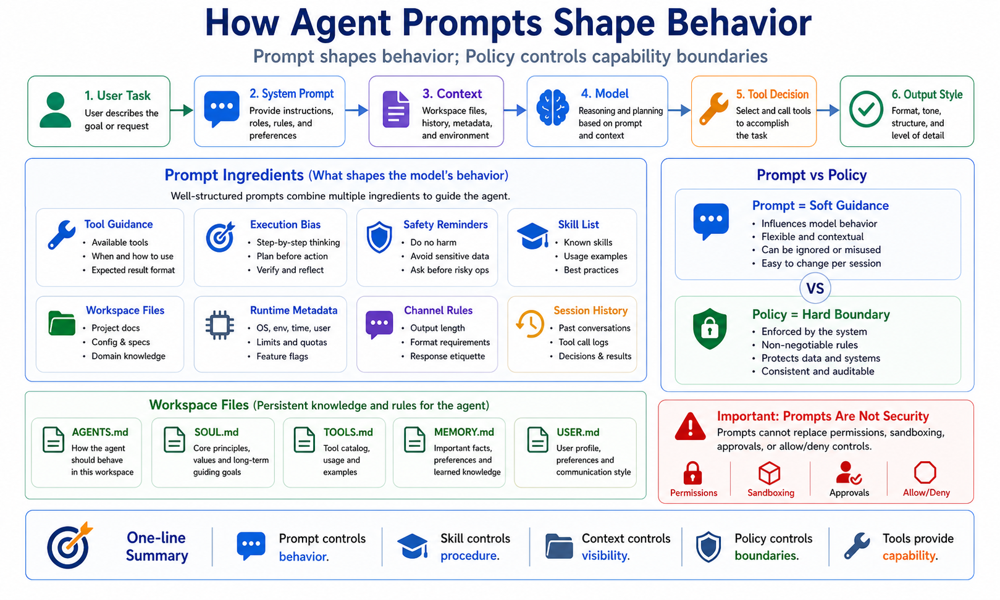

# How Agent Prompts Shape Behavior



Why can the same model behave so differently in different agents?

Sometimes it acts decisively: reading files, calling tools, running commands, and verifying results.

Sometimes it asks for confirmation before every step.

Sometimes it behaves like an engineer.

Sometimes it behaves like a customer-support assistant.

The difference is not always the model.

Often, the difference is the prompt environment.

More precisely, it is the combination of system prompt, tool descriptions, skill list, workspace files, runtime metadata, channel rules, and conversation history.

## Prompt Shapes Behavior; Policy Sets Boundaries

Prompt can influence:

```text
identity
tone
initiative
tool usage
uncertainty handling
output format
memory usage
channel reply style
task completion bias
```

But prompt is not a hard security boundary.

It guides the model.

It does not enforce permissions.

Hard boundaries come from:

```text
tool policy
exec approvals
sandboxing
channel allowlists
provider limits
gateway configuration
```

Remember the split:

```text
Prompt shapes behavior.
Policy controls capability.
```

## OpenClaw's Prompt Is Not a Static Text File

OpenClaw builds a custom system prompt for each agent run.

It is not just a fixed sentence copied from a file.

The prompt is assembled from runtime facts and configuration.

It can include:

```text
Tooling: tool rules and available tool guidance
Execution Bias: follow-through guidance for actionable tasks
Safety: guardrails
Skills: available skill metadata and how to load skills
OpenClaw Control: config, restart, and Gateway operation guidance
Workspace: current working directory
Documentation: local or online docs location
Workspace Files: injected project context
Sandbox: sandbox state
Current Date & Time: timezone and time context
Runtime: host, OS, model, reasoning level
Messaging / Channel: reply format, chunking, silent reply behavior
```

This is why the same user message can produce different behavior in different environments.

The model does not only see your message.

It sees the run context OpenClaw assembled around that message.

## How Prompt Changes Execution Style

If the prompt emphasizes:

```text
When a request is actionable, do the work in this turn until done or blocked.
```

The agent is more likely to:

- read files
- call tools
- run commands
- verify results
- summarize only after doing the work

If the prompt emphasizes:

```text
Ask for confirmation before any action.
```

The agent becomes more cautious.

If the prompt says:

```text
Replies should be short and suitable for chat.
```

The agent will avoid long explanations.

If the prompt includes:

```text
This is a Telegram group. Use the channel reply tag format.
```

The agent changes output formatting.

Prompt is not just personality.

Prompt is execution behavior.

## Workspace Files Shape Behavior

OpenClaw can inject workspace files into Project Context:

```text
AGENTS.md
SOUL.md
TOOLS.md
IDENTITY.md
USER.md
HEARTBEAT.md
BOOTSTRAP.md
MEMORY.md
```

Each file influences a different layer:

```text
AGENTS.md   = operating rules and long-term instructions
SOUL.md     = persona, boundaries, tone
TOOLS.md    = local tool conventions
IDENTITY.md = agent name and identity
USER.md     = user preferences
MEMORY.md   = curated long-term summary
BOOTSTRAP.md = first-run initialization
```

If `AGENTS.md` says:

```text
Before code changes, inspect related tests.
```

The agent will tend to search for tests first.

If `TOOLS.md` says:

```text
Deployment commands must run dry-run first.
```

The agent will treat deployment more carefully.

That is a behavior change, not a new capability.

## Skill Metadata Shapes Selection

Skill bodies are not injected by default.

OpenClaw puts compact skill metadata into the prompt: name, description, and location.

The model decides whether to read a skill based on the task.

So skills influence behavior in two layers:

```text
1. Description affects whether the model selects the skill
2. SKILL.md affects how the model executes the task
```

A vague description like:

```text
Helps users complete tasks.
```

is not useful.

A precise description like:

```text
Use when the user asks for browser-based form submission, page inspection, screenshots, or multi-step web automation.
```

is much easier for the model to match.

The skill description is not decoration.

It affects trigger probability.

## The Context Window Limits Prompt Effects

Prompt only works if the model can see it.

OpenClaw defines context as everything the model receives in the current run:

```text
system prompt
conversation history
tool calls and results
attachments
injected workspace files
compaction summaries
tool schemas
skill metadata
```

The model context window is limited.

Large files, many tools, long history, and large attachments all consume space.

OpenClaw truncates oversized injected workspace content according to configured limits.

This is why you should not put every detail into one giant `MEMORY.md`.

A better layout:

```text
stable rules → AGENTS.md
tone and persona → SOUL.md
tool conventions → TOOLS.md
durable summary → MEMORY.md
detailed history → searchable memory or files
task procedure → Skill
```

## Prompt Does Not Solve Everything

When the agent makes a mistake, many people add one more prompt line.

Sometimes that helps.

But it is not the whole answer.

Writing:

```text
Do not run dangerous commands.
```

is only guidance.

To actually restrict dangerous commands, configure:

```text
exec approval
tool allow / deny
sandboxing
channel allowlists
read-only workspace rules
secret isolation
```

Writing:

```text
Always use browser.
```

does not help if the browser tool is not enabled.

Prompt changes what the model tries to do.

Configuration and policy decide what it can do.

## Common Misunderstandings

### Misunderstanding 1: Longer prompts are better

Not necessarily.

Long prompts consume context and dilute priorities.

Good prompts are structured, concise, and executable.

### Misunderstanding 2: Prompt can replace skills

Usually no.

Prompt is good for global behavior.

Skills are better for detailed task procedures.

### Misunderstanding 3: Prompt can replace security configuration

No.

Prompt is soft guidance.

Policy is the hard boundary.

### Misunderstanding 4: If the model disobeys, the model is bad

Maybe not.

The issue could be truncated context, missing skill visibility, hidden tools, conflicting instructions, channel rules, or stale history.

Debug the full context, not just the visible user message.

## Final Summary

Agent Prompt is the behavior control layer of OpenClaw.

It is built from system prompt sections, tool guidance, skill metadata, workspace files, runtime facts, channel rules, and session history.

It influences whether the agent is active or cautious, engineering-oriented or support-oriented, tool-using or explanation-only.

But prompt is not a security wall.

Use this mental model:

```text
Prompt controls behavior
Skill controls procedure
Context controls visibility
Policy controls boundaries
Tools provide capability
```

Once you understand that, you stop blaming every failure on the model.

## Lesson Homework

1. Open your `AGENTS.md` and identify three rules that clearly shape behavior.
2. Write one rule that makes the agent more proactive and one that makes it more cautious.
3. Inspect context usage with `/context list` or a similar diagnostic command.
4. Split one long prompt into global rules, skill workflow, and tool policy.
5. Name one problem that prompt cannot solve and tool policy must solve.

## Next Lesson Preview

The next lesson explains what happens internally after user input.

This lesson focused on prompt behavior. Next, we follow the runtime path: Gateway, session resolution, queueing, context assembly, model call, tool execution, and final reply.

## References

- [OpenClaw System prompt](https://docs.openclaw.ai/concepts/system-prompt)
- [OpenClaw Context](https://docs.openclaw.ai/concepts/context)
- [OpenClaw Agent runtime](https://docs.openclaw.ai/concepts/agent)
- [OpenClaw Skills](https://docs.openclaw.ai/tools/skills)

