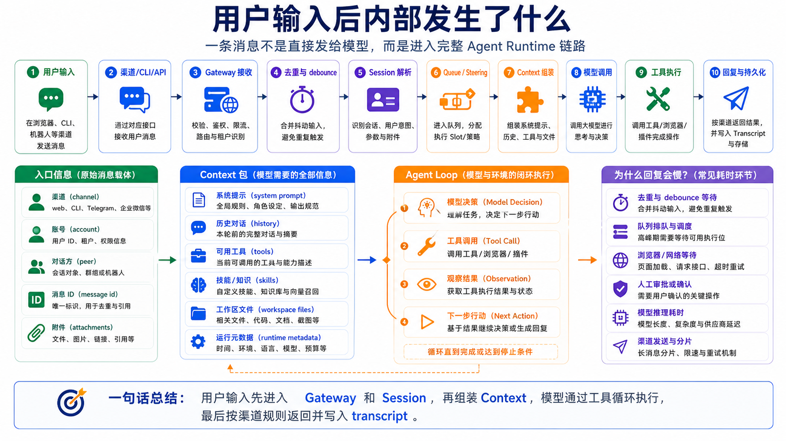

# 用户输入后内部发生了什么



你在 OpenClaw 里输入一句话：

```text
帮我检查这个网页后台的数据，并生成一份报告。
```

表面上看，只是“用户发消息，模型回复”。

但 OpenClaw 内部发生的事情要复杂得多。

消息要进入 Gateway。

Gateway 要判断它属于哪个 session。

如果当前正在执行任务，消息可能要排队、合并或作为 steering 进入下一轮。

运行时要组装 Prompt、上下文、工具、Skill、Workspace 信息。

模型要决定是否调用工具。

工具结果要回到模型。

最后回复要根据渠道规则分块、流式返回或写入会话。

这一篇我们把用户输入之后的内部链路完整拆开。

## 先说结论：输入不是直接发给模型

OpenClaw 的真实流程更像这样：

```text
用户输入
  ↓
渠道 / CLI / Dashboard / API
  ↓
Gateway 接收消息
  ↓
去重、debounce、路由和绑定
  ↓
解析 session key
  ↓
进入队列或当前 run 的 steering
  ↓
创建 agent run
  ↓
组装 system prompt、context、tools、skills
  ↓
调用模型
  ↓
模型回复或请求工具
  ↓
执行工具并返回 observation
  ↓
模型继续推理
  ↓
生成最终输出
  ↓
按渠道限制流式/分块发送
  ↓
写入 transcript 和状态
```

所以用户输入不是直接进入模型。

它先进入 OpenClaw 的运行系统。

模型只是执行链路中的一站。

## 第一步：入口不同，消息形态不同

用户输入可能来自很多入口：

```text
CLI
Dashboard
HTTP API
Telegram
企业微信
Slack / Discord
WhatsApp
Browser 控制界面
定时任务
Webhook
```

不同入口带来的信息不一样。

CLI 输入通常很直接。

消息平台会有 channel、account、peer、message id、reply id、群聊上下文、附件、语音、图片。

HTTP API 可能带业务系统自己的用户 ID、任务 ID、回调地址。

OpenClaw 要先把这些不同形态的输入转换成可以进入 Agent Runtime 的消息。

这就是 Gateway 的价值。

Gateway 不是“模型转发器”。

它是输入标准化和运行调度中心。

## 第二步：去重和 debounce

消息平台可能重复投递同一条消息。

网络断线重连、Webhook 重试、客户端同步，都可能导致同一条用户消息被送到 Gateway 多次。

OpenClaw 会做 inbound dedupe，用 channel、account、peer、session、message id 之类的信息短期缓存，避免重复触发 Agent run。

另一个常见问题是用户连续发多条短消息：

```text
帮我查一下
这个网页
昨天的数据
顺便截图
```

如果每一条都立刻触发一次模型调用，体验会很差，也浪费成本。

所以 OpenClaw 支持 inbound debouncing，把短时间内同一发送者的连续文本消息合并成一个 turn。

但控制命令通常会绕过 debounce，保持独立执行。

这就是为什么你有时会看到“多条消息被一起处理”。

不是模型神奇地猜到了上下文。

是 Gateway 在入口层做了消息整理。

## 第三步：解析 Session

OpenClaw 的 session 是 Gateway 拥有的，不是某个客户端自己决定的。

直接聊天、群聊、频道、不同设备，都会映射到不同或相同的 session key。

一般可以这样理解：

```text
个人直接对话 → 主 session
群聊 / 频道 → 独立 session key
控制界面 / TUI → 看到 Gateway 的 session transcript
```

session 决定了模型能看到哪些历史。

同一句话，如果进入不同 session，结果可能不同。

因为历史、记忆、工具结果、上下文都不同。

这也解释了一个常见现象：

你在 Telegram 群里说过的上下文，不一定会完整同步到另一个客户端。

真正的来源是 Gateway 上的 session transcript。

## 第四步：队列和 steering

如果 Agent 当前没有运行任务，新消息通常会创建一个新的 agent run。

但如果 Agent 正在执行工具或等待模型回复，新消息怎么办？

OpenClaw 有队列和 steering 机制。

简单理解：

```text
followup：等当前 run 完成后再处理
steer：当前 run 完成本轮工具调用后，把新消息带入下一次模型调用
interrupt：中断当前 run
collect：收集起来稍后处理
```

这对真实业务很重要。

比如 Agent 正在浏览后台页面，你又补一句：

```text
只看华东区的数据。
```

如果它能作为 steering 进入下一轮，Agent 就可以在继续执行前调整计划。

如果系统只会“另起一个任务”，上下文就会乱。

## 第五步：组装 Context

准备调用模型前，OpenClaw 要组装 context。

context 包括：

```text
system prompt
conversation history
workspace injected files
skill metadata
tool list and schemas
tool call results
attachments
compaction summaries
runtime metadata
channel context
```

这一步非常关键。

用户以为模型只看到了那句输入。

实际上模型看到的是一个完整运行包。

里面可能包含：

- 当前 workspace 路径
- AGENTS.md 指令
- SOUL.md 语气
- 可用工具
- 可用 Skill
- 当前渠道回复规则
- 会话历史
- 最近工具结果
- 当前时间和运行状态

所以，用户输入只是一部分。

Context 决定模型“看见了什么世界”。

## 第六步：调用模型

上下文组装完成后，OpenClaw 会根据配置选择 Provider 和模型。

模型收到的是：

```text
系统提示词
历史消息
工具 schema
Skill 列表
当前用户任务
运行时信息
```

模型可能有两种输出：

```text
直接回复
请求调用工具
```

如果任务很简单，比如：

```text
总结这段文字。
```

模型可能直接回复。

如果任务需要真实动作，比如：

```text
打开网页后台，导出数据，生成报告。
```

模型就需要调用 Browser、Shell、Filesystem、MCP 或插件工具。

## 第七步：工具执行和 observation

模型不会直接操作浏览器或 Shell。

它提出工具调用请求。

OpenClaw 根据工具策略、审批、沙箱、配置，决定是否执行。

执行后，工具结果作为 observation 回到模型。

流程是：

```text
模型请求工具
  ↓
OpenClaw 检查工具是否允许
  ↓
必要时请求审批
  ↓
执行工具
  ↓
返回结果 / 错误 / 截图 / 文件路径
  ↓
模型读取 observation
  ↓
决定下一步
```

这就是 Agent Loop。

模型不是一次性把任务想完。

它是一边看结果，一边继续决策。

## 第八步：输出、分块、持久化

最终回复生成后，还不能简单“原样发出去”。

不同渠道有不同限制：

- 消息长度限制
- 是否支持流式
- 是否支持 Markdown
- 是否支持附件
- 是否需要 reply tag
- 群聊是否允许自动回复
- 是否需要分块发送

OpenClaw 会根据渠道和配置处理输出。

同时，session transcript 会记录本轮消息、助手输出、工具调用、结果等信息。

这样下一轮才能继续接上。

如果没有持久化，每次对话都是失忆的。

如果没有渠道适配，模型输出再好也可能发不出去。

## 一个完整例子

用户在企业微信群里说：

```text
帮我检查昨天 SEO 数据，截图后台图表，生成一份日报。
```

内部可能发生：

```text
1. 企业微信插件把消息送到 Gateway
2. Gateway 去重，确认不是重复投递
3. 根据群聊映射到对应 session
4. 如果连续消息在 debounce 窗口内，先合并
5. 进入 agent run
6. 注入 AGENTS.md、TOOLS.md、Skill 列表、渠道规则
7. 模型判断需要 browser + report skill
8. OpenClaw 打开浏览器后台
9. 模型根据页面 observation 决定点击和截图
10. 工具保存截图到 Workspace
11. 模型整理日报
12. Gateway 按企业微信消息限制分块发送
13. transcript 保存完整过程
```

这才是“用户输入后内部发生了什么”。

## 常见误解

### 误解一：用户输入直接发给模型

不是。

它会先经过 Gateway、session、queue、context assembly。

### 误解二：模型自己操作浏览器

不是。

模型请求工具，OpenClaw 执行工具，再把 observation 返回给模型。

### 误解三：消息平台上下文天然同步

不是。

session transcript 在 Gateway 侧是主要事实来源。

不同客户端不一定拥有完全一致的上下文。

### 误解四：回复慢一定是模型慢

不一定。

可能是 debounce、排队、工具执行、浏览器等待、审批、渠道分块、网络或 Provider 延迟。

## 最后总结

用户输入后，OpenClaw 不是简单把文本转发给模型。

它会经过：

```text
入口标准化
去重和 debounce
session 解析
队列和 steering
context 组装
模型调用
工具执行
observation 回传
最终回复
渠道适配
transcript 持久化
```

这条链路解释了为什么 OpenClaw 是 Agent Runtime，而不是普通聊天壳子。

真正的 Agent 系统，复杂性不在一句 prompt，而在完整运行生命周期。

## 本节作业

1. 画一张“用户输入到最终回复”的流程图，至少包含 Gateway、Session、Context、Model、Tools、Reply。
2. 找一个你常用入口，判断它会带哪些额外信息：channel、message id、reply id、attachments。
3. 思考一个场景：用户连续发三条短消息，debounce 应该如何处理？
4. 写出一个需要 steering 的例子，比如 Agent 执行中用户补充限制条件。
5. 列出回复慢的 5 个可能原因，不要只写“模型慢”。

## 下一节预告

下一节我们会进入 Browser、Shell、Canvas 原理。

前面我们已经知道模型不会直接操作世界，而是通过工具观察和行动。下一节会拆开三个最重要的执行表面：浏览器如何交互，Shell 为什么危险，Canvas 为什么适合结构化输出。

## 参考资料

- [OpenClaw Messages](https://docs.openclaw.ai/concepts/messages)
- [OpenClaw Agent loop](https://docs.openclaw.ai/concepts/agent-loop)
- [OpenClaw Context](https://docs.openclaw.ai/concepts/context)
- [OpenClaw Agent runtime](https://docs.openclaw.ai/concepts/agent)
- [OpenClaw Gateway architecture](https://docs.openclaw.ai/concepts/architecture)

