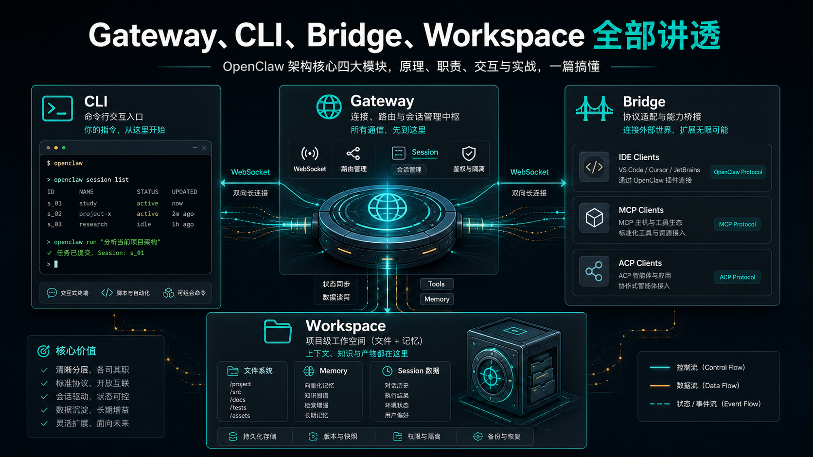
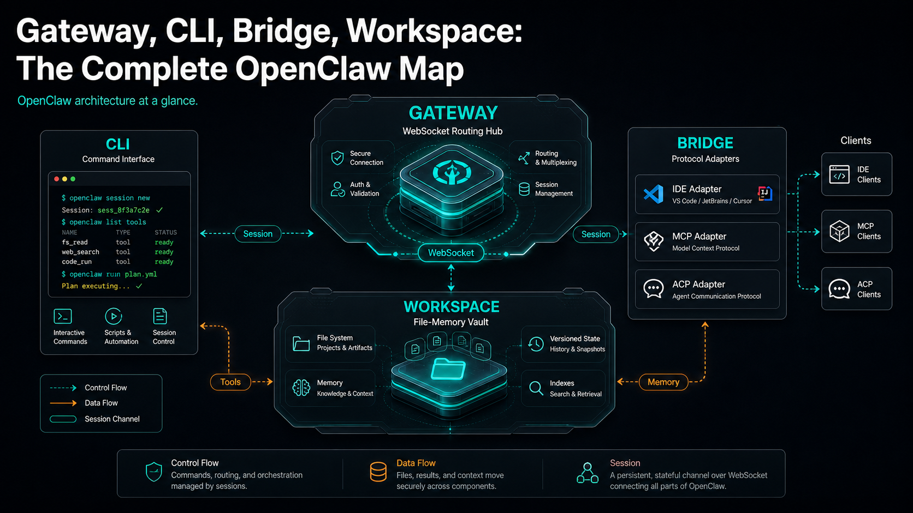

# Gateway、CLI、Bridge、Workspace 全部讲透





上一篇我们讲清楚了一件事：OpenClaw 不是一个普通 AI Agent，而是一套让 Agent 能进入真实系统的运行平台。

但只知道这个结论还不够。

因为真正开始使用 OpenClaw 时，你很快会遇到四个高频词：

Gateway。

CLI。

Bridge。

Workspace。

这四个词如果没搞明白，后面看 Docker 部署、18789 端口、providers 配置、Browser 插件、MCP 接入、企业微信机器人、远程调用，都会像在雾里看东西。

你会知道“好像要启动 Gateway”，但不知道为什么。

你会知道“可以用 openclaw 命令”，但不知道 CLI 到底在控制谁。

你会看到 Bridge、ACP、MCP、WebSocket，又分不清它们是不是一回事。

你会看到 workspace 目录，却不知道它到底是项目目录、运行目录，还是 Agent 的记忆目录。

所以第二篇，我们先不急着装 Docker，也不急着接模型。

先把 OpenClaw 的四块地基讲透。

## 先用一张图理解

你可以先把 OpenClaw 想象成下面这个流程：

```text
用户 / 外部系统
  ↓
CLI / Web / 消息平台 / IDE / MCP 客户端
  ↓
Bridge 或客户端连接层
  ↓
Gateway
  ↓
Agent Session
  ↓
Workspace + Tools + Model Provider
  ↓
结果返回给用户或外部系统
```

这张图里，最重要的不是某一个模块，而是它们的分工。

```text
Gateway   = 调度中心
CLI       = 操作入口
Bridge    = 协议适配器
Workspace = Agent 的工作现场
```

一句话说透：

**Gateway 决定请求怎么进系统，CLI 决定人怎么操作系统，Bridge 决定外部协议怎么接进来，Workspace 决定 Agent 在哪里工作、读什么、记住什么。**

只要这句话记住，OpenClaw 的整体架构就不会乱。

## Gateway：OpenClaw 的调度中心

先讲 Gateway。

很多人第一次看到 Gateway，会把它理解成“网关服务”。

这没错，但还不够。

在 OpenClaw 里，Gateway 不是简单的反向代理，也不是普通 Web API Server。它更像 OpenClaw 的中枢神经：负责连接客户端、管理会话、分发事件、接收消息、协调工具和 Agent 执行。

官方文档里把 Gateway 描述为 OpenClaw 的 WebSocket server，负责 channels、nodes、sessions、hooks 等能力。也就是说，OpenClaw 的很多实时能力，都是围绕 Gateway 展开的。

你可以这样理解：

```text
没有 Gateway：
  CLI 只是本地命令
  Web UI 没有统一入口
  消息平台没有统一调度
  会话状态难以管理
  外部客户端不知道连到哪里

有了 Gateway：
  所有入口都可以连接到一个中心
  所有请求都能进入统一会话系统
  所有事件都能被订阅和分发
  所有运行状态都能被检查和诊断
```

所以 Gateway 不是“可有可无的一层”。

它是 OpenClaw 从本地工具变成运行平台的关键。

## 为什么总提 18789 端口

学 OpenClaw 时，你会经常看到 18789。

这个端口通常就是 Gateway 的 WebSocket / HTTP 服务端口。不同客户端、Bridge、Web UI、节点或远程调用，都可能围绕这个端口建立连接。

你可以把它理解成 OpenClaw 的本机大门：

```text
http://localhost:18789
wss://your-gateway-host:18789
```

当然，实际生产环境里可能还会套 Nginx、HTTPS、Tailscale、内网域名或反向代理。

但无论外面怎么包装，核心问题都是一样的：

**客户端最终要能找到 Gateway，并且通过正确的认证方式连上它。**

如果后面你遇到 dashboard 打不开、CLI 连接失败、MCP bridge 连不上、远程调用无响应，第一反应应该不是“模型坏了”，而是先问：

```text
Gateway 是否启动？
端口是否正确？
认证是否正确？
客户端连的是不是同一个 Gateway？
会话是否路由到了正确 Agent？
```

很多 OpenClaw 的问题，最后都能回到 Gateway 这一层。

## Gateway 常用命令应该怎么理解

你后面会看到类似命令：

```bash
openclaw gateway
openclaw gateway run
openclaw gateway status
openclaw gateway health
openclaw gateway restart
openclaw gateway discover
```

这些命令不要死记。

你只要知道它们分成三类：

```text
启动类：run / start
检查类：status / health / probe / discover
运维类：restart / stop / logs / install / uninstall
```

学习时最重要的是建立排查顺序。

当 OpenClaw 不工作时，先看 Gateway 是否活着。

当客户端连不上时，看 Gateway 地址、端口、token、password、绑定地址。

当消息不返回时，看 Gateway 是否收到了请求，会话有没有创建，Agent 是否开始执行。

这样你排错就不会乱。

## CLI：不是启动器，而是控制台

第二个词是 CLI。

CLI 就是命令行工具，也就是你在终端里输入的 `openclaw` 命令。

但在 OpenClaw 里，CLI 不只是“启动程序的入口”。

它更像一个操作控制台。

你可以用 CLI 做很多事：

```text
安装初始化：setup / onboard / configure
检查状态：status / health / doctor / logs
管理 Gateway：gateway start / stop / restart / discover
管理模型：models / infer / providers
管理 Agent：agent / agents / sessions / tasks
管理能力：skills / plugins / browser / mcp / acp
管理消息：message / channels / devices
```

你会发现，CLI 横跨了 OpenClaw 的几乎所有层。

这说明一件事：

**CLI 是 OpenClaw 的人工操作面。**

Dashboard 更适合日常使用。

HTTP API 更适合系统集成。

消息平台更适合业务触达。

但当你要部署、排错、检查、配置、自动化脚本、远程维护时，CLI 往往是最可靠的入口。

## CLI 和 Gateway 到底是什么关系

很多人会把 CLI 和 Gateway 混在一起。

其实它们不是一类东西。

CLI 是客户端。

Gateway 是服务端。

你在终端里运行命令时，可能发生两种情况。

第一种，CLI 在本地直接做一件事，比如检查配置、写入文件、安装插件。

第二种，CLI 连接 Gateway，让 Gateway 去执行某个操作，比如查看会话、发送消息、触发 Agent、检查运行状态。

用流程表示就是：

```text
你输入 openclaw 命令
  ↓
CLI 解析参数
  ↓
如果是本地任务：直接处理
  ↓
如果是运行时任务：连接 Gateway
  ↓
Gateway 进入会话 / 工具 / Agent 执行流程
```

所以以后你看到 `openclaw gateway status`，不要只理解成“查一下状态”。

它背后真正问的是：

```text
当前 CLI 能不能找到 Gateway？
Gateway 进程是否可用？
它现在管理哪些会话和能力？
```

CLI 是你伸出去的手。

Gateway 是 OpenClaw 正在跳动的心脏。

## Bridge：外部世界和 OpenClaw 之间的翻译层

第三个词是 Bridge。

这个词最容易让人困惑。

因为在不同上下文里，Bridge 可能指不同东西。

有时候你看到的是历史上的 TCP bridge。

有时候你看到的是 ACP bridge。

有时候你看到的是 MCP bridge。

有时候教程里说 Bridge，只是泛指“把外部协议接到 Gateway 的适配层”。

所以这里必须先拆清楚。

## 不要把 Bridge 理解成单一组件

Bridge 最好不要理解成某一个固定进程。

更准确的理解是：

**Bridge 是协议适配层，把外部客户端或外部协议，转换成 OpenClaw Gateway 能理解的会话和事件。**

比如：

```text
IDE / ACP Client
  ↓
openclaw acp
  ↓
ACP over stdio
  ↓
Gateway over WebSocket
```

再比如：

```text
Claude Code / Codex / MCP Client
  ↓
openclaw mcp serve
  ↓
MCP over stdio
  ↓
Gateway over WebSocket
  ↓
OpenClaw channel conversations
```

你会发现 Bridge 的核心价值不是“自己完成任务”，而是做转换：

```text
外部协议 → OpenClaw 会话
外部请求 → Gateway 请求
外部客户端事件 → OpenClaw 事件
OpenClaw 回复 → 外部协议能理解的返回
```

它像一个翻译官。

翻译官不负责思考答案，但没有翻译官，两个系统就听不懂对方。

## 旧 Bridge 和新 Bridge 思路

这里有一个容易踩坑的地方。

OpenClaw 文档里有一个 Bridge protocol 页面，但它明确说历史 TCP bridge 已经移除，当前构建不再提供旧 bridge listener，`bridge.*` 配置也不再是有效 schema。

这意味着你不能拿老教程里的 TCP bridge 配置生搬硬套。

更稳的理解方式是：

```text
旧含义：
Bridge = 某个历史 TCP JSONL bridge listener

当前更实用的含义：
Bridge = ACP / MCP / 客户端适配层，把外部系统接到 Gateway
```

所以当课程里讲 Bridge，我们讲的不是让你去找一个固定叫 bridge 的后台进程。

我们讲的是一类能力：

**OpenClaw 如何把 IDE、MCP 客户端、消息平台、节点、外部工具连接到 Gateway。**

这才是今天仍然重要的东西。

## Bridge 什么时候最有用

Bridge 最有用的场景，是外部系统已经有自己的协议，而 OpenClaw 又不想把所有协议都写进 Gateway 核心。

比如 IDE 喜欢 ACP。

MCP 客户端喜欢 MCP。

某些消息平台有自己的 webhook 或长连接机制。

某些远程节点有自己的认证和事件模型。

这时 OpenClaw 不应该让 Gateway 直接背上所有协议细节，而是通过 Bridge 做适配。

这样架构更干净：

```text
外部协议复杂性
  ↓
Bridge 处理
  ↓
Gateway 只面对统一的会话和事件模型
```

这也是 OpenClaw 能扩展的关键。

如果没有 Bridge 思想，每接一个系统，就要改 Gateway 核心。

有了 Bridge 思想，Gateway 保持稳定，外部协议通过适配层进来。

## Workspace：Agent 的家，不只是一个目录

第四个词是 Workspace。

很多人第一次看到 workspace，会以为它只是“项目目录”。

这个理解太窄了。

在 OpenClaw 里，Workspace 是 Agent 的工作现场。

官方文档里有一句很关键的定义：workspace 是 agent 的 home，是文件工具和 workspace context 使用的工作目录，并且应该被当作私有记忆来对待。

这句话信息量很大。

它说明 Workspace 至少承担三件事：

```text
1. 工作目录：Agent 读写文件的默认位置
2. 上下文来源：Agent 启动时会读取部分工作区文件形成行为和记忆
3. 长期记忆：AGENTS.md、MEMORY.md、skills、canvas 等都可能放在这里
```

所以 Workspace 不是临时文件夹。

它决定了 Agent “住在哪里”。

## Workspace 和 ~/.openclaw 不一样

这里也很容易混。

OpenClaw 的配置、凭据、会话数据通常在 `~/.openclaw/` 下面。

但 Workspace 是 Agent 的工作目录，默认位置通常是：

```text
~/.openclaw/workspace
```

如果设置了不同 profile，默认 workspace 还可能变成：

```text
~/.openclaw/workspace-<profile>
```

你可以通过配置指定：

```json5
{
  agents: {
    defaults: {
      workspace: "~/.openclaw/workspace"
    }
  }
}
```

重点是：

```text
~/.openclaw/          = 配置、凭据、会话、运行数据
~/.openclaw/workspace = Agent 的工作现场和记忆文件
```

不要把 API Key、token、OAuth 凭据直接放进 workspace。

Workspace 可以进入私有 Git 仓库备份，但 secrets 应该另行管理。

## Workspace 里通常有什么

一个比较完整的 Workspace，可能会包含这些东西：

```text
AGENTS.md      Agent 的行为规则和操作说明
SOUL.md        Agent 的人格、语气、角色设定
TOOLS.md       工具使用说明
MEMORY.md      长期记忆摘要
memory/        更细的记忆日志或历史记录
skills/        工作区级别的技能
canvas/        Canvas UI 文件
```

这些文件不是摆设。

它们会影响 Agent 的行为。

比如：

AGENTS.md 里写了“不要直接删除生产文件”，Agent 就应该遵守。

MEMORY.md 里记录了“公司默认使用 Qwen 作为低成本模型”，Agent 以后就能把它当作长期偏好。

skills/ 里放了企业内部工具说明，Agent 就能在特定工作区里拥有特殊能力。

这就是为什么 Workspace 很重要。

它不是被动目录，而是 Agent 的上下文地基。

## Workspace 不是绝对沙箱

还要特别注意一点。

Workspace 是默认工作目录，但它不天然等于安全沙箱。

也就是说，文件工具的相对路径会围绕 Workspace 解析，但如果没有启用 sandbox，绝对路径仍然可能访问主机上的其他位置。

这件事在生产部署里很重要。

如果你只是本地学习，Workspace 更多是组织文件和上下文。

如果你要做企业内网部署、多用户 SaaS、客户机器人、自动化执行，那就必须进一步考虑：

```text
workspace 隔离
sandbox 策略
权限边界
用户数据隔离
密钥管理
备份恢复
```

否则 Agent 能力越强，风险也越大。

## 四者放在一起看

现在我们把四个概念放回同一个流程。

假设你在终端里输入一句：

```bash
openclaw message send "帮我检查一下今天的任务"
```

可能发生的事情是：

```text
1. CLI 接收你的命令
2. CLI 根据配置找到 Gateway
3. Gateway 接收请求并进入对应 Session
4. Gateway 调度 Agent 执行
5. Agent 从 Workspace 读取上下文和记忆
6. Agent 根据需要调用工具、模型或插件
7. 执行结果回到 Gateway
8. Gateway 再把结果返回给 CLI 或其他客户端
```

如果外部是 MCP 客户端，流程会多一层 Bridge：

```text
MCP Client
  ↓
openclaw mcp serve
  ↓
Bridge 连接 Gateway
  ↓
Gateway 找到 routed session
  ↓
Agent 使用 Workspace 和工具执行
  ↓
结果通过 Bridge 返回 MCP Client
```

这时你再看四个词，它们就不抽象了：

```text
CLI       = 你发起操作的入口
Bridge    = 外部协议进来的适配器
Gateway   = 所有请求汇合和调度的中心
Workspace = Agent 实际工作的地方
```

## 最常见的错误理解

### 错误一：把 Gateway 当成模型代理

Gateway 不是只负责转发模型请求。

它还负责客户端连接、会话、事件、节点、消息、状态和运行协调。

模型 Provider 只是 OpenClaw 能力体系的一部分，不要把 Gateway 缩小成“模型 API 转发器”。

### 错误二：把 CLI 当成一次性启动命令

CLI 不只是启动 OpenClaw。

它是配置、运维、排错、自动化和能力管理的统一入口。

真正学 OpenClaw，一定要熟悉 CLI。

### 错误三：把 Bridge 当成旧 TCP bridge

旧 TCP bridge 已经是历史概念。

现在更应该从 ACP、MCP、Gateway Protocol、客户端适配这些角度理解 Bridge。

不要拿旧配置去套新版本。

### 错误四：把 Workspace 当普通项目文件夹

Workspace 是 Agent 的家，是上下文和记忆的一部分。

你可以在里面放课程文章、工具说明、长期记忆和工作产物，但不要随便放密钥。

## 学习顺序建议

如果你是第一次学 OpenClaw，我建议按这个顺序理解：

```text
第一步：先启动 Gateway
第二步：用 CLI 检查 Gateway 状态
第三步：理解 Workspace 在哪里
第四步：让 Agent 在 Workspace 里读写文件
第五步：再接 Browser、Shell、MCP、ACP 等 Bridge/工具能力
```

不要一开始就把所有概念混在一起。

Gateway 没跑通，就不要急着接企业微信。

CLI 不会用，就不要急着做自动化。

Workspace 没搞清楚，就不要急着做知识库。

Bridge 没理解，就不要急着接 MCP 和 IDE。

OpenClaw 是一个系统，系统学习最怕跳层。

## 最后总结

这一篇只讲四个词，但这四个词基本就是 OpenClaw 的骨架。

Gateway 是调度中心。

CLI 是操作入口。

Bridge 是协议适配层。

Workspace 是 Agent 的工作现场和记忆地基。

如果用一句话收尾：

```text
CLI 把人的操作带进来，
Bridge 把外部协议翻译进来，
Gateway 把所有请求组织起来，
Workspace 让 Agent 有地方工作、有上下文可读、有记忆可延续。
```

## 本节作业

完成下面几个练习，重点是把四个概念放回真实运行流程里：

1. 用自己的话分别解释 Gateway、CLI、Bridge、Workspace，每个概念只写一句话。
2. 画一条请求链路：从 CLI 输入一条任务，到 Gateway 调度，再到 Agent 在 Workspace 里执行。
3. 思考一个外部系统接入场景，比如 MCP 客户端、企业微信、IDE 或 HTTP API，判断它更像 CLI 入口还是 Bridge 入口。
4. 检查你的本地 OpenClaw 工作目录，区分哪些文件属于 Workspace，哪些属于全局配置或运行状态。
5. 写出 3 个排错问题：如果 Gateway 正常、CLI 正常、Workspace 正常，Bridge 仍然失败，你会先看哪里？

## 下一节预告

下一节我们会继续往下拆：OpenClaw 如何调用模型、工具和浏览器。

那一篇会进入真正的执行层：模型怎么被选中，工具怎么暴露给 Agent，浏览器为什么不是简单的网页截图，而是 OpenClaw 连接真实世界的重要能力。

## 参考资料

- [OpenClaw Gateway architecture](https://docs.openclaw.ai/concepts/architecture)
- [OpenClaw Gateway CLI](https://docs.openclaw.ai/cli/gateway)
- [OpenClaw CLI reference](https://docs.openclaw.ai/cli)
- [OpenClaw ACP bridge](https://docs.openclaw.ai/cli/acp)
- [OpenClaw MCP CLI](https://docs.openclaw.ai/cli/mcp)
- [OpenClaw Agent workspace](https://docs.openclaw.ai/concepts/agent-workspace)
- [OpenClaw Bridge protocol](https://docs.openclaw.ai/gateway/bridge-protocol)
