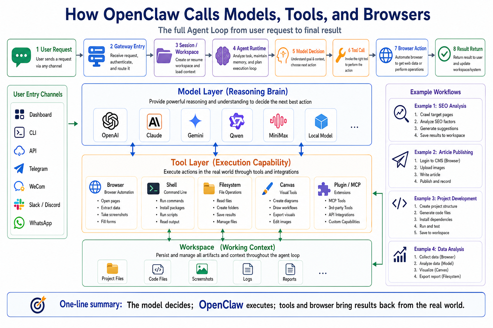

# How OpenClaw Calls Models, Tools, and Browsers



When people first hear that an AI agent can use tools, they often imagine the model doing everything directly.

They imagine the model opening a browser.

They imagine the model running shell commands.

They imagine the model reading files, clicking buttons, typing into forms, and controlling the machine by itself.

That is not what is actually happening.

A model does not directly operate your browser or your shell. The model decides what should happen next. OpenClaw is the runtime that turns those decisions into controlled actions.

The model's job looks more like this:

```text
Read the context
  ↓
Decide what the next step should be
  ↓
Ask to call a tool when needed
  ↓
Wait for the tool result
  ↓
Reason again or produce the final reply
```

The runtime's job is different:

```text
Resolve the session
Build the prompt
Select the model
Expose the allowed tools
Execute tool calls
Control the browser
Persist the transcript
Return streamed output
```

This article explains how OpenClaw connects those pieces into one complete agent run.

The key idea is simple:

**The model decides. OpenClaw executes.**

## The Core Flow

A normal chatbot can be simplified as:

```text
User message
  ↓
Model response
```

OpenClaw is not just that.

An OpenClaw agent run is closer to this:

```text
User input
  ↓
Gateway receives the request
  ↓
Session and Workspace are resolved
  ↓
System prompt, context, and history are assembled
  ↓
Model Provider and model are selected
  ↓
Visible tools are calculated for this turn
  ↓
The model is called
  ↓
The model replies or requests a tool call
  ↓
OpenClaw executes the tool
  ↓
The tool result returns to the model
  ↓
The model continues or produces the final answer
  ↓
The result is streamed, persisted, and returned
```

OpenClaw documentation calls this the Agent Loop. It is the real lifecycle of an agent run: intake, context assembly, model inference, tool execution, streaming replies, and persistence.

That distinction matters.

OpenClaw's value is not only that it can send text to a model. Its value is that it can place the model inside a controlled execution loop where the model can observe, choose tools, read results, and continue reasoning until the task is finished.

## Chat Is Not the Same as an Agent Loop

A chatbot answers.

An agent acts.

That sounds like a small difference, but architecturally it changes everything.

A normal chat flow is:

```text
Ask a question
  ↓
Get an answer
```

An agent loop is:

```text
Describe a goal
  ↓
The model decides what it needs
  ↓
It calls search, browser, shell, files, messages, or plugins
  ↓
OpenClaw executes the action
  ↓
The result comes back
  ↓
The model decides again
  ↓
The loop continues until the task is complete
```

So the center of an agent system is not the answer. The center is the loop.

That loop is why OpenClaw has to care about more than prompt text. It has to care about model selection, tool visibility, workspace context, browser state, permissions, approvals, sandboxing, streaming, persistence, and failure handling.

## Layer One: How OpenClaw Calls Models

OpenClaw supports many model providers, including OpenAI, Anthropic, Google Gemini, Qwen, MiniMax, Moonshot, OpenRouter, Ollama, LM Studio, and others.

But a model in OpenClaw is not usually referenced by a vague name like "Claude" or "GPT".

OpenClaw uses model references in this form:

```text
provider/model
```

Examples:

```text
openai/gpt-5.5
anthropic/claude-opus-4-6
google/gemini-3-flash-preview
moonshot/kimi-k2.6
ollama/...
lmstudio/...
```

This format separates two things:

```text
provider = the provider or runtime route
model    = the specific model id
```

That separation is important because OpenClaw is not tied to one model company. It can route agent turns through different providers, provider plugins, runtime backends, local models, and OpenAI-compatible endpoints.

## Model Selection Is Intentional

A common beginner mistake is assuming that once several API keys are configured, OpenClaw will automatically pick the best model.

That is not how you should think about it.

Model selection can depend on:

- the default agent config
- the current session override
- the selected provider
- authentication state
- model allowlists
- aliases
- failover rules
- provider plugins
- runtime policies

A minimal default model config looks like this:

```json5
{
  agents: {
    defaults: {
      model: {
        primary: "openai/gpt-5.5"
      }
    }
  }
}
```

In practice, the default model usually lives under:

```text
agents.defaults.model.primary
```

If you want to switch models, you can use a CLI flow such as:

```bash
openclaw models set provider/model
```

There is also an important operational detail: adding or reauthenticating a provider does not necessarily replace your current primary model. OpenClaw tries to preserve the existing default unless you explicitly ask to change it.

That is a good production behavior.

If you only wanted to add Gemini as a backup route, you probably do not want your default production agent to suddenly switch away from the model it was already using.

## What Happens Before the Model Is Called

The model is not the first thing OpenClaw touches.

Before a model request is sent, OpenClaw has to prepare the turn:

```text
1. Resolve the current Session
2. Load conversation history
3. Resolve the Workspace
4. Inject bootstrap and workspace context
5. Build the system prompt
6. Calculate visible tools for this turn
7. Resolve the model reference
8. Load provider authentication
9. Apply context window and token limits
10. Send the model request
```

This is why OpenClaw should not be reduced to a model proxy.

Calling the model is only one part of the run. The engineering around the model call is what makes the agent reliable.

## Layer Two: How OpenClaw Exposes Tools

Tools are what allow an agent to act.

Without tools, a model can only generate text. With tools, it can read data, modify files, run commands, operate a browser, send messages, call APIs, generate media, or talk to external systems through plugins and MCP servers.

OpenClaw treats tools as typed functions.

That means the model does not receive a vague instruction like:

```text
You can do anything on the computer.
```

Instead, it receives structured tool definitions:

```text
tool name
parameter schema
description
availability rules
return shape
```

Then the model can choose whether to request a tool call.

Examples of tool categories include:

- `exec` for shell commands
- `browser` for web browser control
- `web_search` and `web_fetch` for web information
- `message` for messaging surfaces
- plugin-provided tools
- MCP-backed tools
- media generation tools
- sub-agent tools

## The Model Does Not See Every Tool

This is one of the most important details in OpenClaw.

Just because a tool exists does not mean the model can see it.

Before the model request is made, OpenClaw filters the available tools. A tool may be removed because of:

```text
tools.profile
tools.allow
tools.deny
provider restrictions
sandbox state
channel permissions
runtime policy
plugin availability
MCP server visibility
agent-specific config
```

If policy removes a tool, the model does not receive that tool's schema for the turn.

That means the model cannot call it.

So when you see behavior like:

```text
Why is the agent not using the browser?
Why is it not running commands?
Why are my MCP tools missing?
Why did a plugin install but not appear?
```

do not blame the model first.

Check whether the tool was visible to the model in that session.

## What a Tool Call Really Looks Like

A tool call is a controlled request, not free execution.

The real flow is:

```text
The model receives a list of visible tools
  ↓
The model requests a tool call
  ↓
OpenClaw receives the tool call
  ↓
OpenClaw checks policy, permissions, sandbox, approvals, and plugin state
  ↓
The tool is executed
  ↓
The tool returns a result
  ↓
OpenClaw sanitizes, truncates, or summarizes the result if needed
  ↓
The result is written back into the session
  ↓
The model continues reasoning
```

This is the control point that makes OpenClaw usable in real systems.

The model asks.

OpenClaw decides whether that action is allowed and then executes it.

## Exec: Powerful and Risky

The `exec` tool is one of the clearest examples.

It can run shell commands in the workspace, the gateway host, a sandbox, or a node host depending on configuration.

That means it can:

- inspect files
- install dependencies
- run tests
- start services
- generate files
- delete files
- call local CLIs
- run deployment scripts

It is powerful, but it is also risky.

OpenClaw documentation describes `exec` as a mutating shell surface. Disabling file tools like `write`, `edit`, or `apply_patch` does not make shell execution read-only.

In production, you should think carefully about:

```text
Is exec enabled?
Is sandboxing enabled?
Is host execution allowed?
Are approvals required?
Is there an allowlist?
Which node can run commands?
What timeout applies?
Can the agent escape the sandbox?
```

The goal is not to let the agent do everything. The goal is to let the agent do the right things within boundaries you understand.

## Layer Three: How OpenClaw Calls the Browser

The browser is often misunderstood.

Browser control is not the same as web search.

`web_search` searches the web.

`web_fetch` fetches content from a URL.

`browser` operates an actual browser session.

With browser control, an agent can:

```text
open pages
list tabs
read snapshots
take screenshots
click elements
type into fields
select options
drag elements
upload files
wait for downloads
handle dialogs
inspect console errors
capture PDFs
```

This is not just "reading the internet". It is interacting with web applications.

## OpenClaw Uses a Separate Browser Profile

OpenClaw's default browser model is not to randomly control your personal browser.

It can run a dedicated Chrome, Brave, Edge, or Chromium profile that is managed for agent use. The default `openclaw` profile is isolated from your everyday browser profile.

You can think of it this way:

```text
Your daily browser: for you
OpenClaw browser profile: for the agent
```

That separation matters because it:

- avoids polluting your personal browser state
- reduces accidental access to personal logins
- makes browser automation easier to reproduce
- keeps tab state easier to track
- makes screenshots and snapshots more predictable
- gives operators clearer control over browser access

OpenClaw can also attach to existing user sessions or remote CDP browsers, but those modes should be used deliberately.

If a task needs your logged-in Chrome state, a `user` or `existing-session` profile may be appropriate. If the task should run safely and repeatably, an isolated managed profile is usually the better starting point.

## What a Browser Run Looks Like

Imagine the user says:

```text
Open the admin dashboard and check today's failed orders.
```

The actual flow may look like:

```text
Gateway receives the request
  ↓
Agent Loop prepares context and visible tools
  ↓
The model sees the browser tool
  ↓
The model asks to navigate to a page
  ↓
OpenClaw opens the page in the managed browser
  ↓
The model asks for a snapshot
  ↓
OpenClaw returns page structure and element refs
  ↓
The model chooses refs to click, type, or select
  ↓
The browser performs those actions
  ↓
The model reads the updated page
  ↓
The final answer is returned
```

One detail is especially important: browser automation is usually snapshot-driven.

The model does not need to guess CSS selectors blindly. OpenClaw can return page snapshots with stable element references. The model can then request actions against those refs:

```text
click <ref>
type <ref> "value"
select <ref> OptionA
```

That is much more reliable than asking the model to invent selectors from memory.

## Browser vs Web Search

These tools serve different jobs.

Use `web_search` when you need discovery:

```text
Search engine style query
  ↓
Result list
  ↓
Model reads summaries or links
```

Use `web_fetch` when you already have a URL:

```text
Fetch a known page
  ↓
Extract readable content
  ↓
Return text to the model
```

Use `browser` when you need interaction:

```text
Open a real page
  ↓
Observe current state
  ↓
Click, type, wait, download, or screenshot
  ↓
Continue based on page changes
```

A simple rule:

```text
Research public information: web_search / web_fetch
Operate a website: browser
Operate the machine: exec
Connect to external systems: plugins / MCP / message
```

## Why Browser Control Goes Through the Gateway

The browser is not a random side process controlled directly by the model.

It is part of the OpenClaw runtime.

The local browser control service is managed through the Gateway. The browser profile, tabs, snapshots, actions, timeouts, screenshots, and remote routing all sit inside OpenClaw's controlled execution path.

That gives OpenClaw several advantages:

- browser activity can align with sessions
- tabs can be tracked
- screenshots and snapshots can return to the agent
- actions can be wrapped with timeouts and errors
- remote gateways can proxy browser actions through node hosts
- operators can enable or disable browser capability centrally

So the browser is not an extra toy feature.

It is one of the main ways OpenClaw connects an agent to real web systems.

## Putting Models, Tools, and Browsers Together

Here is the full picture:

```text
User input
  ↓
Gateway creates or finds a Session
  ↓
Workspace context is injected
  ↓
Tool Policy calculates visible tools
  ↓
Provider resolves the model
  ↓
The model receives:
  - system prompt
  - conversation history
  - workspace context
  - visible tool schemas
  ↓
The model outputs:
  - text
  - or a tool call
  ↓
OpenClaw executes:
  - exec
  - browser
  - web_fetch
  - message
  - plugin tools
  - MCP tools
  ↓
Tool results return to the model
  ↓
The model continues reasoning
  ↓
The final result is persisted and returned
```

The model is not isolated.

The tools are not uncontrolled.

The browser is not blindly clicking around.

Everything is wired through Gateway, Session, Workspace, Tool Policy, Provider, Plugin, and Browser Service.

## A Practical Example

Suppose you ask:

```text
Open the order dashboard, find today's failed orders, and summarize them in a table.
```

A normal chatbot can only give instructions:

```text
Log in to the dashboard.
Open the orders page.
Filter by today's date.
Filter by failed status.
Export or copy the results.
```

An OpenClaw agent can run a real workflow:

```text
1. Recognize that the task needs browser access
2. Check whether the browser tool is visible
3. Open the dashboard URL
4. Read the page snapshot
5. Ask for manual login if needed
6. Continue after login
7. Click the orders menu
8. Fill date and status filters
9. Read the result table
10. Paginate or download if needed
11. Summarize the results
12. Return a Markdown table or write a file
```

The model makes the decisions.

OpenClaw performs the actions.

The browser exposes the web application.

The session keeps the run coherent.

That combination is the difference between a chatbot and an agent runtime.

## Common Misunderstandings

### Misunderstanding 1: Stronger models make tools less important

No.

The stronger the model, the more valuable reliable tools become.

Without tools, a model can only advise. With tools, it can act.

### Misunderstanding 2: If a tool is installed, the model will use it

Not necessarily.

The tool must be visible in that turn. If policy, sandboxing, provider restrictions, or plugin state removes the tool, the model cannot call it.

### Misunderstanding 3: Browser means web search

No.

Search finds information.

Browser control interacts with pages.

They solve different problems.

### Misunderstanding 4: Exec is just for reading files

No.

`exec` can mutate the filesystem, run scripts, start processes, and affect the host or sandbox environment. Treat it as a powerful execution surface.

### Misunderstanding 5: The agent will automatically control your personal Chrome

Not by default.

OpenClaw's normal managed browser profile is separate. Existing user sessions are available, but they should be chosen deliberately.

## Debugging Checklist

When model, tool, or browser behavior does not match expectations, debug from the runtime outward:

```text
1. Is the Gateway healthy?
2. Was a Session created?
3. Is the default model configured?
4. Is the Provider authenticated?
5. Is the model ref in provider/model form?
6. Does tools.profile include the tool?
7. Did tools.allow or tools.deny filter it?
8. Did sandbox policy hide plugin or MCP tools?
9. Is Browser enabled?
10. Did the browser profile start?
11. Does the page require login, MFA, or a manual blocker?
12. Does the tool call require approval?
13. Do session logs show tool start, end, or error events?
```

This is usually more useful than blaming the model.

Many "model failed" problems are actually tool visibility, policy, authentication, or browser state problems.

## Suggested Learning Order

If you are learning OpenClaw through this course, practice this layer in a controlled order:

```text
1. Configure one default model
2. Confirm models list and models status
3. Run a pure text task
4. Let the agent read a workspace file
5. Let the agent use exec in a safe directory
6. Enable Browser and open a public webpage
7. Run snapshot plus click on a simple page
8. Add web_search, MCP, and plugin tools later
9. Only then attempt logged-in dashboards or business workflows
```

Do not start with a complex internal admin system.

First make the model path work.

Then make tool execution work.

Then make browser control work.

Then combine them.

## Final Summary

OpenClaw does not call models, tools, and browsers as three unrelated features.

They all live inside the Agent Loop.

The model decides what should happen.

Tools execute real actions.

The browser connects the agent to real web applications.

Gateway coordinates the run.

Workspace provides context and a working surface.

Tool Policy decides which capabilities the model can see.

Provider routing sends the model request to the right model service.

The core chain is:

```text
Context enters the model
  ↓
The model chooses an action
  ↓
OpenClaw executes the tool
  ↓
The result returns to the model
  ↓
The loop continues until the task is done
```

That is how an AI system moves from "answering" to "doing".

## Lesson Homework

Use these exercises to make the model-tool-browser relationship concrete:

1. Draw an Agent Loop diagram that includes user input, Gateway, model call, tool call, tool result, and final response.
2. Explain this sentence in your own words: "The model decides, OpenClaw executes."
3. Pick one browser automation task and break it into five steps. Mark which steps need Browser control and which only need Web Search.
4. Design a minimal tool permission table. If the agent may only read files, open a browser, and search the web, which tools would you allow and which would you block?
5. Write a debugging checklist for this problem: the model did not call the browser. Would you inspect model config, tool visibility, the Browser switch, login state, or approval policy first?

## Next Lesson Preview

The next lesson will compare OpenClaw with OpenHands, Hermes, and Claude Code.

Once you understand the loop described here, that comparison becomes much easier. You will be able to see why OpenClaw is best understood as an agent runtime, not merely a coding assistant or browser automation wrapper. You will also have a clearer sense of when to use OpenClaw, when to use a coding assistant, and when a narrower automation tool is enough.

## References

- [OpenClaw Agent loop](https://docs.openclaw.ai/concepts/agent-loop)
- [OpenClaw Agent runtime](https://docs.openclaw.ai/concepts/agent)
- [OpenClaw Provider directory](https://docs.openclaw.ai/providers)
- [OpenClaw Model providers](https://docs.openclaw.ai/concepts/model-providers)
- [OpenClaw Tools overview](https://docs.openclaw.ai/tools)
- [OpenClaw Tools config](https://docs.openclaw.ai/gateway/config-tools)
- [OpenClaw Exec tool](https://docs.openclaw.ai/tools/exec)
- [OpenClaw Browser tool](https://docs.openclaw.ai/tools/browser)
- [OpenClaw Browser CLI](https://docs.openclaw.ai/cli/browser)
