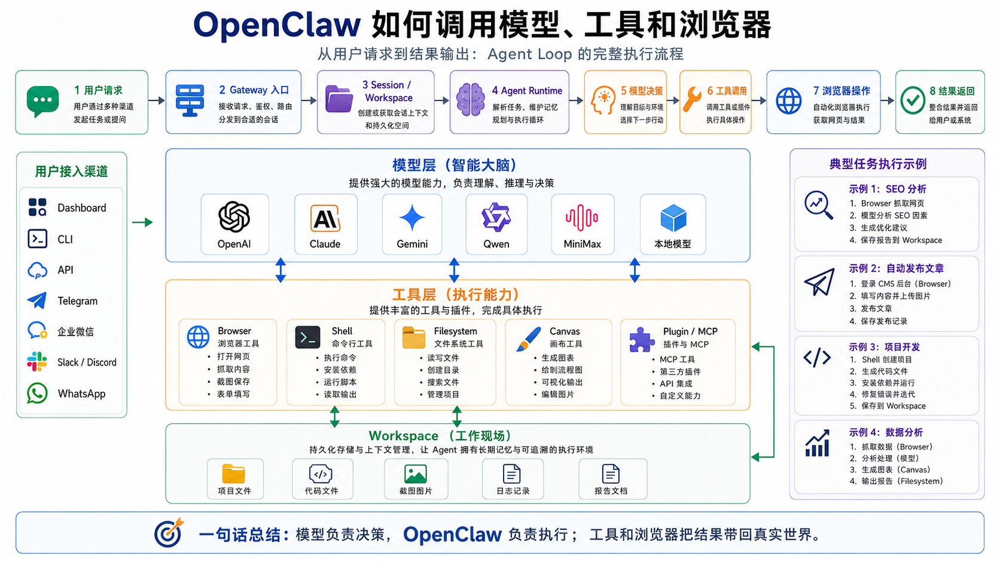

# OpenClaw 如何调用模型、工具和浏览器



很多人理解 AI Agent 时，会有一个很自然的误解：

“模型是不是直接打开浏览器？”

“模型是不是直接执行 Shell 命令？”

“模型是不是自己去读文件、写文件、点按钮？”

答案其实是否定的。

模型本身不会真的打开浏览器，也不会真的敲命令，更不会直接控制你的电脑。

模型做的事情更像是：

```text
看上下文
  ↓
判断下一步要做什么
  ↓
决定是否调用某个工具
  ↓
等待工具结果
  ↓
继续推理或给出最终回复
```

真正负责执行工具、连接浏览器、管理权限、保存会话、处理失败的，是 OpenClaw 的运行时系统。

这一篇我们就讲清楚：

**OpenClaw 是怎么把模型、工具和浏览器串成一次完整 Agent 执行的。**

如果前两篇是建立地图，这一篇就开始进入 OpenClaw 的执行层。

## 先说结论：模型负责决策，OpenClaw 负责执行

在 OpenClaw 里，一次 Agent 运行不是简单的：

```text
用户输入 → 模型回答
```

更准确的流程是：

```text
用户输入
  ↓
Gateway 接收请求
  ↓
解析 Session 和 Workspace
  ↓
组装系统提示词、上下文、历史消息
  ↓
选择模型 Provider 和具体模型
  ↓
计算本轮模型可见工具列表
  ↓
调用模型
  ↓
模型决定回复或调用工具
  ↓
OpenClaw 执行工具
  ↓
工具结果回到模型
  ↓
模型继续推理或输出最终回复
  ↓
写入会话、流式返回、持久化
```

官方文档把这个过程称为 Agent Loop。它不是一次模型请求，而是一条完整的执行链：intake、context assembly、model inference、tool execution、streaming replies、persistence。

这句话非常关键。

OpenClaw 的 Agent 能力，不在于“模型一次回答得多聪明”，而在于它能让模型在一个受控循环里不断观察、调用工具、读取结果、继续决策。

## 普通聊天和 Agent Loop 的区别

普通聊天系统通常是这样：

```text
你问一句
  ↓
模型回一句
```

最多加一点上下文、记忆或知识库。

但 Agent Loop 是这样：

```text
你给目标
  ↓
模型判断目标
  ↓
需要信息：调用搜索或浏览器
  ↓
需要操作：调用 Shell、文件、消息、插件
  ↓
拿到结果：继续判断
  ↓
必要时再调用工具
  ↓
完成后总结并返回
```

所以 Agent 的核心不是“回答”，而是“循环执行”。

这也是 OpenClaw 和普通聊天壳子的分水岭。

普通聊天壳子只关心模型怎么回。

OpenClaw 要关心：

- 模型用哪个
- 工具有哪些
- 哪些工具能给模型看到
- 工具结果怎么返回
- 工具是否需要审批
- 浏览器状态如何保存
- 执行过程怎么流式展示
- 失败后怎么中断、重试或排错

这才是一个真正 Agent Runtime 要处理的问题。

## 第一层：OpenClaw 如何调用模型

先看模型。

OpenClaw 支持很多模型 Provider，例如 OpenAI、Anthropic、Google Gemini、Qwen、MiniMax、Moonshot、OpenRouter、Ollama、LM Studio 等。

但在 OpenClaw 里，模型不是直接写一个 API Key 就完事。

它通常用一个标准形式来引用模型：

```text
provider/model
```

例如：

```text
openai/gpt-5.5
anthropic/claude-opus-4-6
google/gemini-3-flash-preview
qwen/...
minimax/...
ollama/...
```

这个格式很重要，因为它把“谁提供模型”和“具体使用哪个模型”分开了。

```text
provider = 模型供应商或运行入口
model    = 具体模型 ID
```

OpenClaw 调模型时，先要知道这两个东西。

## 模型选择不是随便选的

很多新手会以为：

“我配置了几个 Key，OpenClaw 会自动随便挑一个最强的。”

不是这样。

OpenClaw 的模型选择通常来自配置、会话覆盖、命令行设置、Provider 登录状态、模型 allowlist、fallback 规则以及插件钩子。

最常见的默认配置大概长这样：

```json5
{
  agents: {
    defaults: {
      model: {
        primary: "openai/gpt-5.5"
      }
    }
  }
}
```

也就是说，默认模型通常写在：

```text
agents.defaults.model.primary
```

如果你想切换默认模型，可以用类似：

```bash
openclaw models set provider/model
```

或者通过 onboarding、configure、provider auth login 等流程完成认证和选择。

但要注意一个细节：添加新的 Provider 认证，不一定会自动替换当前默认模型。官方文档明确提到，重新认证或新增 Provider 时，OpenClaw 会尽量保留已有 primary model，除非你明确要求设置默认模型。

这个设计很合理。

否则你只是想多接一个 Gemini，结果系统默认模型突然变了，生产环境就很容易出事故。

## 模型调用前发生了什么

当一条用户消息进入 OpenClaw，模型并不是第一时间被调用。

在调用模型前，OpenClaw 至少要做这些准备：

```text
1. 找到当前 Session
2. 加载会话历史
3. 解析 Workspace
4. 注入 bootstrap / AGENTS.md / MEMORY 等上下文
5. 构建系统提示词
6. 计算本轮可见工具
7. 解析模型 ref
8. 找到 Provider 认证信息
9. 应用模型限制、上下文窗口、token 预算
10. 才真正发起模型请求
```

这就是为什么你不能把 OpenClaw 理解成“一个模型代理”。

模型调用只是中间一步。

真正复杂的是模型调用前后那些工程化工作。

## 第二层：OpenClaw 如何把工具交给模型

现在看工具。

工具是 Agent 能“做事”的关键。

如果没有工具，模型只能生成文本。

有了工具，模型才可能：

- 读写文件
- 执行命令
- 搜索网页
- 拉取网页内容
- 操作浏览器
- 发送消息
- 调用 MCP 工具
- 调用插件能力
- 生成图片、音频、视频
- 创建子 Agent 或后台任务

OpenClaw 官方文档对工具的定义很直接：工具是 agent 可以调用的 typed function，例如 `exec`、`browser`、`web_search`、`message`、`image_generate` 等。

注意这里的关键词是 typed function。

模型看到的不是“你随便操作电脑吧”。

模型看到的是一组结构化工具说明：

```text
工具名
参数 schema
用途说明
可用条件
返回格式
```

然后模型在推理时决定是否发起某个工具调用。

## 工具不是全部都给模型看

这是理解 OpenClaw 工具系统最重要的一点。

不是系统里有什么工具，模型就能看到什么工具。

OpenClaw 会在模型调用前先过滤工具。

一个工具是否能出现在本轮模型请求里，可能受这些因素影响：

```text
tools.profile
tools.allow
tools.deny
provider 支持情况
sandbox 状态
channel 权限
runtime 策略
plugin 是否加载
MCP server 是否可见
当前 Agent 配置
```

官方文档里也强调：如果策略移除了某个工具，模型本轮不会收到这个工具的 schema。

这很关键。

如果模型看不到工具，它就不可能调用工具。

所以当你遇到：

```text
为什么 Agent 不会用浏览器？
为什么它不执行命令？
为什么 MCP 工具没出现？
为什么某个插件明明安装了但模型不用？
```

不要第一时间怪模型。

你要先查工具是否真的暴露给了本轮模型。

## 工具调用的真实流程

一次工具调用大概是这样：

```text
模型请求里带着可见工具列表
  ↓
模型决定调用某个工具
  ↓
OpenClaw 收到 tool_call
  ↓
执行前检查策略、权限、审批、沙箱、插件状态
  ↓
真正执行工具
  ↓
工具输出结果
  ↓
OpenClaw 清理、截断、脱敏或压缩结果
  ↓
工具结果写回会话
  ↓
模型继续下一轮推理
```

所以模型并不是“自由操作”。

它只是提出一个结构化调用请求。

OpenClaw 才是执行者。

这也是为什么 OpenClaw 可以做权限控制、审批、沙箱、日志和排错。

如果所有东西都由模型直接做，就没有这些控制点。

## Shell Tool：最强也最危险的工具之一

工具里面，`exec` 是最典型的例子。

它可以运行 Shell 命令。

这意味着它能：

- 查看文件
- 安装依赖
- 运行测试
- 启动服务
- 生成文件
- 删除文件
- 调用本地 CLI
- 执行部署脚本

但也正因为它能力强，所以风险也高。

官方文档明确说，`exec` 是一个 mutating shell surface。也就是说，它不是只读工具，命令可以在宿主机或沙箱允许的范围内创建、编辑、删除文件。

所以生产环境里一定要想清楚：

```text
exec 是否开启？
是否启用 sandbox？
是否需要审批？
是否允许 gateway host 执行？
是否允许 node host 执行？
是否限制 PATH？
是否只允许某些命令？
```

OpenClaw 的工具系统不是为了让 Agent 什么都能干，而是为了让 Agent 在你允许的范围内干事。

## 第三层：OpenClaw 如何调用浏览器

浏览器是最容易被误解的工具。

很多人以为“浏览器工具”就是网页搜索。

不是。

网页搜索通常是 `web_search` 或 `web_fetch` 这类工具。

浏览器工具是另一类能力：它让 Agent 能控制一个真实浏览器会话。

OpenClaw 的浏览器能力可以做这些事：

```text
打开页面
列出标签页
读取页面快照
截图
点击元素
输入文本
选择下拉框
拖拽
上传文件
等待下载
处理弹窗
读取 console 和网络请求
生成 PDF
```

这已经不是“搜一下网页”了。

这是让 Agent 有了一个可以操作 Web 应用的手。

## OpenClaw 管理的是独立浏览器

OpenClaw 的默认思路不是直接拿你的日常浏览器乱点。

官方文档说，OpenClaw 可以运行一个专用的 Chrome、Brave、Edge 或 Chromium profile，agent 可以控制它。这个 profile 和你的个人浏览器隔离，由 Gateway 里的本地控制服务管理。

可以把它理解成：

```text
你的日常浏览器：你自己用
OpenClaw 浏览器：Agent 专用
```

默认的 `openclaw` profile 是一个隔离浏览器环境。

这样做有几个好处：

- 不污染你的个人浏览器
- 不轻易碰你的登录态
- 更容易复现自动化过程
- 更适合截图、快照、点击、输入
- 更容易做权限和远程控制

当然，OpenClaw 也支持 `user` profile 或 existing-session 方式，让它连接到已有 Chrome 会话。但这属于更敏感的模式，适合明确需要登录态的场景，不应该一上来就默认使用。

## 浏览器调用的真实流程

一次浏览器任务可能是这样的：

```text
用户：帮我打开后台，查一下今天订单状态
  ↓
Gateway 接收请求
  ↓
Agent Loop 准备上下文和可见工具
  ↓
模型看到 browser 工具
  ↓
模型请求 browser.navigate
  ↓
OpenClaw 浏览器服务打开页面
  ↓
模型请求 browser.snapshot
  ↓
OpenClaw 返回页面结构和元素 ref
  ↓
模型根据 ref 请求 click/type/select
  ↓
浏览器执行动作
  ↓
模型继续读取页面
  ↓
最终整理结果返回给用户
```

这里有一个重要细节：浏览器自动化通常不是靠“猜 CSS 选择器”完成的，而是通过 snapshot 返回的稳定引用来操作。

比如页面快照里出现一个按钮 ref，模型下一步就可以调用：

```text
click <ref>
type <ref> "内容"
select <ref> OptionA
```

这比让模型凭空猜页面结构可靠得多。

## Browser 和 Web Search 的区别

这两个工具一定要分清。

`web_search` 更像：

```text
搜索引擎检索
  ↓
返回结果列表
  ↓
模型阅读摘要
```

`web_fetch` 更像：

```text
抓取某个 URL
  ↓
提取页面内容
  ↓
返回给模型阅读
```

`browser` 更像：

```text
打开真实网页
  ↓
读取页面状态
  ↓
点击、输入、等待、截图
  ↓
完成交互任务
```

如果只是查公开资料，搜索和 fetch 可能就够了。

如果需要登录、点击按钮、填写表单、翻页、下载文件、观察页面状态，就要用 Browser。

简单说：

```text
查资料：web_search / web_fetch
操作网站：browser
操作本机：exec
连接外部系统：plugin / MCP / message
```

## 浏览器为什么要经过 Gateway

前面讲过，Gateway 是 OpenClaw 的调度中心。

浏览器也不例外。

本地浏览器控制服务通常由 Gateway 管理。默认情况下，OpenClaw 浏览器控制服务绑定在 loopback，并且端口会从 Gateway 端口派生。

这说明浏览器不是模型自己启动的，也不是前端页面随便控制的。

它是被 OpenClaw 纳入统一运行体系里的能力。

这样做的好处是：

- 浏览器状态能和 Session 对齐
- 标签页能被追踪
- 截图和快照能返回给 Agent
- 动作可以被超时和错误处理包住
- 远程 Gateway 可以通过 node host 代理浏览器动作
- 生产环境可以统一控制是否启用浏览器

所以 Browser 不是一个附加玩具。

它是 OpenClaw 连接真实 Web 世界的重要执行工具。

## 把模型、工具和浏览器放在一起看

现在我们把三者放到一张完整流程里：

```text
用户输入
  ↓
Gateway 创建/找到 Session
  ↓
Workspace 注入上下文
  ↓
Tool Policy 计算可见工具
  ↓
Provider 解析模型
  ↓
模型收到：
  - 系统提示词
  - 历史消息
  - Workspace 上下文
  - 可见工具 schemas
  ↓
模型输出：
  - 文本回复
  - 或 tool_call
  ↓
OpenClaw 执行工具：
  - exec
  - browser
  - web_fetch
  - message
  - plugin
  - MCP
  ↓
工具结果回到模型
  ↓
模型继续推理
  ↓
最终结果写入 Session 并返回用户
```

这就是 OpenClaw 的执行核心。

模型不是孤立的。

工具不是裸奔的。

浏览器不是随便点的。

它们都被 Gateway、Session、Workspace、Tool Policy、Provider、Plugin 和 Browser Service 串起来。

## 一个真实例子：自动检查网页后台

假设你让 OpenClaw 做一件事：

```text
帮我打开订单后台，检查今天失败的订单，并整理成表格。
```

普通聊天模型只能告诉你步骤：

```text
请登录后台
点击订单
筛选失败状态
导出结果
```

OpenClaw 的 Agent 执行可能是：

```text
1. 识别任务需要浏览器
2. 检查 browser 工具是否可用
3. 打开后台 URL
4. 读取页面快照
5. 如果未登录，提示人工登录或使用已有 profile
6. 登录后继续读取页面
7. 点击订单菜单
8. 输入日期和状态筛选
9. 读取结果表格
10. 必要时翻页或导出
11. 把结果整理成 Markdown 表格
12. 写入 Workspace 或直接回复
```

这中间模型一直在做决策。

但打开页面、点击、输入、读取快照这些动作，都是 OpenClaw 的浏览器工具在执行。

这就是“模型 + 工具 + 浏览器”的组合价值。

## 常见误解

### 误解一：模型越强，工具就越不重要

恰恰相反。

模型越强，越需要稳定工具来把能力落地。

没有工具，模型只能生成建议。

有工具，模型才能执行任务。

### 误解二：工具装上了，模型就一定会用

不一定。

工具必须在本轮可见。

如果被 `tools.deny` 拦掉、被 sandbox 策略过滤、被 Provider 限制、插件没加载，模型根本看不到它。

### 误解三：Browser 等于 Web Search

不是。

Web Search 是查资料。

Browser 是操作网页。

一个负责找信息，一个负责和网页交互。

### 误解四：exec 只是读文件

不是。

`exec` 可以修改文件、删除文件、运行脚本、启动服务。

它是强能力工具，生产环境必须配合审批、沙箱和策略使用。

### 误解五：浏览器会直接操作我的私人 Chrome

默认不应该这样理解。

OpenClaw 推荐使用独立的 managed profile，让 Agent 在隔离环境里操作。只有当你明确使用 `user` 或 existing-session profile 时，才会接入已有浏览器会话。

## 排错时应该从哪里看

如果模型、工具或浏览器没有按预期工作，可以按这个顺序排查：

```text
1. Gateway 是否正常
2. Session 是否创建
3. 默认模型是否配置正确
4. Provider 是否认证成功
5. 模型 ref 是否是 provider/model
6. tools.profile 是否包含需要的工具
7. tools.allow / tools.deny 是否过滤了工具
8. sandbox 是否挡住了插件或 MCP 工具
9. Browser 是否 enabled
10. browser profile 是否启动
11. 页面是否需要人工登录或验证码
12. 工具调用是否需要审批
13. Session 日志里是否有 tool start / end / error
```

这套排查顺序比“模型怎么这么笨”有效得多。

因为很多时候不是模型不会做，而是它没有拿到正确工具，或者工具执行层被策略挡住了。

## 学习顺序建议

如果你正在按 90 天课程学习，我建议这一块按下面顺序练：

```text
第一步：先配置一个默认模型
第二步：用 CLI 确认 models list / models status
第三步：让 Agent 做一个纯文本任务
第四步：让 Agent 用 exec 读取 workspace 文件
第五步：启用 Browser 并打开一个公开网页
第六步：让 Agent 做一次 snapshot + click
第七步：再接 web_search、MCP、插件工具
第八步：最后再做登录态网页和企业系统自动化
```

不要一开始就挑战“自动登录复杂后台并完成业务操作”。

先把模型链路跑通。

再把普通工具跑通。

再把浏览器跑通。

最后再做真实业务自动化。

## 最后总结

OpenClaw 调用模型、工具和浏览器，本质上不是三件孤立的事。

它们都发生在 Agent Loop 里。

模型负责判断下一步。

工具负责执行真实动作。

浏览器负责连接真实 Web 页面。

Gateway 负责调度。

Workspace 负责上下文和工作现场。

Tool Policy 负责决定模型能看到什么能力。

Provider 负责把模型请求送到正确的模型服务。

所以真正的 OpenClaw 执行链是：

```text
上下文进入模型
  ↓
模型选择动作
  ↓
OpenClaw 执行工具
  ↓
结果回到模型
  ↓
循环直到完成任务
```

这就是 AI Agent 从“会回答”变成“会做事”的关键。

## 本节作业

完成下面几个练习，把模型、工具和浏览器的关系真正练熟：

1. 画一张 Agent Loop 流程图，至少包含用户输入、Gateway、模型调用、工具调用、工具结果、最终回复。
2. 用自己的话解释一句话：为什么说“模型负责决策，OpenClaw 负责执行”？
3. 找一个你想自动化的网页任务，拆成 5 个步骤，标出哪些步骤需要 Browser，哪些步骤只需要 Web Search。
4. 设计一个最小工具权限表：如果只允许 Agent 读文件、打开浏览器、搜索网页，你会开放哪些工具，禁止哪些工具？
5. 写一份排错清单：当模型没有调用浏览器时，你会检查模型配置、工具可见性、Browser 开关、登录态还是审批策略？

## 下一节预告

下一节我们会横向比较 OpenClaw、OpenHands、Hermes、Claude Code。

到那时你会更清楚：为什么 OpenClaw 更像一个 Agent Runtime，而不只是一个代码助手或浏览器自动化工具。比较完这些项目，你也会更容易判断：什么时候该用 OpenClaw，什么时候该用代码助手，什么时候该用专门的自动化工具。

## 参考资料

- [OpenClaw Agent loop](https://docs.openclaw.ai/concepts/agent-loop)
- [OpenClaw Agent runtime](https://docs.openclaw.ai/concepts/agent)
- [OpenClaw Provider directory](https://docs.openclaw.ai/providers)
- [OpenClaw Model providers](https://docs.openclaw.ai/concepts/model-providers)
- [OpenClaw Tools overview](https://docs.openclaw.ai/tools)
- [OpenClaw Tools config](https://docs.openclaw.ai/gateway/config-tools)
- [OpenClaw Exec tool](https://docs.openclaw.ai/tools/exec)
- [OpenClaw Browser tool](https://docs.openclaw.ai/tools/browser)
- [OpenClaw Browser CLI](https://docs.openclaw.ai/cli/browser)
