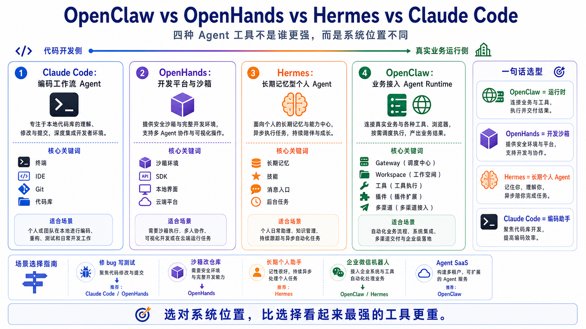

# OpenClaw vs OpenHands vs Hermes vs Claude Code



学 AI Agent，最容易掉进一个坑：

看到一个工具会写代码，就说它是 Agent。

看到一个工具能跑 Shell，就说它是 Agent。

看到一个工具能打开浏览器，就说它是 Agent。

看到一个工具支持 MCP、插件、记忆、子任务、自动化，又说它也是 Agent。

结果几天之后，你脑子里只剩下一团词：

OpenClaw、OpenHands、Hermes、Claude Code、Codex、Cursor、Cline、MCP、Browser、Workspace、Runtime、Gateway……

它们看起来都能“让 AI 做事”，但真正用起来差别很大。

这一篇不做排行榜。

因为问“谁最强”通常没有意义。

更好的问题是：

```text
我到底要让 AI 在什么环境里，替谁，长期完成什么类型的任务？
```

这句话一问，四个工具的边界就清楚了。

先给结论：

```text
OpenClaw   = 面向真实业务和多入口接入的 Agent Runtime
OpenHands  = 面向软件开发任务的沙箱化 AI 开发平台
Hermes     = 面向长期陪伴、记忆和自成长的个人/消息 Agent
Claude Code = 面向开发者日常编码工作流的商业级编码 Agent
```

你可以把它们都叫 Agent 工具。

但它们解决的不是同一个问题。

## 先用一张地图理解

如果只看“模型能不能调用工具”，它们确实很像。

但如果看系统边界，它们就分开了：

```text
                           AI Agent 工具光谱

代码开发侧                                                        真实业务运行侧
│                                                                    │
│  Claude Code       OpenHands              Hermes        OpenClaw   │
│  编码助手          开发平台/沙箱           个人长期 Agent  业务运行时 │
│                                                                    │
└────────────────────────────────────────────────────────────────────┘

更关注代码效率  →  更关注执行环境  →  更关注记忆陪伴  →  更关注系统接入
```

这不是说 Claude Code 不能做业务自动化。

也不是说 OpenClaw 不能写代码。

而是说它们的默认设计重心不同。

一个工具的设计重心，决定了它最顺手的场景，也决定了你把它用错时会遇到什么麻烦。

## 比较 Agent，不能只比模型

很多新手比较这类工具，会先问：

“它支持 Claude 吗？”

“它支持 GPT 吗？”

“它能不能用 Gemini？”

这些当然重要，但不是核心。

因为模型只是 Agent 系统里的一层。

真正决定体验的，是下面这些东西：

```text
1. 入口：用户从哪里发任务？
2. 运行时：谁拥有 Agent Loop？
3. 工作区：任务在哪里执行？
4. 工具：模型能调用哪些能力？
5. 状态：会话、文件、记忆怎么保存？
6. 权限：危险动作怎么审批？
7. 部署：它是个人工具、团队服务，还是业务系统？
8. 扩展：接新工具、新渠道、新协议有多难？
```

所以我们比较 OpenClaw、OpenHands、Hermes、Claude Code 时，不要只看“谁能写代码”。

要看它们分别站在哪个系统位置。

## OpenClaw：重点不是写代码，而是把 Agent 接进真实系统

OpenClaw 的关键词是：

```text
Gateway
Agent Loop
Workspace
Tools
Plugins
Channels
Long-running runtime
```

它最像什么？

它最像一个 Agent Runtime。

也就是说，它关心的不是“这一轮模型怎么回答”，而是“一条任务进入系统后，怎样被接收、调度、执行、记录、返回，并且长期稳定运行”。

前几篇我们已经拆过：

```text
用户 / CLI / Dashboard / 消息平台
  ↓
Gateway
  ↓
Session / Workspace
  ↓
Agent Loop
  ↓
模型决策
  ↓
工具 / 浏览器 / Shell / 插件
  ↓
结果返回与持久化
```

OpenClaw 的长处不是某一个单点功能，而是把这些东西组织成一个系统。

它可以接多种入口。

它有 Gateway 作为调度中心。

它有 Workspace 作为工作现场。

它有工具、插件、技能、浏览器、Shell、MCP 这些能力面。

它更适合你要把 Agent 做成一个长期运行的业务执行系统。

比如：

- 企业微信机器人
- Telegram 运营助手
- 内部数据问答
- 自动检查网页后台
- 定时生成运营报告
- 帮团队维护知识库
- 调用浏览器和 API 完成业务流程
- 把 Agent 能力封装成 SaaS

这就是 OpenClaw 的核心位置。

它不是“最会写代码的工具”。

它更像“让 Agent 能进入真实业务现场的运行平台”。

### OpenClaw 最适合什么

如果你的目标是下面这些，OpenClaw 很顺手：

```text
1. 多入口接入：CLI、Dashboard、HTTP API、企业微信、Telegram、Slack 等
2. 多工具协同：Browser、Shell、Filesystem、Canvas、MCP、插件
3. 长期任务：定时任务、后台任务、消息回调、持续监控
4. 企业集成：权限、日志、部署、内网、网关、回调
5. 产品化：把 Agent 能力包装成服务或 SaaS
```

### OpenClaw 不一定适合什么

如果你只是想在一个代码仓库里快速修 bug、写测试、提交 PR，Claude Code 或 OpenHands 往往更直接。

如果你只是想要一个“陪你聊天、记住你习惯、慢慢成长”的个人 Agent，Hermes 的气质可能更贴近。

OpenClaw 的优势在系统化。

系统化意味着它会比单一编码工具更重，也更需要你理解 Gateway、Workspace、工具策略、部署和安全边界。

## OpenHands：重点是 AI 软件开发平台和沙箱运行

OpenHands 的关键词是：

```text
Software development agent
SDK
CLI
Local GUI
Cloud
Enterprise
Docker sandbox
Runtime / Sandbox
```

如果说 OpenClaw 的问题是：

```text
Agent 如何接入真实业务系统？
```

那么 OpenHands 更像在回答：

```text
AI 如何像开发者一样，在一个可控环境里修改代码、运行命令、观察结果？
```

OpenHands 官方文档把它描述成一个 AI-driven development 社区和平台。

它提供 SDK、CLI、本地 GUI、Cloud、Enterprise 等形态。

它的一个重要设计，是用沙箱环境运行代码和命令。

这点非常关键。

软件开发 Agent 经常要执行不确定的代码：

- 安装依赖
- 运行测试
- 启动服务
- 改配置
- 执行脚本
- 尝试修复失败

如果这些动作直接发生在宿主机上，风险很高。

所以 OpenHands 强调 Docker Runtime / Sandbox：让 Agent 在隔离环境里执行动作，把结果作为 observation 返回给后端。

这个设计很适合软件开发任务。

因为开发任务往往需要一个完整但隔离的实验场。

### OpenHands 最适合什么

OpenHands 适合这类场景：

```text
1. 让 Agent 在仓库里完成开发任务
2. 需要 Docker 沙箱隔离执行命令
3. 需要 Web GUI 观察 Agent 工作过程
4. 想把软件开发 Agent 接进团队流程
5. 想用 SDK 构建自己的开发 Agent
6. 想在 Cloud / Enterprise 形态下规模化运行开发任务
```

举个例子：

你有一个 GitHub issue：

```text
修复登录页在移动端布局错乱的问题，
补一条回归测试，
跑完测试后给出变更说明。
```

这类任务非常适合 OpenHands。

它可以在沙箱中打开仓库、修改文件、运行测试、收集 observation，再继续下一步。

### OpenHands 不一定适合什么

如果你的核心场景不是“软件开发”，而是“多消息渠道业务机器人”，OpenHands 就不是最自然的入口。

它可以被扩展、可以走 API、也可以被接入自动化流程。

但它的默认心智模型仍然是开发任务、代码仓库和沙箱执行。

也就是说：

```text
OpenHands 更像 AI 软件工程师的工作台，
不是天然的企业消息 Agent 网关。
```

## Hermes：重点是长期记忆、消息入口和自成长

Hermes Agent 的关键词是：

```text
The agent that grows with you
CLI / TUI
Messaging Gateway
Skills
Memory
Toolsets
Cron
Background tasks
Self-improvement
```

Hermes 和 OpenClaw 有一些气质相近的地方。

它也有 CLI。

它也有消息 Gateway。

它也能接 Telegram、Discord、Slack、WhatsApp、Signal、Email 等渠道。

它也有工具、MCP、技能、记忆、后台任务。

所以很多人会把 Hermes 和 OpenClaw 放在一起比较。

这个比较是合理的。

但它们的重心仍然不同。

Hermes 更强调：

```text
一个会长期记住你、学习你、逐步成长的个人 Agent。
```

它的记忆系统、session search、外部 memory provider、skills、background tasks，都让它很适合作为长期个人助手或“消息里的 AI Worker”。

如果你希望 Agent 不只是完成一次任务，而是能逐渐理解你的偏好、历史会话、工作方式，Hermes 的设计会很吸引人。

### Hermes 最适合什么

Hermes 适合这类场景：

```text
1. 个人长期 Agent
2. 多消息平台助手
3. 重视记忆、会话搜索和用户画像
4. 希望通过 Skills 积累工作流
5. 希望把任务扔给后台运行，结果通过聊天平台返回
6. 喜欢可自定义、可成长、可迁移的个人智能体
```

比如：

你每天在 Telegram 里对 Hermes 说：

```text
帮我查今天项目仓库的新 issue，
按优先级整理，
把需要我处理的发到 Slack，
顺便记住我不喜欢周一上午安排部署。
```

这类“个人偏好 + 多渠道 + 长期记忆 + 工具执行”的任务，Hermes 会比较有感觉。

### Hermes 和 OpenClaw 最大的差异

我会这样区分：

```text
Hermes 更像“长期成长的个人 Agent”。
OpenClaw 更像“可接入业务系统的 Agent Runtime”。
```

两者有交集。

但当你需要严格设计企业接入、网关、Workspace、插件生命周期、工具策略、远程调用和 SaaS 改造时，OpenClaw 这条路线更贴近本课程的目标。

当你更关心“它记不记得我、会不会越来越懂我、能不能像一个个人助手一样存在”，Hermes 更像那个方向。

## Claude Code：重点是开发者的编码工作流

Claude Code 的关键词是：

```text
Terminal
IDE
Codebase
File edits
Shell commands
Git workflows
MCP
Hooks
Subagents
Commercial coding agent
```

Claude Code 是这四个里面最容易让开发者立刻产生价值的工具之一。

你在项目里运行：

```bash
claude
```

然后告诉它：

```text
帮我看一下这个项目的认证逻辑，
修复登录失败的问题，
补测试，
跑完后提交一个清晰的变更说明。
```

它会读代码、搜文件、改文件、跑命令、看错误、继续修。

这就是它的强项。

Claude Code 官方文档也强调，它是一个 agentic coding tool，可以读代码库、编辑文件、运行命令，并通过终端、IDE、桌面、浏览器等形态进入开发工作流。

它不是一个需要你自己从零搭起来的 Agent Runtime。

它是一个成熟的开发者产品。

### Claude Code 最适合什么

Claude Code 适合：

```text
1. 日常编码
2. 修 bug
3. 写测试
4. 解释代码
5. 重构
6. Git 工作流
7. PR / CI / issue 相关任务
8. 通过 MCP 接内部工具
9. 快速把一个开发任务做完
```

如果你每天都写代码，它可能是四个里面最直接提升效率的工具。

因为它离开发现场太近了：

- 终端
- 编辑器
- Git
- 文件系统
- 测试命令
- 代码上下文

这些都是开发者每天真实使用的东西。

### Claude Code 不一定适合什么

Claude Code 很强，但不要把它误解成“你自己的 Agent 平台后端”。

它当然可以脚本化，可以接 MCP，可以跑在 CI，可以做自动化。

但它的默认产品边界仍然是开发者工作流。

如果你要做的是：

- 企业微信机器人
- 多租户 Agent SaaS
- 自定义业务网关
- 多消息平台分发
- 长期后台任务队列
- 复杂权限系统
- 内网部署和故障转移

那 Claude Code 可能是一个很好的开发工具，但不一定是最终运行平台。

一句话：

```text
Claude Code 很适合帮你构建系统，
但不一定适合直接成为那个系统。
```

## 四者核心差异表

下面这张表比“谁更强”更有用：

| 维度 | OpenClaw | OpenHands | Hermes | Claude Code |
|---|---|---|---|---|
| 核心定位 | Agent Runtime / 业务接入平台 | AI 软件开发平台 | 长期记忆型个人 Agent | 编码工作流 Agent |
| 默认场景 | 多渠道、工具、插件、业务系统 | 代码仓库、沙箱、开发任务 | 消息助手、记忆、后台任务 | 终端、IDE、Git、代码库 |
| 入口 | CLI、Dashboard、HTTP、消息平台 | CLI、Local GUI、Cloud、SDK | CLI/TUI、消息 Gateway | Terminal、IDE、Desktop、Web |
| 执行环境 | Gateway + Workspace + 工具策略 | Docker / Process / Remote sandbox | 本地 Agent + Gateway + toolsets | 本地/云端 Claude Code session |
| 最强优势 | 系统接入和长期运行 | 开发任务沙箱化 | 记忆、技能、个人化成长 | 编码体验和开发者效率 |
| 典型工具 | Browser、Shell、MCP、插件、消息 | Shell、文件、浏览器、开发插件 | Terminal、Browser、Memory、Skills、Cron | 文件、Shell、Git、Web、MCP、Hooks |
| 更适合谁 | 想做 Agent 产品/企业自动化的人 | 想让 AI 做软件工程任务的人 | 想要个人长期 AI Worker 的人 | 每天写代码的开发者 |
| 主要风险 | 系统复杂度和安全边界 | Docker/沙箱资源和配置复杂度 | 权限、记忆污染、长期状态治理 | 过度依赖单一商业工具边界 |

这张表不需要背。

你只要记住四个词：

```text
OpenClaw：运行时
OpenHands：开发沙箱
Hermes：长期个人 Agent
Claude Code：编码助手
```

## 用真实场景来选

工具选型最好不要从工具开始，而要从任务开始。

下面几个例子会更清楚。

### 场景一：修一个复杂项目 bug

你要修一个项目里的异步任务失败问题。

需要读代码、跑测试、看日志、改文件、提交说明。

优先考虑：

```text
Claude Code 或 OpenHands
```

如果你在本地开发，想要最快的交互体验，Claude Code 很舒服。

如果你想把执行放到隔离沙箱里，或者希望通过 Web GUI / Cloud / Enterprise 管理开发任务，OpenHands 更合适。

OpenClaw 也能做，但它不是为“单次代码修复体验”最优化的。

### 场景二：做一个企业微信客服机器人

你要把 Agent 接到企业微信。

它要接收用户消息、判断意图、查知识库、调用内部 API、必要时浏览后台页面、记录日志，并把结果返回到群聊。

优先考虑：

```text
OpenClaw 或 Hermes
```

如果你的重点是企业接入、网关、Workspace、插件、部署和后续 SaaS 改造，OpenClaw 更贴近。

如果你的重点是个人/小团队长期助手、记忆、技能和消息入口，Hermes 很合适。

Claude Code 可以帮你开发这个机器人，但不应该默认成为机器人运行时。

OpenHands 也可以帮你开发代码，但它不是天然的消息网关。

### 场景三：让 AI 在沙箱里改一个仓库

你不想让 Agent 直接操作宿主机。

你希望它在容器中安装依赖、跑测试、修复问题。

优先考虑：

```text
OpenHands
```

因为 OpenHands 的 Docker Runtime / Sandbox 正是为了这种执行模型设计的。

这不是说其他工具不能沙箱化。

而是说 OpenHands 在“开发任务 + 沙箱执行”这条路径上更天然。

### 场景四：做一个长期记住你的 AI 助手

你希望 Agent 记得：

- 你的偏好
- 你的工作节奏
- 你过去的项目
- 你常用的命令
- 你不喜欢的回复风格
- 你和它以前讨论过的事情

优先考虑：

```text
Hermes 或 OpenClaw
```

Hermes 的记忆、session search、external memory provider 和技能系统很突出。

OpenClaw 也有 Workspace、Memory、Skills、Plugin，可以沿着业务系统方向做长期状态管理。

区别是：

```text
Hermes 更像个人长期 Agent。
OpenClaw 更像业务运行时里的长期上下文。
```

### 场景五：做一个 Agent SaaS

你想让不同客户创建自己的 Agent。

每个客户有不同模型、不同工具、不同权限、不同工作区、不同消息渠道。

优先考虑：

```text
OpenClaw
```

因为你真正要解决的是：

```text
多租户
权限
网关
工具策略
任务追踪
回调
审计
部署
故障恢复
商业化计费
```

这些不是“模型会不会写代码”的问题。

这是运行平台问题。

Claude Code 可以帮你写 SaaS 代码。

OpenHands 可以帮你跑开发任务。

Hermes 可以给你一些长期 Agent 和记忆系统的启发。

但最终你需要的是 Agent Runtime 和业务平台架构。

这正是本课程后面要讲的方向。

## 常见误解

### 误解一：Claude Code 最强，所以所有事情都用 Claude Code

Claude Code 很强，尤其是开发场景。

但“强”不等于“适合当所有系统的运行时”。

开发工具和业务运行平台不是一回事。

你可以用 Claude Code 构建 OpenClaw 插件、写企业微信机器人代码、调试 Docker 配置。

但真正让机器人 24 小时接收消息、排队、调用工具、保存状态、处理权限的，仍然需要运行平台。

### 误解二：OpenHands 有沙箱，所以一定比 OpenClaw 安全

不能这样简单比较。

OpenHands 的 Docker sandbox 对开发任务很重要。

但安全不是只有“有没有容器”。

Agent 系统还要看：

- 哪些工具可见
- 密钥如何注入
- 输出是否审计
- 外部内容是否可能 prompt injection
- 是否有审批
- 是否有日志和回滚
- 是否有网络隔离

不同工具的安全边界不同，不能只用一个标签判断。

### 误解三：Hermes 和 OpenClaw 是完全一样的

它们有相似之处，尤其是消息入口、工具、技能、记忆、后台任务。

但 OpenClaw 更适合从 Runtime、Gateway、业务接入和产品化角度理解。

Hermes 更适合从个人 Agent、长期记忆、自成长、消息陪伴角度理解。

重合不等于相同。

### 误解四：OpenClaw 不如 OpenHands，因为它不是专门写代码的

这是错位比较。

OpenHands 专注软件开发任务，这正是它的优势。

OpenClaw 的重点是让 Agent 接入真实业务系统。

一个像开发工作台。

一个像运行平台。

你不会因为数据库不会写 React 页面，就说数据库“不如前端框架”。

它们本来就不是同一层。

## 一句话选型法

如果你还是记不住，可以用这张小抄：

```text
我要让 AI 帮我写代码、修 bug、跑测试：
  → Claude Code / OpenHands

我要让 AI 在沙箱里完成开发任务：
  → OpenHands

我要一个长期记住我的消息型个人 Agent：
  → Hermes

我要把 Agent 接入企业微信、浏览器、API、内部系统，并长期运行：
  → OpenClaw

我要做 Agent SaaS 或企业自动化平台：
  → OpenClaw 为主，Claude Code / OpenHands 辅助开发
```

## 学习顺序建议

如果你按这个 90 天课程学习，不建议一开始就把四个工具都装上，然后来回切。

更好的顺序是：

```text
第一步：先理解 OpenClaw 的 Runtime 思维
第二步：理解 Gateway、Workspace、Agent Loop、Tools
第三步：用 Claude Code 或 OpenHands 类比“开发工具”和“运行平台”的差异
第四步：再看 Hermes 的记忆、技能、消息入口和长期 Agent 思路
第五步：最后回到 OpenClaw，思考如何做企业级接入和产品化
```

不要把工具学成“命令大全”。

你真正要学的是：

```text
不同 Agent 系统如何划分边界，
以及在真实业务里应该把它们放在哪个位置。
```

## 最后总结

OpenClaw、OpenHands、Hermes、Claude Code 都可以被称为 AI Agent 工具。

但它们不是同一个层级的东西。

Claude Code 是开发者工作流里的强力编码 Agent。

OpenHands 是软件开发任务的沙箱化平台。

Hermes 是强调记忆、技能、消息入口和长期成长的个人 Agent。

OpenClaw 是面向真实业务系统、多入口、多工具、多插件、长期运行的 Agent Runtime。

所以这篇的核心不是“谁赢了”。

核心是：

```text
Claude Code 帮你更快开发。
OpenHands 帮你在沙箱里跑开发任务。
Hermes 帮你构建长期个人 Agent。
OpenClaw 帮你把 Agent 接进真实业务系统。
```

选对位置，比选一个“看起来最强”的工具重要得多。

## 本节作业

完成下面几个练习，训练你的 Agent 工具选型能力：

1. 选一个你真实想做的 Agent 项目，判断它更像“代码开发任务”“个人长期助手”还是“业务运行平台”。
2. 用一句话分别解释 OpenClaw、OpenHands、Hermes、Claude Code 的核心定位。
3. 画一个四象限图：横轴是“代码开发 → 业务运行”，纵轴是“一次性任务 → 长期状态”，把四个工具放进去。
4. 写出一个场景：Claude Code 很适合开发它，但不适合作为最终运行时。
5. 写出一个场景：OpenClaw 比单纯代码助手更适合，因为它需要 Gateway、Workspace、工具策略和消息入口。

## 下一节预告

下一节我们会进入 OpenClaw Skill：如何使用 OpenClaw Skill。

前四节我们一直在讲 OpenClaw 的系统位置、执行链路和工具边界。到了 Skill，你会开始看到一个更细的层次：当 Agent 已经有模型和工具之后，怎样把一套可复用的工作方法教给它。

## 参考资料

- [OpenClaw Gateway architecture](https://docs.openclaw.ai/concepts/architecture)
- [OpenClaw Agent loop](https://docs.openclaw.ai/concepts/agent-loop)
- [OpenClaw Capabilities overview](https://docs.openclaw.ai/tools)
- [OpenHands Introduction](https://docs.openhands.dev/overview/introduction)
- [OpenHands Runtime Architecture](https://docs.openhands.dev/openhands/usage/architecture/runtime)
- [OpenHands Sandbox Overview](https://docs.openhands.dev/openhands/usage/sandboxes/overview)
- [Hermes Agent GitHub](https://github.com/NousResearch/hermes-agent)
- [Hermes Tools & Toolsets](https://hermes-agent.nousresearch.com/docs/user-guide/features/tools/)
- [Hermes Messaging Gateway](https://hermes-agent.nousresearch.com/docs/user-guide/messaging)
- [Hermes Persistent Memory](https://hermes-agent.nousresearch.com/docs/user-guide/features/memory/)
- [Claude Code Overview](https://code.claude.com/docs/en/overview)
- [How Claude Code works](https://code.claude.com/docs/en/how-claude-code-works)
- [Claude Code MCP](https://code.claude.com/docs/en/mcp)

---

原文外链：[OpenClaw vs OpenHands vs Hermes vs Claude Code](https://www.harries.blog/archives/720281.html)
