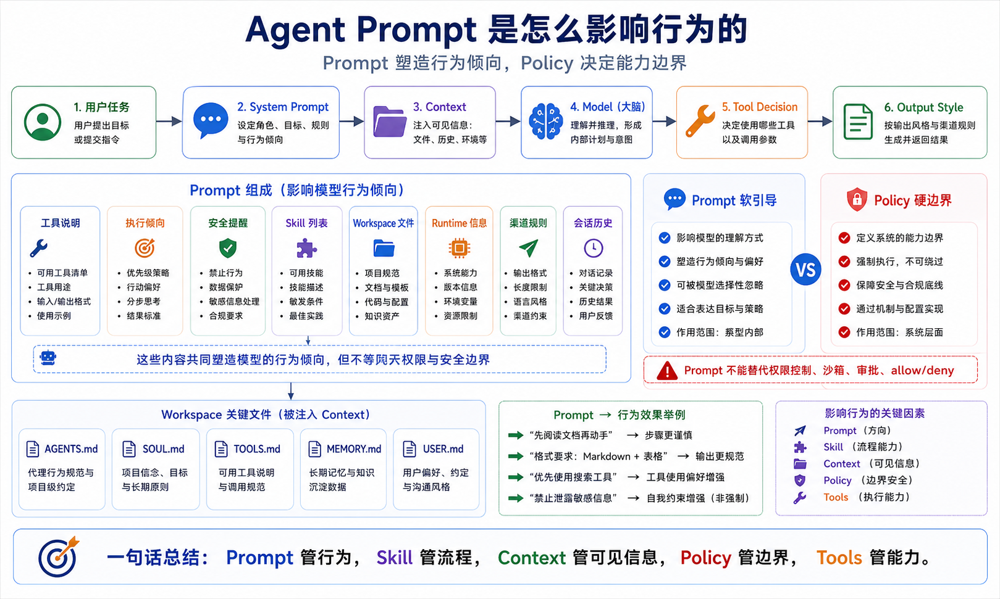

# Agent Prompt 是怎么影响行为的



同一个模型，为什么在不同 Agent 里表现完全不一样？

有时候它很主动，会自己查资料、读文件、跑命令、验证结果。

有时候它很保守，只会问你“是否继续”。

有时候它像工程师，先看代码再动手。

有时候它像客服，优先简短回复用户。

差别不一定来自模型。

很多时候，差别来自 Prompt。

更准确地说，是系统提示词、工具说明、Skill 列表、Workspace 文件、运行时信息、渠道规则共同组成的 Agent Prompt 环境。

这一篇我们讲清楚：Agent Prompt 不是一句“你是一个助手”，而是 OpenClaw 每次运行前组装出来的一套行为操作系统。

## 先说结论：Prompt 决定倾向，策略决定边界

Prompt 会影响 Agent：

```text
如何理解身份
是否主动执行
是否调用工具
如何处理不确定性
如何输出结果
是否需要引用记忆
是否遵守渠道回复格式
是否倾向继续完成任务
```

但 Prompt 不是硬安全边界。

它能引导模型。

不能真正阻止高权限工具执行。

真正的硬约束要靠：

```text
tool policy
exec approvals
sandbox
channel allowlist
provider limits
gateway configuration
```

所以你要同时记住两句话：

```text
Prompt 塑造行为倾向。
Policy 决定能力边界。
```

## OpenClaw 的 Prompt 不是固定文本

OpenClaw 官方文档明确说明：OpenClaw 会为每次 agent run 构建自定义 system prompt。

它不是简单从某个文件复制一段固定话术。

它会根据当前运行状态组装多个部分。

大致包括：

```text
Tooling：工具使用规则和可用工具说明
Execution Bias：遇到可执行任务时应尽量推进
Safety：安全提醒
Skills：可用 Skill 列表和加载方式
OpenClaw Control：如何处理配置、重启、Gateway 相关操作
Workspace：当前工作目录
Documentation：本地或在线文档位置
Workspace Files：注入的项目上下文
Sandbox：沙箱状态
Current Date & Time：时间和时区信息
Runtime：主机、系统、模型、推理级别等
Messaging / Channel：渠道回复格式、分块、静默回复等
```

这就是为什么同一句用户输入，在不同环境里会触发不同结果。

模型看到的不只是你打的那句话。

它还看到 OpenClaw 为本轮任务构建的运行现场。

## Prompt 如何改变 Agent 的执行风格

举个例子。

如果系统提示词里强调：

```text
遇到可执行任务时，不要只给建议；能做就直接做，直到完成或遇到阻塞。
```

Agent 就更可能：

- 先读文件
- 调工具
- 跑命令
- 验证结果
- 最后总结

如果系统提示词里强调：

```text
任何执行前都必须先确认。
```

Agent 就会更谨慎，更频繁询问你。

如果系统提示词里强调：

```text
回复应简短，适合消息平台。
```

它就会少写长篇解释。

如果系统提示词里注入了：

```text
当前渠道是 Telegram 群聊，回复需要带 reply tag。
```

它就会调整消息格式。

Prompt 不只是“性格”。

Prompt 是任务执行方式。

## Workspace 文件如何影响行为

OpenClaw 会把某些 workspace 文件注入 Project Context。

常见文件包括：

```text
AGENTS.md
SOUL.md
TOOLS.md
IDENTITY.md
USER.md
HEARTBEAT.md
BOOTSTRAP.md
MEMORY.md
```

这些文件各自影响不同层面：

```text
AGENTS.md   = 操作规则和长期指令
SOUL.md     = 角色、语气、边界
TOOLS.md    = 工具使用习惯和本地约定
IDENTITY.md = Agent 名称和身份
USER.md     = 用户偏好
MEMORY.md   = 长期摘要
BOOTSTRAP.md = 首次初始化流程
```

这也是为什么你改一个 `AGENTS.md`，Agent 行为会变。

比如在 `AGENTS.md` 写：

```text
所有代码修改前先阅读相关测试。
```

Agent 就会更倾向先找测试。

在 `TOOLS.md` 写：

```text
部署命令必须先 dry-run。
```

Agent 就会更谨慎地执行部署相关命令。

这些不是工具能力变化，而是行为规则变化。

## Skill 列表如何影响行为

Skill 不会默认全文注入。

OpenClaw 会把可用 Skill 的名称、描述、位置放进 Prompt。

模型看到这些信息后，会判断是否需要读取某个 `SKILL.md`。

所以 Skill 对行为有两层影响：

```text
第一层：描述影响模型是否选择它
第二层：SKILL.md 正文影响模型如何执行
```

如果 Skill 描述写得很模糊：

```text
帮助用户完成各种任务。
```

模型很难知道什么时候该用。

如果描述写得明确：

```text
Use when the user asks for browser-based form submission, page inspection, screenshots, or multi-step web automation.
```

模型更容易匹配。

所以写 Skill 时，description 不是装饰。

它直接影响触发概率。

## Context 窗口会限制 Prompt 的效果

Prompt 再好，也要进入模型上下文才有效。

OpenClaw 文档里把 context 定义为模型当前 run 能看到的一切，包括：

```text
System prompt
Conversation history
Tool calls and results
Attachments
Injected workspace files
Compaction summaries
Tool schemas
Skill metadata
```

模型上下文窗口是有限的。

文件太大、工具太多、历史太长，都会挤占空间。

OpenClaw 会对 workspace 注入文件做长度限制，过大的内容会截断。

这就是为什么你不能把所有规则都塞进一个巨大 `MEMORY.md`。

更好的方式是：

```text
稳定规则放 AGENTS.md
角色语气放 SOUL.md
工具约定放 TOOLS.md
长期摘要放 MEMORY.md
详细历史放可搜索记忆或文件
具体流程放 Skill
```

这样上下文才不会变成一团糊。

## Prompt 不能解决所有问题

很多人一遇到 Agent 出错，就想“再加一句 Prompt”。

这有时有效，但不是万能。

比如你写：

```text
不要执行危险命令。
```

这只是提醒。

真正要限制危险命令，应该配置：

```text
exec approval
工具 allow / deny
sandbox
channel allowlist
只读 workspace
密钥隔离
```

比如你写：

```text
一定要使用 browser。
```

但 browser 工具没有启用，模型仍然用不了。

Prompt 能改变模型“想做什么”。

配置和工具策略决定它“能做什么”。

## 常见误解

### 误解一：Prompt 写得越长越好

不是。

长 Prompt 会占用上下文，也会稀释重点。

好的 Prompt 是结构清楚、优先级明确、可执行。

### 误解二：Prompt 可以代替 Skill

不建议。

Prompt 适合写通用行为规则。

Skill 适合写某类任务的详细步骤。

把所有流程都塞进系统 Prompt，会让每次运行都背着一大包无关内容。

### 误解三：Prompt 可以代替安全配置

不能。

Prompt 是软约束。

安全配置才是硬边界。

### 误解四：模型不听话一定是模型差

不一定。

可能是上下文被截断、Skill 没加载、工具不可见、渠道规则覆盖、Prompt 冲突、历史消息干扰。

排错时要看完整上下文，而不是只看用户输入。

## 最后总结

Agent Prompt 是 OpenClaw 行为的底层操控台。

它由系统提示词、工具说明、Skill 列表、Workspace 文件、运行时状态、渠道规则、历史消息共同构成。

它决定 Agent 更主动还是更保守，更像工程师还是客服，更倾向调用工具还是只解释。

但 Prompt 不是万能安全墙。

正确做法是：

```text
Prompt 管行为
Skill 管流程
Context 管可见信息
Policy 管硬边界
Tools 管真实能力
```

理解这套关系，你才不会把所有问题都归咎于“模型不行”。

## 本节作业

1. 打开你的 `AGENTS.md`，找出 3 条会明显影响 Agent 行为的规则。
2. 设计一条“让 Agent 更主动执行”的规则，再设计一条“让 Agent 更谨慎确认”的规则。
3. 用 `/context list` 或类似方式观察系统提示词、工具和 Skill 对上下文的占用。
4. 把一个长 Prompt 拆成：通用规则、Skill 流程、工具策略三部分。
5. 写出一个 Prompt 无法解决、必须用 tool policy 解决的问题。

## 下一节预告

下一节我们讲：用户输入后内部发生了什么。

这一节我们看的是 Prompt 如何塑造行为；下一节会把视角推进到运行链路：一条消息进入 OpenClaw 后，如何经过 Gateway、session、queue、context assembly、model call、tool execution，最终变成回复。

## 参考资料

- [OpenClaw System prompt](https://docs.openclaw.ai/concepts/system-prompt)
- [OpenClaw Context](https://docs.openclaw.ai/concepts/context)
- [OpenClaw Agent runtime](https://docs.openclaw.ai/concepts/agent)
- [OpenClaw Skills](https://docs.openclaw.ai/tools/skills)

---

原文外链：[Agent Prompt 是怎么影响行为的](https://www.harries.blog/archives/720294.html)
