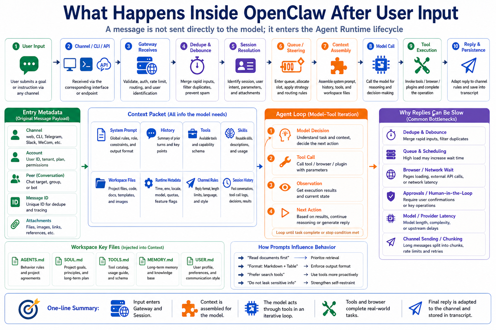

# What Happens Inside OpenClaw After User Input



You type a message into OpenClaw:

```text
Check this admin dashboard and generate a report.
```

From the outside, it looks simple:

```text
user sends message
  ↓
model replies
```

Internally, much more happens.

The message enters the Gateway.

The Gateway resolves the session.

If a run is already active, the message may be queued, collected, or steered into the next model turn.

The runtime assembles prompt, context, tools, skills, workspace information, and channel rules.

The model may call tools.

Tool observations return to the model.

The final response is streamed, chunked, adapted to the channel, and persisted.

This article follows that path.

## The Short Version

User input is not sent directly to the model.

The real flow looks like:

```text
User input
  ↓
Channel / CLI / Dashboard / API
  ↓
Gateway receives message
  ↓
Dedupe, debounce, routing, bindings
  ↓
Resolve session key
  ↓
Queue or steer into active run
  ↓
Create agent run
  ↓
Assemble system prompt, context, tools, skills
  ↓
Call model
  ↓
Model replies or requests tool calls
  ↓
Execute tools and return observations
  ↓
Model continues reasoning
  ↓
Generate final output
  ↓
Stream or chunk according to channel limits
  ↓
Persist transcript and state
```

The model is one stage in the runtime, not the whole runtime.

## Step 1: Different Entry Points Produce Different Messages

Input can arrive through:

```text
CLI
Dashboard
HTTP API
Telegram
WeCom
Slack / Discord
WhatsApp
Browser control UI
scheduled jobs
webhooks
```

Different entry points carry different metadata.

CLI input is usually direct.

Messaging channels include channel, account, peer, message id, reply id, group context, attachments, images, audio, and more.

HTTP APIs may include business user ids, task ids, and callback URLs.

OpenClaw first normalizes these forms into messages that can enter the Agent Runtime.

That is part of the Gateway's job.

Gateway is not merely a model proxy.

It is the input normalization and orchestration layer.

## Step 2: Dedupe and Debounce

Messaging platforms can redeliver the same message.

Reconnects, webhook retries, and client sync can send the same user message multiple times.

OpenClaw uses inbound dedupe to avoid triggering duplicate agent runs.

Another common case is split messages:

```text
help me check
this dashboard
yesterday's data
and take screenshots
```

If every short message triggered a separate model call, the experience would be poor and expensive.

OpenClaw supports inbound debouncing so rapid text messages from the same sender can be batched into one turn.

Control commands usually bypass debouncing so they remain standalone.

So when several messages are handled together, that is not magic.

It is Gateway-level message handling.

## Step 3: Resolve Session

Sessions are owned by the Gateway, not by individual clients.

Direct chats, groups, channels, and devices map to session keys.

A useful mental model:

```text
direct chat → main session
group/channel → separate session key
Control UI / TUI → gateway-backed session transcript
```

Session decides which history the model sees.

The same message can behave differently in different sessions because history, memory, tool results, and context differ.

This also explains why context from one messaging client is not automatically fully synced into another.

The Gateway transcript is the source of truth.

## Step 4: Queue and Steering

If no task is active, a new message can start a new agent run.

But what happens if the agent is currently using tools or waiting for model output?

OpenClaw has queue and steering behavior.

Simplified:

```text
followup  = wait until the current run finishes
steer     = inject the new message before the next model call
interrupt = abort the active run
collect   = gather messages for later processing
```

This matters in real work.

Suppose the agent is browsing an admin page and you add:

```text
Only check East China data.
```

If the message can steer the active run, the agent can adjust before continuing.

If every message becomes a separate task, the workflow becomes chaotic.

## Step 5: Assemble Context

Before calling the model, OpenClaw assembles context.

Context can include:

```text
system prompt
conversation history
workspace-injected files
skill metadata
tool list and schemas
tool call results
attachments
compaction summaries
runtime metadata
channel context
```

This is one of the most important steps.

The user thinks the model only saw the visible message.

In reality, the model receives a complete runtime packet:

- workspace path
- `AGENTS.md` instructions
- `SOUL.md` tone
- available tools
- available skills
- channel reply rules
- session history
- recent tool results
- time and runtime state

User input is only one part.

Context defines the world the model can see.

## Step 6: Call the Model

After context is assembled, OpenClaw selects the provider and model based on configuration.

The model receives:

```text
system prompt
history
tool schemas
skill list
current user task
runtime information
```

The model can:

```text
reply directly
request a tool call
```

For a simple text summary, direct reply may be enough.

For real-world work such as:

```text
Open the admin page, export data, and generate a report.
```

the model needs Browser, Shell, Filesystem, MCP, or plugin tools.

## Step 7: Tool Execution and Observation

The model does not directly operate your browser or shell.

It requests tool calls.

OpenClaw checks policy, approval rules, sandboxing, and configuration before executing.

The result returns to the model as an observation.

The loop:

```text
Model requests tool
  ↓
OpenClaw checks whether the tool is allowed
  ↓
Approval is requested if needed
  ↓
Tool executes
  ↓
Result, error, screenshot, or file path returns
  ↓
Model reads observation
  ↓
Model decides next step
```

This is the Agent Loop.

The model does not solve the whole task in one shot.

It observes, acts, reads results, and continues.

## Step 8: Output, Chunking, and Persistence

Final output is not always sent raw.

Each channel can have different constraints:

- message length
- streaming support
- Markdown support
- attachment support
- reply tags
- group auto-reply rules
- chunking behavior

OpenClaw adapts the response to the channel.

It also persists the transcript: user message, assistant output, tool calls, observations, and state.

Without persistence, every conversation would forget.

Without channel adaptation, a good model response might not deliver correctly.

## A Full Example

User says in a WeCom group:

```text
Check yesterday's SEO data, capture dashboard screenshots, and generate a daily report.
```

Internally:

```text
1. WeCom integration sends the message to Gateway
2. Gateway dedupes the inbound message
3. Group mapping resolves the session
4. Rapid messages may be debounced into one turn
5. An agent run begins
6. AGENTS.md, TOOLS.md, skills, and channel rules are injected
7. The model decides it needs browser plus report workflow
8. OpenClaw opens the admin dashboard
9. The model reads page observations and decides clicks/screenshots
10. Tool saves screenshots into Workspace
11. The model writes the report
12. Gateway chunks and sends the message to WeCom
13. Transcript stores the full process
```

That is what happens after user input.

## Common Misunderstandings

### Misunderstanding 1: User input goes directly to the model

No.

It passes through Gateway, session resolution, queueing, and context assembly.

### Misunderstanding 2: The model operates the browser itself

No.

The model requests tool calls. OpenClaw executes them and returns observations.

### Misunderstanding 3: Messaging context automatically syncs everywhere

No.

Gateway-backed session transcripts are the source of truth.

Different clients may not have identical visible history.

### Misunderstanding 4: Slow replies always mean a slow model

Not always.

Delay may come from debouncing, queueing, tool execution, browser waits, approvals, channel chunking, network, or provider latency.

## Final Summary

After user input, OpenClaw does not simply forward text to a model.

It performs:

```text
entry normalization
dedupe and debounce
session resolution
queueing and steering
context assembly
model inference
tool execution
observation return
final response generation
channel adaptation
transcript persistence
```

This is why OpenClaw is an Agent Runtime rather than a chat wrapper.

The complexity is not one prompt.

The complexity is the full lifecycle of a run.

## Lesson Homework

1. Draw a flow from user input to final reply with Gateway, Session, Context, Model, Tools, and Reply.
2. Pick one entry point and list its metadata: channel, message id, reply id, attachments.
3. Design a debounce example for three rapid user messages.
4. Write a scenario where steering is needed during an active run.
5. List five reasons a reply might be slow besides model latency.

## Next Lesson Preview

The next lesson enters Browser, Shell, and Canvas.

We now know the model does not operate the world directly. It acts through tools. Next, we will break down three important execution surfaces: browser interaction, shell execution, and canvas-based structured output.

## References

- [OpenClaw Messages](https://docs.openclaw.ai/concepts/messages)
- [OpenClaw Agent loop](https://docs.openclaw.ai/concepts/agent-loop)
- [OpenClaw Context](https://docs.openclaw.ai/concepts/context)
- [OpenClaw Agent runtime](https://docs.openclaw.ai/concepts/agent)
- [OpenClaw Gateway architecture](https://docs.openclaw.ai/concepts/architecture)

---

Original link: [What Happens Inside OpenClaw After User Input](https://en.harries.blog/what-happens-inside-openclaw-after-user-input/)
