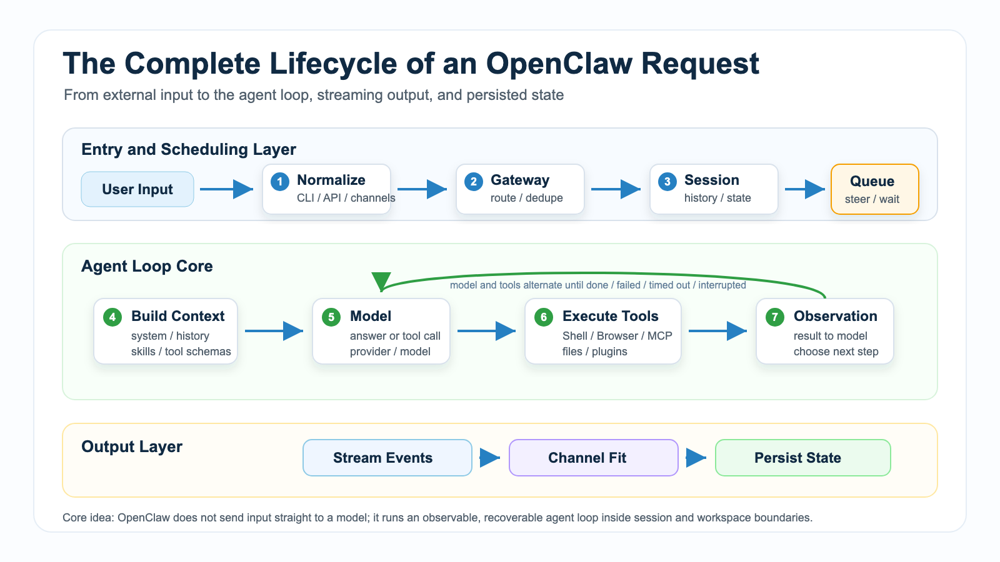

# The Complete Lifecycle of an OpenClaw Request



You type a request into OpenClaw:

```text
Open the admin dashboard, check yesterday's abnormal orders, and turn the result into a report.
```

From the outside, it looks like a normal chat.

The user sends a message. The assistant replies.

Inside OpenClaw, that message is not sent directly to a model. It goes through intake, session resolution, queueing, context assembly, model inference, tool execution, streaming, channel delivery, and persistence.

That is the full lifecycle of an OpenClaw request.

Understanding this lifecycle matters because many confusing problems become easier once you know where they happen:

- Why did OpenClaw merge several short messages into one turn?
- Why did a tool not appear in the model's available tool list?
- Why did the browser click a button while the final answer was still pending?
- Why does the same message behave differently in the CLI and in a messaging channel?
- Why did a follow-up instruction not affect the running task immediately?

This lesson is not about memorizing internal function names. It is about building a practical map for debugging, design, and extension.

## The Key Idea: A Request Is Not One Model Call

OpenClaw's documentation describes the agent loop as a full run:

```text
intake
  → context assembly
  → model inference
  → tool execution
  → streaming replies
  → persistence
```

In more concrete terms:

```text
receive input
  → resolve session and workspace
  → queue, steer, or interrupt
  → build the model-visible context
  → call the model
  → execute requested tools
  → send observations back to the model
  → produce the final reply
  → write transcript and run state
```

So an OpenClaw request is not:

```text
user input → model answer
```

It is closer to:

```text
user input
  ↓
entry layer: CLI / Dashboard / API / messaging channel
  ↓
Gateway: normalize, route, resolve session
  ↓
queue layer: followup / steer / collect / interrupt
  ↓
Agent Runtime: build context, choose model, load tools and skills
  ↓
model: reason, answer, or request a tool call
  ↓
tool system: Shell / Browser / files / MCP / plugins
  ↓
observation: tool result goes back to the model
  ↓
output layer: streaming, chunking, channel adaptation
  ↓
persistence: transcript, metadata, usage, state
```

The closed loop is what makes OpenClaw an agent runtime.

The model decides what should happen next.

OpenClaw turns that decision into controlled, observable, recoverable execution.

## Stage 1: Entry and Normalization

OpenClaw requests can come from many places:

```text
CLI
Dashboard
HTTP API
Telegram
WeCom / enterprise messaging
Slack / Discord
WhatsApp
Webhook
scheduled jobs
```

These all look like "the user said something", but the incoming payloads are very different.

The CLI may provide the current working directory, input text, and session options.

The dashboard may include the current project, browser state, and selected UI context.

Messaging platforms bring channel IDs, account IDs, peer IDs, message IDs, reply IDs, attachments, images, audio, and group context.

An HTTP API request may include business-specific user IDs, task IDs, callback URLs, or trace IDs.

The Gateway turns these external shapes into an internal agent request:

```text
many external message formats
  ↓
Gateway normalization
  ↓
one OpenClaw agent request shape
```

Without this step, sessions, queues, workspace boundaries, and tool permissions would be fragile.

## Stage 2: Session and Workspace Resolution

After a message arrives, the Gateway needs to answer two questions:

```text
Who does this request belong to?
Which execution context should it use?
```

Two concepts matter most:

```text
Session: which conversation history and state this request belongs to
Workspace: which project directory and execution boundary this request can use
```

The session controls what conversation history the model can see.

The workspace controls which files tools can read or write, where shell commands run, and which project files can be injected as context.

That is why the same text may behave differently in different entry points.

If you type this in the CLI:

```text
Continue the previous fix.
```

OpenClaw may have access to the current project, recent commands, previous edits, and the active session transcript.

If the same sentence is sent in a group chat mapped to another session, it may not see that CLI history.

OpenClaw does not mix every conversation into one global pile.

It organizes boundaries by channel, account, peer, session key, workspace, and configuration.

Those boundaries are part of what makes the agent controllable.

## Stage 3: Deduping, Debouncing, and Queueing

Real systems do not always deliver one clean message at a time.

Messaging platforms may retry webhooks.

Users often send several short messages in a row.

The agent may already be working on a previous task.

Before a request reaches the runtime, OpenClaw has to handle three things.

### Deduping

A platform can deliver the same message more than once because of retry behavior.

Without deduping, one user message could trigger two reports, two browser runs, or two external API calls.

OpenClaw can use source, session, and message identity to avoid duplicate runs.

### Debouncing

Users often write like this:

```text
Check the admin dashboard
yesterday's orders
focus on refund anomalies
then make a table
```

Running a full model call for every line would waste cost and confuse planning.

Debouncing lets the entry layer combine short, consecutive messages from the same sender into one turn.

The merged turn is closer to the user's actual intent.

### Queueing and Steering

The harder question is: what if the agent is already running?

Suppose OpenClaw is browsing the dashboard and you add:

```text
Only look at East China. Ignore the full-region view.
```

That message may not deserve a new task. It may need to steer the current run before the next model call.

You can think of OpenClaw's queue behavior like this:

```text
followup   process after the current run finishes
steer      inject into the next model turn of the current run
collect    gather and process later
interrupt  stop the current run and switch instructions
```

This is what gives an agent a continuous collaboration feel.

A real agent cannot only answer one prompt at a time. It must handle correction, interruption, narrowing, and follow-up while work is in progress.

## Stage 4: Creating a Run and Entering the Agent Loop

Once the request is accepted, OpenClaw creates a run.

A run is:

```text
one concrete execution instance from start to finish
```

One session can have many runs.

To avoid tool and transcript races, OpenClaw serializes runs for a session.

In practice:

```text
inside one session
  ↓
one main run mutates session state at a time
  ↓
transcript, tool results, and final replies stay ordered
```

This is not just about being conservative. It protects correctness.

Imagine two runs happening at the same time:

```text
Run A: editing a file
Run B: reading and summarizing the same file
```

Without queueing and write locks, Run B may see a half-written state.

For a toy chatbot, that is annoying.

For an agent that edits files, drives browsers, or calls business systems, it can become a real failure.

## Stage 5: Building Context

Before the model is called, OpenClaw builds the context.

The official docs define context as everything OpenClaw sends to the model for a run, bounded by the model's context window.

That includes:

```text
system prompt
conversation history
tool list and tool schemas
skill metadata
workspace injected files
attachments
tool calls and tool results
compaction summaries
runtime metadata
channel context
```

A common beginner mistake is to treat context as just the user's latest message.

It is not.

Another mistake is to treat context as the same thing as long-term memory.

It is not that either.

Context is the current package of information visible to the model for this run.

OpenClaw may include:

- current time and runtime metadata
- current workspace path
- injected project files such as `AGENTS.md`, `SOUL.md`, and `TOOLS.md`
- skill names, descriptions, and file locations
- tool descriptions and JSON schemas
- recent conversation history or summaries
- observations returned by tools

This stage decides what the model knows and what it does not know.

When the model behaves unexpectedly, the problem is often not that it is "bad at reasoning". The context may be missing the needed fact, or it may contain too much irrelevant material.

## Stage 6: Resolving Model and Tool Visibility

While the context is being prepared, OpenClaw also decides which model to use and which tools are visible.

Model selection can come from:

```text
default configuration
session settings
user directives
provider authentication
model capability limits
plugin hooks
fallback and retry rules
```

Tool visibility is also controlled.

The model can only call tools whose descriptions and schemas are available in the current run.

That set depends on environment and permissions:

```text
Browser tools require browser capability
Shell tools require command execution to be allowed
File tools require a clear workspace boundary
MCP tools require configured and available MCP servers
Plugin tools require enabled plugins and allowed permissions
```

This explains a common question:

```text
I installed the plugin. Why did the model not call it?
```

Possible reasons include:

- the plugin is not enabled
- the tool is not exposed to this run
- the schema did not enter the current context
- permission policy blocks it
- the model decided the tool was unnecessary
- the related skill only exposed metadata, and the full `SKILL.md` was not loaded

When debugging tools, do not only ask whether the tool exists on disk.

Ask:

```text
Was the tool visible to this model run?
Could it execute in this workspace and permission mode?
Did the tool result return to the model correctly?
```

## Stage 7: Model Inference

After the model is called, it usually has two broad choices:

```text
answer directly
request a tool call
```

Normal chat applications mostly handle the first case.

OpenClaw's value is in the second.

For example, if the user says:

```text
Open the dashboard and check yesterday's abnormal orders.
```

The model should not invent an answer.

It should reason:

```text
I need to open the page
I need to inspect the current login or page state
I need to filter yesterday's data
I need to read or export the table
I need to summarize the findings
```

Then the model requests Browser, Shell, file, MCP, or plugin tools.

The important boundary is this:

The model does not actually open the browser.

It produces a structured tool call request.

OpenClaw executes that request.

## Stage 8: Tool Execution and Observations

When a tool call reaches OpenClaw, the runtime executes it and returns the result to the model.

That result is usually called an observation.

For example:

```text
model request: browser.click(selector="#export")
  ↓
OpenClaw performs the click
  ↓
tool result: clicked; a download button is now visible
  ↓
observation returns to the model
```

Shell commands follow the same pattern:

```text
model request: run the test command
  ↓
OpenClaw executes it
  ↓
stdout, stderr, and exit code return
  ↓
model decides the next step
```

A single run may contain several rounds:

```text
model inference
  ↓
tool call
  ↓
observation
  ↓
more model inference
  ↓
another tool call
  ↓
another observation
  ↓
final answer
```

That is the "loop" in agent loop.

The model and tools alternate until the task completes, fails, times out, or is interrupted.

## Stage 9: Streaming and Channel Delivery

OpenClaw does not have to wait until the full run ends before emitting anything.

During the run, it can emit events such as:

```text
lifecycle: start / end / error
assistant: model text deltas
tool: tool start, update, end
usage: token and cost metadata
```

Different entry points display these events differently.

The CLI may show tool calls and command output directly.

The dashboard may show browser state, tool progress, and final replies in separate areas.

Messaging platforms may split output into chunks because of message length or rate limits.

So when you see:

```text
Opening page...
Reading data...
Report generated.
```

that should ideally come from real lifecycle and tool events, not fake progress text.

## Stage 10: Persistence

When a run ends, OpenClaw writes state back to the system.

Persistence may include:

```text
user messages
assistant replies
tool call records
tool result summaries
runId
startedAt / endedAt
errors
usage metadata
session metadata
context reports
```

This matters because the next request depends on it.

If the transcript is not written correctly, the next model call may not know what just happened.

If tool results are not recorded, debugging becomes much harder.

If usage and context reports are missing, you cannot easily explain why a request became slow, expensive, or too large for the context window.

OpenClaw protects session writes because agent execution is stateful.

It is not enough to return one final sentence. The system must preserve a traceable state.

## A Real Scenario

Suppose a user writes in an enterprise chat:

```text
Check yesterday's refund anomalies and send a short summary to this group.
```

The lifecycle may look like this:

```text
1. The messaging platform delivers the message to OpenClaw Gateway
2. Gateway normalizes the payload and identifies the account, group, sender, and message id
3. Gateway dedupes the message to avoid duplicate runs from webhook retries
4. Gateway maps the group to a session key
5. If the session is busy, the message enters followup or steering behavior
6. OpenClaw creates a run and resolves workspace and capabilities
7. Runtime loads system prompt, history, skill metadata, and tool schemas
8. Runtime resolves the model and provider
9. The model decides it must query the business system
10. OpenClaw executes HTTP, Browser, or MCP tools and retrieves refund data
11. Observations return to the model
12. The model analyzes anomalies and writes a summary
13. Output is chunked according to the messaging channel's limits
14. Transcript, tool results, and run metadata are persisted
```

If step 10 fails, the user may only see a failed query.

But debugging should follow the lifecycle:

```text
Did the Gateway receive the message?
Was the session resolved correctly?
Was the tool visible in the current context?
Did the model actually request the tool?
Were the tool parameters correct?
Was the failure network, permission, or business logic?
Was the error written to the transcript?
```

That is much more useful than asking only why the model failed.

## OpenClaw vs a Simple Agent Demo

A simple agent demo often looks like this:

```text
user input
  ↓
build a prompt
  ↓
call a model
  ↓
return text
```

A slightly better demo adds tools:

```text
user input
  ↓
model chooses tool
  ↓
tool runs
  ↓
model summarizes
```

OpenClaw handles a fuller production-style lifecycle:

```text
multiple entry points
session boundaries
workspace boundaries
queueing and interruption
context assembly
model and provider resolution
skill / MCP / plugin extension
tool permissions and execution
stream events
channel adaptation
persistence and debugging
```

The key difference is not simply whether tools exist.

The key difference is whether a request can be accepted, executed, observed, recovered, and traced in a stable way.

## Common Misunderstandings

### Misunderstanding 1: Slow Request Means Slow Model

Not necessarily.

A request can be slow because of:

```text
debounce delay
queue waiting
large context
slow model response
slow tool execution
browser page loading
messaging platform rate limits
session write lock waiting
```

Debug the stage first.

### Misunderstanding 2: Installed Tools Are Always Used

No.

A tool must be visible in the current context, understood by the model, allowed by permissions, and called with valid parameters.

Tool existence and tool usability for this run are different things.

### Misunderstanding 3: Session Is Just a Chat Window

Not exactly.

A chat window is an interface.

An OpenClaw session is a boundary for history, state, queue behavior, writes, and context.

One entry point can map to different sessions, and different entry points can be configured to share a session.

### Misunderstanding 4: The Final Reply Is the Whole Result

It is not.

The real result of an agent run includes the final reply, tool events, errors, usage metadata, context reports, and transcript state.

Only reading the final answer can hide the actual failure point.

## Learning Order

This lesson gives you the lifecycle map.

A good next learning order is:

```text
sessions and messages
  ↓
context and system prompt
  ↓
Gateway and queues
  ↓
model providers and tool schemas
  ↓
Browser / Shell / Canvas
  ↓
Skill / MCP / Plugin
  ↓
deployment, logs, and debugging
```

Do not start by memorizing isolated configuration fields.

First ask where each concept sits in the lifecycle.

## Final Summary

The full lifecycle of an OpenClaw request can be compressed into one sentence:

```text
OpenClaw turns external input into a runnable agent request,
builds context within session and workspace boundaries,
lets the model and tools alternate inside the agent loop,
and writes output, events, and state back to the system.
```

The important part is the loop.

OpenClaw receives input reliably.

It builds context deliberately.

It executes tools under control.

It streams observable progress.

It persists traceable state.

That is the practical difference between OpenClaw and a simple chat wrapper.

## Lesson Homework

1. Draw your own version of an OpenClaw request lifecycle with entry, Gateway, session, context, model, tools, output, and persistence.
2. Pick one previous lesson and mark which part of the lifecycle it mainly explains.
3. For the request "open a webpage and generate a report", list five internal steps OpenClaw may perform.
4. Imagine the final reply never appears. Which lifecycle stages would you inspect first?
5. In your own OpenClaw use case, separate what belongs to the session from what belongs to the workspace.

## Next Lesson Preview

Next we will zoom in on:

```text
how sessions, messages, context, and task state are organized
```

That answers a more specific question: how OpenClaw knows who a message belongs to, which history it continues, and which running task it should affect.

## References

- OpenClaw Docs: [Agent loop](https://docs.openclaw.ai/concepts/agent-loop)
- OpenClaw Docs: [Context](https://docs.openclaw.ai/concepts/context)
- OpenClaw Docs: [Session management](https://docs.openclaw.ai/concepts/session)
- OpenClaw Docs: [Command Queue](https://docs.openclaw.ai/concepts/queue)
- OpenClaw Docs: [Steering Queue](https://docs.openclaw.ai/concepts/queue-steering)
- OpenClaw Docs: [Streaming and chunking](https://docs.openclaw.ai/concepts/streaming)

---

Original link: [The Complete Lifecycle of an OpenClaw Request](https://en.harries.blog/the-complete-lifecycle-of-an-openclaw-request/)
