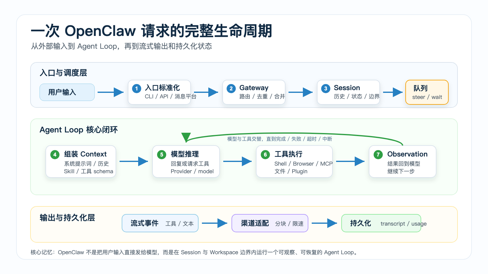

# 一次 OpenClaw 请求的完整生命周期



你在 OpenClaw 里输入一句话：

```text
帮我打开后台，检查昨天的订单异常，并整理成一份报告。
```

如果只看界面，它像一次普通聊天。

用户发消息，助手回复。

但在 OpenClaw 里，这句话不会直接丢给模型。它会经过入口标准化、Session 解析、队列调度、上下文组装、模型推理、工具执行、流式返回、持久化等一整条链路。

这条链路就是一次 OpenClaw 请求的完整生命周期。

理解它非常重要。

因为你后面遇到的大多数问题，其实都可以放回这条链路里定位：

- 为什么我发了两句话，Agent 合并成一次处理？
- 为什么某个工具没有出现在模型可调用列表里？
- 为什么浏览器已经点了按钮，但最终回复还没出来？
- 为什么同一个问题在 CLI 和消息平台里的上下文不一样？
- 为什么 Agent 正在执行时，我补充的一句话没有立刻生效？

这一篇不追求记住所有内部函数名，而是建立一张能排错、能设计、能扩展的运行地图。

## 先说结论：一次请求不是一次模型调用

OpenClaw 官方文档把 Agent loop 描述为一条完整运行链路：

```text
intake
  → context assembly
  → model inference
  → tool execution
  → streaming replies
  → persistence
```

翻成更容易理解的话，就是：

```text
接收输入
  → 找到会话和工作区
  → 排队或插入当前任务
  → 准备模型能看到的上下文
  → 调用模型
  → 执行模型请求的工具
  → 把工具结果送回模型
  → 输出最终回复
  → 写入会话和状态
```

所以，一次 OpenClaw 请求不是：

```text
用户输入 → 模型回答
```

而是：

```text
用户输入
  ↓
入口层：CLI / Dashboard / API / 消息平台
  ↓
Gateway：标准化、路由、Session 解析
  ↓
队列层：followup / steer / collect / interrupt
  ↓
Agent Runtime：组装上下文、选择模型、加载工具和 Skill
  ↓
模型：推理、回复或发起工具调用
  ↓
工具系统：Shell / Browser / 文件 / MCP / Plugin
  ↓
Observation：工具结果回到模型
  ↓
输出层：流式、分块、渠道适配
  ↓
持久化：transcript、metadata、usage、状态
```

真正让 OpenClaw 成为 Agent Runtime 的，是这条闭环。

模型负责判断下一步。

OpenClaw 负责把“下一步”变成可控、可观察、可恢复的真实执行。

## 第一阶段：入口接收，不同渠道先被标准化

OpenClaw 的请求可以来自很多入口：

```text
CLI
Dashboard
HTTP API
Telegram
企业微信
Slack / Discord
WhatsApp
Webhook
定时任务
```

这些入口看起来都是“用户说了一句话”，但实际带来的数据完全不同。

CLI 通常只有当前工作目录、输入文本、会话参数。

Dashboard 可能带有当前打开的项目、浏览器状态、用户界面中的选择。

消息平台会带上 channel、account、peer、message id、群聊上下文、reply id、附件、图片、语音等信息。

HTTP API 可能还有业务系统自己的 user id、task id、callback url、trace id。

Gateway 的第一件事，就是把这些不同形态的输入转换成 OpenClaw 内部可以理解的请求。

你可以把它理解成：

```text
外部世界的各种消息格式
  ↓
Gateway 标准化
  ↓
OpenClaw 内部统一的 agent request
```

这一步看似普通，但非常关键。

如果没有入口标准化，后面的 Session、队列、上下文、工具权限都无法稳定工作。

## 第二阶段：Gateway 解析 Session 和 Workspace

一条消息进入后，Gateway 要回答两个问题：

```text
这是谁的请求？
它属于哪个运行上下文？
```

这里的“运行上下文”至少包括两个核心概念：

```text
Session：这次对话属于哪条会话历史
Workspace：这次任务可以看到和操作哪个工作区
```

Session 决定模型能看到哪些历史。

Workspace 决定工具能读写哪些文件、从哪个目录执行命令、注入哪些项目上下文。

这就是为什么同一句话，在不同入口里可能得到不同结果。

比如你在 CLI 里说：

```text
继续刚才那个修复。
```

它可能能看到当前项目的文件、上一次命令输出、之前的代码修改。

但你在 Telegram 群里说同一句话，如果它映射到另一个 session，就未必能看到 CLI 里的历史。

OpenClaw 不是把所有地方的聊天都混成一锅。

它会根据 channel、account、peer、session key、workspace 等信息组织边界。

这个边界是 Agent 可控性的基础。

## 第三阶段：去重、合并和队列调度

真实系统里，消息不会总是干干净净地来一条。

消息平台可能重试 Webhook。

用户可能连续发几条短消息。

Agent 可能正在执行上一轮任务。

所以请求进入 Agent Runtime 前，Gateway 还要处理三类问题。

### 1. 去重

消息平台经常会因为网络重试重复投递同一条消息。

如果没有去重，用户只发了一句：

```text
生成日报。
```

Agent 可能执行两次，甚至重复发出两份报告。

OpenClaw 会根据消息来源、会话、消息 id 等信息做短期去重，避免重复触发 run。

### 2. 合并

用户经常这样发消息：

```text
帮我看一下后台
昨天的订单
重点看退款异常
最后给我一个表格
```

如果每一句都触发一次模型调用，会浪费成本，也会让 Agent 计划混乱。

因此入口层可以把同一发送者短时间内的连续消息合并成一个 turn。

合并后的输入更接近用户真正想表达的任务。

### 3. 队列和 steering

更复杂的是：如果 Agent 正在执行任务，用户又补充一句怎么办？

比如 Agent 正在浏览后台页面，你突然说：

```text
只看华东区，别看全部区域。
```

这句话不一定应该新开一个任务。

它更可能应该作为 steering 进入当前 run 的下一轮模型调用。

OpenClaw 的队列语义可以理解成几种模式：

```text
followup   当前 run 完成后再处理
steer      当前 run 下一次模型调用时带进去
collect    先收集，稍后一起处理
interrupt  中断当前 run，转向新指令
```

这部分决定了 Agent 的“连续协作感”。

一个成熟的 Agent 系统，不能只会一问一答。

它要能处理用户在任务过程中补充、修正、打断和收束。

## 第四阶段：创建 run，进入 Agent loop

当请求被接受后，OpenClaw 会创建一次 run。

你可以把 run 理解成：

```text
一个具体任务从开始到结束的执行实例
```

同一个 session 可以有很多 run。

但为了避免工具和会话历史互相打架，OpenClaw 会对同一 session 的 run 做串行化。

这意味着：

```text
同一个 session 内
  ↓
一次只让一个主要 run 修改会话状态
  ↓
保证 transcript、工具结果、最终回复顺序一致
```

这不是为了让系统变慢，而是为了让结果可信。

想象两个 run 同时执行：

```text
Run A：正在修改文件
Run B：正在读取同一个文件并总结
```

如果没有队列和写锁，B 看到的可能是 A 改到一半的状态。

对于聊天玩具来说这可能只是小问题。

对于会操作文件、浏览器、业务系统的 Agent 来说，这会直接造成错乱。

## 第五阶段：组装 Context，不只是拼聊天记录

准备调用模型之前，OpenClaw 要构建 Context。

官方文档里对 Context 的定义很直接：它是 OpenClaw 在一次 run 中发送给模型的全部内容，并受到模型上下文窗口限制。

这包括：

```text
System prompt
Conversation history
Tool list and tool schemas
Skill metadata
Workspace injected files
Attachments
Tool calls and tool results
Compaction summaries
Runtime metadata
Channel context
```

新手最容易误解的地方是：

```text
Context ≠ 用户刚发的那句话
Context ≠ 长期记忆
Context ≠ 整个 workspace
```

Context 是“本次模型调用真正能看到的运行包”。

它每次 run 都会重新组装。

比如 OpenClaw 可能会把这些信息放进去：

- 当前时间和运行环境
- 当前 workspace 路径
- 注入的 AGENTS.md、SOUL.md、TOOLS.md 等项目文件
- 可用 Skill 的名称、描述和路径
- 可用工具及其 JSON schema
- 历史对话和必要的摘要
- 最近工具调用返回的 observation

这一步决定模型“知道什么”和“不知道什么”。

如果模型没有按你的预期行动，很多时候不是模型不聪明，而是 Context 里没有给到它需要的信息，或者给了太多干扰信息。

## 第六阶段：解析模型和工具可见性

Context 组装的同时，OpenClaw 还要决定这次 run 用哪个模型，以及模型能看到哪些工具。

模型选择通常来自：

```text
默认配置
会话设置
用户指令
Provider 认证状态
模型能力限制
插件 hook
降级或重试策略
```

工具可见性也不是“系统里有什么，模型就能随便用什么”。

OpenClaw 要把工具描述和 schema 发给模型，模型才知道可以调用它们。

但哪些工具应该出现，要根据当前运行环境和权限决定。

例如：

```text
Browser 工具：需要浏览器能力可用
Shell 工具：需要当前运行环境允许命令执行
文件工具：需要工作区边界明确
MCP 工具：需要对应 MCP server 已配置并可用
插件工具：需要插件启用且权限通过
```

这解释了一个常见问题：

“为什么我明明装了插件，模型却没有调用？”

可能原因包括：

- 插件没有被启用
- 工具没有暴露给当前 run
- schema 没进入本轮上下文
- 权限策略不允许
- 模型认为当前任务不需要调用
- 相关 Skill 只列出了 metadata，完整说明还没被读取

所以排查工具问题时，不要只问“工具在不在机器上”。

要问：

```text
工具是否进入了本轮模型可见上下文？
工具是否能在当前 workspace 和权限下执行？
工具结果是否正确回到了模型？
```

## 第七阶段：模型推理，不一定马上给最终答案

调用模型后，模型通常有两种选择：

```text
直接回复
请求调用工具
```

普通聊天应用主要处理第一种。

OpenClaw 的重点在第二种。

比如用户说：

```text
打开后台检查昨天的异常订单。
```

模型不应该直接编一个答案。

它应该先判断：

```text
我需要打开网页
我需要登录或确认页面状态
我需要筛选昨天
我需要读取表格或导出数据
我需要整理结果
```

于是模型会请求调用 Browser、Shell、文件或业务插件。

这里要注意一个边界：

模型本身不会真的打开浏览器。

它只会产生一个结构化工具调用请求。

真正执行工具的是 OpenClaw 的工具系统。

## 第八阶段：工具执行，把现实世界变成 observation

工具调用进入 OpenClaw 后，运行时会执行它，并把结果返回给模型。

这个结果通常称为 observation。

例如：

```text
模型请求：browser.click(selector="#export")
  ↓
OpenClaw 执行点击
  ↓
工具返回：点击成功，页面出现下载按钮
  ↓
Observation 回到模型
```

Shell 也是类似：

```text
模型请求：执行测试命令
  ↓
OpenClaw 运行命令
  ↓
返回 stdout、stderr、exit code
  ↓
模型根据结果决定下一步
```

一次 run 里可能会发生多轮工具调用：

```text
模型推理
  ↓
调用工具
  ↓
得到 observation
  ↓
模型继续推理
  ↓
再次调用工具
  ↓
再次得到 observation
  ↓
最终回复
```

这就是 Agent loop 的“loop”。

它不是装饰词。

它表示模型和工具之间会反复交替，直到任务完成、失败、超时或被中断。

## 第九阶段：流式返回，让用户看到执行过程

OpenClaw 不会等所有事情结束后才一定给你一个黑盒结果。

一次 run 过程中，系统可以持续发出多类事件：

```text
lifecycle：start / end / error
assistant：模型文本增量
tool：工具开始、更新、结束
usage：token 和成本相关信息
```

这些事件会被不同入口用不同方式展示。

CLI 可能直接把工具调用和输出显示在终端。

Dashboard 可能把工具执行、浏览器画面、最终回复分区展示。

消息平台可能因为消息长度、频率限制，把结果分块发送。

这就是为什么你有时会看到：

```text
正在打开页面...
正在读取数据...
已生成报告。
```

它不是模型在“假装进度”。

更理想的情况下，这些进度来自 Agent loop 的真实生命周期和工具事件。

## 第十阶段：持久化，不只是保存最终回复

一次 run 结束后，OpenClaw 要把结果写回系统。

持久化的内容可能包括：

```text
用户消息
助手回复
工具调用记录
工具结果摘要
runId
startedAt / endedAt
错误信息
usage metadata
session metadata
context report
```

为什么这一步重要？

因为下一次请求要依赖它。

如果 transcript 没写好，后续模型就不知道刚才做过什么。

如果工具结果没记录，排错时就看不到失败点。

如果 usage 和上下文报告没保留，你就很难分析为什么请求变慢、变贵或超出窗口。

这也是为什么 OpenClaw 要对 session 写入做保护。

Agent 是会真实执行操作的系统。

它不能只关心“这次有没有回一句话”。

它还要保证状态可追踪。

## 用一个真实场景串起来

假设你在企业微信群里说：

```text
帮我检查昨天退款异常，发一份摘要到群里。
```

完整生命周期大概是：

```text
1. 企业微信把消息投递给 OpenClaw Gateway
2. Gateway 标准化消息，识别企业、群聊、发送者和 message id
3. Gateway 去重，避免 Webhook 重试导致重复执行
4. Gateway 根据群聊映射到一个 session key
5. 如果当前 session 有任务在跑，新消息按队列策略进入 followup 或 steer
6. OpenClaw 创建 run，确定 workspace 和可用能力
7. Runtime 加载系统提示词、会话历史、Skill metadata、工具 schema
8. Runtime 选择模型和 Provider
9. 模型判断需要查询业务系统，发起工具调用
10. OpenClaw 执行 HTTP / Browser / MCP 工具，拿到退款数据
11. Observation 回到模型，模型继续分析异常类型
12. 模型生成摘要
13. 输出层根据企业微信消息限制分块发送
14. Transcript、工具结果和 run metadata 写回 session
```

如果第 10 步业务系统接口失败，用户看到的可能是“查询失败”。

但排查时你应该回到生命周期里看：

```text
入口是否收到消息？
Session 是否解析正确？
工具是否进入上下文？
模型是否真的发起了工具调用？
工具调用参数是否正确？
工具返回的是网络错误、权限错误，还是业务错误？
错误有没有写入 transcript？
```

这比只问“模型为什么没做好”有效得多。

## 普通 Agent 和 OpenClaw 的差异

很多普通 Agent Demo 的请求生命周期是：

```text
用户输入
  ↓
拼一个 prompt
  ↓
调模型
  ↓
返回文本
```

稍微复杂一点的 Demo 会加工具：

```text
用户输入
  ↓
模型决定工具
  ↓
执行工具
  ↓
模型总结
```

OpenClaw 要处理的是更完整的生产型生命周期：

```text
多入口接入
Session 边界
Workspace 边界
队列和中断
Context 组装
模型与 Provider 解析
Skill / MCP / Plugin 扩展
工具权限和执行
流式事件
渠道适配
持久化和排错
```

差异不在“是否能调用工具”。

差异在是否能把一次请求稳定地接住、执行、观察、恢复和追踪。

## 常见误解

### 误解一：请求慢就是模型慢

不一定。

慢可能发生在很多阶段：

```text
入口等待 debounce
排队等待前一个 run 结束
上下文太大
模型响应慢
工具执行慢
浏览器页面加载慢
消息平台发送限速
transcript 写入等待锁
```

排查慢请求时，要先定位慢在哪一段。

### 误解二：工具装好了，模型就一定会用

不一定。

工具要进入本轮上下文，模型要理解工具用途，权限要允许，调用参数也要合理。

工具“存在”和工具“可被本次 run 使用”是两件事。

### 误解三：Session 就是聊天窗口

不完全是。

聊天窗口只是入口表现。

OpenClaw 内部的 session 是历史、状态、队列、写入和上下文边界的组织单位。

同一个聊天入口也可能因为配置不同映射到不同 session。

不同入口也可能被设计成共享某个 session。

### 误解四：最终回复就是全部结果

不是。

Agent run 的真实结果包括最终回复、工具过程、错误、usage、上下文报告、transcript 状态。

只看最终回复，很容易错过真正的失败原因。

## 学习顺序：接下来该怎么继续

这一篇建立的是生命周期地图。

后续学习可以按下面顺序拆：

```text
Session 和消息
  ↓
Context 和 System Prompt
  ↓
Gateway 和队列
  ↓
模型 Provider 和工具 schema
  ↓
Browser / Shell / Canvas
  ↓
Skill / MCP / Plugin
  ↓
部署、日志和排错
```

不要一开始就钻某个配置项。

先知道它属于生命周期的哪一段。

这样你后面学 Gateway、Context、Skill、MCP、部署排错时，知识不会散。

## 最后总结

一次 OpenClaw 请求的完整生命周期，可以压缩成一句话：

```text
OpenClaw 先把外部输入变成可运行的 agent request，
再在 Session 和 Workspace 边界内组装 Context，
让模型和工具在 Agent loop 中交替工作，
最后把输出、事件和状态写回系统。
```

这里最重要的不是某个单点能力，而是闭环。

入口接得住。

上下文组得准。

工具执行可控。

过程能观察。

结果能持久化。

这才是 OpenClaw 和普通聊天壳子的关键区别。

## 本节作业

1. 画出你自己理解的一次 OpenClaw 请求流程，至少包含入口、Gateway、Session、Context、模型、工具、输出、持久化。
2. 找一篇前面的文章，标出它主要讲生命周期里的哪一段。
3. 假设用户说“帮我打开网页生成报告”，写出这句话可能触发的 5 个内部步骤。
4. 思考一个排错场景：如果最终回复没有出现，你会沿着生命周期检查哪些节点？
5. 在自己的 OpenClaw 使用场景里，区分哪些信息属于 Session，哪些属于 Workspace。

## 下一节预告

下一节我们继续往下拆：

```text
会话、消息、上下文和任务状态如何组织
```

也就是回答一个更具体的问题：OpenClaw 如何知道“这句话属于谁、接着哪段历史、影响哪个任务”。

## 参考资料

- OpenClaw Docs：[Agent loop](https://docs.openclaw.ai/concepts/agent-loop)
- OpenClaw Docs：[Context](https://docs.openclaw.ai/concepts/context)
- OpenClaw Docs：[Session management](https://docs.openclaw.ai/concepts/session)
- OpenClaw Docs：[Command Queue](https://docs.openclaw.ai/concepts/queue)
- OpenClaw Docs：[Steering Queue](https://docs.openclaw.ai/concepts/queue-steering)
- OpenClaw Docs：[Streaming and chunking](https://docs.openclaw.ai/concepts/streaming)
