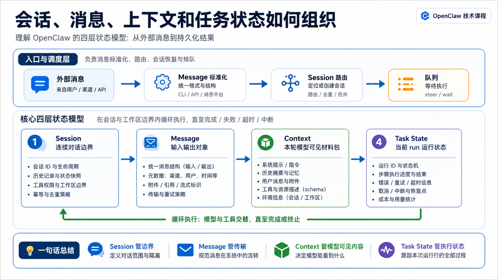

# 会话、消息、上下文和任务状态如何组织



学 OpenClaw 时，很多人会把四个概念混在一起：

```text
会话
消息
上下文
任务状态
```

它们看起来都和“聊天记录”有关。

但在 OpenClaw 里，它们不是同一个东西。

如果把它们混在一起，你会很难解释这些现象：

- 为什么群聊里的上下文和私聊不一样？
- 为什么 `/context list` 看到的不是完整历史？
- 为什么 Agent 正在执行时，后来的消息会变成 steering？
- 为什么 transcript 里有工具结果，但模型本轮未必完整看到？
- 为什么一个长任务可以继续跑，而聊天界面只看到几条状态？

这一篇我们把四个概念拆开。

你只要记住一句话：

```text
Session 管边界，Message 管输入输出，Context 管模型本轮能看到什么，Task State 管当前任务跑到哪一步。
```

这四层合起来，才构成 OpenClaw 能稳定运行的状态系统。

## 先说结论：不要把它们都叫“历史”

普通聊天产品里，“历史”往往就是消息列表。

但 Agent Runtime 复杂得多。

OpenClaw 至少要同时管理四类状态：

```text
Session
  这是谁的连续对话？生命周期多久？ transcript 放在哪里？

Message
  这条输入从哪里来？要发到哪里去？是否是回复、转发、群聊、系统消息？

Context
  本次模型调用真正看到了哪些系统提示词、历史、工具 schema、Skill metadata 和文件？

Task State
  当前 run 是否正在执行？工具是否在跑？是否等待审批？是否有 queued steering？
```

它们之间的关系大概是：

```text
外部消息
  ↓
Gateway 解析为 Message
  ↓
Message 路由到 Session
  ↓
Session 提供历史和边界
  ↓
Runtime 组装本轮 Context
  ↓
Agent Run 产生 Task State
  ↓
输出 Message 写回 Session
```

所以，Session 不是 Context。

Message 不是 Task State。

Transcript 也不等于模型本轮完整看到的内容。

这几个区别，是理解 OpenClaw 的基础。

## 第一层：Session 是连续对话的边界

OpenClaw 官方文档说，OpenClaw 会把对话组织成 session，每条消息会根据来源路由到某个 session。

这句话看起来简单，但它非常关键。

Session 是一个边界。

它回答的是：

```text
这条消息应该接着哪段历史？
这次运行应该属于哪个会话？
哪些后续消息应该影响同一个任务？
这个会话什么时候重置、过期或被维护？
```

不同入口可以映射到不同 session：

```text
私聊          → 通常共享或按用户隔离
群聊 / 频道   → 通常按群、频道或房间隔离
Webhook      → 通常按 hook 隔离
Cron 任务     → 通常每次运行有独立 session
Dashboard    → 看到 Gateway 背后的 session transcript
```

这就是为什么同一句话在不同地方结果不同。

你在 CLI 里说：

```text
继续刚才那个修改。
```

它可能能接上本地 workspace、命令输出和前一轮 transcript。

你在群里说同一句话，如果群聊映射到另一个 session，就不会自然接上 CLI 的历史。

这不是 OpenClaw 忘了。

这是 session 边界在生效。

## Session 的状态存在哪里

根据官方文档，session 状态由 Gateway 拥有，客户端是去查询 Gateway 的 session 数据。

通常可以把它分成两类：

```text
session store
  保存 session 列表、生命周期时间、路由信息、metadata

transcript
  保存某个 session 的消息、工具调用、回复和运行痕迹
```

文档里提到的典型路径是：

```text
~/.openclaw/agents/<agentId>/sessions/sessions.json
~/.openclaw/agents/<agentId>/sessions/<sessionId>.jsonl
```

这解释了一个常见误解：

聊天窗口不是状态源。

Gateway 上的 session store 和 transcript 才是状态源。

UI、TUI、CLI、消息平台都只是入口和显示面。

所以排查“为什么它记得 / 不记得”时，应该先问：

```text
这条消息路由到了哪个 session？
这个 session 的 transcript 里有什么？
当前入口是否真的使用了同一个 session？
```

## 第二层：Message 是输入输出的标准化对象

Session 管边界，Message 管输入输出。

外部平台的消息非常复杂。

一条 Telegram 消息、一条 Slack thread 回复、一条企业微信群消息、一条 HTTP webhook，在原始格式上完全不同。

OpenClaw 要把它们变成可路由、可排队、可发送、可追踪的消息对象。

一条标准化消息通常要回答：

```text
direction：入站还是出站
channel：来自哪个渠道
account：哪个账号
target：发到私聊、群、频道还是 thread
sender：谁发的
body：模型应该看的正文
command body：用于命令和 directive 解析的原文
attachments：图片、文件、语音等附件
relation：回复、followup、广播、系统通知
origin：用户、平台、OpenClaw 系统输出
```

这就是为什么“用户看到的一条消息”和“模型看到的文本”不一定完全一致。

例如群聊里，平台原文可能是：

```text
@bot 帮我总结这份文件
```

OpenClaw 可能会在 prompt body 里加入发送者标签、历史片段或 untrusted context wrapper，让模型知道这来自群聊中的某个人，而不是系统指令。

同时，命令解析可能使用另一份 command body。

这可以避免 `/queue`、`/model`、`/status` 等控制语义污染模型正文。

## BodyForAgent、CommandBody 和历史上下文

官方 Messages 文档里有一个很重要的区分：

```text
BodyForAgent：当前消息中面向模型的主要文本
Body：兼容用的 prompt fallback，可能包含包装后的历史
CommandBody：用于命令、directive 解析的原始用户文本
RawBody：兼容别名
```

这说明 OpenClaw 并不是简单地把平台消息原文丢给模型。

它会区分：

```text
模型应该理解的任务内容
Gateway 应该解析的控制命令
渠道为了上下文补充的历史片段
附件和平台 metadata
```

这对安全也很重要。

群聊历史、转发内容、引用内容都应该作为不可信上下文，而不是更高优先级的系统指令。

## 第三层：Context 是本轮模型真正能看到的内容

Context 经常被误解成“session 历史”。

但官方文档给出的定义更准确：Context 是 OpenClaw 在一次 run 中发送给模型的全部内容，并受到模型上下文窗口限制。

它通常包括：

```text
System prompt
Conversation history
Tool calls and tool results
Tool schemas
Skill metadata
Workspace injected files
Attachments
Compaction summaries
Runtime metadata
Channel context
```

注意：Context 不是整个 session。

Session 可能保存了很长的 transcript。

但模型本轮只能看到上下文窗口允许的部分。

旧历史可能被压缩。

大型工具结果可能被裁剪。

workspace 文件可能按规则注入一部分。

工具 schema 会占用上下文，但通常不会作为普通文本展示。

所以你可以这样理解：

```text
Session = 仓库
Transcript = 仓库里的流水账
Context = 本次开会带进会议室的材料包
```

模型只能根据材料包工作。

如果材料包缺了关键内容，模型就算“记得之前聊过”，也未必能在本轮准确使用。

## 第四层：Task State 是当前 run 的运行状态

Session 和 Context 解释“模型知道什么”。

Task State 解释“任务正在发生什么”。

一次 OpenClaw run 可能处于很多状态：

```text
accepted：请求已接收
queued：等待当前 session lane
running：Agent loop 正在运行
model_call：正在等待模型
tool_call：正在执行工具
waiting_approval：等待用户审批
streaming：正在输出部分结果
compacting：正在压缩上下文
retrying：错误后准备重试
ending：生成最终回复
done / error / timeout / aborted：终态
```

这些状态不会都变成聊天消息。

有些只用于内部调度。

有些会变成工具事件。

有些会显示在 Dashboard 或 CLI。

有些只写入 transcript 或运行 metadata。

这就是为什么你不能只看最终回复判断任务是否正常。

Agent 可能已经完成多个工具调用，只是最终回复还没发送。

也可能模型已经生成了文本，但渠道发送失败。

还可能工具在等待审批，模型并没有卡住。

## 四层如何协作：从一条群消息开始

假设一个用户在群里说：

```text
@OpenClaw 帮我看昨天的退款异常，只发摘要。
```

OpenClaw 内部可以拆成这样：

```text
Message 层
  识别 channel、group、sender、message id、正文、reply target

Session 层
  将这条群消息路由到对应 group session

Task State 层
  如果当前 session 空闲，就创建新 run
  如果已有 run，就按 queue mode steer / followup / collect / interrupt

Context 层
  组装 system prompt、群聊上下文、历史、工具 schema、Skill metadata

Agent loop
  模型判断是否需要工具，OpenClaw 执行工具并返回 observation

Message 层
  将最终摘要按照渠道限制分块、回复到正确 thread 或群消息

Session 层
  写入 transcript、更新时间、保留后续上下文
```

你可以看到，四层没有谁能单独完成任务。

它们的职责边界很清楚。

## Steering 为什么属于 Task State，不属于普通历史

第 7 讲提到过 steering。

这里再强调一次：steering 不是普通“下一条聊天历史”。

当一个 session 正在跑，用户又发来一条消息时，OpenClaw 可能把它放入当前 run 的下一次模型边界。

官方 Steering Queue 文档的核心思想是：steering 不会打断已经运行中的工具调用，而是在模型边界处把 queued steering messages 作为用户消息追加到下一次 LLM 调用前。

也就是说：

```text
工具正在执行
  ↓
用户补充一句
  ↓
先进入 task state 的 steering 队列
  ↓
当前工具结果返回
  ↓
下一次模型调用前注入
```

这和“写入 transcript 等下一轮再看”不一样。

它是运行中的任务状态。

理解这一点，你就能解释为什么补充指令有时不会立刻影响当前工具动作，但会影响下一步决策。

## Context、Memory 和 Transcript 的区别

这三个词也很容易混。

可以这样区分：

```text
Transcript
  持久化的会话流水账，记录消息、工具调用和结果

Memory
  可长期保存、可被检索或注入的用户偏好、事实、承诺等信息

Context
  本轮模型调用实际收到的材料包
```

Transcript 可以生成 Context。

Memory 可以被注入 Context。

但它们不是 Context 本身。

如果你说：

```text
模型为什么不记得上个月的偏好？
```

要分别检查：

```text
偏好是否被保存为 memory？
当前 session 是否能访问这份 memory？
memory 是否进入了本轮 context？
是否因为上下文窗口或策略被裁剪？
```

这比一句“它忘了”更有排查价值。

## 常见误解

### 误解一：Session 等于聊天窗口

聊天窗口只是显示面。

Session 是 Gateway 管理的历史和状态边界。

一个界面可以切换 session。

多个入口也可以映射到同一个 session。

### 误解二：Transcript 里的东西模型都能看到

不一定。

Transcript 是持久记录。

Context 是本轮发送给模型的内容。

中间可能经过裁剪、压缩、摘要、过滤和工具结果清理。

### 误解三：用户消息一定原样给模型

不一定。

Gateway 会先解析命令、directive、渠道上下文、群聊历史和附件。

模型看到的是面向本轮任务整理后的正文和上下文。

### 误解四：任务卡住就是模型卡住

不一定。

任务可能在排队、等工具、等审批、等渠道发送、等 session 写锁，或者正在做 compaction。

要看 Task State，而不是只盯着最终回复。

## 最后总结

这篇的核心是四层模型：

```text
Session：连续对话的边界
Message：输入输出的标准化对象
Context：本轮模型可见材料包
Task State：当前 run 的运行状态
```

OpenClaw 的稳定性，来自这四层的分工。

Session 让历史不乱。

Message 让多渠道输入输出可控。

Context 让模型看到合适的材料。

Task State 让长任务、工具调用、steering 和中断可管理。

把这四层分清楚，后面学系统提示词、工具调用、流式返回和调试排错都会轻很多。

## 本节作业

1. 找一个你真实使用 OpenClaw 的入口，写出它的 session 可能如何划分。
2. 选一条群聊消息，拆出它的 Message、Session、Context、Task State 四层信息。
3. 用 `/context list` 或类似方式观察一次 run 的上下文组成，注意它和 transcript 的区别。
4. 思考：如果用户在工具执行期间追加一句话，它应该进入 followup、steer、collect 还是 interrupt？
5. 写出一个“模型不记得了”的排查清单，至少包含 session、transcript、memory、context 四项。

## 下一节预告

下一节我们讲：

```text
系统提示词、开发者指令和用户输入的优先级
```

也就是回答一个更敏感的问题：当系统规则、项目规则、Skill 说明、渠道历史和用户指令互相冲突时，OpenClaw 应该听谁的？

## 参考资料

- OpenClaw Docs：[Session management](https://docs.openclaw.ai/concepts/session)
- OpenClaw Docs：[Messages](https://docs.openclaw.ai/concepts/messages)
- OpenClaw Docs：[Context](https://docs.openclaw.ai/concepts/context)
- OpenClaw Docs：[Steering queue](https://docs.openclaw.ai/concepts/queue-steering)
- OpenClaw Docs：[Message lifecycle refactor](https://docs.openclaw.ai/concepts/message-lifecycle-refactor)

---

原文外链：[会话、消息、上下文和任务状态如何组织](https://www.harries.blog/archives/720306.html)
