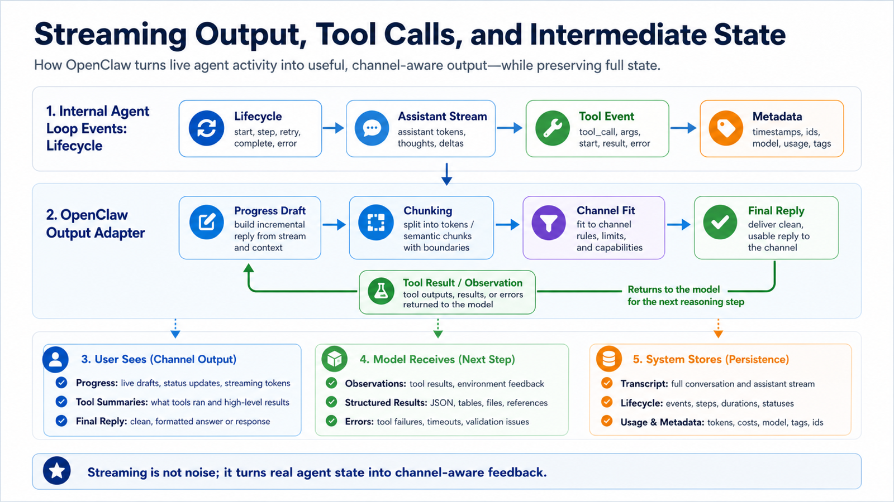

# How Streaming Output, Tool Calls, and Intermediate State Return to the User



You ask OpenClaw to do a task:

```text
Open the admin dashboard, filter yesterday's data, export the table, and summarize anomalies.
```

In a simple chat system, the user waits.

Eventually the model says:

```text
Done.
```

But an agent should not be a black box.

It should let you know:

```text
request accepted
model is planning
browser is opening
tool is running
page failed to load
retrying
data retrieved
summary being generated
final reply sent
```

That is the value of streaming output, tool events, and intermediate state.

OpenClaw does not only return the final answer. It also turns important events from the agent loop into output that users can understand, channels can carry, and systems can trace.

## The Key Idea: Users Receive More Than Final Text

One OpenClaw run can produce several kinds of output:

```text
lifecycle event
  start / end / error / timeout

assistant stream
  model-generated text deltas

tool event
  tool start, parameter summary, progress update, end, failure

progress draft
  short user-facing progress for messaging platforms

final reply
  final answer or summary

metadata
  runId, usage, duration, errors, trace data
```

These outputs are not all sent to the model.

They are not all sent directly to the user either.

OpenClaw translates them:

```text
internal agent loop events
  ↓
OpenClaw stream / lifecycle / tool events
  ↓
CLI, dashboard, messaging channel, or API presentation
  ↓
progress, tool result, and final reply visible to the user
```

This explains:

- Why can the CLI show command output while a messaging platform shows only a summary?
- Why did the browser act on a page while the final reply was still pending?
- Why does a tool failure sometimes retry and sometimes end the run?
- Why is a long reply split into multiple messages?
- Why is a "working..." message edited, merged, or replaced?

## Lifecycle Events: Is the Run Alive or Finished?

Lifecycle events describe the run itself.

The basics are:

```text
start
end
error
```

The Agent loop docs describe OpenClaw bridging runtime events into agent streams, including lifecycle phases such as start, end, and error.

These events answer:

```text
Did the task start?
Did it finish normally?
Did it fail?
Did it time out?
Which run did the error belong to?
```

Lifecycle events are not always the most visible user-facing output, but they are essential for systems.

`agent.wait`, automation jobs, API callers, and business callbacks cannot rely only on natural language to decide whether work is complete.

They need structured terminal state:

```json
{
  "runId": "run_123",
  "status": "ok",
  "startedAt": "...",
  "endedAt": "..."
}
```

or:

```json
{
  "runId": "run_123",
  "status": "error",
  "error": "browser timeout"
}
```

Text is for people.

Lifecycle is for systems.

## Assistant Stream: Model Text Does Not Arrive All at Once

Models can often produce text as a stream.

That means:

```text
model starts generating
  ↓
tokens or blocks arrive incrementally
  ↓
OpenClaw receives deltas
  ↓
the entry point displays them according to its capabilities
```

In the CLI or dashboard, text can appear gradually.

Messaging platforms are more constrained.

They usually should not receive one message per token.

They may need to:

```text
buffer text before sending
split long output into chunks
edit one progress message
replace a draft with a final answer
avoid rate limits
preserve thread or reply relationships
```

So "streaming" does not mean the user sees every token.

The right model is:

```text
internal stream can be fine-grained
external display may be chunked, drafted, edited, or finalized
```

That is why CLI, dashboard, Telegram, and enterprise chat feel different even when the same agent loop is running.

## Tool Events: Showing What the Agent Is Doing

An agent is valuable because it acts.

Tool events are the trace of that action.

A tool event may include:

```text
tool_start
  tool began executing

tool_update
  intermediate state such as page load, command output, download progress

tool_end
  tool completed and returned an observation

tool_error
  tool failed and returned error information
```

Browser example:

```text
tool_start: browser.open https://admin.example.com
tool_update: page loaded
tool_update: clicked "Orders"
tool_update: selected date range
tool_end: table contains 42 rows
```

Shell example:

```text
tool_start: npm test
tool_update: 24 tests passed
tool_update: 1 test failed
tool_end: exit code 1
```

Tool events have at least three jobs.

First, they show the user that the agent is not stuck.

Second, they explain where the final answer came from.

Third, they help developers locate failures.

If the final reply says:

```text
No anomalies were found.
```

but the tool trace shows:

```text
date filter did not apply
```

the conclusion is not trustworthy.

## How Tool Results Return to the Model

Tool events have two destinations.

One destination is the user interface:

```text
show what is running
show success or failure
show partial results
```

The other destination is the model:

```text
return the tool result as an observation
let the model decide the next step
```

These are not the same thing.

The user may see a simplified event.

The model may receive a more structured observation.

For example:

```text
user sees: exported the orders table
model receives: file path, row count, field names, sample data, download status
```

The reverse can also happen:

```text
model receives full stderr
user sees: tests failed; failing case is X
```

OpenClaw balances explainability, privacy, safety, and context cost.

Not every tool output should be fully shown to the user.

Not every tool output should be fully sent back into the model window.

## Progress Drafts: Keeping Messaging Channels From Going Silent

The CLI can keep printing output.

The dashboard can show live panels.

Messaging platforms are different.

If the agent stays silent for too long, users think it stopped.

If it sends every small event, it becomes noisy.

OpenClaw therefore needs progress drafts or similar behavior:

```text
task started
opening dashboard
reading data
generating summary
```

These drafts may be sent, edited, merged, or replaced.

Their purpose is not to expose every detail.

Their purpose is to show that the agent is alive and roughly where it is.

Good progress output should be:

```text
short and accurate
based on real state
free of sensitive parameters
not full of internal debug noise
useful when failure happens
```

Intermediate state is not better just because there is more of it.

The key is meaningful progress and actionable failure signals.

## Chunking: Why Long Replies Become Multiple Messages

Every channel has limits:

```text
maximum message length
rate limits
message editing support
thread support
Markdown support
attachment support
code block behavior
```

OpenClaw's output layer performs chunking and channel adaptation.

The same final reply may appear differently:

```text
CLI
  one continuous stream

Dashboard
  scrollable text plus tool panels

Telegram
  multiple chunked messages

Enterprise chat
  summary plus attachment link

HTTP API
  stream events or final JSON
```

This explains a common issue:

```text
The model wrote a long article, but my messaging platform only showed part of it.
```

The model may have generated the full text.

The failure may be in:

```text
channel length limits
Markdown escaping
chunk sending
attachment upload
platform rate limiting
progress-message editing conflict
```

Debug by separating:

```text
Did the model generate the full text?
Did OpenClaw receive the full assistant stream?
Did the output layer chunk it successfully?
Did the channel send every chunk?
Did the transcript save the full result?
```

## Intermediate State vs Final State

Intermediate state is not the final conclusion.

It describes observations during the run:

```text
opening page
read 42 rows
running tests
1 test failed
retrying
```

Final state describes the run outcome:

```text
completed
failed
timed out
interrupted
needs user confirmation
```

The UI should avoid presenting intermediate state as final result.

For example:

```text
exporting data...
```

does not mean the export succeeded.

```text
read 42 rows
```

does not mean the analysis is complete.

Only a terminal lifecycle event, a final reply, and successful delivery should become a clear completion signal.

## How Errors Return

Errors also have layers:

```text
model error
tool error
permission error
context error
channel delivery error
queue timeout
user interruption
```

Different errors need different responses.

For a tool error:

```text
The browser page timed out.
I have not retrieved the order data, so I cannot summarize anomalies yet.
You can retry, or confirm that the dashboard is accessible.
```

This is much better than:

```text
Failed.
```

It tells the user:

```text
where the failure happened
what has not been completed
what they can do next
```

But errors should not expose everything.

Full environment variables, auth tokens, internal paths, and sensitive request headers should not be sent to a group chat.

Error output also needs channel adaptation and safety filtering.

## A Complete Example

The user says:

```text
Check yesterday's refund anomalies and send a summary to the group.
```

The return path might be:

```text
1. lifecycle:start
   system knows the run began

2. progress draft
   user sees: checking yesterday's refund anomalies...

3. assistant stream
   model plans to query backend data

4. tool_start
   browser opens the dashboard

5. tool_update
   page loaded and orders tab opened

6. tool_update
   date range set to yesterday

7. tool_end
   42 refund records retrieved

8. observation
   data result returns to the model

9. assistant stream
   model writes summary

10. channel chunking
    enterprise chat sends chunks according to message limits

11. lifecycle:end
    run finishes and transcript/metadata are persisted
```

The user may only see:

```text
Checking yesterday's refund anomalies...
Found 42 refund records. Generating summary...
Yesterday's refund anomaly summary: ...
```

Internally, the system has the full event chain.

That is the value of OpenClaw: users see clear progress, and the system keeps traceable state.

## Common Misunderstandings

### Misunderstanding 1: Streaming Means Every Token Is Sent to the User

No.

The internal stream may be token-level or block-level.

The external channel may use chunks, edits, drafts, or final messages.

### Misunderstanding 2: Tool Event Equals Tool Result

Not exactly.

Tool events describe execution.

Tool results are observations or structured data returned to the model and transcript.

The user may only see a summary.

### Misunderstanding 3: Progress Means Success

No.

Progress is intermediate state.

Final state depends on lifecycle, final reply, delivery, and persistence.

### Misunderstanding 4: Failure Means Model Failure

Not necessarily.

Failure can occur in tools, browser, network, permissions, channel delivery, queueing, context, or persistence.

## Final Summary

OpenClaw does not return one simple text blob. It has an output pipeline:

```text
agent loop events
  ↓
lifecycle / assistant / tool streams
  ↓
progress drafts and channel adaptation
  ↓
final reply
  ↓
transcript and metadata persistence
```

This pipeline turns the agent from a black box into an observable system.

Users see progress.

The model receives observations.

The system knows whether the run ended.

Developers can locate where failure happened.

That is the real meaning of streaming output and intermediate state.

## Lesson Homework

1. Draw the path from `tool_start` to `observation` to final reply for one tool call.
2. Pick a messaging platform you use and list its output constraints for OpenClaw.
3. Design three progress drafts that are short, accurate, and safe.
4. If the user asks "why is this taking so long?", list four state points you would inspect.
5. Compare CLI, dashboard, and messaging channels: which intermediate states should each display?

## Next Lesson Preview

Next we move into the third part:

```text
Gateway: OpenClaw's entry layer and scheduling center
```

We will place sessions, messages, queues, and streams inside the Gateway and see how they work together.

## References

- OpenClaw Docs: [Agent loop](https://docs.openclaw.ai/concepts/agent-loop)
- OpenClaw Docs: [Streaming and chunking](https://docs.openclaw.ai/concepts/streaming)
- OpenClaw Docs: [Progress drafts](https://docs.openclaw.ai/concepts/progress-drafts)
- OpenClaw Docs: [Messages](https://docs.openclaw.ai/concepts/messages)
- OpenClaw Docs: [Retry policy](https://docs.openclaw.ai/concepts/retry)
- OpenClaw Docs: [Command Queue](https://docs.openclaw.ai/concepts/queue)

---

Original link: [How Streaming Output, Tool Calls, and Intermediate State Return to the User](https://en.harries.blog/how-streaming-output-tool-calls-and-intermediate-state-return-to-the-user/)
