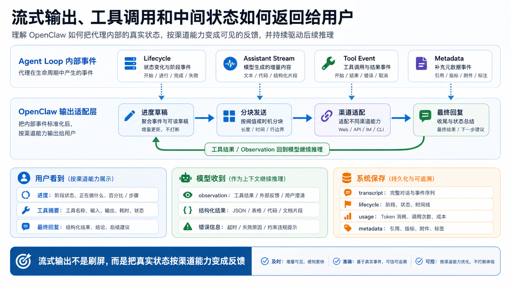

# 流式输出、工具调用和中间状态如何返回给用户



你让 OpenClaw 做一个任务：

```text
打开后台，筛选昨天的数据，导出表格，然后总结异常。
```

如果这是普通聊天系统，用户只能等。

等模型最终说：

```text
处理完成。
```

但 Agent 不应该是黑盒。

它应该让你知道：

```text
请求已接收
模型正在规划
浏览器正在打开
工具正在执行
页面加载失败
正在重试
已经拿到数据
正在生成摘要
最终回复已发送
```

这就是流式输出、工具调用和中间状态的价值。

OpenClaw 不只是把最终答案返回给用户，它还要把 Agent loop 里的重要事件变成用户能理解、渠道能承载、状态能追踪的输出。

## 先说结论：返回给用户的不只有最终文本

一次 OpenClaw run 里可能产生多种输出：

```text
lifecycle event
  start / end / error / timeout

assistant stream
  模型生成的文本增量

tool event
  工具开始、参数摘要、执行中更新、结束、失败

progress draft
  给消息平台看的阶段性进度

final reply
  最终回复或总结

metadata
  runId、usage、耗时、错误信息、trace 信息
```

这些输出不是都直接发给模型。

它们也不是都直接发给用户。

OpenClaw 要做一层转换：

```text
Agent loop 内部事件
  ↓
OpenClaw stream / lifecycle / tool event
  ↓
CLI、Dashboard、消息平台、API 的展示适配
  ↓
用户看到的进度、工具结果和最终回复
```

理解这条链路，你就能解释：

- 为什么 CLI 能看到命令输出，消息平台只看到摘要？
- 为什么浏览器已经操作了页面，但最终回复还在等？
- 为什么工具失败后有时会继续重试，有时会直接结束？
- 为什么长回复会被拆成多条消息？
- 为什么“处理中”的消息会被更新或替换？

## 第一类事件：Lifecycle，告诉你 run 活着还是结束了

Lifecycle 事件描述 run 的生命周期。

最基础的是：

```text
start
end
error
```

官方 Agent loop 文档提到，OpenClaw 会把运行时事件桥接成 agent stream，其中 lifecycle 事件包含 start、end、error 等阶段。

这类事件回答的是：

```text
任务是否开始？
是否正常结束？
是否失败？
是否超时？
错误发生在哪个 run？
```

Lifecycle 事件不一定是用户最想看的内容，但它对系统很重要。

因为 `agent.wait`、自动化任务、API 调用、外部业务系统回调，通常不能只靠自然语言判断任务是否完成。

它们需要结构化终态。

比如：

```json
{
  "runId": "run_123",
  "status": "ok",
  "startedAt": "...",
  "endedAt": "..."
}
```

或者：

```json
{
  "runId": "run_123",
  "status": "error",
  "error": "browser timeout"
}
```

这就是为什么 Agent 系统不能只返回一段文本。

文本给人看。

Lifecycle 给系统判断。

## 第二类事件：Assistant Stream，模型文本不是一次性出来的

大模型生成文本时，通常可以流式输出。

也就是：

```text
模型开始生成
  ↓
一段一段吐出 token 或 block
  ↓
OpenClaw 接收增量
  ↓
按入口能力展示
```

在 CLI 或 Dashboard 中，用户可以看到文本逐步出现。

在消息平台中，情况更复杂。

很多平台不适合每个 token 发一条消息。

它们可能需要：

```text
攒一段再发
超过长度就分块
编辑一条进度消息
最终替换为完整答案
避免过高发送频率
保留 thread / reply 关系
```

所以“流式”并不等于“用户看到每个 token”。

OpenClaw 要在内部流和渠道限制之间做适配。

正确理解是：

```text
内部可以是细粒度 stream
外部展示可以是 chunk、draft、edit 或 final message
```

这就是为什么 CLI 体验和 Telegram / 企业微信体验不同。

不是 Agent loop 不一样，而是展示层能力不同。

## 第三类事件：Tool Event，告诉用户 Agent 正在做什么

Agent 的关键不在于一直说话，而在于会做事。

工具调用事件就是“做事”的轨迹。

一个工具事件可能包含：

```text
tool_start
  工具开始执行

tool_update
  执行中状态，例如页面加载、命令输出、下载进度

tool_end
  工具成功结束，返回 observation

tool_error
  工具失败，返回错误信息
```

比如 Browser 工具：

```text
tool_start: browser.open https://admin.example.com
tool_update: page loaded
tool_update: clicked "Orders"
tool_update: selected date range
tool_end: table contains 42 rows
```

Shell 工具：

```text
tool_start: npm test
tool_update: 24 tests passed
tool_update: 1 test failed
tool_end: exit code 1
```

工具事件至少有三个作用。

第一，让用户知道 Agent 没有卡住。

第二，让用户能理解最终答案的来源。

第三，让系统能在失败时定位问题。

如果最终回复只是：

```text
没有找到异常。
```

但中间工具事件显示：

```text
筛选器没有成功应用
```

那这个结论就不可信。

## 工具结果怎样回到模型

工具事件有两条去向。

第一条去向是用户界面：

```text
显示正在执行什么
显示成功或失败
展示部分结果
```

第二条去向是模型：

```text
作为 observation 返回给模型
让模型决定下一步
```

这两条去向不是同一件事。

用户看到的工具事件可能是简化版。

模型收到的 observation 可能更结构化、更详细。

比如：

```text
用户看到：已导出订单表格。
模型收到：文件路径、行数、字段名、采样数据、下载状态。
```

反过来也可能：

```text
模型收到完整 stderr。
用户只看到：测试失败，失败用例是 X。
```

OpenClaw 要在可解释性、隐私、安全和上下文成本之间取平衡。

不是所有工具输出都适合完整展示给用户。

也不是所有工具输出都适合完整塞回模型。

## Progress Draft：让消息平台看起来不沉默

CLI 可以不断滚动输出。

Dashboard 可以显示实时面板。

但企业微信、Telegram、Slack 这类消息平台不同。

如果 Agent 长时间不发消息，用户会以为它挂了。

但如果每个小事件都发一条消息，又会刷屏。

所以 OpenClaw 需要 progress draft 或类似机制：

```text
任务已开始
正在打开后台
正在读取数据
正在生成摘要
```

这些进度可以被发送、编辑、合并或替换。

它们的目标不是展示所有细节，而是提供“活着”和“正在做哪一步”的信号。

一个好的进度输出应该：

```text
少而准
能反映真实状态
不泄露敏感参数
不把内部调试噪音发给普通用户
能在失败时给出有用线索
```

这也是为什么中间状态不是越多越好。

关键是让用户知道任务在推进，并且失败时能定位。

## Chunking：为什么长回复会拆成多条

不同渠道有不同限制。

比如：

```text
单条消息最大长度
发送频率限制
是否支持编辑消息
是否支持 thread
是否支持 Markdown
是否支持附件
是否支持代码块
```

OpenClaw 在输出层要做 chunking 和 channel adaptation。

同一段最终回复，在不同入口可能呈现为：

```text
CLI
  一整段流式输出

Dashboard
  可滚动文本 + 工具面板

Telegram
  多条分块消息

企业微信
  摘要 + 附件链接

HTTP API
  stream event 或最终 JSON
```

这解释了一个常见问题：

“为什么模型明明生成了一篇长文，但消息平台只显示一部分？”

可能不是模型没写完。

可能是：

```text
渠道限制截断
Markdown 转义失败
分块发送中断
附件上传失败
平台限速
最终消息和进度消息更新冲突
```

排查时要区分：

```text
模型是否生成完整文本？
OpenClaw 是否收到完整 assistant stream？
输出层是否成功分块？
渠道是否成功发送？
transcript 是否保存完整结果？
```

## 中间状态和最终状态的区别

中间状态不是最终结论。

它描述的是 run 进行中的观察。

比如：

```text
正在打开页面
已读取 42 行
正在运行测试
测试失败 1 个
准备重试
```

最终状态描述 run 的结果：

```text
已完成
失败
超时
被中断
需要用户确认
```

用户界面应该避免把中间状态包装成最终结果。

比如：

```text
正在导出数据...
```

这不是“导出成功”。

```text
已读取 42 行。
```

这也不是“分析完成”。

只有当 lifecycle 进入 end，或者模型给出 final reply，并且输出层发送成功，用户才应该看到明确的完成信号。

## 错误如何返回

错误也分层。

至少有：

```text
模型错误
工具错误
权限错误
上下文错误
渠道发送错误
队列超时
用户中断
```

不同错误应该返回不同信息。

例如工具错误：

```text
浏览器页面加载超时。
我还没有拿到订单数据，所以不能给出结论。
可以重试，或请你确认后台是否可访问。
```

比下面这种好得多：

```text
处理失败。
```

因为它告诉用户：

```text
失败在哪里
哪些事情还没完成
下一步可以怎么做
```

但错误信息也不能无限详细。

比如完整环境变量、鉴权 token、内部路径、敏感请求头，不应该直接发到群聊。

所以错误返回也要做渠道适配和安全过滤。

## 一个完整例子

用户说：

```text
帮我检查昨天退款异常，发群里一份摘要。
```

可能的返回链路是：

```text
1. lifecycle:start
   系统知道 run 开始

2. progress draft
   用户看到：正在检查昨天退款异常...

3. assistant stream
   模型规划：需要查询后台数据

4. tool_start
   Browser 打开后台

5. tool_update
   页面加载完成，进入订单页

6. tool_update
   日期筛选为昨天

7. tool_end
   获取到 42 条退款记录

8. observation
   数据结果返回模型

9. assistant stream
   模型生成摘要

10. channel chunking
    企业微信按长度限制分块发送

11. lifecycle:end
    run 正常结束，transcript 和 metadata 写入
```

用户最终可能只看到三条消息：

```text
正在检查昨天退款异常...
发现 42 条退款记录，正在生成摘要...
昨天退款异常摘要：...
```

但系统内部有完整的事件链。

这就是 OpenClaw 的价值：用户看到的是清晰进度，系统保留的是可追踪状态。

## 常见误解

### 误解一：流式输出就是每个 token 都发给用户

不是。

内部可以 token 级或 block 级流式。

外部要根据渠道能力做 chunk、edit、draft 或 final。

### 误解二：工具事件等于工具结果

不完全是。

工具事件描述执行过程。

工具结果是返回给模型和 transcript 的 observation 或结构化数据。

用户看到的可能只是摘要。

### 误解三：看到进度就代表成功

不是。

进度只是中间状态。

最终状态要看 lifecycle、final reply、发送结果和持久化。

### 误解四：失败就是模型失败

不一定。

失败可能发生在工具、浏览器、网络、权限、渠道发送、队列、上下文或持久化阶段。

## 最后总结

OpenClaw 返回给用户的不是一段单一文本，而是一套输出链路：

```text
Agent loop events
  ↓
lifecycle / assistant / tool streams
  ↓
progress drafts and channel adaptation
  ↓
final reply
  ↓
transcript and metadata persistence
```

这套链路让 Agent 从黑盒变成可观察系统。

用户能看到进度。

模型能拿到 observation。

系统能知道 run 是否结束。

开发者能排查失败发生在哪一层。

这就是流式输出和中间状态的真正意义。

## 本节作业

1. 画出一次工具调用从 `tool_start` 到 `observation` 再到最终回复的路径。
2. 找一个你用过的消息平台，列出它可能对 OpenClaw 输出造成的限制。
3. 设计三条 progress draft，要求简短、真实、不泄露敏感信息。
4. 假设用户说“怎么还没好”，写出你会检查的四个状态点。
5. 比较 CLI、Dashboard、消息平台三种入口，它们各自适合展示哪些中间状态？

## 下一节预告

下一节开始进入第三部分：

```text
Gateway：OpenClaw 的入口层和调度中心
```

我们会把前面三讲中的 Session、Message、Queue、Stream 放到 Gateway 里统一看。

## 参考资料

- OpenClaw Docs：[Agent loop](https://docs.openclaw.ai/concepts/agent-loop)
- OpenClaw Docs：[Streaming and chunking](https://docs.openclaw.ai/concepts/streaming)
- OpenClaw Docs：[Progress drafts](https://docs.openclaw.ai/concepts/progress-drafts)
- OpenClaw Docs：[Messages](https://docs.openclaw.ai/concepts/messages)
- OpenClaw Docs：[Retry policy](https://docs.openclaw.ai/concepts/retry)
- OpenClaw Docs：[Command Queue](https://docs.openclaw.ai/concepts/queue)
