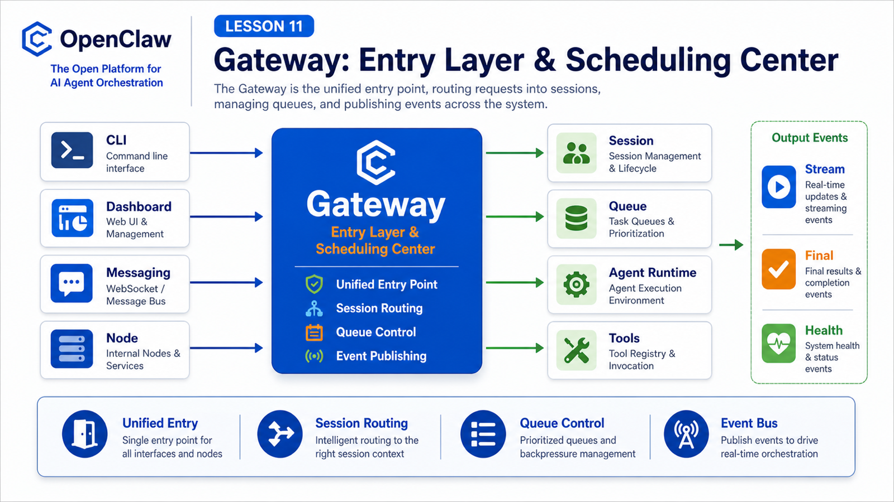

# Gateway: OpenClaw's Entry Layer and Scheduling Center



Now that we have covered request lifecycle, sessions, context, instruction priority, and streaming, we can start breaking down OpenClaw's core components.

The first component to understand is the Gateway.

It is easy to think of the Gateway as "a forwarding service".

That is only a small part of the truth.

In OpenClaw, the Gateway is the entry layer, session router, scheduling center, and event bus.

It receives input from the outside world and delivers agent output back to the correct destination.

Without the Gateway, OpenClaw is mostly a local agent. With the Gateway, it can coordinate CLI, dashboard, messaging channels, nodes, browser control, automation, and remote calls.

## The Key Idea: Gateway Is Not Just a Proxy

The official docs describe the Gateway as a long-lived WebSocket server that owns messaging surfaces, nodes, sessions, and hooks.

Its place in the system looks like this:

```text
CLI / Dashboard / API / messaging channels / nodes
  ↓
Gateway
  ↓
Session / Queue / Agent Runtime / Tools / Hooks
  ↓
stream events / final reply / channel delivery / persisted state
```

The Gateway does much more than pass bytes along:

```text
accept connections
authenticate and pair devices
route messages to sessions
accept agent requests
return accepted, final, and stream events
connect messaging platforms and device nodes
report health and status
host hooks, cron, presence, and event surfaces
```

If the Agent Runtime is the reasoning and execution loop, the Gateway is the nervous system and traffic controller.

## Responsibility 1: A Unified Entry Layer

OpenClaw has many entry points:

```text
CLI
Web UI
macOS app
Telegram
enterprise chat
Slack / Discord
WhatsApp
webhooks
scheduled jobs
remote nodes
```

Each entry point has different identity, message shape, protocol, and permission behavior.

The Gateway brings them into one runtime surface.

The architecture docs explain that control-plane clients connect over WebSocket, usually on `127.0.0.1:18789`, while nodes connect to the same server with a node role and declared capabilities.

The important result:

```text
many entry points
one Gateway-owned runtime surface
```

That is how CLI runs, dashboard events, channel replies, and session transcripts can cooperate.

## Responsibility 2: Protocol and Authentication

The Gateway uses WebSocket JSON payloads.

At a high level:

```text
first frame: connect
after handshake:
  req/res for client requests
  event for server-pushed events
```

So it is not a loose text pipe.

Requests have ids, methods, params, payloads, and errors.

The Gateway also handles trust:

```text
shared token or password
device identity
pairing approval
Tailscale or trusted-proxy identity
local loopback trust paths
```

This complexity exists for a reason: OpenClaw needs to be easy to connect to, but difficult for untrusted callers to take over.

## Responsibility 3: Session Routing

The Gateway owns the routing decision that maps incoming messages to sessions.

For each message it may need to ask:

```text
Which channel did it come from?
Which account?
Which peer, group, or thread?
Was a session key provided?
Is it bound to a specific agent?
Is there already an active run?
```

If this routing is wrong, users see confusing behavior:

- group context leaks into direct chat
- CLI history does not match messaging history
- "continue the previous task" continues the wrong session
- a retried webhook creates duplicate runs

Session routing is not an implementation detail.

It defines context boundaries.

## Responsibility 4: Queues and Concurrency

Users do not wait politely for every agent run to finish before speaking again.

They correct and interrupt:

```text
Only look at East China.
Stop this task for now.
After that, send the summary to the group.
```

The Gateway must decide how these messages enter the active session.

Typical modes include:

```text
steer      inject into the next model boundary of the active run
followup   wait until the current run completes
collect    gather for later
interrupt  abort the active run
```

Without this layer, long-running agents become chaotic.

The Gateway does not merely receive requests. It manages relationships between requests.

## Responsibility 5: Events and Observability

After an agent run starts, the Gateway does not just wait for final text.

It pushes events:

```text
agent accepted
lifecycle start / end / error
assistant stream
tool event
presence
health
heartbeat
shutdown
```

The CLI can show streamed text.

The dashboard can show tool progress.

Messaging platforms can receive drafts or final replies.

Automation systems can wait for structured terminal state.

That is why the Gateway is also an event bus.

## Gateway and Agent Runtime

The Gateway is not the model.

It is not the whole agent either.

The split is:

```text
Gateway
  connection, auth, routing, queues, events, channels

Agent Runtime
  prompt, context, model, tool loop, session transcript
```

They cooperate closely.

The Gateway sends requests into the runtime.

The runtime emits tool, lifecycle, and assistant events back.

The Gateway delivers those results to clients and channels.

The core loop is:

```text
external input → Gateway → Agent Runtime → Gateway → external output
```

## A Real Scenario

A user writes in an enterprise group:

```text
Check yesterday's refund anomalies and send a summary.
```

The Gateway may:

```text
1. receive the channel webhook
2. validate source and message identity
3. route the group to a session
4. check whether the session already has a run
5. create a new run or steer the active one
6. send the request to Agent Runtime
7. push lifecycle and tool events to the dashboard
8. chunk the final summary for the messaging platform
9. persist transcript and session metadata
```

The user sees a clean progress message and final answer.

The system preserves the full path.

## Common Misunderstandings

### Misunderstanding 1: Gateway Is Just Port 18789

No.

The port is only the entry point. The Gateway manages connections, sessions, events, routing, and runtime surfaces.

### Misunderstanding 2: CLI Can Replace the Gateway

Local embedded runs exist, but Gateway-backed runs share Gateway-owned sessions, channels, loopback resources, and event subscriptions.

### Misunderstanding 3: Gateway Only Serves Chat

No.

It also serves nodes, Canvas surfaces, health checks, hooks, cron, presence, remote calls, and tool events.

### Misunderstanding 4: Gateway Is the Whole Security Boundary

No.

Gateway handles auth, pairing, protocol, and connection boundaries. Tool policy, exec approvals, sandboxing, and workspace boundaries continue to constrain execution below it.

## Final Summary

The Gateway is OpenClaw's entry layer and scheduling center.

It unifies external inputs, manages connection and auth, routes sessions, controls queues, carries event streams, and delivers runtime output back to the right channel.

In one sentence:

```text
Gateway turns OpenClaw from a local agent into a multi-entry, multi-session, observable agent system.
```

## Lesson Homework

1. Draw a Gateway input/output diagram with CLI, dashboard, messaging channels, and Agent Runtime.
2. List three user-visible problems caused by wrong session routing.
3. Explain the difference between Gateway health and Gateway probe.
4. Write five internal steps for a group message entering the Gateway.
5. Separate Gateway security boundaries from tool execution boundaries.

## Next Lesson Preview

Next we cover:

```text
CLI: how local commands connect to OpenClaw
```

We will start from commands such as `openclaw agent`, `openclaw gateway`, and `openclaw doctor`.

## References

- OpenClaw Docs: [Gateway architecture](https://docs.openclaw.ai/concepts/architecture)
- OpenClaw Docs: [Gateway CLI](https://docs.openclaw.ai/cli/gateway)
- OpenClaw Docs: [Agent loop](https://docs.openclaw.ai/concepts/agent-loop)
- OpenClaw Docs: [Command queue](https://docs.openclaw.ai/concepts/queue)
- OpenClaw Docs: [Streaming and chunking](https://docs.openclaw.ai/concepts/streaming)
