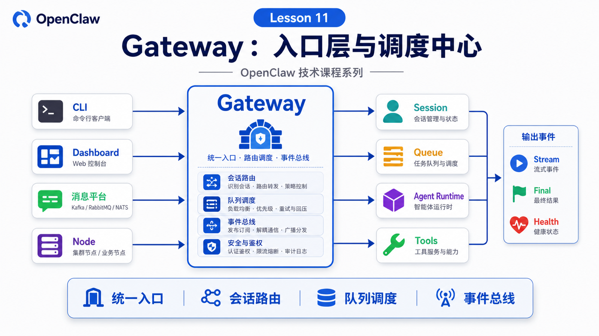

# Gateway：OpenClaw 的入口层和调度中心



学到第 11 讲，我们终于进入 OpenClaw 的核心组件拆解。

第一个必须讲的是 Gateway。

很多人第一次看到 Gateway，会把它理解成“一个转发请求的服务”。

这只说对了一小半。

在 OpenClaw 里，Gateway 更像整个系统的入口层、会话调度中心和事件总线。

它负责接住外部世界的输入，也负责把 Agent 的输出送回正确的地方。

如果没有 Gateway，OpenClaw 就会退化成一个本地 CLI Agent；有了 Gateway，OpenClaw 才能同时面对 CLI、Dashboard、消息平台、节点、浏览器、自动化任务和远程调用。

## 先说结论：Gateway 不是普通代理

OpenClaw 官方文档把 Gateway 描述为一个长期运行的 WebSocket server。它拥有 messaging surfaces、nodes、sessions、hooks 等运行面。

你可以这样理解它的位置：

```text
CLI / Dashboard / API / 消息平台 / Node
  ↓
Gateway
  ↓
Session / Queue / Agent Runtime / Tools / Hooks
  ↓
流式事件 / 最终回复 / 渠道发送 / 状态持久化
```

所以 Gateway 不是简单的 HTTP proxy。

它至少做这些事：

```text
接收连接
做认证和 pairing
维护会话和路由
接收 agent 请求
返回 accepted / final / stream event
连接消息平台和设备节点
管理健康检查和状态
承载 hooks、cron、presence 等事件
```

如果说 Agent Runtime 是大脑和执行循环，Gateway 就是神经系统和交通枢纽。

## Gateway 的第一职责：统一入口

OpenClaw 的入口很多。

用户可能来自：

```text
CLI
Web UI
macOS app
Telegram
企业微信
Slack / Discord
WhatsApp
Webhook
自动化任务
远程节点
```

这些入口的协议、身份、消息格式和权限都不同。

Gateway 的第一件事就是把它们收进同一个运行面。

官方架构文档里提到，控制面客户端通过 WebSocket 连接 Gateway，默认绑定在 `127.0.0.1:18789`；节点也通过 WebSocket 连接，但会声明 node 角色和能力。

这带来一个很重要的结果：

```text
入口可以很多
运行状态只有一个 Gateway 统一管理
```

这样 CLI 发起的任务、Dashboard 看到的事件、消息平台收到的回复，才有可能围绕同一条 session transcript 协作。

## Gateway 的第二职责：协议和认证

Gateway 使用 WebSocket JSON payload。

官方文档总结的 wire protocol 大概是：

```text
第一帧：connect
之后：
  req/res：客户端请求和响应
  event：服务端推送事件
```

这意味着 Gateway 不是“随便发字符串”的通道。

它有明确的帧结构、请求 id、method、params、payload、error。

同时，Gateway 还要处理认证。

比如：

```text
shared secret token / password
设备身份
pairing approval
Tailscale 或 trusted proxy 身份
本地 loopback 的信任路径
```

这解释了为什么 Gateway 比普通本地脚本复杂。

它要在“方便连接”和“不能被陌生入口接管”之间做平衡。

## Gateway 的第三职责：Session 路由

前面几讲反复提到 Session。

Gateway 是 Session 路由的关键拥有者。

当一条消息进来时，Gateway 要判断：

```text
来自哪个 channel？
哪个账号？
哪个 peer / group / thread？
是否显式指定 session-key？
是否绑定到某个 agent？
是否已有正在运行的 run？
```

然后把它映射到对应 session。

如果这个路由错了，就会出现很多奇怪问题：

- 群聊里的上下文串到私聊
- CLI 的任务和消息平台的任务互相看不见
- Agent 以为“继续上一个任务”，但其实进入了另一个 session
- 同一个 webhook 重复触发多个任务

所以 Gateway 的路由不只是工程细节。

它决定 Agent 的上下文边界。

## Gateway 的第四职责：Queue 和并发控制

真实用户不会等 Agent 完美结束后才说下一句话。

他们会补充、打断、纠正：

```text
别看全部区域，只看华东。
这个任务先停一下。
做完以后再帮我发群里。
```

Gateway 必须决定这些输入如何进入当前 session。

常见模式包括：

```text
steer：进入当前 run 的下一次模型调用
followup：等当前 run 完成后处理
collect：先收集，稍后一起处理
interrupt：中断当前 run
```

没有这层队列，Agent 很容易在长任务里乱套。

Gateway 的价值就在于：它不只是接收请求，还管理请求之间的关系。

## Gateway 的第五职责：事件流和可观测性

当 Agent run 开始后，Gateway 不只是等最终答案。

它会把事件推给订阅者：

```text
agent accepted
lifecycle start / end / error
assistant stream
tool event
presence
health
heartbeat
shutdown
```

CLI 可以显示流式文本。

Dashboard 可以展示工具过程。

消息平台可以收到进度草稿或最终回复。

自动化系统可以等待结构化终态。

这就是为什么 Gateway 是事件总线。

如果没有事件流，OpenClaw 就只能“最后给你一句话”；有了事件流，OpenClaw 才能解释“正在做什么、做到哪一步、哪里失败了”。

## Gateway 与 Agent Runtime 的关系

Gateway 不是模型。

Gateway 也不是 Agent 的全部。

更准确的关系是：

```text
Gateway
  负责连接、认证、路由、队列、事件、渠道

Agent Runtime
  负责 prompt、context、model、tool loop、session transcript
```

但它们不是两个完全分离的孤岛。

Gateway 会把请求送入 Agent Runtime。

Agent Runtime 会把流式事件、工具状态、最终回复交回 Gateway。

Gateway 再把这些结果送回 CLI、Dashboard 或消息平台。

这就是 OpenClaw 的核心闭环：

```text
外部输入 → Gateway → Agent Runtime → Gateway → 外部输出
```

## 一个真实场景

假设你在企业微信群里说：

```text
帮我检查昨天退款异常，并发一份摘要。
```

Gateway 做的事大概是：

```text
1. 接收企业微信 webhook
2. 校验来源和消息 id，避免重复投递
3. 根据群聊和账号映射到 session
4. 判断当前 session 是否已有 run
5. 按 queue mode 创建新 run 或 steering
6. 把请求送入 Agent Runtime
7. 推送 lifecycle 和 tool events 给 Dashboard
8. 把最终摘要按企业微信限制分块发送
9. 写入 transcript 和 session metadata
```

用户只看到“开始处理”和“最终摘要”。

但系统中间经过了入口、路由、队列、模型、工具、输出适配等多个步骤。

## 常见误解

### 误解一：Gateway 只是端口 18789

不是。

端口只是入口。

Gateway 真正管理的是连接、会话、事件、路由和运行面。

### 误解二：CLI 可以绕过 Gateway 做所有事

部分本地模式可以嵌入运行，但 Gateway-backed run 才能共享 Gateway 管理的 session、MCP loopback、消息渠道和事件订阅。

### 误解三：Gateway 只服务聊天

不是。

它还服务节点、Canvas、健康检查、hooks、cron、presence、远程调用和工具事件。

### 误解四：Gateway 是安全边界的全部

也不是。

Gateway 做认证、pairing、连接和协议边界；工具权限、exec approvals、sandbox、workspace 还在更低层继续约束执行。

## 最后总结

Gateway 是 OpenClaw 的入口层和调度中心。

它统一外部入口，维护连接和认证，解析 session，管理队列，承载事件流，并把 Agent Runtime 的结果送回正确渠道。

一句话总结：

```text
Gateway 让 OpenClaw 从“本地 Agent”变成“多入口、多会话、多渠道、可观察的 Agent 系统”。
```

## 本节作业

1. 画出你理解的 Gateway 输入输出图，至少包含 CLI、Dashboard、消息平台、Agent Runtime。
2. 思考：如果 Gateway 路由错 session，会出现哪些用户可见问题？
3. 用 `openclaw gateway health` 或 `openclaw gateway probe` 的概念，解释 health 和 probe 解决什么问题。
4. 写出一次群聊消息进入 Gateway 后的 5 个内部步骤。
5. 区分 Gateway 安全边界和工具执行安全边界。

## 下一节预告

下一节讲：

```text
CLI：本地命令如何连接到 OpenClaw
```

我们会从用户敲下 `openclaw agent`、`openclaw gateway`、`openclaw doctor` 开始，看 CLI 如何成为 OpenClaw 的本地控制面。

## 参考资料

- OpenClaw Docs：[Gateway architecture](https://docs.openclaw.ai/concepts/architecture)
- OpenClaw Docs：[Gateway CLI](https://docs.openclaw.ai/cli/gateway)
- OpenClaw Docs：[Agent loop](https://docs.openclaw.ai/concepts/agent-loop)
- OpenClaw Docs：[Command queue](https://docs.openclaw.ai/concepts/queue)
- OpenClaw Docs：[Streaming and chunking](https://docs.openclaw.ai/concepts/streaming)
