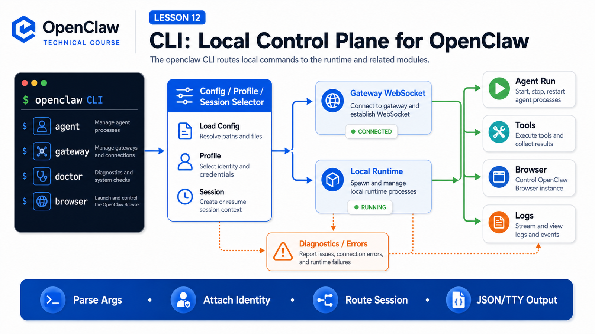

# CLI: How Local Commands Connect to OpenClaw



You may use commands like these every day:

```text
openclaw agent --message "summarize today's logs"
openclaw gateway health
openclaw browser status
openclaw doctor
```

They look like ordinary local commands.

In OpenClaw, the CLI is more than a bag of shortcuts. It is the local control plane that connects human intent, script arguments, terminal state, configuration, and the Gateway-managed runtime.

If the Gateway is the entry layer and scheduling center, the CLI is the handle you usually hold.

It can start agent runs, inspect the Gateway, manage sessions, configure models, control the browser, view logs, and produce JSON output for automation.

## The Key Idea: CLI Is a Control Plane

OpenClaw CLI sits here:

```text
User / script / terminal
  ↓
openclaw CLI
  ↓
config + profile + auth + workspace
  ↓
Gateway WebSocket or local embedded runtime
  ↓
Agent / Tools / Browser / Sessions / Channels
  ↓
TTY output / JSON / delivered reply / logs
```

It solves three problems:

```text
turn command-line arguments into structured requests
attach local configuration and identity
turn runtime results into terminal-friendly or machine-readable output
```

So learning the CLI is not about memorizing a command list.

The useful questions are:

- Which commands only inspect local state?
- Which commands connect to the Gateway?
- Which commands create an agent run?
- Which commands change configuration, permissions, or external channels?
- When does the CLI use an embedded local runtime?

## Two Paths Into OpenClaw

The CLI has two major execution paths.

Gateway-backed:

```text
openclaw CLI
  ↓ WebSocket
Gateway
  ↓
Session / Agent Runtime / Tool Events
```

Local embedded:

```text
openclaw CLI
  ↓
embedded Agent Runtime
  ↓
local tools, model providers, plugin registry
```

The official `openclaw agent` docs describe the default as a Gateway-backed agent turn, with `--local` available for embedded execution. Gateway mode may also fall back to embedded execution when the Gateway request fails.

That explains why the same command can behave differently:

```text
Gateway is healthy
  CLI connects to Gateway and reuses sessions, events, and channels

Gateway is unavailable
  some commands fail
  some agent commands may fall back locally

explicit --local
  skip Gateway and use the local runtime directly
```

## `openclaw agent`: Turning Text Into a Run

A common command is:

```bash
openclaw agent --agent ops --message "Summarize logs"
```

This does not simply send text to a model.

It usually does this:

```text
1. parse CLI options
2. load profile, config, agent bindings, and model overrides
3. resolve the session selector
4. build an agent request
5. connect to Gateway or enter local runtime
6. receive accepted ack, stream events, and final response
7. choose TTY, JSON, or delivery output
```

The docs require at least one session selector for `openclaw agent`, such as `--to`, `--session-key`, `--session-id`, or `--agent`.

That is not busywork.

An agent run must know where it belongs:

```text
Which transcript receives this turn?
Which history should be reused?
Where should the final reply be delivered?
Which run owns the tool events?
```

The CLI turns a terminal sentence into a structured request that the Gateway and Agent Runtime can route.

## CLI Options Change Runtime Semantics

Some options look small but change the meaning of the run:

```text
--message
  user input body

--agent
  target an agent id and possibly override routing bindings

--session-key / --session-id
  choose context ownership

--model
  override the model for this run

--thinking
  choose reasoning effort

--deliver
  send the reply back to the selected channel or target

--json
  emit machine-readable output

--local
  use embedded local runtime
```

A chat box usually expresses only "what to say".

The CLI also expresses "who says it, which agent says it, which session owns it, which model runs it, whether to deliver it, and whether a person or program will read the result."

## Output: Human-Friendly or Script-Friendly

OpenClaw CLI output is layered.

In a TTY, it can optimize for humans:

```text
color
progress
clickable links
streamed text
long-running indicators
```

In scripts, it must be stable:

```text
--json
--plain
no color
parseable fields
clear exit codes
```

The CLI reference notes that ANSI styling and progress indicators render only in TTY sessions, while `--json` and `--plain` disable styling for clean output.

That means the CLI is built for both operators and automation.

For a person:

```bash
openclaw agent --agent ops --message "Check recent failed jobs"
```

For a script:

```bash
openclaw agent --agent ops --message "Check recent failed jobs" --json
```

The first values readability.

The second values stable fields.

## Gateway, Doctor, Status: CLI as Ops Surface

The CLI does not only send messages.

It also tells you whether OpenClaw is healthy.

Common commands include:

```text
openclaw gateway
openclaw gateway health
openclaw gateway status
openclaw gateway probe
openclaw status
openclaw doctor
openclaw logs
```

These commands turn "it does not work" into diagnosable layers:

```text
Is the Gateway running?
Is the port reachable?
Is auth correct?
Does config exist?
Is the model provider available?
Is the browser plugin enabled?
Is the workspace healthy?
Do logs show a clear error?
```

The CLI gives you a path:

```text
config layer → Gateway layer → Agent layer → Tool layer → Channel layer
```

## Browser, Approvals, Sandbox

Tool capabilities are also controlled through the CLI.

Browser examples:

```text
openclaw browser status
openclaw browser start
openclaw browser open https://example.com
openclaw browser snapshot
```

The browser docs describe OpenClaw-managed browser as a separate profile with deterministic tab control, actions, snapshots, screenshots, and PDFs. It is not your daily browser; it is an isolated surface for automation and verification.

Exec approval examples:

```text
openclaw approvals get
openclaw exec-policy show
openclaw exec-policy set
```

These are not obscure settings.

They decide whether the agent can execute commands, when a human confirmation is required, and what happens when no approval UI is reachable.

## A Real Scenario

Imagine a CI system calls OpenClaw after a failed run:

```bash
openclaw agent \
  --agent ops \
  --session-key ci:repo-a:run-8842 \
  --message "Read the latest failure log and decide whether this is a test issue or environment issue" \
  --json
```

This command says:

```text
use the ops agent
attach this to ci:repo-a:run-8842
run a diagnostic task
return parseable output
```

The Gateway can then connect this run to the same session's history, tool events, and log summaries.

Later:

```bash
openclaw agent --session-key ci:repo-a:run-8842 --message "Rewrite the conclusion in Chinese"
```

The agent can continue in the same context.

That is the real value of the CLI: temporary terminal actions become routable, traceable agent workflows.

## Common Misunderstandings

### Misunderstanding 1: CLI Is Only a Gateway Client

Not exactly.

Many commands do connect to the Gateway, but the CLI also handles local configuration, profiles, setup, doctor, browser, sandbox, approvals, and embedded runtime.

### Misunderstanding 2: `--local` Is Always Equivalent

Not always.

`--local` can preload the plugin registry and run locally, but it is not the same as sharing every Gateway event subscription, messaging channel, remote node, and managed state surface.

### Misunderstanding 3: `--json` Is Just Formatting

No.

`--json` means a program will read the output. Scripts should rely on structured fields, not colored terminal text.

### Misunderstanding 4: CLI Can Bypass Permissions

Do not treat it that way.

The CLI may request work, but actual tool execution is still constrained by Gateway policy, agent policy, exec approvals, sandboxing, and host settings.

## Final Summary

CLI is OpenClaw's local control plane.

It connects terminal input, script options, local configuration, Gateway sessions, and Agent Runtime.

In one sentence:

```text
CLI makes OpenClaw operable by people, callable by scripts, diagnosable by operators, and connected to the same session and tool system.
```

## Lesson Homework

1. Explain Gateway-backed execution versus `--local`.
2. Write an `openclaw agent` command using `--agent`, `--session-key`, and `--json`.
3. Explain why `openclaw agent` needs a session selector.
4. List CLI commands you would use to debug "the agent did not reply".
5. Separate "CLI requested execution" from "the tool was allowed to execute".

## Next Lesson Preview

Next:

```text
Bridge: connecting models, tools, and runtime environments
```

We will untangle a confusing word: historical TCP Bridge, current Gateway protocol, ACP, MCP, tool calls, and runtime adapters.

## References

- OpenClaw Docs: [CLI reference](https://docs.openclaw.ai/cli)
- OpenClaw Docs: [Agent CLI](https://docs.openclaw.ai/cli/agent)
- OpenClaw Docs: [Gateway architecture](https://docs.openclaw.ai/concepts/architecture)
- OpenClaw Docs: [Browser tool](https://docs.openclaw.ai/tools/browser)
- OpenClaw Docs: [Exec approvals](https://docs.openclaw.ai/tools/exec-approvals)

---

Original link: [CLI: How Local Commands Connect to OpenClaw](https://en.harries.blog/cli-how-local-commands-connect-to-openclaw/)
