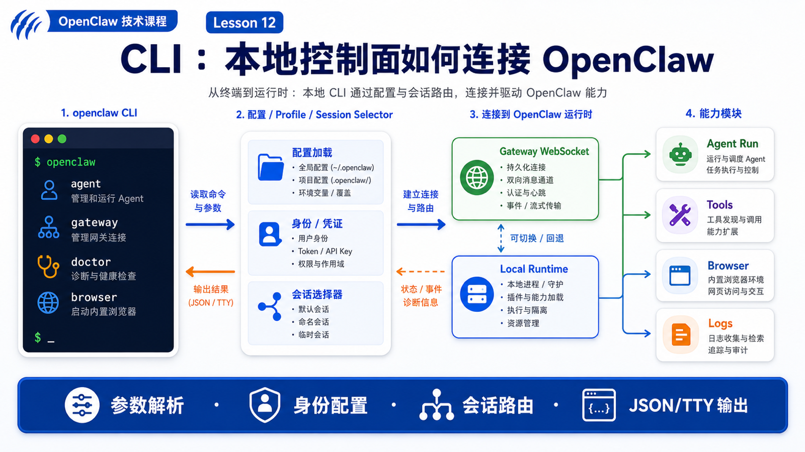

# CLI：本地命令如何连接到 OpenClaw



你可能每天都在终端里敲命令：

```text
openclaw agent --message "总结今天的日志"
openclaw gateway health
openclaw browser status
openclaw doctor
```

看起来这些命令只是本地工具。

但在 OpenClaw 里，CLI 不是一个简单的“命令集合”。它更像本地控制面：负责把人的意图、脚本的参数、终端环境和 Gateway 管理的运行系统连接起来。

如果 Gateway 是入口层和调度中心，那么 CLI 就是你最常用的操作杆。

它既能发起 Agent run，也能检查 Gateway、管理会话、配置模型、启动浏览器、查看日志，还能用 JSON 输出和外部脚本配合。

## 先说结论：CLI 是本地控制面，不只是快捷命令

OpenClaw CLI 的位置可以画成这样：

```text
User / script / terminal
  ↓
openclaw CLI
  ↓
config + profile + auth + workspace
  ↓
Gateway WebSocket 或 local embedded runtime
  ↓
Agent / Tools / Browser / Sessions / Channels
  ↓
TTY output / JSON / delivered reply / logs
```

它解决三个问题：

```text
把命令行参数变成结构化请求
把本地配置和身份带入请求
把远端或本地运行结果变成终端可读输出
```

所以，理解 CLI，不是背命令表。

你真正要理解的是：

- 哪些命令只是查询本地状态？
- 哪些命令会连接 Gateway？
- 哪些命令会触发 Agent run？
- 哪些命令会改变配置、权限或外部渠道？
- 什么情况下 CLI 会走 embedded local runtime？

## CLI 连接 OpenClaw 的两条路

OpenClaw CLI 大致有两种运行路径。

第一种是 Gateway-backed：

```text
openclaw CLI
  ↓ WebSocket
Gateway
  ↓
Session / Agent Runtime / Tool Events
```

第二种是 local embedded：

```text
openclaw CLI
  ↓
同进程或本地嵌入式 Agent Runtime
  ↓
本地工具、模型 provider、插件注册表
```

官方 `openclaw agent` 文档说明：默认通过 Gateway 运行一次 agent turn，使用 `--local` 可以改成本地嵌入式运行；如果 Gateway 请求失败，Gateway 模式也可能回退到嵌入式运行。

这就是为什么同一个命令在不同环境下表现不同：

```text
Gateway 正常
  CLI 连接 Gateway，复用会话、事件和渠道能力

Gateway 不可用
  某些命令只能失败
  某些 Agent 命令可能退回本地运行

显式 --local
  不等 Gateway，直接走本地嵌入式 runtime
```

## `openclaw agent`：把一句话变成一次 run

最典型的 CLI 命令是：

```bash
openclaw agent --agent ops --message "Summarize logs"
```

一次命令背后不是直接把文本丢给模型。

它通常经历这些步骤：

```text
1. 解析命令参数
2. 读取 profile、config、agent 绑定和模型覆盖
3. 确定 session selector
4. 构造 agent 请求
5. 连接 Gateway 或进入 local runtime
6. 接收 accepted ack、stream events 和 final response
7. 根据 TTY / --json / --deliver 决定输出方式
```

官方文档要求 `openclaw agent` 至少带一个 session selector，例如 `--to`、`--session-key`、`--session-id` 或 `--agent`。这不是多余限制。

因为 Agent 必须知道这次 run 属于哪个上下文。

如果没有 session selector，就会出现：

```text
这次回答应该写入哪个 transcript？
应该复用哪段历史？
最终回复应该送回哪个 channel？
工具事件应该和哪个 run 关联？
```

CLI 的一个核心职责，就是把“我在终端输入的一句话”变成“可以被 Gateway 和 Agent Runtime 路由的结构化请求”。

## CLI 参数不是小细节，它们会改变运行语义

很多参数看似只是开关，实际会改变系统行为。

例如：

```text
--message
  用户输入正文

--agent
  直接指定 agent id，可能覆盖路由绑定

--session-key / --session-id
  指定上下文归属

--model
  本次运行的模型覆盖

--thinking
  本次运行的推理强度

--deliver
  不只打印到终端，还把回复送回目标渠道

--json
  输出机器可读结果，适合脚本

--local
  走本地嵌入式 runtime
```

这也是 CLI 和普通聊天框的不同。

聊天框通常只表达“说什么”。

CLI 还表达“给谁说、用哪个 agent 说、写入哪个 session、用哪个模型、是否投递、输出给人还是给机器”。

## CLI 如何处理输出

OpenClaw CLI 的输出也分层。

在 TTY 里，它会尽量让人好读：

```text
颜色
进度
可点击链接
流式文本
长任务提示
```

在脚本里，它要尽量稳定：

```text
--json
--plain
无颜色输出
可解析字段
明确 exit code
```

官方 CLI reference 提到，ANSI 颜色和进度只在 TTY 会话里渲染，`--json` 和 `--plain` 会禁用样式，方便干净输出。

这说明 CLI 既面向人，也面向自动化。

一个给人看的命令可以是：

```bash
openclaw agent --agent ops --message "检查最近失败的任务"
```

一个给脚本看的命令可以是：

```bash
openclaw agent --agent ops --message "检查最近失败的任务" --json
```

前者重视阅读体验。

后者重视字段稳定。

## Gateway、Doctor、Status：CLI 也是运维入口

CLI 不只发消息。

它还负责让你知道 OpenClaw 是否健康。

常见命令包括：

```text
openclaw gateway
openclaw gateway health
openclaw gateway status
openclaw gateway probe
openclaw status
openclaw doctor
openclaw logs
```

这些命令的价值在于把“系统不工作”拆成可定位的问题：

```text
Gateway 是否启动？
端口是否可连？
认证是否正确？
配置是否存在？
模型 provider 是否可用？
浏览器插件是否启用？
workspace 是否正常？
日志里有没有明确错误？
```

如果没有 CLI，很多问题只能靠猜。

有了 CLI，你可以按层排查：

```text
配置层 → Gateway 层 → Agent 层 → Tool 层 → Channel 层
```

## Browser、Approvals、Sandbox：CLI 也是工具控制台

OpenClaw 的工具能力也常通过 CLI 管理。

例如浏览器：

```text
openclaw browser status
openclaw browser start
openclaw browser open https://example.com
openclaw browser snapshot
```

官方浏览器文档把 OpenClaw-managed browser 描述成独立 profile，支持 tab 控制、点击、输入、拖拽、截图、PDF 和 snapshot。它不是你的日常浏览器，而是给 Agent 自动化和验证用的隔离表面。

再比如 exec approvals：

```text
openclaw approvals get
openclaw exec-policy show
openclaw exec-policy set
```

这些命令不是“高级设置”。

它们决定 Agent 能不能执行命令、什么时候需要确认、确认失败时怎么处理。

## 一个真实场景

假设你想在 CI 失败后用 OpenClaw 做一次排查：

```bash
openclaw agent \
  --agent ops \
  --session-key ci:repo-a:run-8842 \
  --message "读取最近一次失败日志，判断是测试问题还是环境问题" \
  --json
```

这条命令传达了很多信息：

```text
使用 ops agent
归属到 ci:repo-a:run-8842 这个会话
输入是一段排查请求
输出给脚本读取
```

Gateway 接收后，可以把这次 run 和同一个 session 的历史、工具事件、日志摘要关联起来。

如果后面你再执行：

```bash
openclaw agent --session-key ci:repo-a:run-8842 --message "把结论改成中文"
```

Agent 能接着同一条上下文继续。

这就是 CLI 的真实价值：把终端里的临时操作，变成可路由、可追踪、可复用的 Agent 工作流。

## 常见误解

### 误解一：CLI 只是 Gateway 的客户端

不完全是。

很多命令确实连接 Gateway，但 CLI 还负责本地配置、profile、setup、doctor、browser、sandbox、approvals 和 embedded local runtime。

### 误解二：`--local` 等于功能完全一样

不一定。

`--local` 可以加载插件注册表并运行本地 runtime，但它不等于完整复用 Gateway 的所有事件订阅、消息渠道、远程节点和共享状态。

### 误解三：`--json` 只是换个格式

不是。

`--json` 意味着命令输出要给程序读。脚本应该依赖结构化字段，而不是解析带颜色的终端文本。

### 误解四：CLI 命令能绕过权限

不能这么理解。

CLI 可以请求执行工具，但真正是否允许执行，还要经过 Gateway、agent policy、exec approvals、sandbox 和 host 策略。

## 最后总结

CLI 是 OpenClaw 的本地控制面。

它把人的终端输入、脚本参数、本地配置、Gateway 会话和 Agent Runtime 连接起来。

一句话总结：

```text
CLI 让 OpenClaw 可以被人操作、被脚本调用、被运维排查，并把这些操作接入同一套会话和工具系统。
```

## 本节作业

1. 用自己的话解释 Gateway-backed 和 `--local` 的区别。
2. 设计一条 `openclaw agent` 命令，必须包含 `--agent`、`--session-key` 和 `--json`。
3. 思考：为什么 `openclaw agent` 需要 session selector？
4. 列出你会用哪些 CLI 命令排查“Agent 没有回复”的问题。
5. 区分“CLI 发起请求”和“工具真正获得执行权限”。

## 下一节预告

下一节讲：

```text
Bridge：连接模型、工具和运行环境的中间层
```

我们会把“Bridge”这个容易混淆的词拆开：哪些是历史 TCP Bridge，哪些是当前 Gateway 协议、ACP、MCP、工具调用和 runtime adapter。

## 参考资料

- OpenClaw Docs：[CLI reference](https://docs.openclaw.ai/cli)
- OpenClaw Docs：[Agent CLI](https://docs.openclaw.ai/cli/agent)
- OpenClaw Docs：[Gateway architecture](https://docs.openclaw.ai/concepts/architecture)
- OpenClaw Docs：[Browser tool](https://docs.openclaw.ai/tools/browser)
- OpenClaw Docs：[Exec approvals](https://docs.openclaw.ai/tools/exec-approvals)
