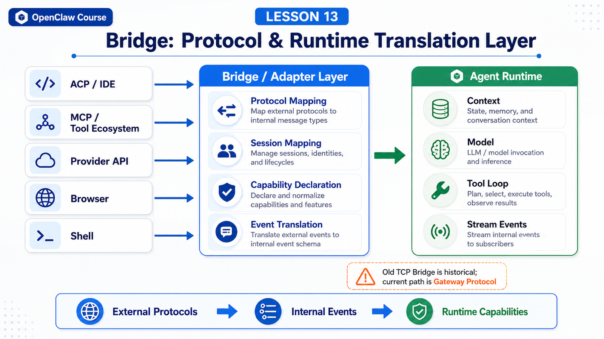

# Bridge: Connecting Models, Tools, and Runtime Environments



"Bridge" is one of the easiest OpenClaw terms to misunderstand.

People ask:

```text
Is Bridge a service?
Is it part of the Gateway?
Is it a model adapter?
How does it relate to ACP, MCP, and tool calls?
```

The answer is slightly counterintuitive: to understand Bridge today, do not start with a single process named Bridge.

The historical TCP Bridge documented by OpenClaw has been removed. Current builds do not start a bridge listener, and `bridge.*` config keys are no longer part of the current schema. Current node and operator clients should use the Gateway Protocol.

So this lesson is not about memorizing an old component. It is about understanding the bridging layer as a design pattern: connecting different protocols, runtimes, tool systems, and model APIs into the same agent loop.

## The Key Idea: Bridge Means Boundary Translation

Different parts of an agent system speak different languages.

```text
Models
  tokens, messages, tool calls, responses

Gateway
  WebSocket frames, requests, events, sessions

CLI / IDE
  argv, stdio, ACP, JSON

Tools
  schemas, arguments, stdout, stderr, files

Browser
  tabs, DOM snapshots, click/type, screenshots

Workspace
  cwd, files, context, boundaries
```

The value of a bridge layer is translation:

```text
external protocol
  ↓
OpenClaw internal requests and events
  ↓
context, tools, and state the Agent Runtime understands
```

Without this layer, every external protocol leaks into the agent loop.

With it, the runtime can focus on prompt, context, model, and tool loop while entry points adapt themselves at the boundary.

## First Correction: TCP Bridge Is Historical

The official Bridge protocol page warns that the TCP bridge has been removed. Current OpenClaw builds do not ship the bridge listener, and `bridge.*` configuration is no longer valid. The page remains as historical reference.

If you see old material about:

```text
bridge listener
bridge.bind
18790
JSONL over TCP
```

treat it as historical design, not the path to configure now.

The current path is closer to:

```text
operator / node / CLI / web UI
  ↓ WebSocket + Gateway Protocol
Gateway
  ↓
Agent Runtime + Tool Runtime
```

This lesson uses Bridge to mean the bridging responsibility, not the removed TCP service.

## Problem 1: Protocol Shapes Differ

An IDE may speak ACP.

An external tool ecosystem may speak MCP.

A CLI speaks argv, stdout, and stderr.

The Gateway speaks WebSocket JSON frames.

Model providers speak their own chat, completions, or responses APIs.

These protocols have different fields, lifecycles, and error models.

The bridge maps them into internal OpenClaw objects:

```text
external prompt
  → user message

external session id
  → Gateway session key / session id

external streaming delta
  → assistant stream event

external cancel
  → abort run

external tool request
  → OpenClaw tool invocation

external resource / file
  → attachment or workspace file reference
```

That is why bridge layers often look like protocol adapters.

## Problem 2: Runtime Environments Differ

An agent may run in several places:

```text
Gateway host
Sandbox
Node host
macOS companion app
IDE stdio process
headless server
```

Each environment has different capabilities:

```text
Can it read host files?
Can it open a browser?
Can it run shell commands?
Is there a UI approval client?
Does it have network?
What is cwd?
How does tool output return?
```

The bridge layer turns those differences into capability declarations and execution results the runtime can understand.

A node declares role, capabilities, and commands when connecting to the Gateway. The browser plugin registers browser tools. A sandbox changes filesystem and process boundaries.

The Agent Runtime should not guess the machine it is on at every step.

It should see stable capabilities through context and tool schemas.

## Problem 3: Model APIs Differ

Model providers are not identical.

Some are message-oriented.

Some are response-oriented.

Tool call fields differ.

Reasoning controls differ.

Multimodal inputs differ.

If the runtime depends directly on every provider's raw fields, the system becomes messy.

The bridging pattern is:

```text
OpenClaw internal request
  ↓ provider adapter
model-specific API call
  ↓ provider adapter
OpenClaw internal assistant/tool event
```

The agent loop can then work with stable concepts:

```text
assistant text
tool call
tool result
usage
finish reason
error
```

## Problem 4: Tool Calls Must Be Observable

A tool call is not just a function call.

It may involve:

```text
argument validation
policy check
approval
sandbox routing
running output
timeout
retry
result trimming
transcript write
stream event display
```

Tool bridging serves both sides:

```text
for the model
  clear tool schema and tool result

for the system
  traceable tool lifecycle events
```

That connects this lesson to Lesson 10 on streaming and tool events.

The bridge does not only return a tool result to the model. It also translates intermediate state for Gateway, CLI, dashboard, and messaging channels.

## ACP as a Typical Bridge

The `openclaw acp` docs describe a command that speaks Agent Client Protocol over stdio to an IDE, forwards prompts to the Gateway over WebSocket, and maps ACP sessions to Gateway session keys.

That is a classic bridge:

```text
IDE / ACP client
  ↓ stdio + ACP
openclaw acp
  ↓ WebSocket
Gateway
  ↓
OpenClaw session / Agent Runtime
```

It is not trying to make OpenClaw a full IDE-native runtime.

It handles:

```text
session mapping
prompt forwarding
cancel forwarding
basic streaming updates
```

That is the boundary of a good bridge: translate and route, not own every layer.

## MCP Is Also Bridging, in Another Direction

MCP often means exposing external tools and resources to an agent.

If ACP is "external clients entering OpenClaw", MCP is closer to "OpenClaw entering external tool ecosystems".

Comparison:

```text
ACP
  IDE/client → OpenClaw
  focus: session, prompt, stream, cancel

MCP
  OpenClaw → external tool/resource server
  focus: tool, resource, prompt, capability discovery
```

Both are bridges.

They bridge in different directions.

## A Real Scenario

Suppose you use ACP from an IDE:

```text
Read the current project's error logs and suggest a fix.
```

The path may be:

```text
IDE
  ↓ ACP prompt
openclaw acp bridge
  ↓ Gateway WebSocket agent request
Gateway
  ↓ session routing
Agent Runtime
  ↓ context + model + tools
Tool Runtime
  ↓ read / exec / browser
Agent Runtime
  ↓ final answer
Gateway
  ↓ stream events
openclaw acp bridge
  ↓ ACP updates
IDE
```

The user sees an answer in the IDE.

The system translated through ACP, Gateway Protocol, session routing, runtime, tools, and stream events.

That is the value of bridging.

## Common Misunderstandings

### Misunderstanding 1: Bridge Means the Old TCP Bridge

No.

The old TCP Bridge is historical reference. Today, understand Bridge as protocol and runtime translation, with Gateway Protocol as the main path.

### Misunderstanding 2: More Bridges Are Always Better

No.

More bridge layers can mean more state duplication, error mapping, and latency. Good bridge design has clear boundaries and traceable events.

### Misunderstanding 3: Bridge Can Ignore Security

It cannot.

Bridges cross protocol and environment boundaries, so they must preserve identity, session, policy, approval, and sandbox information.

### Misunderstanding 4: Bridge Only Handles Input

No.

Output also needs translation: streaming deltas, tool events, errors, cancel results, and final responses.

## Final Summary

Bridge is the translation layer between system boundaries.

Do not understand modern OpenClaw through the removed TCP Bridge. Understand it through Gateway Protocol, ACP, MCP, tool adapters, provider adapters, and runtime adapters.

In one sentence:

```text
Bridge lets OpenClaw connect different entry points, protocols, models, tools, and runtime environments to the same agent loop.
```

## Lesson Homework

1. Draw the chain from an ACP client to a Gateway session.
2. Explain why the old TCP Bridge is not the current main path.
3. Compare the direction of ACP and MCP bridging.
4. List five pieces of information that must be bridged during a tool call.
5. Think through what happens if the bridge drops the session id.

## Next Lesson Preview

Next:

```text
Workspace: filesystem, project context, and execution boundaries
```

We will explain why workspace is both a context source and default cwd, but not by itself a hard security sandbox.

## References

- OpenClaw Docs: [Bridge protocol](https://docs.openclaw.ai/gateway/bridge-protocol)
- OpenClaw Docs: [Gateway architecture](https://docs.openclaw.ai/concepts/architecture)
- OpenClaw Docs: [ACP CLI](https://docs.openclaw.ai/cli/acp)
- OpenClaw Docs: [CLI reference](https://docs.openclaw.ai/cli)
- OpenClaw Docs: [Agent loop](https://docs.openclaw.ai/concepts/agent-loop)

---

Original link: [Bridge: Connecting Models, Tools, and Runtime Environments](https://en.harries.blog/bridge-connecting-models-tools-and-runtime-environments/)
