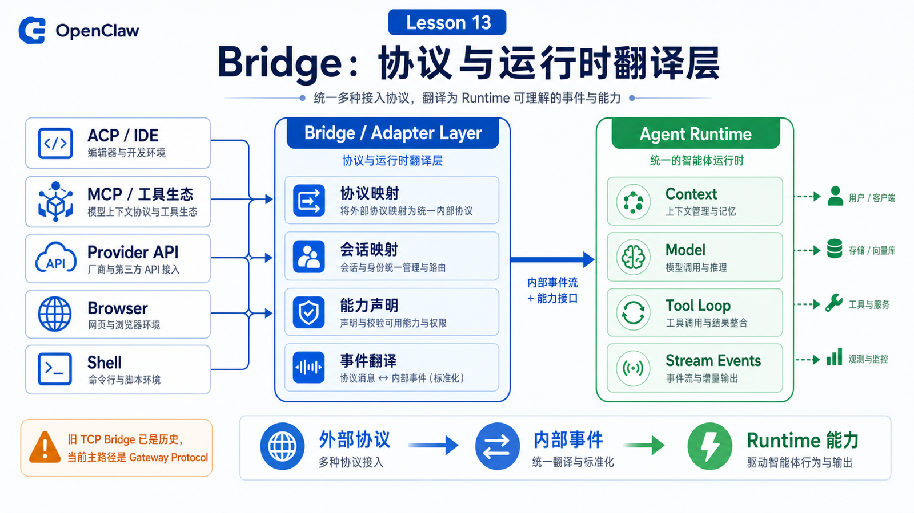

# Bridge：连接模型、工具和运行环境的中间层



“Bridge”是 OpenClaw 里最容易被误解的词之一。

很多人会问：

```text
Bridge 是一个服务吗？
Bridge 是 Gateway 的一部分吗？
Bridge 是模型适配器吗？
Bridge 和 ACP、MCP、工具调用有什么关系？
```

答案有点反直觉：今天讲 Bridge，不能只讲一个名叫 Bridge 的进程。

因为官方文档里历史上的 TCP Bridge 已经被移除，当前版本不再启动 TCP bridge listener，`bridge.*` 配置也不再是当前 schema 的一部分。现在应该优先使用 Gateway Protocol。

所以这篇文章讲的 Bridge，不是让你记一个旧组件，而是让你理解 OpenClaw 里的“桥接层思维”：把不同协议、运行时、工具系统和模型接口接到同一个 Agent loop 里。

## 先说结论：Bridge 是边界翻译层

在 Agent 系统里，很多东西天然说的不是一种语言。

```text
模型
  说 token、messages、tool calls、responses

Gateway
  说 WebSocket frames、requests、events、sessions

CLI / IDE
  说 argv、stdio、ACP、JSON

工具
  说 schema、参数、stdout、stderr、files

浏览器
  说 tabs、DOM snapshot、click/type、screenshots

Workspace
  说 cwd、文件、上下文、边界
```

Bridge 的核心价值就是翻译：

```text
外部协议
  ↓
OpenClaw 内部请求和事件
  ↓
Agent Runtime 可理解的上下文、工具和状态
```

如果没有桥接层，Agent loop 会被每一种外部协议污染。

有了桥接层，Runtime 可以专心处理 prompt、context、model、tool loop，而不同入口只要完成适配。

## 先纠正一个历史误会：TCP Bridge 已经是历史

官方 Bridge protocol 页面明确提示：TCP bridge 已经移除，当前 OpenClaw build 不再提供 bridge listener，`bridge.*` 配置也不在 schema 中。该页面保留为历史参考，当前 node/operator client 应使用 Gateway Protocol。

这点很重要。

如果你在旧文章里看到：

```text
bridge listener
bridge.bind
18790
JSONL over TCP
```

要把它当成历史设计，而不是今天课程里要你配置的主路径。

当前主路径更接近：

```text
operator / node / CLI / web UI
  ↓ WebSocket + Gateway Protocol
Gateway
  ↓
Agent Runtime + Tool Runtime
```

也就是说，本课讲 Bridge 的重点是“桥接职责”，不是“旧 TCP Bridge 服务”。

## Bridge 层解决的第一个问题：协议形状不同

一个 IDE 可能使用 ACP。

一个外部工具生态可能使用 MCP。

一个 CLI 使用 argv、stdout、stderr。

Gateway 使用 WebSocket JSON frames。

模型 provider 使用各自的 chat/completions/responses API。

这些协议的字段、生命周期、错误模型都不同。

桥接层要做的是把它们映射成 OpenClaw 可以处理的内部对象：

```text
external prompt
  → user message

external session id
  → Gateway session key / session id

external streaming delta
  → assistant stream event

external cancel
  → abort run

external tool request
  → OpenClaw tool invocation

external resource / file
  → attachment or workspace file reference
```

这就是为什么桥接层经常和“协议适配器”长得很像。

## Bridge 层解决的第二个问题：运行环境不同

Agent 可能运行在不同地方：

```text
Gateway host
Sandbox
Node host
macOS companion app
IDE stdio process
headless server
```

每个环境的能力不同：

```text
能不能读写宿主文件？
能不能打开浏览器？
能不能执行 shell？
有没有 UI approval？
有没有网络？
cwd 是哪里？
工具输出怎么返回？
```

桥接层必须把这些差异变成 Runtime 能理解的能力声明和执行结果。

例如，一个 node 连接 Gateway 时会声明角色、能力和命令；浏览器插件会注册 browser tool；sandbox 会改变工具执行的文件系统和进程边界。

Agent Runtime 不应该在每一步都猜“我现在到底在哪台机器上”。

它应该通过上下文和工具 schema 看到稳定能力。

## Bridge 层解决的第三个问题：模型接口不同

不同模型 provider 的接口并不完全一样。

有的强调 messages。

有的强调 responses。

有的工具调用字段不同。

有的支持特殊 thinking 参数。

有的支持 multimodal input。

如果 Runtime 直接依赖每个 provider 的原始字段，系统会很快变乱。

桥接思路是：

```text
OpenClaw internal request
  ↓ provider adapter
model-specific API call
  ↓ provider adapter
OpenClaw internal assistant/tool event
```

这样，Agent loop 看见的是统一的：

```text
assistant text
tool call
tool result
usage
finish reason
error
```

而不是被每个 provider 的差异拖着走。

## Bridge 层解决的第四个问题：工具调用要可观察

工具调用不是函数调用那么简单。

它可能包含：

```text
参数校验
权限检查
审批
sandbox 路由
执行中输出
超时
失败重试
结果裁剪
写入 transcript
流式事件展示
```

所以工具桥接要同时服务两边：

```text
对模型
  提供清晰的 tool schema 和 tool result

对系统
  提供可追踪的 tool lifecycle event
```

这就是为什么第 10 讲提到的 streaming/tool events 和本讲的 Bridge 有关系。

Bridge 不只是把工具结果塞回模型，它还要把中间状态变成 Gateway、CLI、Dashboard、消息平台能理解的事件。

## ACP 是一种典型桥接

官方 `openclaw acp` 文档说，它通过 stdio 与 IDE 的 Agent Client Protocol 通信，再通过 WebSocket 把 prompt 转发到 OpenClaw Gateway，并保持 ACP sessions 与 Gateway session keys 的映射。

这就是非常典型的桥：

```text
IDE / ACP client
  ↓ stdio + ACP
openclaw acp
  ↓ WebSocket
Gateway
  ↓
OpenClaw session / Agent Runtime
```

它的职责不是把 OpenClaw 变成完整 IDE runtime。

它做的是：

```text
session 映射
prompt 转发
cancel 转发
基础 streaming update
```

这很好地说明了桥接层的边界：翻译和路由，而不是包办所有执行。

## MCP 也是桥接，但方向不同

MCP 常见于“把外部工具暴露给 Agent”。

如果 ACP 更像“让外部客户端进入 OpenClaw”，那么 MCP 更像“让 OpenClaw 进入外部工具生态”。

可以这样对比：

```text
ACP
  IDE/client → OpenClaw
  重点是 session、prompt、stream、cancel

MCP
  OpenClaw → external tool/resource server
  重点是 tool、resource、prompt、capability discovery
```

两者都属于桥接。

只不过桥接方向不同。

## 一个真实场景

假设你在 IDE 里使用 ACP，把一个问题发给 OpenClaw：

```text
请读取当前项目的错误日志，并生成修复建议。
```

链路可能是：

```text
IDE
  ↓ ACP prompt
openclaw acp bridge
  ↓ Gateway WebSocket agent request
Gateway
  ↓ session routing
Agent Runtime
  ↓ context + model + tools
Tool Runtime
  ↓ read / exec / browser
Agent Runtime
  ↓ final answer
Gateway
  ↓ stream events
openclaw acp bridge
  ↓ ACP updates
IDE
```

用户看到的是 IDE 里的回答。

但系统实际经过了 ACP、Gateway Protocol、Session、Runtime、Tool、Stream 多层翻译。

这就是 Bridge 的价值。

## 常见误解

### 误解一：Bridge 就是旧 TCP Bridge

不是。

旧 TCP Bridge 已经是历史参考。当前应该把 Bridge 理解成协议和运行时之间的翻译层，主路径是 Gateway Protocol。

### 误解二：Bridge 越多越好

不是。

桥接层越多，错误映射、状态重复和延迟也越多。好的设计是边界清晰、职责单一、事件可追踪。

### 误解三：Bridge 可以忽略安全边界

不能。

桥接层经常跨越协议和环境，因此更需要保留身份、session、权限、审批和 sandbox 信息。

### 误解四：Bridge 只处理输入

不是。

它也处理输出：streaming delta、tool event、error、cancel、final response 都需要被翻译回外部协议。

## 最后总结

Bridge 是连接不同系统边界的翻译层。

今天的 OpenClaw 不应该再按旧 TCP Bridge 来理解，而应该按 Gateway Protocol、ACP、MCP、tool adapter、provider adapter、runtime adapter 这些桥接职责来理解。

一句话总结：

```text
Bridge 让 OpenClaw 可以把不同入口、协议、模型、工具和运行环境接入同一个 Agent loop。
```

## 本节作业

1. 用一张图画出 ACP client 到 Gateway session 的映射链路。
2. 解释为什么旧 TCP Bridge 不是当前主路径。
3. 对比 ACP 和 MCP 的桥接方向。
4. 列出一次工具调用中需要桥接的 5 种信息。
5. 思考：Bridge 层如果丢失 session id，会导致什么问题？

## 下一节预告

下一节讲：

```text
Workspace：文件系统、项目上下文和执行边界
```

我们会解释 workspace 为什么既是上下文来源，也是工具执行的默认 cwd，但它本身并不等于安全沙箱。

## 参考资料

- OpenClaw Docs：[Bridge protocol](https://docs.openclaw.ai/gateway/bridge-protocol)
- OpenClaw Docs：[Gateway protocol / Gateway architecture](https://docs.openclaw.ai/concepts/architecture)
- OpenClaw Docs：[ACP CLI](https://docs.openclaw.ai/cli/acp)
- OpenClaw Docs：[CLI reference](https://docs.openclaw.ai/cli)
- OpenClaw Docs：[Agent loop](https://docs.openclaw.ai/concepts/agent-loop)

---

原文外链：[Bridge：连接模型、工具和运行环境的中间层](https://www.harries.blog/archives/720329.html)
