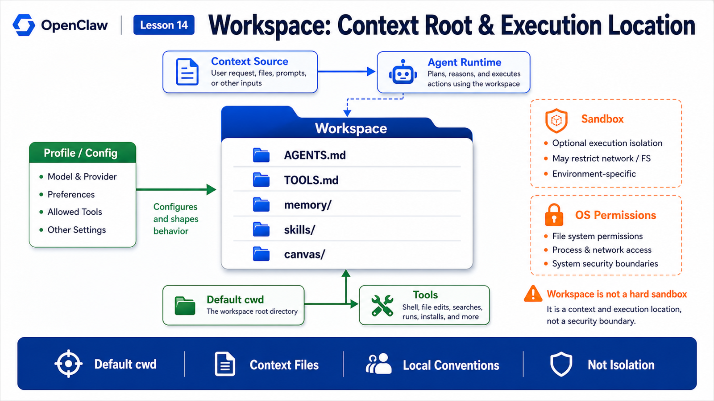

# Workspace: Filesystem, Project Context, and Execution Boundaries



Many people first understand OpenClaw workspace as "the agent's project directory".

That is true, but incomplete.

Workspace has three roles at once:

```text
default working directory
context source
home for long-term memory and local conventions
```

But there is one crucial boundary:

```text
workspace itself is not a hard sandbox
```

If you only remember "workspace is a folder", you underestimate how much it shapes agent behavior.

If you assume "workspace automatically isolates execution", you overestimate its security properties.

This lesson fixes both misunderstandings.

## The Key Idea: Context Boundary, Not Security Boundary

The official docs state that workspace is the default cwd, not a hard sandbox. Tools resolve relative paths against the workspace, but absolute paths can still reach elsewhere on the host unless sandboxing is enabled.

That is the key sentence.

Think of workspace like this:

```text
Workspace
  responsible for:
    default cwd
    bootstrap files
    agent instructions
    user information
    tool conventions
    memory files
    Canvas files

not directly responsible for:
    blocking all host file access
    hostile multi-tenant isolation
    command approval
    browser permission
    network boundary
```

Workspace is the agent's home and project context root.

Real security boundaries require sandboxing, exec approvals, tool policy, Gateway auth, OS permissions, and related controls.

## Default Location and Profiles

The default workspace is usually:

```text
~/.openclaw/workspace
```

If `OPENCLAW_PROFILE` is set to a non-default profile, the default becomes:

```text
~/.openclaw/workspace-<profile>
```

It can also be configured:

```json5
{
  agents: {
    defaults: {
      workspace: "~/.openclaw/workspace"
    }
  }
}
```

This explains why one machine may have multiple workspace folders.

The docs also warn that multiple workspace directories can cause confusing auth or state drift, because only one workspace is active at a time.

If the agent "forgot the rules", do not assume the model got worse.

Check:

```text
Which profile is active?
Which workspace path is active?
Is AGENTS.md in that workspace?
Which path does config point to?
```

## Workspace File Map

An OpenClaw workspace is not an empty folder.

It has conventional files:

```text
AGENTS.md
  operating instructions and memory usage rules

SOUL.md
  persona, tone, and boundaries

USER.md
  who the user is and how to address them

IDENTITY.md
  agent name, style, identity

TOOLS.md
  local tool conventions

HEARTBEAT.md
  small checklist for heartbeat runs

BOOT.md
  startup checklist after Gateway restart

BOOTSTRAP.md
  first-run ritual

memory/YYYY-MM-DD.md
  daily memory log

MEMORY.md
  optional curated long-term memory

skills/
  workspace-level skills

canvas/
  Canvas UI files
```

These files are not decoration.

They influence how the agent understands you, uses tools, follows rules, and maintains context.

## How Workspace Enters Context

The agent should not dump the entire workspace into the model.

A better pattern is:

```text
load key bootstrap files at session start
read task-relevant files when needed
retrieve memory when useful
use workspace as default cwd for tools
write results to transcript or workspace
```

The principle:

```text
persistent context should be short
task context should be precise
long-term memory should be retrievable
```

Examples:

```text
AGENTS.md
  durable operating rules

TOOLS.md
  local tool commands and path conventions

memory/YYYY-MM-DD.md
  today's changes

project files
  read only when relevant
```

If you put logs, documents, and chat history into `AGENTS.md`, every run carries unnecessary context weight.

That is one of the most common workspace mistakes.

## Workspace and Tool Execution

For tools, workspace is usually the default cwd.

The benefit:

```text
relative paths are stable
```

If the agent runs:

```bash
rg "TODO" .
```

`.` is likely the active workspace, not a random system directory.

But this is not isolation.

Without sandboxing, absolute paths may still point outside workspace:

```text
/Users/me/Desktop
/etc
/tmp
```

Separate "path organization" from "permission isolation".

Workspace organizes.

Sandboxing and approvals restrict.

## Sandbox Changes Workspace Semantics

The workspace docs explain that when sandboxing is enabled and `workspaceAccess` is not `"rw"`, tools operate inside a sandbox workspace under `~/.openclaw/sandboxes`, not the host workspace.

That means:

```text
sandbox off
  workspace is the host-side default cwd

sandbox on
  tools may run inside an isolated copy or sandbox workspace
```

Users often ask:

```text
Why did the agent edit a file but I cannot see it on the host?
Why does shell see a different path?
Why did browser or command behavior change?
```

The answer often involves sandbox mode, workspaceAccess, and mount strategy.

## What Should Not Live in Workspace

The docs list several things that should not be committed into a workspace repo:

```text
~/.openclaw/openclaw.json
model auth profiles
credentials
session transcripts
managed skills
per-agent Codex runtime account/config/thread state
```

These are runtime state, secrets, credentials, or internal state.

They are not course material or public project files.

A practical rule:

```text
rules that explain agent behavior can live in workspace
private memory can live in a private repo
secrets, tokens, credentials, and session internals should not live in the project repo
```

## Workspace Skill Priority

The `skills/` folder matters.

The docs describe workspace-specific skills as the highest-precedence skill location for that workspace. If names collide, workspace skills override project, personal, managed, bundled, and extra skill locations.

That means:

```text
workspace can define very local capabilities
```

For example:

```text
skills/deploy-company-service/
```

This skill may apply only inside this workspace.

But be careful with naming collisions.

If a workspace skill shares a name with a bundled skill, it can change agent behavior in this workspace.

## A Real Scenario

You use OpenClaw as a personal ops assistant.

Workspace contains:

```text
AGENTS.md
  always read the runbook first; explain dangerous commands before running

TOOLS.md
  log locations, kubectl context, common script paths

memory/2026-05-28.md
  billing service migrated today

skills/deploy-check/
  internal deployment checklist
```

You ask:

```text
Check whether billing service had anomalies after yesterday's release.
```

The agent gets implicit context:

```text
how to act
which tools exist
where logs live
what changed today
which actions need care
```

Whether it can run shell, access host paths, or needs approval is still decided by tool policy and sandboxing.

That is the correct place of workspace.

## Common Misunderstandings

### Misunderstanding 1: Workspace Is Just Source Code

No.

It can include project files, agent instructions, user information, memory, tool conventions, workspace skills, and Canvas files.

### Misunderstanding 2: Workspace Is a Security Sandbox

No.

The docs explicitly say workspace is default cwd, not a hard sandbox. Use sandboxing when you need isolation.

### Misunderstanding 3: More in AGENTS.md Means Smarter

No.

Large persistent context burns tokens, dilutes priorities, and increases misunderstanding.

### Misunderstanding 4: Multiple Workspaces Are Harmless

Not always.

Multiple active-looking paths can cause config, auth, memory, and state drift.

## Final Summary

Workspace is OpenClaw's context root and default execution location.

It carries agent instructions, user information, tool conventions, memory, skills, and Canvas files, and it gives tools a stable cwd.

But it is not a hard security boundary.

In one sentence:

```text
Workspace tells the agent "where I am and what rules apply"; sandboxing and approvals decide "what I am allowed to touch."
```

## Lesson Homework

1. Inspect which bootstrap files exist in your workspace.
2. Explain workspace versus sandbox in your own words.
3. Design a focused `TOOLS.md` with local conventions, not long logs.
4. Explain why multiple workspaces can cause state drift.
5. List files that should not be committed to a workspace repo.

## Next Lesson Preview

Next:

```text
Permission model: safety boundaries for Shell, Browser, and file operations
```

We will place Gateway auth, operator trust, exec approvals, browser isolation, sandboxing, and workspaceAccess on one map.

## References

- OpenClaw Docs: [Agent workspace](https://docs.openclaw.ai/concepts/agent-workspace)
- OpenClaw Docs: [Sandboxing](https://docs.openclaw.ai/gateway/sandboxing)
- OpenClaw Docs: [Security](https://docs.openclaw.ai/gateway/security)
- OpenClaw Docs: [Exec approvals](https://docs.openclaw.ai/tools/exec-approvals)

---

Original link: [Workspace: Filesystem, Project Context, and Execution Boundaries](https://en.harries.blog/workspace-filesystem-project-context-and-execution-boundaries/)
