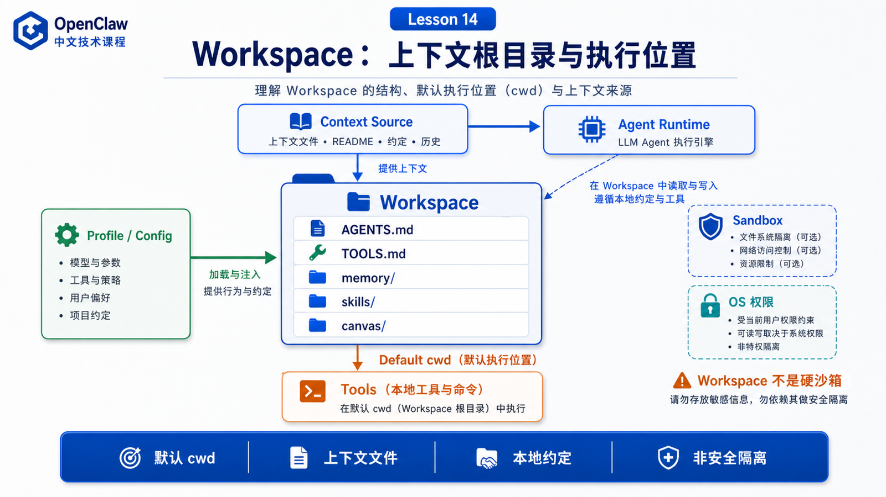

# Workspace：文件系统、项目上下文和执行边界



很多人第一次接触 OpenClaw 的 workspace，会把它理解成“Agent 的项目目录”。

这个说法没错，但太浅。

Workspace 同时承担三种角色：

```text
默认工作目录
上下文来源
长期记忆和本地约定的承载地
```

但还有一个非常重要的边界：

```text
workspace 本身不是硬沙箱
```

如果你只记住“workspace 是目录”，你会低估它对 Agent 行为的影响。

如果你误以为“workspace 天然安全隔离”，你会高估它的安全能力。

这篇文章把这两个误区一起拆掉。

## 先说结论：Workspace 是上下文边界，不等于安全边界

OpenClaw 官方文档明确说明：workspace 是默认 cwd，不是硬沙箱。工具会把相对路径解析到 workspace 下，但如果没有启用 sandbox，绝对路径仍可能访问宿主机其他位置。

这句话是理解 workspace 的关键。

可以这样画：

```text
Workspace
  负责：
    默认 cwd
    启动文件
    Agent 指令
    用户信息
    工具约定
    记忆文件
    Canvas 文件

不直接负责：
    阻止所有宿主文件访问
    多租户隔离
    命令审批
    浏览器权限
    网络边界
```

所以 workspace 更像“Agent 的家”和“项目上下文根目录”。

真正的安全边界还要靠 sandbox、exec approvals、tool policy、Gateway auth、OS 权限等一起完成。

## 默认位置和 profile

OpenClaw 的默认 workspace 通常是：

```text
~/.openclaw/workspace
```

如果设置了非 default 的 `OPENCLAW_PROFILE`，默认位置会变成：

```text
~/.openclaw/workspace-<profile>
```

也可以在配置里覆盖：

```json5
{
  agents: {
    defaults: {
      workspace: "~/.openclaw/workspace"
    }
  }
}
```

这解释了为什么同一台机器上可能出现多个 workspace。

但官方文档也提醒：保留多个 workspace 目录可能导致 auth 或状态漂移，因为同一时间只有一个 workspace 是活跃的。

如果你看到 Agent “好像忘了规则”，第一反应不应该是模型变笨。

先检查：

```text
当前 profile 是什么？
active workspace 是哪个？
AGENTS.md 是否在这个 workspace 里？
配置指向了哪个路径？
```

## Workspace 文件图谱

OpenClaw workspace 不是空目录。

它有一组约定文件。

常见文件包括：

```text
AGENTS.md
  Agent 操作规则和使用记忆的方式

SOUL.md
  persona、语气和边界

USER.md
  用户是谁、如何称呼用户

IDENTITY.md
  Agent 名字、风格、身份信息

TOOLS.md
  本地工具约定和使用习惯

HEARTBEAT.md
  heartbeat run 的轻量 checklist

BOOT.md
  Gateway restart 后的启动检查

BOOTSTRAP.md
  第一次初始化 ritual

memory/YYYY-MM-DD.md
  每日记忆日志

MEMORY.md
  可选的长期记忆摘要

skills/
  workspace 级别技能

canvas/
  Canvas UI 文件
```

这些文件不是装饰。

它们会影响 Agent 如何理解你、如何执行任务、如何使用工具、如何保持长期上下文。

## Workspace 如何进入上下文

Agent 不会把整个 workspace 一股脑塞进模型。

更合理的方式是：

```text
启动时加载关键 bootstrap 文件
根据任务读取相关文件
必要时检索 memory
工具执行时以 workspace 为默认 cwd
把结果写回 transcript 或 workspace
```

这背后的原则是：

```text
常驻上下文要短
任务相关上下文要准
长期记忆要可检索
```

例如：

```text
AGENTS.md
  适合放长期操作原则

TOOLS.md
  适合放本机工具命令和路径约定

memory/YYYY-MM-DD.md
  适合放当天变化

项目文件
  需要时再读取
```

如果你把大量日志、长文档、历史聊天都塞进 `AGENTS.md`，Agent 每次启动都会背负巨大上下文负担。

这是 workspace 设计中最常见的问题之一。

## Workspace 与工具执行

工具执行时，workspace 通常是默认 cwd。

这带来一个好处：

```text
相对路径稳定
```

例如 Agent 调用：

```bash
rg "TODO" .
```

它知道 `.` 大概率是当前 workspace，而不是系统某个随机目录。

但这不等于安全隔离。

如果没有启用 sandbox，绝对路径仍可能指向 workspace 外：

```text
/Users/me/Desktop
/etc
/tmp
```

所以你要把“路径组织”和“权限隔离”分开看。

Workspace 负责组织。

Sandbox 和 approvals 负责限制。

## Sandbox 启用后，workspace 语义会变化

官方 workspace 文档提到：当 sandboxing 启用且 `workspaceAccess` 不是 `"rw"` 时，工具会在 `~/.openclaw/sandboxes` 下的 sandbox workspace 中运行，而不是宿主 workspace。

这意味着：

```text
未启用 sandbox
  workspace 是宿主机上的默认 cwd

启用 sandbox
  工具可能在隔离副本或 sandbox workspace 中运行
```

用户容易困惑的是：

```text
为什么 Agent 明明改了文件，我宿主目录没看到？
为什么 shell 看到的路径和我本机不一样？
为什么浏览器或命令的环境变了？
```

答案往往和 sandbox mode、workspaceAccess、挂载策略有关。

## 什么不应该放进 workspace

官方文档列出了一些不应该提交进 workspace repo 的内容，例如：

```text
~/.openclaw/openclaw.json
模型 auth profiles
credentials
session transcripts
managed skills
per-agent Codex runtime account/config/thread state
```

这些属于运行状态、密钥、凭证或内部状态。

它们不是课程项目、不是可公开资料，也不应该随便进 git。

一个稳妥原则：

```text
可解释 Agent 行为的规则可以放 workspace
能恢复用户上下文的私有记忆可以放私有 repo
密钥、token、凭证、session 内部状态不要放项目仓库
```

## Workspace skills 的优先级

Workspace 下的 `skills/` 很重要。

官方文档说明，workspace-specific skills 是该 workspace 的最高优先级 skill location。当名称冲突时，它会覆盖 project、personal、managed、bundled 等其他来源。

这意味着：

```text
workspace 可以定义非常本地化的能力
```

比如你的公司内部有特定部署命令：

```text
skills/deploy-company-service/
```

这个 skill 可以只在当前 workspace 生效。

但这也意味着你要小心命名冲突。

如果 workspace skill 和 bundled skill 同名，它可能改变 Agent 在这个 workspace 里的行为。

## 一个真实场景

你把 OpenClaw 用作个人运维助手。

Workspace 里有：

```text
AGENTS.md
  永远先读 runbook，危险命令先解释

TOOLS.md
  日志目录、kubectl context、常用脚本路径

memory/2026-05-28.md
  今天迁移了 billing service

skills/deploy-check/
  公司内部部署检查流程
```

你说：

```text
检查 billing service 昨天发布后有没有异常。
```

Agent 会从 workspace 得到很多隐含信息：

```text
应该如何行动
哪些工具可用
日志在哪里
今天有什么背景
哪些操作需要谨慎
```

但它是否能执行 shell、能否访问宿主路径、是否需要 approval，仍由工具策略和 sandbox 决定。

这就是 workspace 的正确位置。

## 常见误解

### 误解一：Workspace 就是项目源码目录

不只是。

它可以包含项目文件，也包含 Agent 指令、用户信息、记忆、工具约定、workspace skills 和 Canvas 文件。

### 误解二：Workspace 是安全沙箱

不是。

官方文档明确说 workspace 是默认 cwd，不是硬沙箱。需要隔离时应配置 sandbox。

### 误解三：把所有东西写进 AGENTS.md 会更聪明

不会。

过大的常驻上下文会浪费 token，稀释重点，增加模型误读概率。

### 误解四：多个 workspace 可以随便混用

不建议。

多个活跃路径容易导致配置、认证、记忆和状态漂移。

## 最后总结

Workspace 是 OpenClaw 的上下文根目录和默认执行位置。

它承载 Agent 指令、用户信息、工具约定、记忆、skills 和 Canvas 文件，也为工具提供默认 cwd。

但它不是硬安全边界。

一句话总结：

```text
Workspace 负责让 Agent 知道“我在哪、该按什么规则做事”；sandbox 和 approvals 才负责限制“我能碰什么”。
```

## 本节作业

1. 检查你的 workspace 里有哪些 bootstrap 文件。
2. 用自己的话解释 workspace 和 sandbox 的区别。
3. 设计一个合理的 `TOOLS.md`，只放本机工具约定，不放大段日志。
4. 思考：为什么多个 workspace 会导致状态漂移？
5. 列出哪些文件不应该提交到 workspace 私有 repo。

## 下一节预告

下一节讲：

```text
权限模型：Shell、Browser、文件读写的安全边界
```

我们会把 Gateway auth、operator trust、exec approvals、browser isolation、sandbox 和 workspaceAccess 放在一张图里讲清楚。

## 参考资料

- OpenClaw Docs：[Agent workspace](https://docs.openclaw.ai/concepts/agent-workspace)
- OpenClaw Docs：[Sandboxing](https://docs.openclaw.ai/gateway/sandboxing)
- OpenClaw Docs：[Security](https://docs.openclaw.ai/gateway/security)
- OpenClaw Docs：[Exec approvals](https://docs.openclaw.ai/tools/exec-approvals)
