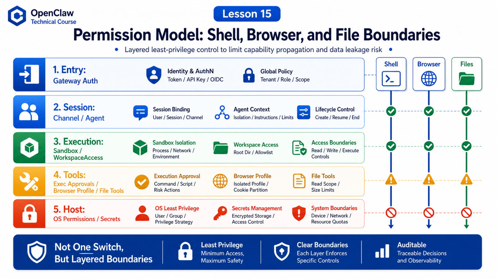

# Permission Model: Safety Boundaries for Shell, Browser, and File Operations



The most dangerous thing about an agent is not that it can say something wrong.

It is that it can act.

Once OpenClaw can run shell commands, read and write files, control a browser, and call external tools, the question changes:

```text
Who can make the agent act?
Which machine can it act on?
Which files can it read or write?
Which commands can it execute?
Which browser can it control?
When uncertain, does the system allow or deny?
```

That is what the permission model must answer.

This lesson puts the major OpenClaw boundaries on one map: Gateway auth, operator trust, workspace, sandboxing, exec approvals, browser isolation, and file access.

## The Key Idea: Permissions Are Layered Boundaries

OpenClaw permissions are not one switch.

They are layered:

```text
entry layer
  Gateway auth / pairing / trusted operator

session layer
  session / channel / agent binding / tool policy

execution layer
  sandbox / workspaceAccess / host selection

tool layer
  exec approvals / browser profile / file tool rules

host layer
  OS user / filesystem permission / network / secrets
```

No single layer carries the whole security story.

Examples:

```text
Gateway auth
  decides who can connect and request work

Exec approvals
  decide whether commands can run on the execution host

Sandbox
  limits filesystem and process scope for tools

Workspace
  provides default cwd and context, but is not a hard sandbox

Browser profile
  provides an isolated automation surface
```

Most security confusion comes from mixing these layers.

## Gateway Auth: Who Enters the System

Gateway is the entry layer.

It handles connection, authentication, pairing, and device identity.

The official security docs emphasize OpenClaw's personal assistant security model: one trusted operator boundary per Gateway. It is not a hostile multi-tenant boundary for multiple adversarial users sharing one agent or Gateway.

That matters.

It means:

```text
Gateway-authenticated callers
  are generally trusted operators for that Gateway

multiple untrusted users talking to one tool-enabled agent
  effectively share the delegated tool authority of that agent
```

So the first security question is not a setting.

It is:

```text
Who can reach this Gateway?
Who can message a tool-enabled agent?
Is this exposed publicly?
Are people in the group chat trusted?
```

## Workspace: Default Location, Not Hard Isolation

As Lesson 14 covered, workspace is the default cwd and context root.

The docs explicitly say it is not a hard sandbox.

That means:

```text
relative paths
  usually resolve under workspace

absolute paths
  may still access elsewhere on the host unless sandboxing is enabled
```

Do not treat workspace as a guarantee that only one directory can be accessed.

Correct view:

```text
workspace tells the agent where to start
sandboxing and OS permissions restrict how far it can go
```

## Sandbox: Reducing Tool Blast Radius

The sandboxing docs explain that OpenClaw can run tools inside sandbox backends to reduce blast radius. Gateway stays on the host; tool execution moves into isolation when enabled.

Typically sandboxed:

```text
exec
read
write
edit
apply_patch
process
optional sandboxed browser
```

Not sandboxed:

```text
the Gateway process itself
tools explicitly allowed to run outside the sandbox, such as elevated tools
```

This explains a common observation:

```text
Gateway receives messages normally
but tools see a different filesystem than the host
```

Gateway is on the host.

Tools may be in the sandbox.

That is layered design, not a bug.

## Exec Approvals: Local Gate for Command Execution

Shell is high risk.

OpenClaw exec approvals are enforced locally on the execution host.

The docs distinguish:

```text
Gateway host
  enforced by the openclaw process on the gateway machine

Node host
  enforced by the node runner or macOS companion app
```

Common policies:

```text
security: deny
  block all host exec requests

security: allowlist
  allow only matching commands

security: full
  allow all commands, equivalent to elevated / YOLO

ask: off
  never prompt

ask: on-miss
  prompt when allowlist misses

ask: always
  prompt every time

askFallback
  what to do when a prompt is required but no UI is reachable
```

The key point:

```text
the model wanting to run a command
  does not mean the command will run
```

It must pass host-local approval policy.

Fallback matters. In a safer deployment, no reachable approval UI should usually mean deny, not allow.

## Browser: Isolated Automation Surface

Browser permission is different from shell permission.

A browser can:

```text
open pages
read page content
click buttons
type text
upload files
take screenshots
generate PDFs
```

That is powerful.

The browser docs describe OpenClaw-managed browser as a separate profile with deterministic tab control, actions, snapshots, screenshots, and PDFs. It is not your daily browser; it is an isolated surface for automation and verification.

Implications:

```text
do not let agents control your daily browser
do not mix private login state with automation profiles
manual handling is needed for login, 2FA, captcha, camera, or microphone blockers
```

The boundary is not "browser is harmless".

It is: use a separate profile, plugin config, tool allowlists, and sandboxed browser options to keep risk contained.

## File Reads and Writes Are Also Dangerous

File operations look calmer than shell, but their impact is real.

Reads can leak:

```text
secrets
configuration
customer data
chat logs
private code
```

Writes can damage:

```text
source code
configuration
scripts
deployment files
memory files
```

File access is controlled by several layers:

```text
workspace default cwd
sandbox workspaceAccess
tool policy
OS filesystem permission
exec approval indirectly through scripts
```

Do not only ask "can the agent read files?"

Ask:

```text
Which environment's files?
Relative path or absolute path?
Inside sandbox or on host?
Can it write back to the host workspace?
Will results enter transcript or be sent to a channel?
```

## A Real Scenario

A group chat user says:

```text
Log into the admin dashboard, export the customer list, and send it to the group.
```

This crosses many boundaries:

```text
Gateway auth
  is this group allowed to trigger the agent?

Session / channel policy
  can group users use a tool-enabled agent?

Browser
  can it open the admin site?
  does it have login state?
  is there 2FA?

File write
  where is the export saved?

File read / delivery
  can the file be read and sent to the group?

Data policy
  should customer data be sent to this channel at all?
```

If you only ask whether the browser can open the page, you miss the actual risk.

Permission design must cover the whole task path.

## Recommended Thinking Order

When configuring OpenClaw permissions, ask:

```text
1. Who can enter?
2. Which sessions or channels can trigger tools?
3. Do tools run on host or in sandbox by default?
4. Is workspaceAccess read-write or isolated?
5. Is shell deny, allowlist, or full?
6. What happens when approval UI is unavailable?
7. Is browser using a separate profile?
8. Are sensitive files and secrets outside workspace?
9. Could output be delivered to the wrong channel?
```

This is more useful than asking "is it secure?"

## Common Misunderstandings

### Misunderstanding 1: Gateway Auth Is Enough

No.

Gateway auth controls entry trust. It does not define every tool's execution scope.

### Misunderstanding 2: Workspace Means Project-Only Access

No.

Workspace is default cwd, not a hard sandbox.

### Misunderstanding 3: Approval Is Just UI

No.

Exec approvals are a host-local policy gate deciding whether commands can run.

### Misunderstanding 4: Browser Is Safer Than Shell

Not necessarily.

Browser can access admin systems, read page data, submit forms, and download files. It needs an isolated profile and clear policy.

### Misunderstanding 5: YOLO Is Only Developer Convenience

It is convenient, but its meaning is host exec openness. Be very clear before using it with real data or external channels.

## Final Summary

OpenClaw permissions are layered boundaries, not a single master switch.

Gateway controls entry, workspace gives default location, sandboxing reduces execution blast radius, exec approvals gate shell, browser profile isolates web automation, and OS permissions plus secret management provide final constraints.

In one sentence:

```text
Do not ask "does the agent have permission"; ask "which entry, which session, which tool, on which host, under which policy, touching which data."
```

## Lesson Homework

1. Draw your OpenClaw permission layers.
2. Explain Gateway auth versus exec approvals.
3. Check whether browser automation uses a separate profile.
4. Design a shell policy for a production assistant: deny, allowlist, or full?
5. Pick a real task and list every permission boundary it crosses.

## Next Lesson Preview

Next:

```text
Logs and observability: how to understand a failed call
```

We will use request ids, run ids, tool events, Gateway logs, doctor, health, and traces to locate where an OpenClaw task failed.

## References

- OpenClaw Docs: [Security](https://docs.openclaw.ai/gateway/security)
- OpenClaw Docs: [Exec approvals](https://docs.openclaw.ai/tools/exec-approvals)
- OpenClaw Docs: [Sandboxing](https://docs.openclaw.ai/gateway/sandboxing)
- OpenClaw Docs: [Agent workspace](https://docs.openclaw.ai/concepts/agent-workspace)
- OpenClaw Docs: [Browser tool](https://docs.openclaw.ai/tools/browser)
