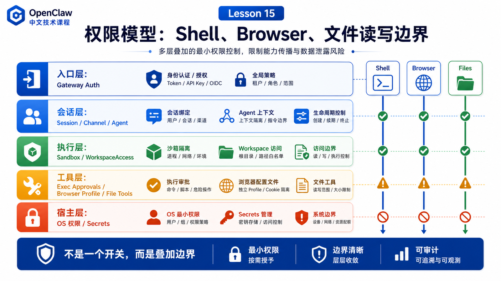

# 权限模型：Shell、Browser、文件读写的安全边界



Agent 最危险的地方，不是它会说错话。

而是它能做事。

一旦 OpenClaw 可以执行 shell、读写文件、控制浏览器、调用外部工具，问题就从“回答是否准确”变成：

```text
谁能让 Agent 做事？
Agent 能在哪台机器上做事？
它能读写哪些文件？
它能执行哪些命令？
它能控制哪个浏览器？
失败或不确定时默认允许还是默认拒绝？
```

这就是权限模型要解决的问题。

本讲不把安全讲成玄学，而是把 OpenClaw 的几个边界放到同一张图里：Gateway auth、operator trust、workspace、sandbox、exec approvals、browser isolation、file access。

## 先说结论：权限不是一层开关，而是一组叠加边界

OpenClaw 的权限模型可以这样理解：

```text
入口层
  Gateway auth / pairing / trusted operator

会话层
  session / channel / agent binding / tool policy

执行层
  sandbox / workspaceAccess / host selection

工具层
  exec approvals / browser profile / file tool rules

宿主层
  OS user / filesystem permission / network / secrets
```

任何一层都不能单独承担全部安全责任。

例如：

```text
Gateway auth
  决定谁能连接和发起请求

Exec approvals
  决定命令是否能在执行 host 上运行

Sandbox
  限制工具执行能看到的文件系统和进程范围

Workspace
  提供默认 cwd 和上下文，但不是硬沙箱

Browser profile
  提供隔离的自动化浏览器表面
```

把这些层混在一起，是很多 OpenClaw 安全误解的根源。

## Gateway auth：谁能进入系统

Gateway 是入口层。

它负责连接、认证、pairing 和设备身份。

官方安全文档强调，OpenClaw 的默认安全模型是个人助手模型：一个 Gateway 对应一个可信操作边界，不是给多个互相不信任的用户共享的敌对多租户边界。

这句话非常重要。

它意味着：

```text
Gateway 认证过的人
  通常被视为这个 Gateway 的可信 operator

如果多个不可信用户能给一个 tool-enabled agent 发消息
  他们实际共享这个 agent 被委托的工具权限
```

所以安全第一步不是调某个参数，而是先问：

```text
这个 Gateway 面向谁？
谁能发消息给 tool-enabled agent？
这个入口是不是暴露到公网？
群聊里的人是否都可信？
```

## Workspace：默认位置，不是硬隔离

上一讲已经讲过，workspace 是默认 cwd 和上下文根目录。

但官方 workspace 文档明确说，它不是硬沙箱。

这意味着：

```text
相对路径
  通常从 workspace 解析

绝对路径
  在没有 sandbox 时仍可能访问宿主其他位置
```

所以不要把 workspace 当成“只能访问这个目录”的保证。

正确理解是：

```text
workspace 让 Agent 知道从哪里开始工作
sandbox 和 OS 权限限制 Agent 最多能碰到哪里
```

## Sandbox：降低工具执行的爆炸半径

OpenClaw sandboxing 文档说明：OpenClaw 可以把工具执行放进 sandbox backend 里，以降低影响范围。Gateway 本身仍在宿主上；启用 sandbox 时，工具执行进入隔离环境。

会被 sandbox 的通常是：

```text
exec
read
write
edit
apply_patch
process
可选 sandboxed browser
```

不会被 sandbox 的包括：

```text
Gateway 进程本身
显式允许跑出 sandbox 的 elevated tool
```

这解释了一个常见现象：

```text
Gateway 能正常接收消息
但工具看到的文件系统和宿主不一样
```

因为 Gateway 在宿主，工具在 sandbox。

这不是 bug，而是边界分层。

## Exec approvals：命令执行的本地闸门

Shell 是高风险能力。

OpenClaw 的 exec approvals 在执行 host 本地强制执行。

官方文档说明：

```text
Gateway host
  由 gateway machine 上的 openclaw process 执行和约束

Node host
  由 node runner 或 macOS companion app 执行和约束
```

常见策略包括：

```text
security: deny
  阻止所有 host exec 请求

security: allowlist
  只允许命中 allowlist 的命令

security: full
  允许所有命令，相当于 elevated / YOLO

ask: off
  不询问

ask: on-miss
  allowlist 未命中时询问

ask: always
  每次都询问

askFallback
  需要询问但没有 UI 时如何处理
```

这层的重点是：

```text
模型想执行命令
  不等于命令一定会执行
```

命令要经过 host 本地 approvals 策略。

如果 approval UI 不可用，默认 fallback 很关键。安全部署里通常应该偏向 deny，而不是“没人看见就允许”。

## Browser：隔离的自动化表面

Browser 权限和 shell 不一样。

浏览器可以：

```text
打开网页
读取页面内容
点击按钮
输入文本
上传文件
截图
生成 PDF
```

这很强，也很危险。

官方浏览器文档说明，OpenClaw-managed browser 使用独立 profile，支持 deterministic tab control、actions、snapshot、screenshots、PDF，并强调它不是你的日常浏览器，而是给 agent automation 和 verification 用的隔离表面。

这意味着：

```text
不要让 Agent 控制你的日常主浏览器
不要把私人登录态和自动化 profile 混在一起
遇到登录、2FA、captcha、摄像头/麦克风阻塞时应该人工处理
```

Browser 的安全边界不是“浏览器完全无害”。

而是通过独立 profile、插件配置、工具 allowlist、sandboxed browser 等机制，把风险控制在更小范围。

## 文件读写：看起来温和，实际也危险

读文件和写文件不像 shell 那么吓人，但影响同样很大。

读文件可能泄露：

```text
密钥
配置
客户数据
聊天记录
私有代码
```

写文件可能破坏：

```text
源码
配置
脚本
部署文件
记忆文件
```

文件权限通常由多层共同决定：

```text
workspace 默认 cwd
sandbox workspaceAccess
工具 policy
OS filesystem permission
exec approval 间接影响脚本读写
```

所以不要只问“Agent 能不能读文件”。

要问：

```text
读哪个环境里的文件？
相对路径还是绝对路径？
在 sandbox 内还是 host 上？
是否允许写回 host workspace？
结果会不会进入 transcript 或发送到 channel？
```

## 一个真实场景

假设群聊里有人说：

```text
帮我登录后台，导出客户列表，再发到群里。
```

这条请求会触发多个边界：

```text
Gateway auth
  这个群是否允许触发 agent？

Session / channel policy
  群聊用户是否能使用 tool-enabled agent？

Browser
  是否允许打开后台？
  是否有登录态？
  是否遇到 2FA？

File write
  导出的文件写到哪里？

File read / delivery
  文件能不能被读取并发送到群？

Data policy
  客户列表是否允许发到这个 channel？
```

如果你只看“浏览器能不能打开网页”，就漏掉了真正的风险。

权限模型要覆盖完整任务链路。

## 推荐的思考顺序

配置 OpenClaw 权限时，可以按这个顺序问：

```text
1. 谁能入口？
2. 哪些 session / channel 能触发工具？
3. 工具默认跑在 host 还是 sandbox？
4. workspaceAccess 是读写还是隔离副本？
5. shell 是 deny、allowlist 还是 full？
6. approval UI 不可用时怎么处理？
7. browser 是否独立 profile？
8. 敏感文件和密钥是否在 workspace 外？
9. 输出是否会发到不合适的 channel？
```

这比单纯问“安全吗”更有用。

## 常见误解

### 误解一：Gateway 有认证就安全了

不够。

Gateway auth 解决入口信任，不解决每个工具的执行范围。

### 误解二：Workspace 等于只能访问项目目录

不是。

workspace 是默认 cwd，不是硬沙箱。

### 误解三：Approval 只是弹窗体验

不是。

Exec approvals 是执行 host 上的本地策略闸门，决定命令是否能运行。

### 误解四：浏览器比 shell 安全

不一定。

浏览器可能访问后台、读取页面数据、提交表单、下载文件。它也需要隔离 profile 和明确策略。

### 误解五：YOLO 模式只是方便开发

它确实方便，但语义是放开 host exec。用于真实数据或外部渠道前，要非常清楚风险。

## 最后总结

OpenClaw 的权限模型不是一个总开关，而是一组叠加边界。

Gateway 决定谁能进入，workspace 决定默认工作位置，sandbox 降低执行影响范围，exec approvals 控制 shell 命令，browser profile 隔离网页自动化，OS 权限和密钥管理提供最后约束。

一句话总结：

```text
不要问“Agent 有没有权限”，要问“哪个入口、哪个 session、哪个工具、在哪个 host、以什么策略、访问哪些数据”。
```

## 本节作业

1. 画出你的 OpenClaw 权限分层图。
2. 解释 Gateway auth 和 exec approvals 的区别。
3. 检查你的 browser automation 是否使用独立 profile。
4. 设计一套适合生产助手的 shell 策略：deny、allowlist 还是 full？
5. 选一个真实任务，列出它经过的权限边界。

## 下一节预告

下一节讲：

```text
日志与可观测性：如何看懂一次失败的调用
```

我们会从 request id、run id、tool event、Gateway logs、doctor、health、trace 这些线索出发，学会定位一次 OpenClaw 任务失败在了哪一层。

## 参考资料

- OpenClaw Docs：[Security](https://docs.openclaw.ai/gateway/security)
- OpenClaw Docs：[Exec approvals](https://docs.openclaw.ai/tools/exec-approvals)
- OpenClaw Docs：[Sandboxing](https://docs.openclaw.ai/gateway/sandboxing)
- OpenClaw Docs：[Agent workspace](https://docs.openclaw.ai/concepts/agent-workspace)
- OpenClaw Docs：[Browser tool](https://docs.openclaw.ai/tools/browser)
