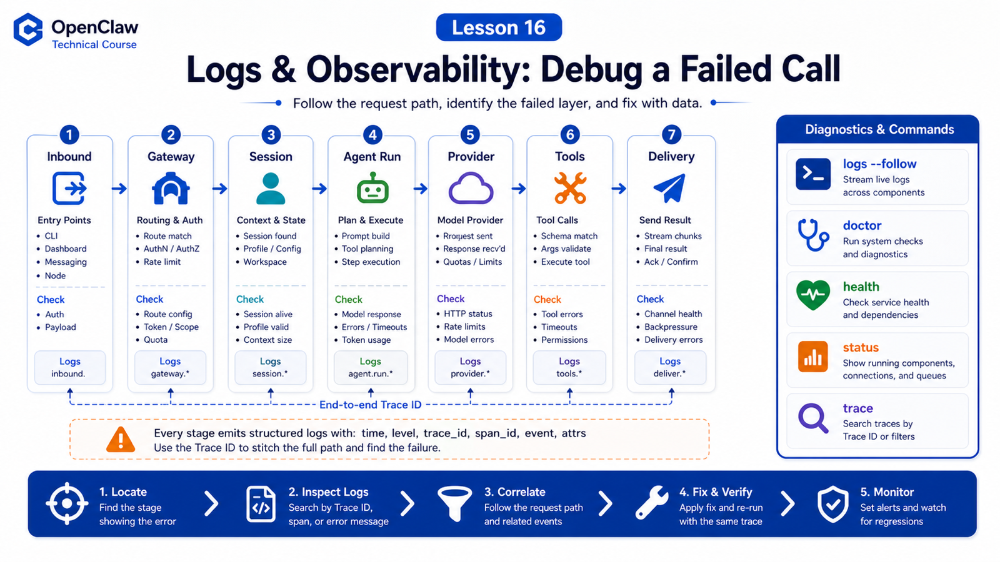

# Logs and Observability: Understanding a Failed Call



When an agent fails, the least useful question is:

```text
Why didn't it reply?
```

Better questions are:

```text
Did the request reach the Gateway?
Was the session routed correctly?
Was a run accepted?
Did the provider request happen?
Did a tool start?
Did failure happen in provider, tool, channel, or delivery?
```

Observability in OpenClaw turns a vague failure into layers you can inspect.

## The Key Idea: Locate the Layer First

Debug a failed call along this path:

```text
inbound message
  ↓
Gateway RPC / channel event
  ↓
Session routing
  ↓
Agent run accepted
  ↓
Context build
  ↓
Provider request
  ↓
Tool calls
  ↓
Final reply
  ↓
Channel delivery
```

Do not start by reading the whole log file. First decide which layer failed, then inspect evidence for that layer.

## Where Logs Live

OpenClaw has two main log surfaces:

```text
Console output
  terminal and Gateway Debug UI

File logs
  JSONL written by the Gateway
```

By default, file logs live under:

```text
/tmp/openclaw/openclaw-YYYY-MM-DD.log
```

Recommended CLI:

```bash
openclaw logs --follow
openclaw logs --follow --json
```

The Control UI Logs tab tails the same Gateway file log.

## Verbose Is Not the Same as Log Level

This is a common trap.

```text
--verbose
  changes console verbosity and WebSocket log style

logging.level
  controls what gets written to file logs
```

To capture debug or trace detail in file logs, configure:

```json
{
  "logging": {
    "level": "debug"
  }
}
```

## Important Clues

Prioritize:

```text
time
level
subsystem
message
agent_id
session_id
channel
request id / run id / task id
error code
duration
```

`session_id` verifies context. `subsystem` points to gateway, channel, model, tool, browser, or sandbox. Duration distinguishes slow from failed.

## Doctor, Health, and Status

Useful commands:

```bash
openclaw doctor
openclaw health
openclaw status
openclaw gateway health
openclaw gateway probe
```

Mental model:

```text
doctor
  config checks, migrations, common repairs

health
  current Gateway health snapshot

status
  local setup, connections, models, channels, usage

probe
  client-side reachability check
```

## Real Scenario: "No Reply"

Debug sequence:

```text
1. openclaw health: is Gateway alive?
2. openclaw logs --follow: did a channel event arrive?
3. search session_id: was routing correct?
4. check accepted: was a run created?
5. inspect provider logs: timeout, 429, auth, unavailable?
6. inspect tool events: approval, sandbox, or policy block?
7. inspect delivery: was final text generated but not sent?
```

Many "no reply" failures are not reasoning failures. They are delivery failures, rate limits, approval stalls, or wrong session routing.

## Common Misunderstandings

### Misunderstanding 1: No Console Output Means No Logs

Not necessarily. File logs and console output are separate surfaces.

### Misunderstanding 2: Verbose Writes More File Logs

Not by itself. File logs are controlled by `logging.level`.

### Misunderstanding 3: Model Error Means Switch Models

First check rate limits, auth profile, timeout, context size, and tool schema size.

### Misunderstanding 4: Final Error Is Enough

Usually not. Agent failures are path failures; inspect the whole route.

## Final Summary

Observability is not about more logs. It is about locating failure by layer.

In one sentence:

```text
Find the failed layer first, then read the matching structured evidence.
```

## Lesson Homework

1. Run `openclaw logs --follow` and watch subsystems during a normal request.
2. Explain `openclaw health` versus `openclaw doctor`.
3. Pick one failed log entry and label session, channel, level, and subsystem.
4. Draw your "user did not receive reply" debug path.

## Next Lesson Preview

Next: Provider abstraction and why OpenClaw can connect to many models.

## References

- OpenClaw Docs: [Logging](https://docs.openclaw.ai/logging)
- OpenClaw Docs: [Gateway logging](https://docs.openclaw.ai/gateway/logging)
- OpenClaw Docs: [Debugging](https://docs.openclaw.ai/help/debugging)
- OpenClaw Docs: [Doctor](https://docs.openclaw.ai/gateway/doctor)
- OpenClaw Docs: [Health checks](https://docs.openclaw.ai/gateway/health)

---

Original link: [Logs and Observability: Understanding a Failed Call](https://en.harries.blog/logs-and-observability-understanding-a-failed-call/)
