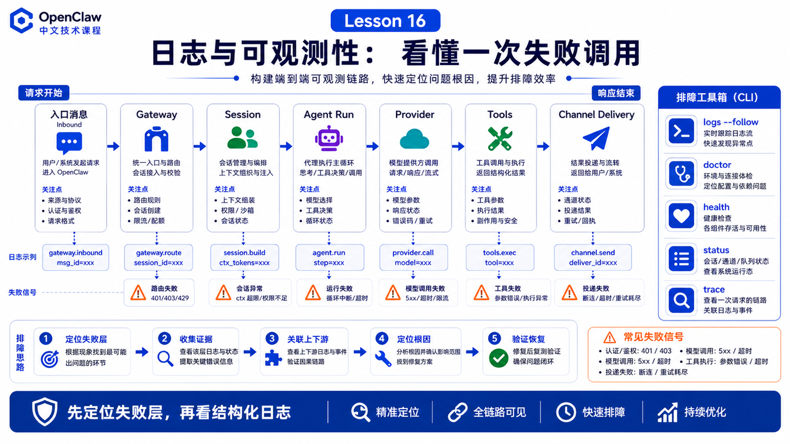

# 日志与可观测性：如何看懂一次失败的调用



Agent 失败时，最没用的问题是：

```text
它为什么没回我？
```

更有效的问题是：

```text
请求有没有进 Gateway？
session 路由对不对？
run 有没有 accepted？
模型调用有没有发出去？
工具有没有启动？
失败发生在 provider、tool、channel，还是消息投递？
```

OpenClaw 的可观测性，就是把一次看似模糊的失败拆成可定位的层。

## 先说结论：先按链路定位，再看日志细节

一次失败可以按这条路径排查：

```text
入口消息
  ↓
Gateway RPC / channel event
  ↓
Session routing
  ↓
Agent run accepted
  ↓
Context build
  ↓
Provider request
  ↓
Tool calls
  ↓
Final reply
  ↓
Channel delivery
```

不要一上来就翻全文日志。先判断失败在哪一层，再看对应证据。

## 日志在哪里

OpenClaw 有两个主要日志表面：

```text
Console output
  终端或 Gateway Debug UI 里看到的输出

File logs
  Gateway 写出的 JSONL 文件
```

默认文件日志在：

```text
/tmp/openclaw/openclaw-YYYY-MM-DD.log
```

推荐用 CLI tail：

```bash
openclaw logs --follow
openclaw logs --follow --json
```

Control UI 的 Logs tab 也会 tail 同一份 Gateway file log。

## 日志级别和 verbose 不一样

这是很多人会踩的坑。

```text
--verbose
  主要影响 console verbosity 和 WebSocket log style

logging.level
  决定 file log 写到什么详细程度
```

如果你想把 debug/trace 级别信息写进文件，应该改：

```json
{
  "logging": {
    "level": "debug"
  }
}
```

而不是只加 `--verbose`。

## 关键线索：id、session、subsystem、level

看日志时优先找这些字段：

```text
time
level
subsystem
message
agent_id
session_id
channel
request id / run id / task id
error code
duration
```

`session_id` 能帮你确认消息有没有进对上下文；`subsystem` 能告诉你是 gateway、channel、model、tool、browser、sandbox 哪一层；duration 能帮你区分“卡住”和“失败”。

## Doctor、Health、Status 的分工

常用排查命令：

```bash
openclaw doctor
openclaw health
openclaw status
openclaw gateway health
openclaw gateway probe
```

可以这样理解：

```text
doctor
  检查配置、迁移、常见错误，并给修复建议

health
  看 Gateway 当前健康快照

status
  看本地配置、连接、模型、通道、使用概况

probe
  从客户端视角确认 Gateway 是否可达
```

## 真实场景：用户说“没回复”

排查顺序可以是：

```text
1. openclaw health：Gateway 是否活着？
2. openclaw logs --follow：有没有收到 channel event？
3. 搜 session_id：是否路由到正确 session？
4. 看 accepted：run 有没有被创建？
5. 看 provider：模型是超时、429、认证失败，还是不可用？
6. 看 tool event：工具是否被 approval、sandbox 或 policy 拦住？
7. 看 delivery：最终回复是否生成但发送失败？
```

很多“没回复”其实不是模型没想出来，而是最终投递失败、channel rate limit、工具 approval 卡住，或者 session 被路由到另一个会话。

## 常见误解

### 误解一：没有终端输出就是没有日志

不一定。文件日志和 console 是两个表面。

### 误解二：verbose 会自动写更多文件日志

不会。文件日志由 `logging.level` 控制。

### 误解三：看到模型报错就一定要换模型

先看是不是 rate limit、auth profile、timeout、context too large 或 tool schema 太大。

### 误解四：只看最终错误就够了

不够。Agent 失败通常是链路问题，要看从入口到投递的完整轨迹。

## 最后总结

可观测性的价值，不是让日志变多，而是让失败可以分层定位。

一句话总结：

```text
先定位失败层，再读取对应日志；先看结构化线索，再看自然语言错误。
```

## 本节作业

1. 运行 `openclaw logs --follow`，观察一条正常请求经过哪些 subsystem。
2. 用 `openclaw health` 和 `openclaw doctor` 分别解释它们解决的问题。
3. 找一条失败日志，标出 session、channel、level、subsystem。
4. 画出“用户没收到回复”的排查链路。

## 下一节预告

下一节讲 Provider 抽象：为什么 OpenClaw 可以接不同模型。

## 参考资料

- OpenClaw Docs：[Logging](https://docs.openclaw.ai/logging)
- OpenClaw Docs：[Gateway logging](https://docs.openclaw.ai/gateway/logging)
- OpenClaw Docs：[Debugging](https://docs.openclaw.ai/help/debugging)
- OpenClaw Docs：[Doctor](https://docs.openclaw.ai/gateway/doctor)
- OpenClaw Docs：[Health checks](https://docs.openclaw.ai/gateway/health)
