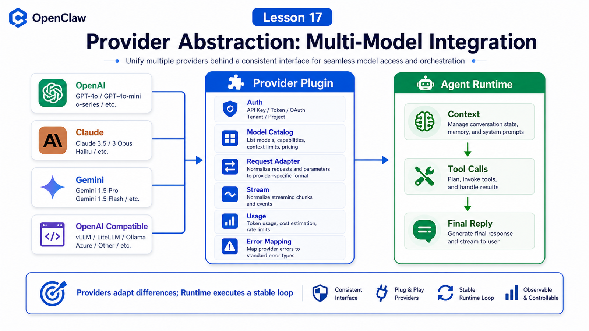

# Provider Abstraction: Why OpenClaw Can Use Different Models



If OpenClaw could only use one model, it would be a client for that model.

Provider abstraction is what makes it a platform.

The question is:

```text
If model APIs differ, how can one OpenClaw agent loop call all of them?
```

## The Key Idea: Providers Contain Model Differences

Providers handle differences such as:

```text
authentication
model catalog
request protocol
tool schema cleanup
stream wrapping
usage reporting
reasoning / thinking parameters
error classification
failover decisions
```

The Agent Runtime should not depend on every provider's raw fields. It should see stable concepts:

```text
messages / context
tool schemas
assistant text
tool call
tool result
usage
finish reason
error
```

A provider plugin translates the external model world into those internal concepts.

## Provider and Model Are Different

OpenClaw model refs usually look like:

```text
provider/model
openai/gpt-5.5
anthropic/claude-opus-4-6
google/gemini-*
```

`provider` is the integration route. `model` is the concrete model under that provider.

This means:

```text
you can change models without changing the agent architecture
```

One provider can also support many models, auth profiles, and fallbacks.

## What Provider Plugins Own

The docs describe provider plugins as owning onboarding, model catalogs, auth env-var mapping, transport/config normalization, tool-schema cleanup, failover classification, OAuth refresh, usage reporting, and reasoning profiles.

Think in four layers:

```text
configuration
  model refs, defaults, context window, max tokens

authentication
  API key, OAuth, CLI reuse, auth profiles

request
  provider-specific payload, stream, transport

recovery
  usage, error, retry, failover, cooldown
```

## Why Not Hard-Code OpenAI, Claude, and Gemini?

Agent systems evolve.

Models change:

```text
API shape
tool call format
context length
pricing
reasoning controls
streaming protocol
```

If these details live inside the agent loop, the core runtime becomes fragile.

Provider abstraction keeps change at the boundary:

```text
external provider changes
  ↓
provider plugin updates
  ↓
agent loop still sees unified events
```

## A Real Scenario

You use:

```text
openai/gpt-5.5
```

Then long-context tasks move to:

```text
google/gemini-*
```

Code review uses:

```text
anthropic/claude-*
```

Gateway, sessions, tool loop, and workspace do not need to be rewritten. Model selection and provider plugins handle the mapping.

## Common Misunderstandings

### Misunderstanding 1: Provider Means API Key

No. API key is only one part of authentication.

### Misunderstanding 2: Providers Have Identical Capabilities

They do not. Tool calls, context, reasoning, streaming, and media capabilities differ.

### Misunderstanding 3: OpenAI Compatible Means OpenAI

Not exactly. The interface may look similar, but capability, errors, usage, and tool details can differ.

## Final Summary

Provider abstraction lets OpenClaw connect different models to one Agent Runtime.

In one sentence:

```text
Providers adapt differences; the runtime executes a stable loop.
```

## Lesson Homework

1. Write three `provider/model` refs.
2. Distinguish Provider, Model, and Auth Profile.
3. List the minimum errors a provider plugin must classify.
4. Explain why tool schema cleanup belongs near the provider boundary.

## Next Lesson Preview

Next: connecting OpenAI, Claude, Gemini, and OpenAI-compatible providers.

## References

- OpenClaw Docs: [Model providers](https://docs.openclaw.ai/concepts/model-providers)
- OpenClaw Docs: [Provider directory](https://docs.openclaw.ai/providers)
- OpenClaw Docs: [Agent runtimes](https://docs.openclaw.ai/concepts/agent-runtimes)
- OpenClaw Docs: [Building provider plugins](https://docs.openclaw.ai/plugins/sdk-provider-plugins)

---

Original link: [Provider Abstraction: Why OpenClaw Can Use Different Models](https://en.harries.blog/provider-abstraction-why-openclaw-can-use-different-models/)
