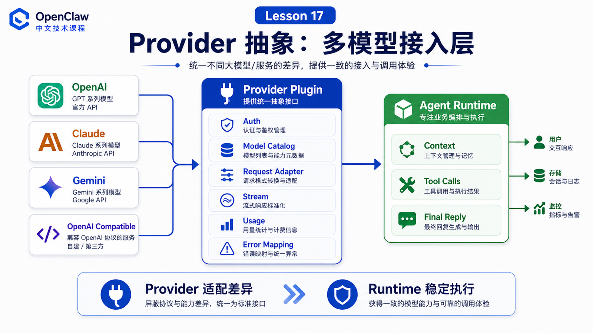

# Provider 抽象：为什么 OpenClaw 可以接不同模型



如果 OpenClaw 只能接一个模型，它就只是某个模型的客户端。

真正让它变成平台的是 Provider 抽象。

Provider 抽象回答的问题是：

```text
不同模型 API 都不一样，OpenClaw 为什么还能用同一套 Agent loop 调它们？
```

## 先说结论：Provider 把模型差异挡在运行时边界外

不同 Provider 负责不同事情：

```text
认证方式
模型目录
请求协议
工具 schema 清理
stream 包装
usage 统计
reasoning / thinking 参数
错误分类
failover 判断
```

Agent Runtime 不应该关心每家 API 的字段细节。它只需要稳定地看到：

```text
messages / context
tool schemas
assistant text
tool call
tool result
usage
finish reason
error
```

Provider plugin 就是把外部模型世界翻译成这些内部概念的层。

## Provider 和 Model 不是一回事

OpenClaw 的模型引用通常长这样：

```text
provider/model
openai/gpt-5.5
anthropic/claude-opus-4-6
google/gemini-*
```

`provider` 是接入方式，`model` 是这个 provider 下的具体模型。

这带来一个好处：

```text
你可以换模型而不换 Agent 架构
```

也可以用同一个 Provider 支持多个模型、多个认证 profile、多个 fallback。

## Provider plugin 负责什么

官方文档说明，多数 Provider 逻辑位于 provider plugins。它们拥有 onboarding、model catalogs、auth env-var mapping、transport/config normalization、tool-schema cleanup、failover classification、OAuth refresh、usage reporting、thinking/reasoning profiles 等职责。

可以把它拆成四层：

```text
配置层
  model ref、默认模型、context window、max tokens

认证层
  API key、OAuth、CLI reuse、auth profiles

请求层
  provider-specific payload、stream、transport

回收层
  usage、error、retry、failover、cooldown
```

## 为什么不能直接写死 OpenAI/Claude/Gemini

因为 Agent 系统需要长期演化。

模型会变：

```text
接口变
工具调用格式变
上下文长度变
计费方式变
reasoning 参数变
流式协议变
```

如果把这些写进 Agent loop，核心运行时会越来越乱。

Provider 抽象让变化停在边界：

```text
外部 provider 改变
  ↓
provider plugin 更新
  ↓
Agent loop 仍然处理统一事件
```

## 一个真实场景

你默认使用：

```text
openai/gpt-5.5
```

后来某些长上下文任务改用：

```text
google/gemini-*
```

某些代码审查改用：

```text
anthropic/claude-*
```

OpenClaw 不需要重写 Gateway、session、tool loop、workspace。它只需要在模型选择和 Provider 插件层完成映射。

## 常见误解

### 误解一：Provider 就是 API key

不是。API key 只是认证的一部分。

### 误解二：所有 Provider 能力完全一样

不一样。工具调用、上下文、reasoning、流式、媒体能力都会有差异。

### 误解三：OpenAI Compatible 就等于 OpenAI

不等于。兼容通常指接口形状类似，但模型能力、错误、usage、工具细节可能不同。

## 最后总结

Provider 抽象让 OpenClaw 把不同模型接入同一个 Agent Runtime。

一句话总结：

```text
Provider 负责适配差异，Runtime 负责稳定执行。
```

## 本节作业

1. 写出三个 `provider/model` 形式的模型引用。
2. 区分 Provider、Model、Auth Profile。
3. 思考一个 Provider 插件最少需要处理哪些错误。
4. 解释为什么工具 schema 清理应该放在 Provider 边界附近。

## 下一节预告

下一节讲 OpenAI、Claude、Gemini 与 OpenAI Compatible 的接入方式。

## 参考资料

- OpenClaw Docs：[Model providers](https://docs.openclaw.ai/concepts/model-providers)
- OpenClaw Docs：[Provider directory](https://docs.openclaw.ai/providers)
- OpenClaw Docs：[Agent runtimes](https://docs.openclaw.ai/concepts/agent-runtimes)
- OpenClaw Docs：[Building provider plugins](https://docs.openclaw.ai/plugins/sdk-provider-plugins)
