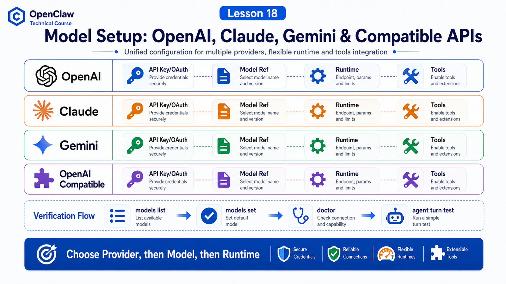

# Connecting OpenAI, Claude, Gemini, and OpenAI-Compatible Providers



Provider abstraction is only the first step. In real setup, you usually meet four routes:

```text
OpenAI
Anthropic Claude
Google Gemini
OpenAI Compatible
```

They all look like "add a key and pick a model", but runtime, auth, and capability boundaries differ.

## The Key Idea: Provider, Model, Then Runtime

Use this order:

```text
1. provider: which integration route?
2. model: which concrete model under that route?
3. runtime: OpenClaw runtime, Codex harness, Claude CLI, or something else?
```

Do not look only at the model name.

The same `openai/...` ref can run through Codex harness by default or through OpenClaw runtime when runtime policy selects it.

## OpenAI

Common routes:

```text
API key
  OPENAI_API_KEY

Codex / subscription style
  openai-codex auth or Codex harness
```

The docs note that `openai/<model>` can use the native Codex app-server harness for agent turns by default. If provider/model runtime policy explicitly selects `openclaw`, it uses the built-in OpenClaw runtime.

So model ref and execution runtime are separate dimensions.

## Claude

Anthropic usually uses:

```text
ANTHROPIC_API_KEY
anthropic/claude-*
```

It may also use Claude CLI reuse or setup-token paths. The docs recommend keeping canonical model refs such as `anthropic/claude-*`, then selecting `claude-cli` through runtime policy rather than encoding the runtime into the model name.

Principle:

```text
which model
  and
which runtime executes the agent turn
```

are separate.

## Gemini

Google Provider supports Gemini-related capabilities. Auth may come from API key or OAuth, and capabilities may include media understanding, search, image generation, and more depending on plugin/provider support.

Check:

```text
GOOGLE_API_KEY or OAuth
model catalog availability
tool-call support
context window and max tokens
```

## OpenAI Compatible

OpenAI-compatible routes are useful for:

```text
OpenRouter
LiteLLM
vLLM
SGLang
LM Studio
self-hosted OpenAI-compatible endpoints
```

But compatible means the protocol shape is similar, not that capabilities are identical.

Verify:

```text
base URL
API key
model id
tool calling
streaming
context window
error shape
usage reporting
```

## Verification After Setup

Useful commands:

```bash
openclaw models list
openclaw models status
openclaw models set <provider/model>
openclaw onboard
openclaw doctor
```

Do not only verify "the key works". Verify:

```text
agent turn starts
tools work
streaming works
context window is recognized
fallback behaves as expected
```

## Common Misunderstandings

### Misunderstanding 1: Adding Provider Auth Switches the Primary Model

The docs say adding or reauthing a provider usually preserves the current primary model unless you explicitly set a default.

### Misunderstanding 2: OpenAI Compatible Always Supports Tools

Not necessarily. Test it.

### Misunderstanding 3: Model Ref Determines Everything

Not always. OpenClaw separates provider/model from agent runtime.

## Final Summary

Model setup is more than adding a key.

In one sentence:

```text
Confirm provider, model, runtime, and tool capability before trusting a setup.
```

## Lesson Homework

1. Inspect your current default model with `openclaw models status`.
2. List auth sources for OpenAI, Anthropic, and Google.
3. Explain why OpenAI-compatible endpoints still need tool-call testing.
4. Run `openclaw doctor` and note any model migration hints.

## Next Lesson Preview

Next: choosing models by speed, cost, context length, and tool capability.

## References

- OpenClaw Docs: [OpenAI](https://docs.openclaw.ai/providers/openai)
- OpenClaw Docs: [Anthropic](https://docs.openclaw.ai/providers/anthropic)
- OpenClaw Docs: [Google Gemini](https://docs.openclaw.ai/providers/google)
- OpenClaw Docs: [Local models](https://docs.openclaw.ai/gateway/local-models)
- OpenClaw Docs: [Model providers](https://docs.openclaw.ai/concepts/model-providers)
