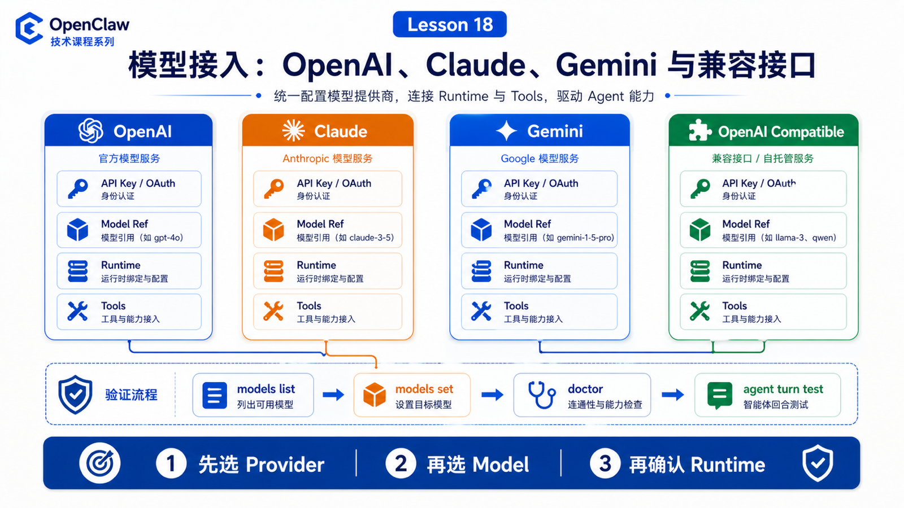

# OpenAI、Claude、Gemini 与 OpenAI Compatible 接入方式



知道 Provider 抽象还不够。真正配置时，你会遇到四类常见路线：

```text
OpenAI
Anthropic Claude
Google Gemini
OpenAI Compatible
```

它们看起来都是“填 key、选 model”，但背后的 runtime、auth、能力边界并不完全一样。

## 先说结论：先选 provider，再选模型，再确认 runtime

接入模型时按三步走：

```text
1. provider：我要走哪条模型接入路线？
2. model：这条路线下选哪个具体模型？
3. runtime：这个模型由 OpenClaw runtime、Codex harness、Claude CLI，还是其他 runtime 执行？
```

不要只看模型名。

同样的 `openai/...` 在不同 runtime policy 下，可能走 Codex harness，也可能走 OpenClaw 内置 runtime。

## OpenAI 接入

OpenAI 常见两条路线：

```text
API key
  OPENAI_API_KEY

Codex / subscription style
  openai-codex auth 或 Codex harness
```

官方文档特别提醒：`openai/<model>` 默认可通过 native Codex app-server harness 运行 agent turns；如果 provider/model runtime policy 显式选择 `openclaw`，则走 OpenClaw 内置 runtime。

这说明模型 ref 和执行 runtime 要分开看。

## Claude 接入

Anthropic Provider 通常使用：

```text
ANTHROPIC_API_KEY
anthropic/claude-*
```

也可以通过 Claude CLI reuse / setup token 等路径。官方文档建议保持 canonical model ref，例如 `anthropic/claude-*`，再通过 runtime policy 选择 `claude-cli`，而不是把旧的 CLI runtime 写进模型名。

这体现了一个原则：

```text
模型是谁
  和
谁来执行这次 agent turn
```

是两个维度。

## Gemini 接入

Google Provider 支持 Gemini 相关能力。认证可能来自 API key 或 OAuth，具体能力还可能涉及媒体理解、搜索、图片生成等 provider/plugin 能力。

接入时重点看：

```text
GOOGLE_API_KEY 或 OAuth 是否可用
模型是否在 catalog 中
当前 runtime 是否支持工具调用
context window 和 max tokens 设置是否合理
```

## OpenAI Compatible 接入

OpenAI Compatible 是一类非常实用的路线。

它适合：

```text
OpenRouter
LiteLLM
vLLM
SGLang
LM Studio
自建 OpenAI-compatible endpoint
```

但要记住：compatible 通常意味着协议相似，不意味着能力完全相同。

你要额外确认：

```text
base URL
API key
model id
tool calling 支持
streaming 支持
context window
错误格式
usage 返回
```

## 配置后的验证

常用命令：

```bash
openclaw models list
openclaw models status
openclaw models set <provider/model>
openclaw onboard
openclaw doctor
```

不要只验证“key 能不能用”。还要验证：

```text
能否发起 agent turn
能否使用工具
能否正常 stream
context window 是否被正确识别
fallback 是否按预期工作
```

## 常见误解

### 误解一：加了 provider auth 就会自动切主模型

官方文档说明，添加或重新认证 provider 通常不会替换已有 primary model，除非你显式 `models set` 或使用 `--set-default`。

### 误解二：OpenAI Compatible 一定支持工具调用

不一定。要实际验证。

### 误解三：模型 ref 就决定全部 runtime

不总是。OpenClaw 将 provider/model 和 agentRuntime 分开处理。

## 最后总结

模型接入不是“填 key”这么简单。

一句话总结：

```text
先确认 provider，再确认 model，再确认 runtime 和工具能力。
```

## 本节作业

1. 查出当前默认模型：`openclaw models status`。
2. 写出 OpenAI、Anthropic、Google 三种 provider 的认证来源。
3. 解释 OpenAI Compatible 为什么还需要验证工具调用。
4. 用 `openclaw doctor` 检查模型配置是否有迁移或错误提示。

## 下一节预告

下一节讲模型选择：速度、成本、上下文长度和工具能力如何取舍。

## 参考资料

- OpenClaw Docs：[OpenAI](https://docs.openclaw.ai/providers/openai)
- OpenClaw Docs：[Anthropic](https://docs.openclaw.ai/providers/anthropic)
- OpenClaw Docs：[Google Gemini](https://docs.openclaw.ai/providers/google)
- OpenClaw Docs：[Local models](https://docs.openclaw.ai/gateway/local-models)
- OpenClaw Docs：[Model providers](https://docs.openclaw.ai/concepts/model-providers)
