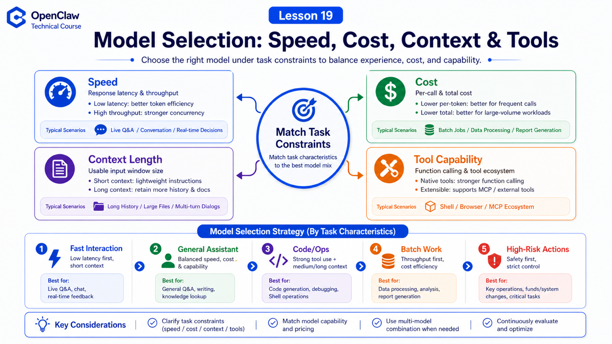

# Model Selection: Speed, Cost, Context Length, and Tool Capability



Choosing a model is not a leaderboard game.

In OpenClaw, the model does real work: reads context, calls tools, waits for results, revises plans, and sends a final reply.

So do not only ask:

```text
Which model is strongest?
```

Ask:

```text
How fast must this be?
What cost is acceptable?
How much context is needed?
Are tool calls stable?
Is there a fallback?
```

## The Key Idea: Match the Task Constraints

Start with four dimensions:

```text
speed
  is the user waiting live?

cost
  is this high-volume or scheduled work?

context length
  does it need long history, files, or many schemas?

tool capability
  does it need shell, browser, MCP, or plugin tools?
```

There is no universal best model. There is a better fit for the task.

## Speed

For messaging, CLI, and dashboard interactions, latency is visible.

Low-latency models are good for:

```text
short rewrites
error explanations
quick classification
small command generation
status Q&A
```

If the task opens a browser, runs scripts, or reads files, tool time is part of total latency too.

## Cost

Scheduled jobs, batch analysis, and long log summaries can multiply token usage.

Practical split:

```text
low-risk classification → small model
structured extraction → cheap but stable model
complex planning / code edits → stronger model
final review → optional strong-model check
```

Usage tracking, token reports, and `/usage tokens` help you measure real cost.

## Context

Large context is useful, but not free:

```text
slower requests
higher cost
more irrelevant material
more noise for the model
```

OpenClaw context includes system prompt, conversation history, tool results, attachments, compaction summaries, and tool schemas.

So context window and context engineering must be considered together.

## Tool Capability

For OpenClaw, tool ability is often more important than chat quality.

Check:

```text
tool-call support
stable argument generation
long tool-result handling
recovery after tool failure
loop tendency
media input support
```

A model can be good at chat and still weak inside a tool loop.

## Suggested Strategy

Split by task:

```text
fast interaction
  low latency, short context, few tools

general assistant
  balanced model, normal tools, medium context

code / ops / browser automation
  strong tool calling, longer context, higher reasoning

batch background work
  cost-first, with optional strong-model audits

high-risk actions
  strong model + approval + human confirmation
```

## Common Misunderstandings

### Misunderstanding 1: Biggest Context Is Always Best

No. You still need high-quality context.

### Misunderstanding 2: Cheap Models Only Chat

No. Many extraction and classification tasks are perfect for cheaper models.

### Misunderstanding 3: Tool Ability Comes Only From OpenClaw

No. OpenClaw provides the protocol and execution layer, but the model must choose tools and fill arguments well.

## Final Summary

Model choice is task engineering, not brand preference.

In one sentence:

```text
Choose by task constraints, then test the real tool path before making it default.
```

## Lesson Homework

1. Choose model strategies for browser automation, log classification, and code repair.
2. Run `/context list` and inspect context pressure.
3. Use `/usage tokens` to estimate a batch task.
4. Record one real tool-call failure and identify whether it was model or tool layer.

## Next Lesson Preview

Next: context assembly, including files, history, instructions, and tool schemas.

## References

- OpenClaw Docs: [Context](https://docs.openclaw.ai/concepts/context)
- OpenClaw Docs: [Models CLI](https://docs.openclaw.ai/concepts/models)
- OpenClaw Docs: [Token use and costs](https://docs.openclaw.ai/reference/token-use)
- OpenClaw Docs: [Usage tracking](https://docs.openclaw.ai/concepts/usage-tracking)
