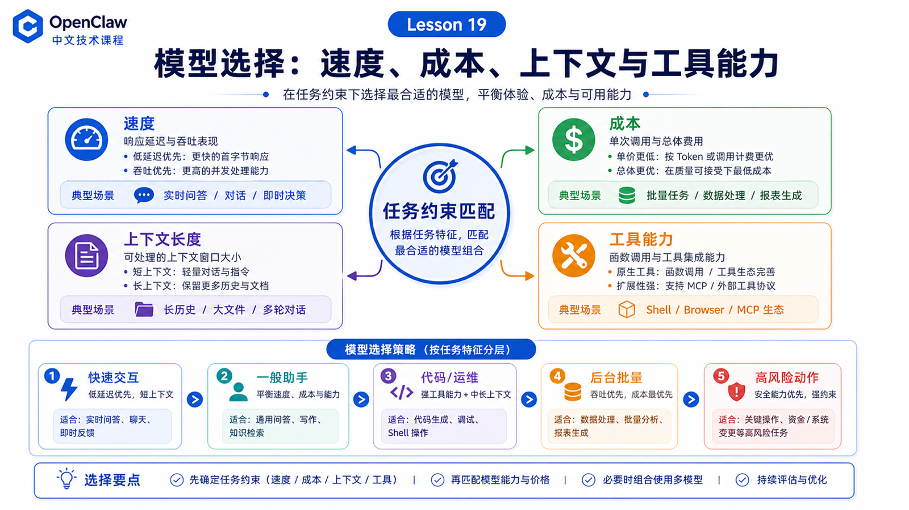

# 模型选择：速度、成本、上下文长度和工具能力



选模型不是排行榜游戏。

在 OpenClaw 里，模型要参与真实任务：读上下文、调用工具、等待结果、修正计划、把最终回复发回用户。

所以你不能只问：

```text
哪个模型最强？
```

你应该问：

```text
这个任务需要多快？
能接受多少成本？
需要多长上下文？
工具调用稳不稳？
失败后有没有 fallback？
```

## 先说结论：模型选择是任务约束匹配

可以用四个维度做第一轮选择：

```text
速度
  用户是否在等实时回复？

成本
  是否高频、批量、后台任务？

上下文长度
  是否要读长历史、大文件、多工具 schema？

工具能力
  是否要稳定调用 shell、browser、MCP、plugin tools？
```

没有全场景最优模型。只有更适合当前任务的模型。

## 速度：交互任务优先低延迟

消息平台、CLI、Dashboard 交互里，用户很容易感知延迟。

适合低延迟模型的任务：

```text
改写一句话
解释一个错误
快速分类
短命令生成
状态问答
```

如果任务要打开浏览器、执行脚本、读文件，模型本身速度只是总耗时的一部分。工具时间也要算进去。

## 成本：后台任务别默认用最贵模型

定时任务、批量分析、长日志总结，很容易把 token 用量放大。

建议：

```text
低风险分类 → 小模型
结构化提取 → 便宜但稳定的模型
复杂规划 / 代码修改 → 强模型
最终审核 → 可选强模型二次检查
```

OpenClaw 的 usage tracking、token use 和 `/usage tokens` 可以帮你观察真实成本。

## 上下文：不是窗口越大越好

大上下文很有用，但也有代价：

```text
请求更慢
成本更高
无关信息更多
模型更容易被噪声影响
```

OpenClaw 的 context 文档提醒：context 包括系统提示词、会话历史、工具调用结果、附件、compaction summary、tool schemas 等。

所以模型窗口要和上下文工程一起看。

## 工具能力：Agent 任务的关键指标

对 OpenClaw 来说，工具能力比纯聊天分数更重要。

要看：

```text
是否支持 tool calls
工具参数是否稳定
能不能处理长 tool result
遇到工具失败是否会修正
是否容易重复调用同一个工具
是否支持需要的媒体输入
```

同一个模型在聊天里很好，不代表在工具循环里稳定。

## 推荐选择策略

可以按任务分层：

```text
快速交互
  低延迟模型，短上下文，少工具

一般助手
  平衡模型，常规工具，适中上下文

代码 / 运维 / 浏览器自动化
  强工具调用模型，较长上下文，较高 reasoning

批量后台
  成本优先，必要时强模型抽检

高风险动作
  强模型 + 明确 approval + 人工确认
```

## 常见误解

### 误解一：最大上下文模型一定最好

不一定。你还需要控制上下文质量。

### 误解二：便宜模型只能做简单聊天

不一定。很多结构化、分类、提取任务很适合便宜模型。

### 误解三：工具能力只由 OpenClaw 决定

不是。OpenClaw 提供工具协议和执行层，模型本身也要会正确选择工具和填参数。

## 最后总结

模型选择是任务工程，不是品牌偏好。

一句话总结：

```text
先看任务约束，再选模型；先测真实工具链路，再决定默认配置。
```

## 本节作业

1. 给“浏览器自动化”“日志分类”“代码修复”分别选一个模型策略。
2. 用 `/context list` 观察一次 run 的上下文压力。
3. 用 `/usage tokens` 估算一个批量任务成本。
4. 记录一个模型在工具调用中失败的具体原因。

## 下一节预告

下一节讲上下文组装：文件、历史消息、指令和工具 schema 如何进入模型。

## 参考资料

- OpenClaw Docs：[Context](https://docs.openclaw.ai/concepts/context)
- OpenClaw Docs：[Models CLI](https://docs.openclaw.ai/concepts/models)
- OpenClaw Docs：[Token use and costs](https://docs.openclaw.ai/reference/token-use)
- OpenClaw Docs：[Usage tracking](https://docs.openclaw.ai/concepts/usage-tracking)
