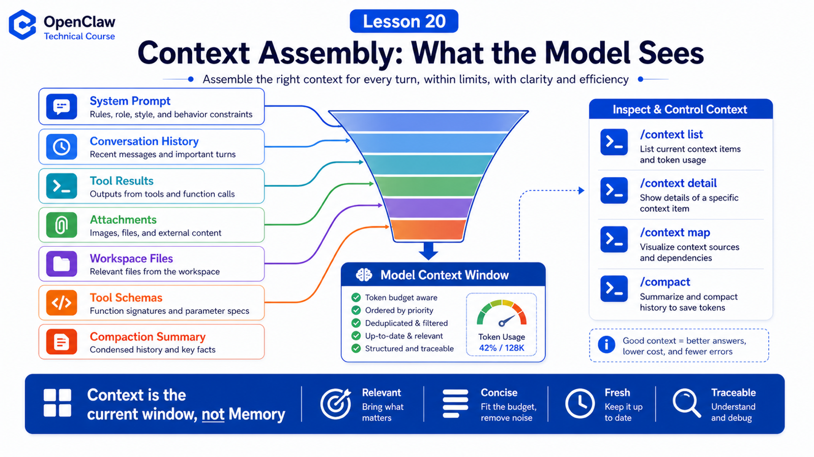

# Context Assembly: Files, History, Instructions, and Tool Schemas



Many agent problems are not caused by a weak model. They come from bad context assembly.

The model acts on what it currently sees.

The OpenClaw context docs define context clearly:

```text
Context is everything OpenClaw sends to the model for a run.
```

## The Key Idea: Context Is Not Memory

Context includes:

```text
System prompt
Conversation history
Tool calls and results
Attachments
Compaction summaries
Injected workspace files
Tool schemas
```

Memory may live on disk and be retrieved later.

Context is what enters the model window now.

## System Prompt Is Rebuilt Each Run

OpenClaw owns and rebuilds the system prompt for each run. It usually includes:

```text
tool list
skills list
workspace location
time and runtime metadata
Project Context injected files
```

It is not just text appended by the user. It is assembled from several runtime sources.

## Project Context

OpenClaw injects workspace bootstrap files such as:

```text
AGENTS.md
SOUL.md
TOOLS.md
IDENTITY.md
USER.md
HEARTBEAT.md
BOOTSTRAP.md
```

Large files are truncated. `/context list` shows raw size, injected size, and truncation status.

Write these files carefully:

```text
clear rules
accurate paths
no huge logs
no full chat history as permanent context
```

## Tools Have Two Context Costs

Tools cost context in two ways:

```text
tool list text
  appears in system prompt so the model knows capabilities

tool JSON schemas
  sent to the model so it can call tools correctly
```

Many people inspect chat history but forget tool schemas. A large tool catalog can consume context before the model starts answering.

## History, Compaction, Pruning

Conversation history enters context, but it cannot grow forever.

OpenClaw uses:

```text
compaction
  summarize old history into a compact entry

pruning
  remove old tool results from current prompt without rewriting disk transcript
```

So "it used to know this" may mean the information did not enter current context.

## Inspecting Context

Useful commands:

```text
/status
/context list
/context detail
/context map
/usage tokens
/compact
```

Check:

```text
system prompt size
injected workspace files
truncated files
tool schema size
history size
window pressure
```

## Common Misunderstandings

### Misunderstanding 1: Memory Equals Context

No. Memory is stored or retrievable; context is the current model window.

### Misunderstanding 2: More Files Is Better

Not always. Irrelevant information dilutes the prompt.

### Misunderstanding 3: More Tools Always Means More Power

More tools also mean more schema cost and higher accidental-use risk.

## Final Summary

Context engineering decides what the model sees.

In one sentence:

```text
Agent behavior = model capability + current context + available tools + permission boundaries.
```

## Lesson Homework

1. Run `/context detail` in one session.
2. Identify the three biggest context contributors.
3. Check whether `TOOLS.md` is too long.
4. Run `/compact` and observe window pressure.

## Next Lesson Preview

Next: tool call protocol and how models decide which tool to call.

## References

- OpenClaw Docs: [Context](https://docs.openclaw.ai/concepts/context)
- OpenClaw Docs: [Context engine](https://docs.openclaw.ai/concepts/context-engine)
- OpenClaw Docs: [System prompt](https://docs.openclaw.ai/concepts/system-prompt)
- OpenClaw Docs: [Compaction](https://docs.openclaw.ai/concepts/compaction)
- OpenClaw Docs: [Session pruning](https://docs.openclaw.ai/concepts/session-pruning)
