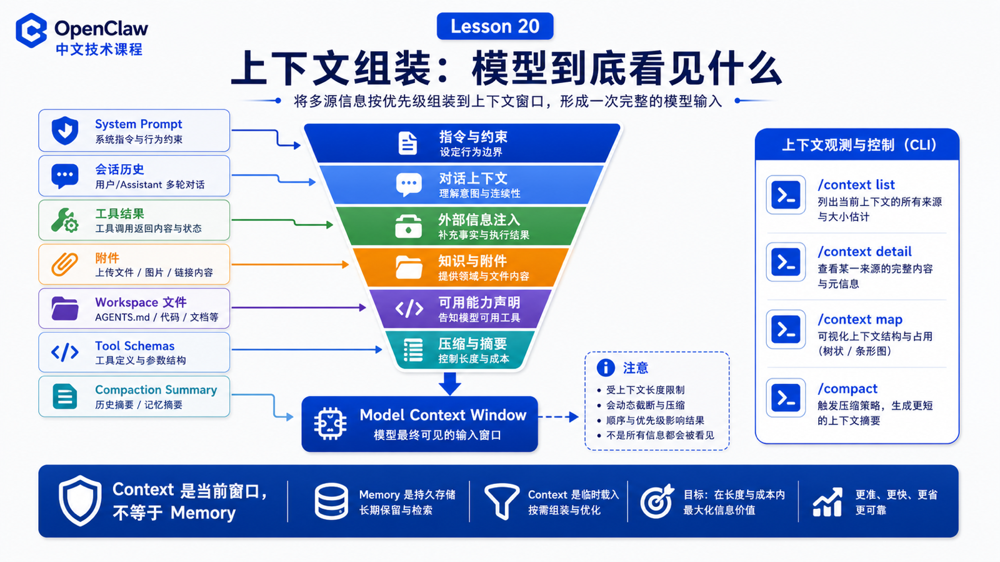

# 上下文组装：文件、历史消息、指令和工具 schema



很多 Agent 问题其实不是“模型不聪明”，而是上下文组装出了问题。

模型只会基于它当前看到的内容行动。

OpenClaw 的 context 文档给了一个清晰定义：

```text
Context 是一次 run 中 OpenClaw 发送给模型的所有内容。
```

## 先说结论：上下文不是记忆，而是当前窗口

Context 包括：

```text
System prompt
Conversation history
Tool calls and results
Attachments
Compaction summaries
Injected workspace files
Tool schemas
```

Memory 可以存在磁盘上，之后再被检索。

Context 是本次请求进入模型窗口的内容。

## System Prompt：每次 run 重新构建

OpenClaw 的 system prompt 由系统拥有并在每次 run 重新构建，通常包含：

```text
工具列表
skills 列表
workspace 位置
时间和 runtime metadata
Project Context 注入文件
```

它不是用户随便追加的一段文本，而是运行时把多个来源整理后的结果。

## Project Context：workspace 文件注入

默认会注入一组 workspace bootstrap 文件，例如：

```text
AGENTS.md
SOUL.md
TOOLS.md
IDENTITY.md
USER.md
HEARTBEAT.md
BOOTSTRAP.md
```

大文件会被截断。`/context list` 会显示 raw size、injected size 和是否 truncated。

所以写这些文件时要克制：

```text
规则写清楚
路径写准确
不要塞大段日志
不要把历史聊天当常驻上下文
```

## Tools：有两种上下文成本

工具会产生两类成本：

```text
工具列表文本
  出现在 system prompt 中，帮助模型知道有哪些能力

工具 JSON schema
  发送给模型以便正确调用工具
```

很多人只看聊天历史，却忽略 tool schemas。工具越多，schema 可能越大，模型还没开始思考就已经消耗了一部分窗口。

## History、Compaction、Pruning

会话历史会进入上下文，但不能无限增长。

OpenClaw 通过：

```text
compaction
  把旧历史总结成压缩条目

pruning
  从当前 prompt 中移除老旧工具结果，但不改写磁盘 transcript
```

来保持窗口可用。

这也是为什么“它以前知道，现在忘了”不一定是 bug：可能是信息没有进入当前 context。

## 如何检查上下文

常用命令：

```text
/status
/context list
/context detail
/context map
/usage tokens
/compact
```

排查时看：

```text
system prompt 多大？
哪些 workspace 文件被注入？
是否有文件被截断？
工具 schema 占多少？
历史消息占多少？
上下文是否接近窗口上限？
```

## 常见误解

### 误解一：memory 等于 context

不是。memory 是可存储可检索的信息，context 是当前发送给模型的窗口。

### 误解二：把文件全塞进去更好

不一定。无关信息会稀释重点。

### 误解三：工具越多越强

工具多也意味着 schema 成本更高、误调用概率更高。

## 最后总结

上下文工程决定模型“看见什么”。

一句话总结：

```text
Agent 行为 = 模型能力 + 当前上下文 + 工具可用性 + 权限边界。
```

## 本节作业

1. 对一个 session 运行 `/context detail`。
2. 找出最大的三个上下文贡献者。
3. 检查 `TOOLS.md` 是否过长。
4. 手动执行一次 `/compact`，观察窗口变化。

## 下一节预告

下一节讲工具调用协议：模型如何决定调用哪个工具。

## 参考资料

- OpenClaw Docs：[Context](https://docs.openclaw.ai/concepts/context)
- OpenClaw Docs：[Context engine](https://docs.openclaw.ai/concepts/context-engine)
- OpenClaw Docs：[System prompt](https://docs.openclaw.ai/concepts/system-prompt)
- OpenClaw Docs：[Compaction](https://docs.openclaw.ai/concepts/compaction)
- OpenClaw Docs：[Session pruning](https://docs.openclaw.ai/concepts/session-pruning)
