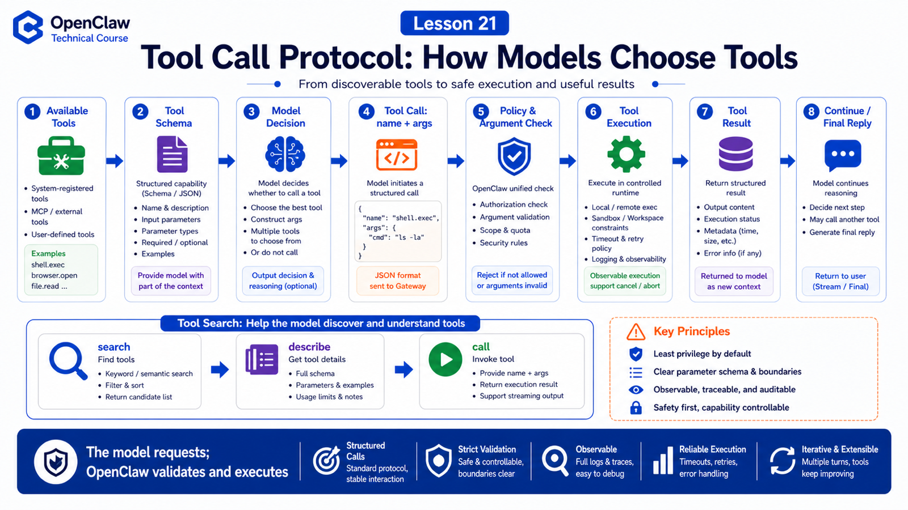

# Tool Call Protocol: How Models Decide Which Tool to Use



An agent can act not because the model has hands.

It acts because OpenClaw exposes tool capabilities as schemas and protocol, then executes the model's tool-call requests in the real runtime.

## The Key Idea: Tool Calls Are Protocol Cooperation

A tool call looks like:

```text
OpenClaw selects available tools
  ↓
tool descriptions and schemas enter model context
  ↓
model decides whether to call a tool
  ↓
model emits tool name + arguments
  ↓
OpenClaw validates arguments and permissions
  ↓
tool executes
  ↓
tool result returns to model
  ↓
model continues or finalizes
```

The model proposes. OpenClaw executes.

## What Tool Schemas Do

A tool schema tells the model:

```text
tool name
what problem it solves
required arguments
argument types
required fields
result shape
```

Vague schemas lead to wrong arguments.

Too many tools increase accidental selection.

## Available Tools Are Not All Installed Tools

The effective tool set is filtered by:

```text
agent policy
profile / session settings
sandbox mode
plugin enabled state
MCP availability
client-provided tools
permission boundary
```

An installed tool is not necessarily visible to this run.

## Tool Search for Large Catalogs

When there are many tools, sending every schema is expensive.

OpenClaw Tool Search changes the shape:

```text
model searches tools
then describes one tool
then calls the selected tool
```

The model does not need every full schema up front. This helps with large MCP, plugin, and client tool catalogs.

## When Tool Calls Fail

Failures may come from:

```text
bad arguments
permission denied
approval rejected
sandbox cannot see file
network timeout
external service failure
oversized result
repeated tool loop
```

OpenClaw returns failure information so the model can recover, but permission and safety failures should not be bypassed by persuasion.

## A Real Scenario

User asks:

```text
Open the admin dashboard, export yesterday's data, and summarize anomalies.
```

The model may choose:

```text
browser.open
browser.click
browser.snapshot
file.read
spreadsheet analyze
message.send
```

Each step is a real tool call with arguments, execution result, and follow-up reasoning.

## Common Misunderstandings

### Misunderstanding 1: The Model Executes Tools Directly

No. The model emits requests; OpenClaw validates and executes.

### Misunderstanding 2: More Tools Is Always Better

No. More tools increase context cost and wrong-tool risk.

### Misunderstanding 3: Tool Failure Means Model Failure

Not always. It may be policy, sandbox, external service, or schema design.

## Final Summary

Tool calls turn "can speak" into "can act", but the mechanism is protocol cooperation.

In one sentence:

```text
The model selects tools; OpenClaw validates, executes, and returns results for further reasoning.
```

## Lesson Homework

1. Pick one tool and write its name, description, and parameters.
2. Explain installed tools versus tools visible in this run.
3. Explain why large MCP catalogs benefit from Tool Search.
4. Analyze one failed tool call and identify the failed layer.

## Next Lesson Preview

Next: model failover, retries, and error handling.

## References

- OpenClaw Docs: [Tools overview](https://docs.openclaw.ai/tools)
- OpenClaw Docs: [Tool Search](https://docs.openclaw.ai/tools/tool-search)
- OpenClaw Docs: [Tool plugins](https://docs.openclaw.ai/plugins/tool-plugins)
- OpenClaw Docs: [Tools invoke API](https://docs.openclaw.ai/gateway/tools-invoke-http-api)
- OpenClaw Docs: [Exec approvals](https://docs.openclaw.ai/tools/exec-approvals)

---

Original link: [Tool Call Protocol: How Models Decide Which Tool to Use](https://en.harries.blog/tool-call-protocol-how-models-decide-which-tool-to-use/)
