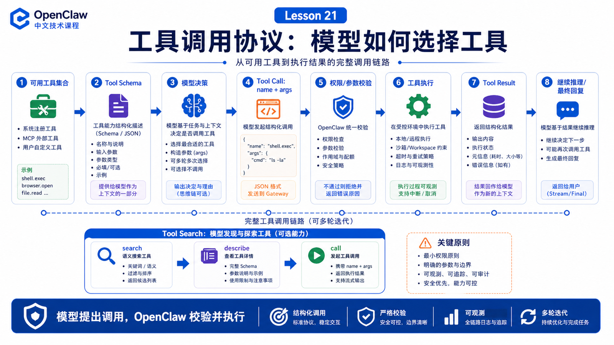

# 工具调用协议：模型如何决定调用哪个工具



Agent 会做事，不是因为模型“有手”。

它能做事，是因为 OpenClaw 把工具能力以 schema 和协议的形式交给模型，再把模型的工具调用请求送到真实执行层。

## 先说结论：工具调用是一次协议协作

一次工具调用大致是：

```text
OpenClaw 选择可用工具
  ↓
把工具说明和 schema 放进模型上下文
  ↓
模型决定是否调用工具
  ↓
模型生成 tool name + arguments
  ↓
OpenClaw 校验参数和权限
  ↓
执行工具
  ↓
把 tool result 返回给模型
  ↓
模型继续推理或给最终答案
```

模型只提出调用意图；OpenClaw 才真正执行。

## 工具 schema 的作用

工具 schema 告诉模型：

```text
工具叫什么
解决什么问题
需要哪些参数
参数类型是什么
哪些字段必填
返回什么结果
```

如果 schema 含糊，模型就容易填错参数。

如果工具太多，模型就容易选错工具。

## 可用工具不是全部工具

每次 run 的工具集合会经过过滤：

```text
agent policy
profile / session setting
sandbox mode
plugin enabled state
MCP availability
client-provided tools
permission boundary
```

所以“系统安装了某个工具”不等于“这个 run 里模型能看到它”。

## Tool Search：大工具目录的解决思路

当工具很多时，直接把所有 schema 发给模型会很贵。

OpenClaw 的 Tool Search 提供另一种形态：

```text
模型先 search 工具
再 describe 目标工具
最后 call 选中的工具
```

这样模型不需要一开始看到所有完整 schema。适合大型 MCP、插件、客户端工具目录。

## 工具调用失败怎么办

工具失败可能来自：

```text
参数错误
权限不足
approval 未通过
sandbox 看不到文件
网络超时
外部服务失败
工具返回太大
模型重复调用
```

OpenClaw 要把失败结果返回给模型，让模型有机会修正；但权限和安全错误不应该被模型“说服”绕过。

## 一个真实场景

用户说：

```text
打开后台，导出昨天的数据，然后总结异常。
```

模型可能选择：

```text
browser.open
browser.click
browser.snapshot
file.read
spreadsheet analyze
message.send
```

每一步都不是自然语言幻想，而是具体 tool call、参数、执行结果和后续推理组成的链。

## 常见误解

### 误解一：模型可以直接执行工具

不可以。模型只生成调用请求，OpenClaw 执行并返回结果。

### 误解二：工具越多越好

不一定。工具太多会增加上下文成本和误选概率。

### 误解三：工具失败就是模型失败

不一定。可能是权限、sandbox、外部服务或参数 schema 问题。

## 最后总结

工具调用让模型从“会说”变成“能做”，但它本质是协议协作。

一句话总结：

```text
模型选择工具，OpenClaw 校验和执行，结果再回到模型继续推理。
```

## 本节作业

1. 选一个工具，写出它需要的 name、description、parameters。
2. 解释“已安装工具”和“本次 run 可用工具”的区别。
3. 思考大型 MCP 目录为什么需要 Tool Search。
4. 找一次工具失败，判断失败来源在哪一层。

## 下一节预告

下一节讲模型降级、重试和错误处理策略。

## 参考资料

- OpenClaw Docs：[Tools overview](https://docs.openclaw.ai/tools)
- OpenClaw Docs：[Tool Search](https://docs.openclaw.ai/tools/tool-search)
- OpenClaw Docs：[Tool plugins](https://docs.openclaw.ai/plugins/tool-plugins)
- OpenClaw Docs：[Tools invoke API](https://docs.openclaw.ai/gateway/tools-invoke-http-api)
- OpenClaw Docs：[Exec approvals](https://docs.openclaw.ai/tools/exec-approvals)
