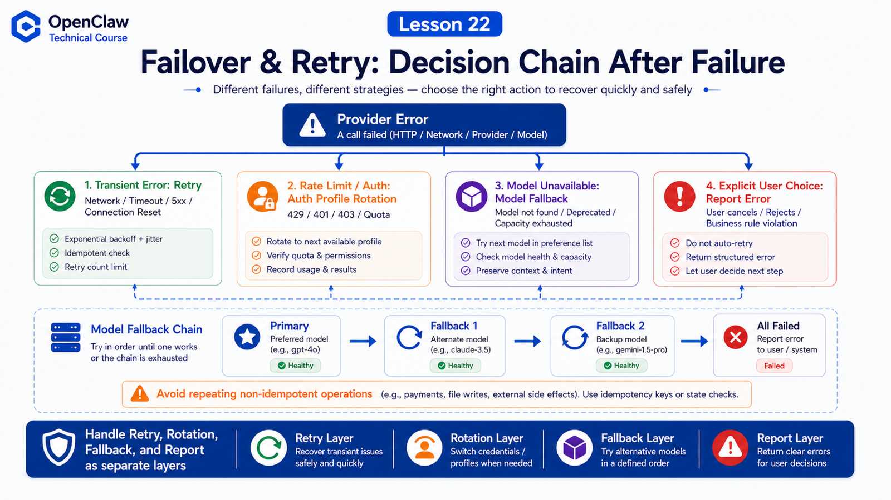

# Model Failover, Retries, and Error Handling



In real systems, model calls fail.

Possible causes:

```text
429 rate limit
expired auth
provider timeout
temporary model outage
context too large
network instability
oversized tool result
```

OpenClaw does not try to make failure impossible. It decides whether to retry, rotate keys, switch models, or report the error.

## The Key Idea: Retry and Failover Are Different

Distinguish:

```text
Retry
  same request, another attempt after transient failure

Auth profile rotation
  same provider, different key or OAuth profile

Model failover
  switch to a fallback model when current candidate is exhausted

User-visible error
  report failure when automatic bypass would be wrong
```

Do not blindly retry every failure.

## Retry: Per Request, Not Whole Flow

The retry policy goals include:

```text
retry per HTTP request
preserve ordering
avoid duplicating non-idempotent operations
```

Defaults:

```text
attempts: 3
maxDelayMs: 30000
jitter: 0.1
```

OpenClaw should not replay completed composite flows casually. That could duplicate messages, uploads, or commands.

## Provider SDKs and Long Retry-After

For SDKs such as OpenAI and Anthropic, OpenClaw lets SDKs handle normal short retries.

When `Retry-After` is very long, OpenClaw surfaces the error quickly so model failover can rotate auth profiles or fallback models.

This avoids making the user wait several minutes without progress.

## Auth Profile Rotation

OpenClaw uses auth profiles for API keys and OAuth tokens.

When one profile hits rate limit, auth, or cooldown-like errors, OpenClaw can try another profile under the same provider.

Example:

```text
openai-codex:user@example.com
  ↓ usage limit
openai:api-key-backup
```

This may keep the same model or runtime while changing credentials.

## Model Failover

The model failover docs describe two stages: auth profile rotation inside the current provider, then fallback across models from `agents.defaults.model.fallbacks`.

Runtime flow:

```text
resolve session model state
build candidate chain
try current provider and auth profiles
advance on failover-worthy errors
persist auto fallback override
roll back narrowly on failure
throw FallbackSummaryError if exhausted
```

Users receive notices when a session moves to fallback and when the primary recovers.

## When Not to Auto-Fallback

If the user explicitly selected a model with `/model`, that is usually a user session override.

The docs describe explicit user selections as strict. If they fail, OpenClaw reports the failure instead of silently answering from another model.

Reason:

```text
the user explicitly asked for A
the system should not silently answer with B
```

## Common Misunderstandings

### Misunderstanding 1: Always Retry Failures

No. Non-idempotent flows must not be replayed casually.

### Misunderstanding 2: Fallback Means Worse Model

Not necessarily. A fallback is the next candidate; it may be faster, cheaper, more reliable, or stronger.

### Misunderstanding 3: User-Selected Models Should Auto-Downgrade

Not always. Explicit user choices should usually remain strict.

## Final Summary

Reliability comes from layered failure handling.

In one sentence:

```text
Use retry for transient errors, profile rotation for credential pressure, model fallback for provider/model exhaustion, and transparent errors when bypass would be wrong.
```

## Lesson Homework

1. Design a primary model plus two fallbacks.
2. Explain retry versus model failover.
3. Identify tool calls that should not be automatically retried.
4. Take one 429 or timeout and decide: retry, rotate, or fallback?

## Next Lesson Preview

Next we enter tools, Browser, Shell, and Canvas: how OpenClaw actually acts.

## References

- OpenClaw Docs: [Model failover](https://docs.openclaw.ai/concepts/model-failover)
- OpenClaw Docs: [Retry policy](https://docs.openclaw.ai/concepts/retry)
- OpenClaw Docs: [Model providers](https://docs.openclaw.ai/concepts/model-providers)
- OpenClaw Docs: [Models CLI](https://docs.openclaw.ai/concepts/models)
- OpenClaw Docs: [FAQ: models and auth](https://docs.openclaw.ai/help/faq-models)
