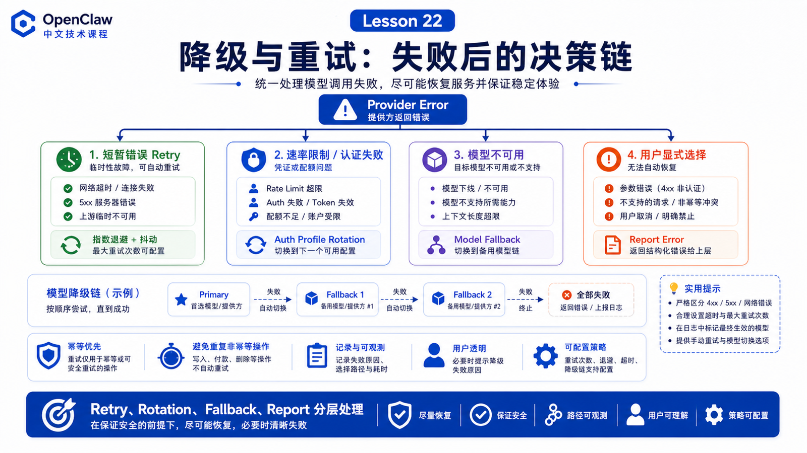

# 模型降级、重试和错误处理策略



真实系统里，模型调用一定会失败。

可能是：

```text
429 rate limit
认证过期
provider 超时
模型临时不可用
上下文太大
网络波动
工具结果过长
```

OpenClaw 要解决的不是“永不失败”，而是“失败后知道该不该重试、换 key、换模型，还是直接告诉用户”。

## 先说结论：Retry 和 Failover 不是一回事

可以这样区分：

```text
Retry
  同一个请求，短暂失败后再试一次

Auth profile rotation
  同一个 provider，换另一个 key / OAuth profile

Model failover
  当前模型或 provider 不可用时，换 fallback model

User-visible error
  不应该自动绕过时，把结构化失败告诉用户
```

不要把所有失败都暴力重试。

## Retry：按请求重试，不按整条流程重跑

官方 retry policy 的目标包括：

```text
按 HTTP request 重试
保持顺序
避免重复非幂等操作
```

默认配置包括：

```text
attempts: 3
maxDelayMs: 30000
jitter: 0.1
```

这意味着 OpenClaw 不会随便重放已经完成的复合流程。否则可能出现重复发消息、重复上传、重复执行命令。

## Provider SDK 和长 Retry-After

对 OpenAI、Anthropic 这类 SDK，OpenClaw 允许 SDK 处理普通短重试。

但如果 retry-after 很长，OpenClaw 会让 SDK 快速暴露错误，这样 model failover 可以接管，换 auth profile 或 fallback model。

这避免了用户等几分钟却没有任何进展。

## Auth profile rotation：先换同 provider 的身份

OpenClaw 使用 auth profiles 管理 API key 和 OAuth token。

当某个 profile 遇到 rate limit、auth 或类似 cooldown 错误时，可以尝试同 provider 下的下一个 profile。

例如：

```text
openai-codex:user@example.com
  ↓ 使用量限制
openai:api-key-backup
```

这仍然可能保持同一个模型或 runtime，只是换了认证来源。

## Model failover：再换模型候选

官方 model failover 文档说明，OpenClaw 先在当前 provider 内进行 auth profile rotation，再根据 `agents.defaults.model.fallbacks` 尝试下一个模型候选。

运行时会：

```text
解析 session 当前模型状态
构建 candidate chain
尝试当前 provider 和 auth profiles
遇到可 failover 错误时进入下一个模型
把 auto fallback override 写入 session
失败时窄范围回滚
全部失败时抛出 FallbackSummaryError
```

用户还会看到 fallback notice，例如从 primary 切到 fallback，或 primary 恢复后清除 fallback。

## 哪些选择不应该自动 fallback

如果用户显式 `/model` 选择了某个模型，这通常是 user session override。

官方文档说明，用户显式选择是严格选择。如果失败，OpenClaw 应报告失败，而不是悄悄用另一个模型回答。

原因很简单：

```text
用户明确要求用 A
系统不应该无声换成 B
```

## 常见误解

### 误解一：失败就应该一直重试

不对。非幂等流程不能随便重放。

### 误解二：Fallback 等于换更差模型

不一定。Fallback 只是下一个候选，可以是更快、更便宜、更稳，也可以是备用强模型。

### 误解三：用户指定模型也应该自动降级

不一定。显式用户选择通常应该严格执行。

## 最后总结

可靠性来自分层处理失败。

一句话总结：

```text
短暂错误用 retry，身份问题用 profile rotation，模型不可用用 fallback，不该绕过的错误要透明报告。
```

## 本节作业

1. 设计一个 primary + two fallbacks 的模型链。
2. 解释 retry 和 model failover 的区别。
3. 思考哪些工具调用不能自动重试。
4. 找一次 429 或 timeout，判断它应该 retry、rotate 还是 fallback。

## 下一节预告

下一节进入工具系统、Browser、Shell 与 Canvas：我们会把 OpenClaw 如何真正“动手做事”讲透。

## 参考资料

- OpenClaw Docs：[Model failover](https://docs.openclaw.ai/concepts/model-failover)
- OpenClaw Docs：[Retry policy](https://docs.openclaw.ai/concepts/retry)
- OpenClaw Docs：[Model providers](https://docs.openclaw.ai/concepts/model-providers)
- OpenClaw Docs：[Models CLI](https://docs.openclaw.ai/concepts/models)
- OpenClaw Docs：[FAQ: models and auth](https://docs.openclaw.ai/help/faq-models)
