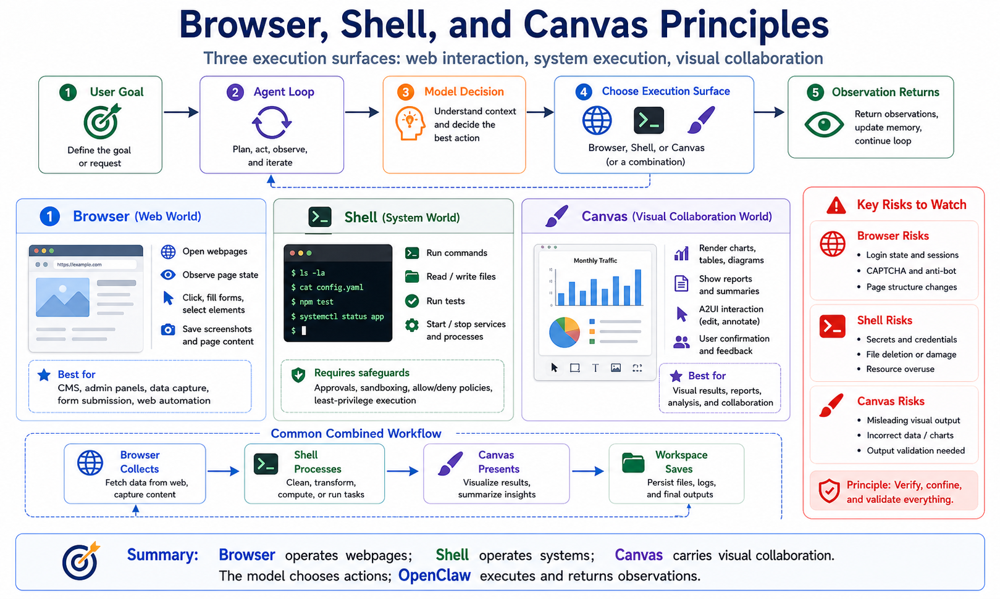

# Browser, Shell, and Canvas Principles



By now, one idea should be clear:

The model does not directly operate the world.

The model decides what should happen next.

OpenClaw turns that decision into controlled action.

Where do those actions happen?

Three of the most important execution surfaces are:

```text
Browser
Shell
Canvas
```

Browser connects the agent to web applications.

Shell connects it to the operating system and command line.

Canvas connects it to visual output and human collaboration.

They are all tools in the broad sense, but they are not the same kind of tool.

Browser is interactive observation and web operation.

Shell is powerful command execution.

Canvas is visual workspace and collaboration.

If you treat them as interchangeable, you will misunderstand both capability and risk.

## The Short Version

Think of them as three execution surfaces:

```text
User goal
  ↓
Agent Loop
  ↓
Model decision
  ↓
Choose execution surface
  ├─ Browser: navigate, observe, click, fill forms, screenshot
  ├─ Shell: run commands, edit files, start services, execute scripts
  └─ Canvas: render UI, show results, visualize, collaborate
  ↓
Observation / page state / command output / visual state
  ↓
Back to the model for the next decision
```

The shared rule:

```text
The model does not execute directly.
The model asks for actions.
OpenClaw executes them.
The result returns to the model.
```

The difference:

```text
Browser handles web interaction.
Shell handles system execution.
Canvas handles visual workspace interaction.
```

## Browser: A Controlled Browser, Not Just a Screenshot

Many beginners think the Browser tool is just a way to show the model a webpage screenshot.

That is too small.

OpenClaw Browser is a controlled browser execution surface.

It can:

- open pages
- inspect page state
- read DOM or accessibility snapshots
- click buttons
- fill inputs
- scroll
- wait for elements
- save screenshots
- execute multi-step web flows

It is also important that the browser is not necessarily your private daily Chrome session.

OpenClaw recommends managed browser profiles so the agent can operate in an isolated browser profile instead of disturbing personal browsing state.

A Browser call looks like:

```text
Model: I need to open the page and inspect it
  ↓
OpenClaw Browser tool starts or connects to a controlled browser
  ↓
Browser navigates
  ↓
Page title, URL, actionable elements, screenshot, or snapshot returns
  ↓
Model uses the observation to decide the next action
```

## Observation Is the Core of Browser Automation

Browser automation is not mainly about clicking fast.

It is about whether the model receives reliable page state.

Browser observations may include:

```text
current URL
page title
visible text
accessibility tree or structured snapshot
buttons, inputs, links, and other actionable elements
screenshot or file path
errors
```

The model reasons from those observations.

Example:

```text
The page shows a Login button
  ↓
The model clicks Login
  ↓
The page shows CAPTCHA
  ↓
The model should ask for human help instead of bypassing it
```

This is the difference between Browser and simple scraping.

Scraping fetches content.

Browser interacts with a real page state.

## Where Browser Fits

Browser is useful for:

```text
1. admin dashboard checks
2. form filling
3. screenshots
4. logged-in data inspection
5. CMS publishing
6. low-frequency business process automation
7. tasks that require page-state judgment
```

For example:

```text
Log into CMS
  ↓
Open article manager
  ↓
Create a post
  ↓
Fill title and body
  ↓
Upload image
  ↓
Save draft
  ↓
Screenshot confirmation
```

That is not just an API call.

It requires UI interaction.

## Where Browser Is Not the Best Tool

Browser should not replace everything.

If a stable API exists, use the API first.

If you only need public information, use search or fetch.

If you are processing local files, use Filesystem or Shell.

Browser is best when the task depends on real page state.

Common failure points:

- expired login state
- CAPTCHA
- MFA
- changed page structure
- lazy loading
- popups
- iframes
- missing permissions

Browser tasks need verification and failure handling.

## Shell: The Most Powerful and Risky Surface

Shell usually means the `exec`-style tool in OpenClaw.

It lets the agent run commands.

That sounds ordinary, but it is one of the most powerful capabilities an agent can have.

The command line can:

- read files
- modify files
- delete files
- install dependencies
- start services
- execute scripts
- connect to databases
- call cloud CLIs
- use Git
- run tests
- build projects

Shell is not just "reading terminal output."

It is a system execution entry point.

A Shell call looks like:

```text
Model: I need to run tests
  ↓
OpenClaw checks whether exec is allowed
  ↓
Approval may be requested
  ↓
Command executes in workspace or sandbox
  ↓
stdout, stderr, and exit code return
  ↓
Model continues fixing or summarizing
```

## Shell Is About Permission Boundaries

Browser risk is mainly web operation.

Shell risk is system modification.

A bad command can:

```text
delete files
leak secrets
stop services
break config
run malicious scripts
consume resources
pollute dependencies
```

So Shell must not be controlled by prompt alone.

Writing:

```text
Do not run dangerous commands.
```

is not enough.

Use:

```text
tool allow / deny
approvals
sandboxing
read-only directories
workspace boundaries
environment isolation
network limits
command logs
timeouts and resource limits
```

Shell is where you most clearly see that prompt is not a security boundary.

## Where Shell Fits

Shell is useful for:

```text
1. inspecting project structure
2. running tests
3. starting local services
4. installing dependencies
5. building projects
6. processing files
7. executing scripts
8. debugging logs
9. Git operations
```

Example development loop:

```text
Read package.json
  ↓
Install dependencies
  ↓
Run tests
  ↓
Observe failure
  ↓
Edit code
  ↓
Run tests again
```

Without Shell, many development tasks are impossible.

But this is exactly why production systems should expose Shell carefully.

## Canvas: A Visual Workspace, Not Just an Image

Canvas is often misunderstood.

People hear "canvas" and think "drawing."

In OpenClaw, Canvas is closer to a visual workspace.

It can:

- display agent-generated interfaces
- show structured results
- support A2UI-style interaction
- let humans review and adjust output
- render charts, tables, workflows, and reports
- cooperate with desktop OpenClaw nodes

The official docs describe Canvas as running through a desktop companion on macOS nodes, using WKWebView.

That means Canvas is not just a Markdown image.

It is a desktop-side visual interaction surface.

The flow:

```text
Model produces structured UI or content
  ↓
OpenClaw passes it to Canvas
  ↓
Canvas renders a visual workspace
  ↓
User reviews, edits, or confirms
  ↓
Result returns to the agent or is saved to Workspace
```

## Canvas vs Browser

Browser operates external webpages.

Canvas shows or controls the agent's own visual workspace.

Simple split:

```text
Browser = interact with someone else's web app
Canvas  = display and collaborate around the agent's own interface
```

Browser focuses on:

- external pages
- DOM
- clicks
- forms
- login state
- screenshots

Canvas focuses on:

- structured display
- custom UI
- charts
- reports
- visual confirmation
- A2UI interaction

If the agent logs into a CMS to publish an article, use Browser.

If it creates a visual SEO report for review, use Canvas.

## Canvas vs Shell

Shell executes commands.

Canvas presents visual state.

Shell returns:

```text
stdout
stderr
exit code
file paths
```

Canvas returns:

```text
interface
chart
table
interaction state
visual result
```

Shell is machine-facing.

Canvas is human-facing.

When a task requires understanding, comparison, confirmation, or adjustment, Canvas becomes valuable.

## How the Three Work Together

Real tasks often combine all three.

Example:

```text
Generate a competitor SEO analysis report
```

Possible flow:

```text
Browser opens competitor pages and gathers page information
  ↓
Shell runs local scripts to clean and summarize data
  ↓
Canvas renders charts and report sections
  ↓
User confirms conclusions
  ↓
Filesystem saves final files
```

Another example:

```text
Publish an article to a CMS
```

Possible flow:

```text
Shell reads local Markdown and images
  ↓
Canvas previews layout
  ↓
Browser logs into CMS and fills forms
  ↓
Browser screenshots publishing status
  ↓
Shell saves publishing records
```

The three surfaces are not replacements.

They are composable.

## Common Misunderstandings

### Misunderstanding 1: Browser means web search

No.

Search finds information.

Browser operates webpages.

### Misunderstanding 2: Shell is just for reading files

No.

Shell can change system state.

It needs approvals, sandboxing, and policy.

### Misunderstanding 3: Canvas is just image generation

No.

Canvas is a visual workspace for structured output and interaction.

### Misunderstanding 4: Stronger tools make the agent safer

No.

Stronger tools require stronger boundaries.

Browser needs session and page safety.

Shell needs permission control.

Canvas needs review and output validation.

## Final Summary

Browser, Shell, and Canvas are three important execution surfaces in OpenClaw.

Browser lets the agent operate web applications.

Shell lets it operate the system and project.

Canvas lets it display and collaborate around visual results.

Remember:

```text
Browser = web world
Shell   = system world
Canvas  = visual collaboration world
```

The model chooses the action.

OpenClaw executes, limits, records, and returns the result.

Understanding these surfaces helps you decide what a real task actually needs.

## Lesson Homework

1. Pick one real task and decide whether it needs Browser, Shell, Canvas, or a combination.
2. Write a Browser task and list possible login, CAPTCHA, and page-change failures.
3. Write a Shell task and mark which commands require approval.
4. Describe one Canvas scenario where plain text output is not enough.
5. Draw a combined flow: Browser collects, Shell processes, Canvas presents.

## Next Lesson Preview

The next lesson builds a minimal agent by hand.

The first nine lessons covered structure, models, tools, prompts, skills, user input, and execution surfaces. Next we turn the Agent Loop from concept into a small program you can understand.

## References

- [OpenClaw Browser tool](https://docs.openclaw.ai/tools/browser)
- [OpenClaw Browser CLI](https://docs.openclaw.ai/cli/browser)
- [OpenClaw Exec tool](https://docs.openclaw.ai/tools/exec)
- [OpenClaw Canvas](https://docs.openclaw.ai/platforms/mac/canvas)
- [OpenClaw Agent loop](https://docs.openclaw.ai/concepts/agent-loop)
- [OpenClaw Tools overview](https://docs.openclaw.ai/tools)
