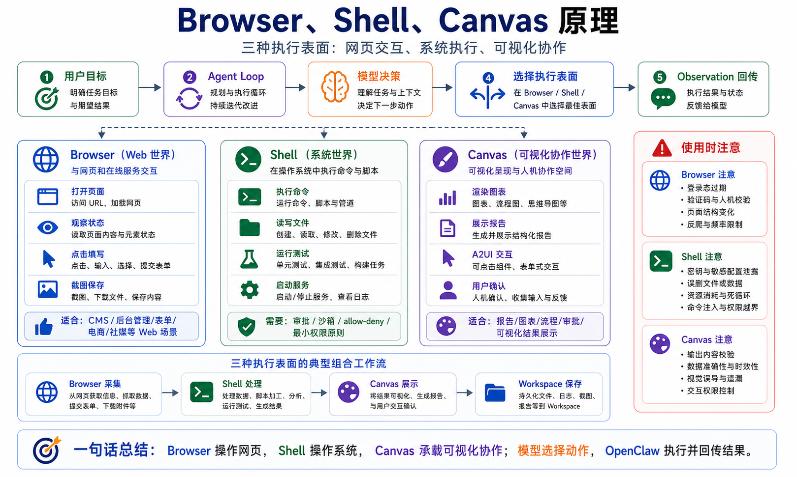

# Browser、Shell、Canvas 原理



学 OpenClaw 到这里，你应该已经知道一件事：

模型不会直接操作世界。

模型负责判断下一步。

OpenClaw 负责把模型的判断变成真实动作。

那真实动作发生在哪里？

最重要的三个执行表面，就是：

```text
Browser
Shell
Canvas
```

Browser 连接网页世界。

Shell 连接操作系统和命令行世界。

Canvas 连接可视化界面和人工协作世界。

这三个东西看起来都是“工具”，但本质完全不同。

Browser 是交互型观察和操作。

Shell 是高权限命令执行。

Canvas 是可视化状态呈现和人机协作。

如果你把它们混成一类，就很容易误判风险。

这一篇我们就把 Browser、Shell、Canvas 的原理拆开。

## 先说结论：三者是三种执行表面

可以先用这张图理解：

```text
用户目标
  ↓
Agent Loop
  ↓
模型决策
  ↓
选择执行表面
  ├─ Browser：打开网页、观察页面、点击、填写、截图
  ├─ Shell：运行命令、读写文件、启动服务、执行脚本
  └─ Canvas：展示界面、渲染结果、可视化协作、A2UI 交互
  ↓
工具结果 / 页面状态 / 文件输出 / 视觉状态
  ↓
回到模型继续推理
```

这三个执行表面的共同点是：

```text
模型不直接执行。
模型提出动作。
OpenClaw 执行动作。
结果再回到模型。
```

它们的区别是：

```text
Browser 处理网页交互。
Shell 处理系统执行。
Canvas 处理可视化工作区。
```

## Browser：不是网页截图，而是受控浏览器

很多人以为 Browser 工具就是“给模型看网页截图”。

这太低估它了。

OpenClaw 的 Browser 是一个受控浏览器执行表面。

它可以承担这些任务：

- 打开页面
- 获取页面状态
- 阅读 DOM / 可访问性快照
- 点击按钮
- 填写输入框
- 滚动页面
- 等待元素
- 截图保存
- 处理多步骤网页流程

更重要的是，Browser 不是模型直接操控你的私人 Chrome。

OpenClaw 推荐使用 managed browser profile，让 Agent 在独立浏览器配置里工作。

这样可以减少对个人浏览器登录态、扩展、历史记录和隐私数据的干扰。

一个 Browser 工具调用可以这样理解：

```text
模型：我需要打开网页并观察页面
  ↓
OpenClaw Browser 工具：启动或连接受控浏览器
  ↓
浏览器执行导航
  ↓
返回页面标题、URL、可操作元素、截图或快照
  ↓
模型根据 observation 决定下一步
```

## Browser 的核心是 observation

Browser 自动化的关键不是“点得快”。

关键是模型能不能看见足够可靠的页面状态。

浏览器返回给模型的内容通常包括：

```text
当前 URL
页面标题
页面文本
可访问性树或结构化快照
按钮、输入框、链接等可操作元素
截图或文件路径
错误信息
```

模型基于这些 observation 做下一步判断。

比如：

```text
页面里出现“登录”按钮
  ↓
模型决定点击登录
  ↓
页面出现验证码
  ↓
模型不能绕过，应该请求人工处理
```

这就是 Browser 和普通网页抓取的区别。

网页抓取通常只拿 HTML 或文本。

Browser 是在真实页面状态里交互。

## Browser 适合什么

Browser 适合：

```text
1. 后台页面检查
2. 表单填写
3. 页面截图
4. 登录后数据查看
5. CMS 发布文章
6. 低频人工流程自动化
7. 需要页面状态判断的任务
```

比如企业运营场景：

```text
登录 CMS 后台
  ↓
进入文章管理
  ↓
创建新文章
  ↓
填写标题和正文
  ↓
上传配图
  ↓
保存草稿
  ↓
截图返回
```

这类任务不只是 API 调用。

它需要和网页界面交互。

Browser 就是这个执行表面。

## Browser 不适合什么

Browser 不适合所有问题。

如果目标系统有稳定 API，优先用 API。

如果只是查询公开资料，优先用 web search 或 HTTP fetch。

如果只是处理本地文件，优先用 Filesystem 或 Shell。

Browser 适合“需要真实页面状态”的任务，不适合替代所有数据接口。

另外，Browser 自动化容易遇到：

- 登录态失效
- 验证码
- MFA
- 页面结构变化
- 延迟加载
- 弹窗
- iframe
- 权限不足

所以 Browser 任务必须强调验证和失败处理。

## Shell：最强也最危险的执行表面

Shell 在 OpenClaw 里通常对应 `exec` 这类工具。

它让 Agent 可以运行命令。

这听起来普通，但它是非常强的能力。

因为命令行可以做太多事：

- 读取文件
- 修改文件
- 删除文件
- 安装依赖
- 启动服务
- 执行脚本
- 连接数据库
- 调用云服务 CLI
- 操作 Git
- 运行测试
- 构建项目

所以 Shell 的本质不是“读取终端输出”。

它是系统级执行入口。

一个 Shell 工具调用可以这样理解：

```text
模型：我需要运行测试
  ↓
OpenClaw 检查 exec 工具是否允许
  ↓
必要时请求审批
  ↓
在 workspace 或 sandbox 中执行命令
  ↓
返回 stdout、stderr、exit code
  ↓
模型根据结果继续修复或总结
```

## Shell 的关键是权限边界

Browser 的主要风险是网页操作。

Shell 的主要风险是系统破坏。

错误命令可能导致：

```text
删除文件
泄露密钥
停止服务
写坏配置
执行恶意脚本
消耗大量资源
污染依赖环境
```

所以 Shell 不能只靠 Prompt 约束。

你不能只写一句：

```text
不要执行危险命令。
```

然后就放心。

真正的控制要靠：

```text
工具 allow / deny
审批机制
sandbox
只读目录
工作区限制
环境变量隔离
网络访问限制
命令日志
超时和资源限制
```

Shell 是最能体现“Prompt 不是安全边界”的地方。

## Shell 适合什么

Shell 适合：

```text
1. 查看项目结构
2. 运行测试
3. 启动本地服务
4. 安装依赖
5. 构建项目
6. 处理文件
7. 执行脚本
8. 调试日志
9. Git 操作
```

比如开发任务：

```text
读取 package.json
  ↓
安装依赖
  ↓
运行测试
  ↓
发现失败
  ↓
修改代码
  ↓
再次运行测试
```

这类任务没有 Shell 很难完成。

但这也是为什么生产环境要谨慎开放 Shell。

开发环境可以给它更大权限。

生产环境要尽量收窄能力。

## Canvas：不是图片，而是可视化工作区

Canvas 容易被误解。

很多人听到 Canvas，以为它只是“画图”。

在 OpenClaw 的语境里，Canvas 更像一个可视化工作区。

它可以用来：

- 展示 Agent 生成的界面
- 呈现结构化结果
- 承载 A2UI 交互
- 让人检查和调整输出
- 渲染图表、表格、流程图、报告
- 和桌面上的 OpenClaw 节点协作

官方文档提到，Canvas 在 macOS 节点上由桌面 companion 负责，通过 WKWebView 打开。

这说明 Canvas 不是简单的 Markdown 图片。

它是运行在桌面侧的可视化交互面。

可以这样理解：

```text
模型生成结构化界面或内容
  ↓
OpenClaw 把它交给 Canvas
  ↓
Canvas 在可视化工作区渲染
  ↓
用户查看、调整、确认
  ↓
结果可以回到 Agent 或保存到 Workspace
```

## Canvas 和 Browser 的区别

Browser 面向外部网页。

Canvas 面向 Agent 生成或控制的可视化工作区。

简单说：

```text
Browser = 操作别人的网页
Canvas  = 展示和协作自己的界面
```

Browser 关注：

- 外部页面
- DOM
- 点击
- 表单
- 登录态
- 截图

Canvas 关注：

- 结构化展示
- 自定义 UI
- 图表
- 报告
- 可视化确认
- A2UI 交互

如果 Agent 要登录某个 CMS 后台发布文章，用 Browser。

如果 Agent 要把 SEO 数据做成可视化报告给你检查，用 Canvas。

## Canvas 和 Shell 的区别

Shell 是命令执行。

Canvas 是可视化呈现。

Shell 输出通常是：

```text
stdout
stderr
exit code
文件路径
```

Canvas 输出通常是：

```text
界面
图表
表格
交互状态
视觉结果
```

Shell 更适合机器操作。

Canvas 更适合人看和人改。

当任务需要“让用户理解、确认、比较、调整”，Canvas 的价值就出来了。

## 三者如何协同

真实任务常常会同时用到三者。

比如：

```text
生成一份竞品 SEO 分析报告
```

执行流程可能是：

```text
Browser 打开竞品网页并抓取页面信息
  ↓
Shell 运行本地脚本清洗和统计数据
  ↓
Canvas 渲染图表和报告
  ↓
用户确认结论
  ↓
Filesystem 保存最终文件
```

再比如：

```text
自动发布一篇文章到 CMS
```

流程可能是：

```text
Shell 读取本地 Markdown 和图片
  ↓
Canvas 预览文章排版
  ↓
Browser 登录 CMS 并填写表单
  ↓
Browser 截图确认发布状态
  ↓
Shell 保存发布记录
```

所以不要把三者理解成互相替代。

它们是不同执行表面，可以组合。

## 常见误解

### 误解一：Browser 就是搜索网页

不是。

搜索是找信息。

Browser 是操作网页。

一个是信息检索，一个是界面交互。

### 误解二：Shell 只是读文件

不是。

Shell 可以改变系统状态。

它是强能力入口，必须配合审批、沙箱和策略。

### 误解三：Canvas 就是生成图片

不是。

Canvas 是可视化工作区，不只是图片文件。

它更接近“让 Agent 的结构化结果被看见、检查和交互”。

### 误解四：工具越强，Agent 越安全

恰恰相反。

工具越强，越需要边界。

Browser 需要登录态和页面限制。

Shell 需要权限控制。

Canvas 需要输出校验和用户确认。

## 最后总结

Browser、Shell、Canvas 是 OpenClaw 连接真实世界的三个重要执行表面。

Browser 让 Agent 操作网页。

Shell 让 Agent 操作系统和项目。

Canvas 让 Agent 展示和协作可视化结果。

它们共同构成：

```text
Browser = Web 世界
Shell   = 系统世界
Canvas  = 可视化协作世界
```

模型负责判断用哪个。

OpenClaw 负责执行、限制、记录和回传结果。

理解这三个表面，你就能更准确地判断：一个任务到底需要浏览器，需要命令行，还是需要一个可视化工作区。

## 本节作业

1. 选一个真实任务，判断它需要 Browser、Shell、Canvas 中的哪几个执行表面。
2. 写出一个 Browser 任务，并列出它可能遇到的登录态、验证码、页面变化问题。
3. 写出一个 Shell 任务，并标出哪些命令必须经过审批。
4. 写出一个 Canvas 场景：为什么纯文本输出不够，需要可视化工作区？
5. 画一张三者协同流程图：Browser 采集、Shell 处理、Canvas 展示。

## 下一节预告

下一节我们会手写一个最小 Agent。

前面九节讲了 OpenClaw 的结构、模型、工具、Prompt、Skill、输入链路和执行表面。下一节我们会用一个极简代码模型，把 Agent Loop 从“概念”变成“你能亲手写出来的程序”。

## 参考资料

- [OpenClaw Browser tool](https://docs.openclaw.ai/tools/browser)
- [OpenClaw Browser CLI](https://docs.openclaw.ai/cli/browser)
- [OpenClaw Exec tool](https://docs.openclaw.ai/tools/exec)
- [OpenClaw Canvas](https://docs.openclaw.ai/platforms/mac/canvas)
- [OpenClaw Agent loop](https://docs.openclaw.ai/concepts/agent-loop)
- [OpenClaw Tools overview](https://docs.openclaw.ai/tools)
