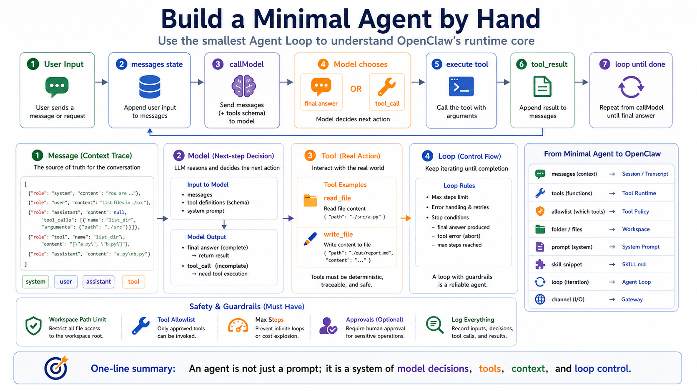

# Build a Minimal Agent by Hand



The first nine lessons decomposed OpenClaw piece by piece.

Gateway, CLI, Bridge, Workspace.

Models, tools, and browser.

Skills, prompts, and context.

User input, queueing, and tool execution.

Browser, Shell, and Canvas.

Those ideas become much clearer when you write the smallest possible agent yourself.

We are not rebuilding OpenClaw.

We are building a tiny teaching model that shows the core Agent Loop.

The goal:

```text
context → model → tool decision → tool execution → result back into context → repeat
```

Once you understand that loop, OpenClaw's Gateway, Workspace, Tool Policy, Skills, Browser, and Shell become much less mysterious.

## A Minimal Agent Needs Four Things

A minimal agent needs:

```text
1. Message: stores user messages, assistant messages, and tool results
2. Model: decides the next step from context
3. Tool: performs real actions
4. Loop: connects model decisions to tool execution
```

The simplest flow:

```text
User input
  ↓
messages.push(user)
  ↓
call model
  ↓
model chooses:
  ├─ final answer → stop
  └─ tool call    → execute tool
                    ↓
                  messages.push(tool_result)
                    ↓
                  call model again
```

That is the minimum core.

OpenClaw adds production-grade layers around it:

```text
Gateway
Session
Workspace
Tool Policy
Browser
Shell
Canvas
Skills
Prompt Assembly
Streaming
Persistence
Approvals
Sandboxing
```

But the loop remains the loop.

## Do Not Start with a Framework

Beginners often start by trying to build:

- multi-agent routing
- long-term memory
- RAG
- browser automation
- MCP
- plugin marketplaces
- visual UI
- distributed queues
- multi-tenant SaaS

That is too much before the loop is understood.

The first agent should be tiny.

Give it two tools:

```text
read_file
write_file
```

and one model call.

For teaching, even a fake model is enough. The point is not the SDK. The point is the structure.

## Minimal Message State

Start with messages:

```js
const messages = [
  { role: "system", content: "You are a careful coding assistant." },
  { role: "user", content: "Read README.md and summarize it." }
];
```

During a run, messages accumulate:

```text
system message
user message
assistant tool request
tool result
assistant final answer
```

Messages store the reasoning and execution trace.

Without them, each model call forgets what happened.

## Minimal Tool Definition

A tool needs:

```text
name
parameter schema
execution function
```

Pseudo-code:

```js
const tools = {
  read_file: {
    description: "Read a text file from the workspace.",
    schema: {
      path: "string"
    },
    async run(args) {
      return await fs.readFile(args.path, "utf8");
    }
  },

  write_file: {
    description: "Write text content to a workspace file.",
    schema: {
      path: "string",
      content: "string"
    },
    async run(args) {
      await fs.writeFile(args.path, args.content, "utf8");
      return `Wrote ${args.path}`;
    }
  }
};
```

The model does not see the JavaScript implementation.

It sees the tool name, description, and schema.

The runtime executes the function.

That is the same separation OpenClaw uses.

## Minimal Model Return Shape

For learning, assume the model returns one of two shapes.

Final answer:

```js
{
  type: "final",
  content: "README.md explains how to start the project."
}
```

Tool call:

```js
{
  type: "tool_call",
  name: "read_file",
  args: { "path": "README.md" }
}
```

Real model APIs have more detailed formats.

But conceptually the model either:

```text
answers
calls a tool
```

That abstraction matters more than memorizing one SDK field.

## Minimal Agent Loop

Now the core loop:

```js
async function runAgent(userInput) {
  const messages = [
    { role: "system", content: "You are a careful assistant. Use tools when needed." },
    { role: "user", content: userInput }
  ];

  for (let step = 0; step < 8; step++) {
    const next = await callModel({ messages, tools });

    if (next.type === "final") {
      messages.push({ role: "assistant", content: next.content });
      return next.content;
    }

    if (next.type === "tool_call") {
      const tool = tools[next.name];
      if (!tool) {
        messages.push({
          role: "tool",
          name: next.name,
          content: `Error: unknown tool ${next.name}`
        });
        continue;
      }

      const result = await tool.run(next.args);

      messages.push({
        role: "tool",
        name: next.name,
        content: result
      });
    }
  }

  return "Stopped: reached max steps.";
}
```

This is a minimal agent.

It has no Gateway.

No Workspace manager.

No approvals.

No browser.

No queue.

No persistence.

But it has the core:

```text
The model can decide to call a tool.
The tool result returns to context.
The model can reason again.
```

## Add a Small Safety Boundary

The code above is unsafe.

`read_file` and `write_file` have no path restrictions.

A slightly better minimal agent limits access to a workspace:

```js
function resolveWorkspacePath(workspaceRoot, userPath) {
  const full = path.resolve(workspaceRoot, userPath);

  if (!full.startsWith(workspaceRoot)) {
    throw new Error("Path escapes workspace");
  }

  return full;
}
```

Use it inside a tool:

```js
async run(args) {
  const safePath = resolveWorkspacePath(WORKSPACE_ROOT, args.path);
  return await fs.readFile(safePath, "utf8");
}
```

This tiny example explains why OpenClaw needs Workspace.

Workspace is not just a folder.

It is the agent's working boundary.

## Add Tool Policy

Add a minimal allowlist:

```js
const allowedTools = new Set(["read_file"]);

function assertToolAllowed(name) {
  if (!allowedTools.has(name)) {
    throw new Error(`Tool not allowed: ${name}`);
  }
}
```

Before executing a tool:

```js
assertToolAllowed(next.name);
```

This makes an important point:

```text
The model may request write_file.
The runtime may refuse it.
```

What the model wants and what the system permits must be separate.

OpenClaw's tool policy, approvals, and sandboxing are production-grade versions of this idea.

## Add Prompt

Add a system prompt:

```js
const systemPrompt = `
You are a careful file assistant.
Read files before answering questions about them.
Never write files unless the user explicitly asks.
If a tool fails, explain the error briefly and stop.
`;
```

This changes model behavior:

```text
more likely to read files first
less likely to write files unprompted
less likely to keep trying after tool failure
```

But prompt is not permission control.

If `write_file` is visible and allowed, the model can still request it.

Minimal agents should keep the distinction:

```text
Prompt = behavior guidance
Policy = execution boundary
```

## Add a Tiny Skill

At the smallest scale, a skill can be an on-demand instruction snippet.

Example:

```js
const summarizeFileSkill = `
When summarizing a file:
1. Read the file first.
2. Identify the topic, structure, and key points.
3. Return summary, important details, and next actions.
`;
```

Pseudo-code:

```js
if (userInput.includes("summarize") || userInput.includes("总结")) {
  messages.push({
    role: "system",
    content: `Relevant skill:\n${summarizeFileSkill}`
  });
}
```

This is the smallest form of a skill:

```text
For a certain task type, give the model a reusable procedure.
```

OpenClaw implements this more fully: scanning, precedence, eligibility, paths, and on-demand `SKILL.md` loading.

But the idea is the same.

## Minimal Agent vs OpenClaw

Our minimal agent has:

```text
messages
callModel
tools
loop
workspace check
allowlist
prompt
skill snippet
```

OpenClaw has:

```text
Gateway for input
Session for history
Context assembly for prompt, tools, skills, workspace files
Provider routing for model calls
Tool Runtime for Browser, Shell, Canvas, MCP
Tool Policy for capability boundaries
Workspace for files and state
Transcript persistence
Channel Adapter for replies
```

They are not different worlds.

OpenClaw is the production runtime around the minimal agent loop.

## Common Misunderstandings

### Misunderstanding 1: An agent is just a prompt

No.

Prompt is one input.

The core is loop plus tool execution.

### Misunderstanding 2: Agents automatically become smart

No.

Without reliable tools, context, policy, and feedback, the model only generates text.

### Misunderstanding 3: Tool functions are safe once written

Not necessarily.

Tools need validation, path limits, permission policy, timeouts, logs, and approvals.

### Misunderstanding 4: A minimal agent is production-ready

No.

It is a teaching model.

Production agents need gateways, sessions, permissions, sandboxing, observability, persistence, retries, and audit.

## Final Summary

Writing a minimal agent teaches the Agent Loop.

It is not mysterious:

```text
store messages
call model
detect tool request
execute tool
put result back into messages
continue until final answer
```

OpenClaw does not change this essence.

It wraps the essence in a deployable, debuggable, extensible, controlled runtime.

If you can write a minimal agent, you can understand why OpenClaw needs Gateway, Workspace, Tool Policy, Skill, Browser, Shell, and Canvas.

## Lesson Homework

1. Write a minimal Agent Loop in a language you know, supporting only `read_file`.
2. Add a max step count, such as 8, to prevent infinite loops.
3. Add workspace path restrictions so the tool cannot read outside the workspace.
4. Add an allowlist so the model can request tools but the runtime can refuse.
5. Add a minimal skill: when the user asks to summarize a file, read the file first and then summarize it.

## Next Lesson Preview

The next lesson starts the deployment stage: Docker installation.

Understanding the Agent Loop is the first step. To run agents long-term, you also need deployment, ports, configuration, logs, permissions, and recovery.

## References

- [OpenClaw Agent loop](https://docs.openclaw.ai/concepts/agent-loop)
- [OpenClaw Agent runtime](https://docs.openclaw.ai/concepts/agent)
- [OpenClaw Context](https://docs.openclaw.ai/concepts/context)
- [OpenClaw System prompt](https://docs.openclaw.ai/concepts/system-prompt)
- [OpenClaw Tools overview](https://docs.openclaw.ai/tools)
- [OpenClaw Exec tool](https://docs.openclaw.ai/tools/exec)

