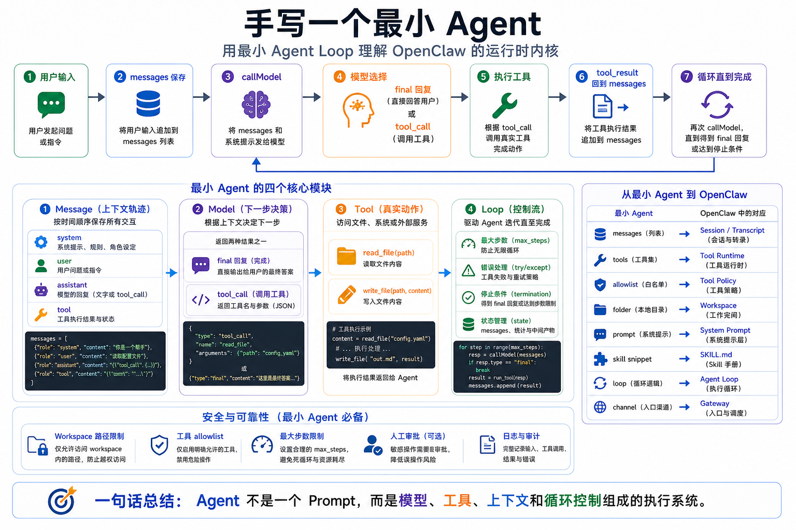

# 手写一个最小 Agent



前面九节，我们一直在拆 OpenClaw。

Gateway、CLI、Bridge、Workspace。

模型、工具、浏览器。

Skill、Prompt、Context。

用户输入、队列、工具执行。

Browser、Shell、Canvas。

这些概念如果只停留在文字上，还是有点散。

所以第 10 节，我们换个方式。

不直接写 OpenClaw 的完整实现。

而是手写一个“最小 Agent”，用几十行代码把 Agent Loop 的核心跑通。

目标不是造一个能上生产的框架。

目标是让你明白：

```text
Agent 本质上就是一个循环：
看上下文 → 调模型 → 判断是否调用工具 → 执行工具 → 把结果放回上下文 → 继续
```

只要这个循环懂了，后面看 OpenClaw 的 Gateway、Workspace、Tool Policy、Skill、Browser、Shell，都不会再觉得神秘。

## 先说结论：最小 Agent 只需要四个东西

一个最小 Agent 需要：

```text
1. Message：保存用户、模型、工具结果
2. Model：根据上下文生成下一步
3. Tool：执行真实动作
4. Loop：把模型和工具串起来
```

用图表示就是：

```text
用户输入
  ↓
messages.push(user)
  ↓
调用模型
  ↓
模型选择：
  ├─ 直接回复 → 结束
  └─ 调用工具 → 执行工具
                  ↓
              messages.push(tool_result)
                  ↓
              再次调用模型
```

这就是 Agent 的最小内核。

OpenClaw 在这个内核外面加了很多工程能力：

```text
Gateway
Session
Workspace
Tool Policy
Browser
Shell
Canvas
Skills
Prompt Assembly
Streaming
Persistence
Approvals
Sandbox
```

但核心循环没变。

## 不要一开始就写复杂框架

很多人写 Agent，上来就想做：

- 多 Agent
- 长期记忆
- RAG
- 浏览器自动化
- MCP
- 插件市场
- 可视化界面
- 分布式队列
- SaaS 多租户

结果还没理解最小循环，代码已经变成一团。

第一个 Agent 应该非常小。

它只需要支持两个工具：

```text
read_file
write_file
```

再加一个简单模型调用。

甚至在教学阶段，我们可以先用伪模型模拟工具调用。

因为这一节的重点不是某个 SDK，而是 Agent Loop 的结构。

## 最小数据结构

先定义消息：

```js
const messages = [
  { role: "system", content: "You are a careful coding assistant." },
  { role: "user", content: "Read README.md and summarize it." }
];
```

一个 Agent 运行时，messages 里会持续追加内容：

```text
system message
user message
assistant tool request
tool result
assistant final answer
```

它不是只保存聊天文本。

它保存整个推理和执行过程。

如果没有 messages，模型每一轮都是失忆的。

## 最小工具定义

工具要有三个部分：

```text
名称
参数 schema
执行函数
```

伪代码如下：

```js
const tools = {
  read_file: {
    description: "Read a text file from the workspace.",
    schema: {
      path: "string"
    },
    async run(args) {
      return await fs.readFile(args.path, "utf8");
    }
  },

  write_file: {
    description: "Write text content to a workspace file.",
    schema: {
      path: "string",
      content: "string"
    },
    async run(args) {
      await fs.writeFile(args.path, args.content, "utf8");
      return `Wrote ${args.path}`;
    }
  }
};
```

注意这里有一个重要点：

模型看到的不是函数代码。

模型看到的是工具名称、描述、参数 schema。

真正执行的是运行时。

这和 OpenClaw 的工具机制是一致的。

## 最小模型返回格式

为了理解 Agent Loop，我们假设模型每次返回两种结果之一：

```js
// 直接回复
{
  type: "final",
  content: "README.md explains how to start the project."
}
```

或者：

```js
// 请求工具
{
  type: "tool_call",
  name: "read_file",
  args: { "path": "README.md" }
}
```

真实模型 API 的格式可能更复杂。

但抽象上就是这两类：

```text
回复
调用工具
```

理解这个抽象，比背某个 SDK 字段更重要。

## 最小 Agent Loop

现在可以写核心循环：

```js
async function runAgent(userInput) {
  const messages = [
    { role: "system", content: "You are a careful assistant. Use tools when needed." },
    { role: "user", content: userInput }
  ];

  for (let step = 0; step < 8; step++) {
    const next = await callModel({ messages, tools });

    if (next.type === "final") {
      messages.push({ role: "assistant", content: next.content });
      return next.content;
    }

    if (next.type === "tool_call") {
      const tool = tools[next.name];
      if (!tool) {
        messages.push({
          role: "tool",
          name: next.name,
          content: `Error: unknown tool ${next.name}`
        });
        continue;
      }

      const result = await tool.run(next.args);

      messages.push({
        role: "tool",
        name: next.name,
        content: result
      });
    }
  }

  return "Stopped: reached max steps.";
}
```

这就是最小 Agent。

它没有 Gateway。

没有 Workspace 管理。

没有权限审批。

没有浏览器。

没有队列。

没有持久化。

但它已经有了 Agent 的核心：

```text
模型可以基于上下文决定调用工具。
工具结果会回到上下文。
模型可以继续推理。
```

## 给最小 Agent 加一点安全边界

上面的代码很危险。

因为 `read_file` 和 `write_file` 没有任何限制。

一个稍微靠谱的最小 Agent，至少要限制 workspace：

```js
function resolveWorkspacePath(workspaceRoot, userPath) {
  const full = path.resolve(workspaceRoot, userPath);

  if (!full.startsWith(workspaceRoot)) {
    throw new Error("Path escapes workspace");
  }

  return full;
}
```

然后工具执行时：

```js
async run(args) {
  const safePath = resolveWorkspacePath(WORKSPACE_ROOT, args.path);
  return await fs.readFile(safePath, "utf8");
}
```

这个小例子解释了 OpenClaw 为什么需要 Workspace。

Workspace 不是普通文件夹。

它是 Agent 的工作边界。

## 给最小 Agent 加工具策略

再加一个最小 allowlist：

```js
const allowedTools = new Set(["read_file"]);

function assertToolAllowed(name) {
  if (!allowedTools.has(name)) {
    throw new Error(`Tool not allowed: ${name}`);
  }
}
```

执行工具前检查：

```js
assertToolAllowed(next.name);
```

这样就能做到：

```text
模型可以请求 write_file
但运行时可以拒绝
```

这非常关键。

模型“想做什么”和系统“允许做什么”必须分开。

OpenClaw 的 tool policy、审批和 sandbox，本质上都是这个思想的工程化版本。

## 给最小 Agent 加 Prompt

现在加一点系统提示词：

```js
const systemPrompt = `
You are a careful file assistant.
Read files before answering questions about them.
Never write files unless the user explicitly asks.
If a tool fails, explain the error briefly and stop.
`;
```

这个 Prompt 会改变模型倾向：

```text
更愿意先读文件
更少主动写文件
工具失败时不继续乱试
```

但注意：

Prompt 不是权限控制。

如果 `write_file` 工具可见、可用，而且没有策略阻止，模型仍然可能调用它。

所以最小 Agent 也要区分：

```text
Prompt = 行为引导
Policy = 执行边界
```

## 给最小 Agent 加 Skill

Skill 可以先简单实现成一段按需加入的说明。

比如用户任务里出现“总结文件”，就追加一个 Skill：

```js
const summarizeFileSkill = `
When summarizing a file:
1. Read the file first.
2. Identify the topic, structure, and key points.
3. Return summary, important details, and next actions.
`;
```

伪代码：

```js
if (userInput.includes("summarize") || userInput.includes("总结")) {
  messages.push({
    role: "system",
    content: `Relevant skill:\n${summarizeFileSkill}`
  });
}
```

这就是 Skill 的最小形态：

```text
遇到某类任务时，给模型一套可复用方法。
```

真实 OpenClaw 会把 Skill 做得更完整：扫描、优先级、eligible、路径、按需读取 `SKILL.md`。

但思想一样。

## 最小 Agent 和 OpenClaw 的关系

现在回头看 OpenClaw，你会更容易理解它在做什么。

我们的最小 Agent：

```text
messages
callModel
tools
loop
workspace check
allowlist
prompt
skill snippet
```

OpenClaw 的完整系统：

```text
Gateway 接收输入
Session 保存历史
Context 组装 Prompt、工具、Skill、Workspace 文件
Provider 调用模型
Tool Runtime 执行 Browser、Shell、Canvas、MCP
Tool Policy 控制能力边界
Workspace 保存文件和状态
Transcript 持久化全过程
Channel Adapter 返回消息
```

它们不是两个世界。

OpenClaw 就是在最小 Agent Loop 外面，加上生产级运行时能力。

## 常见误解

### 误解一：Agent 就是一个 Prompt

不是。

Prompt 只是输入的一部分。

Agent 的核心是循环和工具执行。

### 误解二：Agent 会自动变聪明

不会。

如果没有可靠工具、上下文、策略和反馈，模型只是生成文本。

### 误解三：工具函数写好了就安全

不一定。

工具还需要参数校验、路径限制、权限策略、超时、日志和审批。

### 误解四：最小 Agent 可以直接上生产

不要。

最小 Agent 只是教学模型。

生产 Agent 需要网关、会话、权限、沙箱、观测、持久化、重试、审计。

## 最后总结

手写一个最小 Agent，真正要理解的是 Agent Loop。

它不是神秘的。

它就是：

```text
保存消息
调用模型
识别工具请求
执行工具
把结果放回消息
继续循环
直到输出最终答案
```

OpenClaw 的强大不在于它改变了这个本质。

而在于它把这个本质放进了可部署、可调试、可扩展、可控的运行时系统里。

如果你能写出最小 Agent，就能更清楚地看懂 OpenClaw 为什么需要 Gateway、Workspace、Tool Policy、Skill、Browser、Shell、Canvas。

## 本节作业

1. 用你熟悉的语言写一个最小 Agent Loop，只支持 `read_file` 一个工具。
2. 给它加一个最大循环步数，比如 8 步，防止无限执行。
3. 给工具加 workspace 路径限制，禁止读取工作区外文件。
4. 给它加一个 allowlist，让模型可以请求工具，但运行时可以拒绝。
5. 写一个最小 Skill：当用户要求总结文件时，先读文件再输出摘要。

## 下一节预告

下一节开始进入第二阶段：环境部署。

我们会从 Docker 安装开始，把前面讲过的概念放到真实运行环境里。到那一步，你会看到：理解 Agent Loop 只是第一步，真正让 Agent 长期运行，还需要部署、端口、配置、日志、权限和恢复能力。

## 参考资料

- [OpenClaw Agent loop](https://docs.openclaw.ai/concepts/agent-loop)
- [OpenClaw Agent runtime](https://docs.openclaw.ai/concepts/agent)
- [OpenClaw Context](https://docs.openclaw.ai/concepts/context)
- [OpenClaw System prompt](https://docs.openclaw.ai/concepts/system-prompt)
- [OpenClaw Tools overview](https://docs.openclaw.ai/tools)
- [OpenClaw Exec tool](https://docs.openclaw.ai/tools/exec)

---

原文外链：[手写一个最小 Agent](https://www.harries.blog/archives/720389.html)
