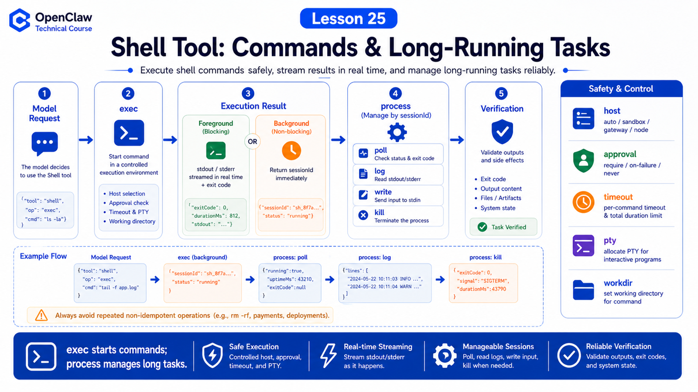

# Shell Tool: Command Execution, Output Reading, and Long-Running Tasks



Shell Tool is what lets OpenClaw move from talking to acting: editing projects, running tests, reading logs, and starting services.

It is also one of the easiest tools to misuse.

A command may only read:

```bash
rg "TODO" .
```

Or it may change files, delete directories, start services, write databases, or run for a long time.

So the important questions are:

```text
Where does the command run?
How does output return?
How are long tasks managed?
How do permissions and approvals apply?
When should the agent use process instead of repeated polling?
```

## The Key Idea: exec Starts, process Manages

OpenClaw shell capability has two layers:

```text
exec
  starts commands, returns foreground output, or backgrounds long work

process
  manages background sessions: list, poll, log, write, send-keys, kill, clear
```

Typical flow:

```text
model decides shell is needed
  ↓
OpenClaw checks policy, host, sandbox, approval
  ↓
exec starts command
  ↓
short command returns stdout/stderr/exit code
  ↓
long command returns running + sessionId + tail
  ↓
process reads logs, sends input, or terminates
```

## exec Is Not Read-Only

The docs explicitly describe `exec` as a mutating shell surface. Disabling `write`, `edit`, or `apply_patch` does not make `exec` read-only.

Examples:

```bash
echo "x" > file.txt
rm -rf build
python migrate.py
npm install
```

All can change system state.

Do not treat "only exec is enabled" as safety.

## Host: Where Does It Run?

`exec` host can be:

```text
auto
sandbox
gateway
node
```

Default `auto` means:

```text
if a sandbox runtime is active
  use sandbox

otherwise
  use gateway host
```

The docs also note that sandboxing is off by default. Without sandboxing, `host=auto` resolves to Gateway host.

Always ask:

```text
Is this command in sandbox or on host?
What is workdir?
Is host=node selected?
Is elevated enabled?
```

## Output: stdout, stderr, Tail, Exit Code

Short commands return:

```text
stdout
stderr
exit code
duration
```

Long commands that pass `yieldMs` become background sessions:

```text
status: running
sessionId
short tail
```

Then use:

```text
process poll
  read new output and exit status

process log
  read aggregated logs with offset/limit

process list
  list background sessions for this agent
```

Background sessions are in memory, not durable storage. Gateway restart loses them.

## Do Not Use sleep Loops for Scheduling

The docs are clear: if work starts now, start it once and use completion wake or `process`.

If work should happen later or on a schedule, use cron instead of:

```bash
sleep 3600 && do-something
```

Good split:

```text
long build / long test
  exec background or yieldMs
  process poll/log for status

future or scheduled work
  cron / automation
```

## TTY and stdin

Some CLIs need a TTY or input:

```text
exec pty: true
process write
process send-keys
process submit
process paste
```

But the agent should not blindly type passwords, codes, or sensitive interactive content. Login, approval, and 2FA should use human confirmation or dedicated tools.

## Permissions and Approvals

Shell safety is layered:

```text
tool policy
sandbox
host selection
exec approvals
allowlist / safe bins
ask fallback
OS filesystem permission
```

When approval is required, `exec` may return:

```text
status: approval-pending
approval id
```

The command runs only after approval.

## A Real Scenario

User asks:

```text
Run tests and diagnose failures.
```

Reasonable path:

```text
1. exec: npm test, yieldMs=1000
2. command backgrounds and returns sessionId
3. process poll: read failure output
4. exec: rg failed test name
5. read/edit/apply_patch if needed
6. exec: npm test -- targeted
7. summarize changes and verification
```

Do not start with dangerous commands, and do not launch duplicate tests while one is still running.

## Common Misunderstandings

### Misunderstanding 1: exec Is Read-Only

No. It can mutate files and system state.

### Misunderstanding 2: Background Sessions Persist Forever

No. They are in memory and disappear on Gateway restart.

### Misunderstanding 3: Long Tasks Need Constant Polling

No. Use completion wake, process, and cron for future work.

### Misunderstanding 4: Interpreters Are Safe Bins

Be careful. Python, Node, and Bash can load arbitrary code and usually need stricter approval.

## Final Summary

Shell Tool is about controlled execution.

In one sentence:

```text
exec starts commands, process manages long work, approvals and sandbox reduce risk, and logs plus exit code verify the result.
```

## Lesson Homework

1. Write one short-command flow and one long-command flow.
2. Explain `host=auto` with sandbox on and off.
3. Design a failed-test workflow using `exec` and `process poll`.
4. List three shell commands that should not run automatically.

## Next Lesson Preview

Next: Browser Tool for opening pages, clicking, typing, screenshots, and verification.

## References

- OpenClaw Docs: [Exec tool](https://docs.openclaw.ai/tools/exec)
- OpenClaw Docs: [Background exec and process tool](https://docs.openclaw.ai/gateway/background-process)
- OpenClaw Docs: [Exec approvals](https://docs.openclaw.ai/tools/exec-approvals)
- OpenClaw Docs: [apply_patch tool](https://docs.openclaw.ai/tools/apply-patch)
