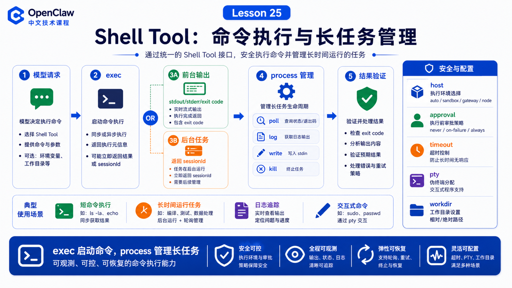

# Shell Tool：命令执行、输出读取和长任务管理



Shell Tool 是 OpenClaw 从“会聊天”变成“能改项目、跑测试、查日志”的关键能力。

但 shell 也是最容易被误用的工具。

因为一条命令可能只是读取：

```bash
rg "TODO" .
```

也可能会修改文件、删除目录、启动服务、写入数据库，甚至长期占用进程。

所以理解 Shell Tool，重点不是“能不能执行命令”，而是：

```text
命令在哪里执行？
输出如何返回？
长任务如何管理？
权限和 approval 如何介入？
什么时候应该用 process，而不是反复轮询？
```

## 先说结论：exec 负责启动，process 负责管理长任务

OpenClaw 的 shell 能力主要分成两层：

```text
exec
  启动命令，返回前台输出，或把长任务转为后台 session

process
  管理后台 session：list、poll、log、write、send-keys、kill、clear
```

典型流程是：

```text
模型决定需要 shell
  ↓
OpenClaw 检查工具 policy、host、sandbox、approval
  ↓
exec 启动命令
  ↓
短命令直接返回 stdout/stderr/exit code
  ↓
长命令返回 running + sessionId + tail
  ↓
process 后续读取日志、发送输入或终止
```

## exec 不是只读工具

官方文档明确提醒：`exec` 是 mutating shell surface。即使禁用了 `write`、`edit`、`apply_patch`，也不代表 `exec` 只读。

原因很简单：

```bash
echo "x" > file.txt
rm -rf build
python migrate.py
npm install
```

这些都可以通过 shell 改变系统状态。

所以不要把“只允许 exec”理解成安全。

## host：命令到底在哪运行

`exec` 的 host 可以是：

```text
auto
sandbox
gateway
node
```

默认 `auto` 的含义是：

```text
如果当前 session 有 sandbox runtime
  走 sandbox

否则
  走 gateway host
```

这点非常重要。官方文档也强调：sandboxing 默认是关闭的。如果没有开启 sandbox，`host=auto` 会解析到 Gateway host。

所以排查 shell 行为时先问：

```text
当前命令跑在 sandbox 里，还是宿主机上？
workdir 是哪里？
是否显式 host=node？
是否启用了 elevated？
```

## 输出读取：stdout、stderr、tail 和 exit code

短命令通常直接返回：

```text
stdout
stderr
exit code
duration
```

长命令如果超过 `yieldMs`，会被转到后台，并返回：

```text
status: running
sessionId
short tail
```

之后使用：

```text
process poll
  读取新增输出，并报告是否退出

process log
  读取聚合日志，支持 offset/limit

process list
  查看当前 agent 的后台 session
```

注意：后台 session 在内存里，不是永久任务数据库。Gateway 重启后会丢失。

## 长任务不要用 sleep 循环模拟调度

官方文档非常明确：如果任务是“现在开始的长任务”，启动一次，然后用自动 completion wake 或 `process` 管理。

如果任务是“以后再做”或“定时做”，应该用 cron，而不是：

```bash
sleep 3600 && do-something
```

或者让 Agent 反复 poll。

合理做法是：

```text
长构建 / 长测试
  exec background 或 yieldMs
  process poll/log 查看状态

未来任务 / 定时任务
  cron / automation
```

## TTY 和 stdin

有些 CLI 需要 TTY 或交互输入。

这时可以：

```text
exec pty: true
process write
process send-keys
process submit
process paste
```

但不要让 Agent 盲目输入密码、验证码或不可审计内容。遇到登录、审批、2FA 这类动作，应交给人工确认或专门工具。

## 权限和 approvals

Shell 的安全由多层控制：

```text
tool policy
sandbox
host selection
exec approvals
allowlist / safe bins
ask fallback
OS filesystem permission
```

当 approvals 需要人工确认时，`exec` 可能先返回：

```text
status: approval-pending
approval id
```

批准后才会真正执行。

## 一个真实场景

用户说：

```text
跑一下测试，失败的话帮我定位原因。
```

合理链路：

```text
1. exec: npm test，yieldMs=1000
2. 命令转后台，得到 sessionId
3. process poll：读取失败输出
4. exec: rg 失败测试名
5. read/edit/apply_patch：必要时修改文件
6. exec: npm test -- targeted
7. 总结改动和验证结果
```

不要一开始就跑危险命令，也不要在测试还运行时开启第二个重复测试。

## 常见误解

### 误解一：exec 是只读查询工具

不是。它可以修改文件和系统状态。

### 误解二：background session 会永久保存

不会。它是内存态，Gateway 重启会丢失。

### 误解三：长任务应该不停 poll

不应该。用 completion wake、process 读取，未来任务用 cron。

### 误解四：allowlist 可以放心加解释器

不建议把 Python、Node、Bash 这类解释器当普通 safe bin。它们可以加载任意代码，通常需要更严格 approval。

## 最后总结

Shell Tool 的核心是“可控执行”。

一句话总结：

```text
exec 启动命令，process 管理长任务，approval 和 sandbox 限制风险，日志和 exit code 负责验证结果。
```

## 本节作业

1. 写出一个短命令和一个长命令分别应该如何调用。
2. 解释 `host=auto` 在 sandbox 开启/关闭时的差异。
3. 设计一个测试失败排查流程，至少包含 `exec` 和 `process poll`。
4. 列出三个不应该自动执行的 shell 命令。

## 下一节预告

下一节讲 Browser Tool：网页打开、点击、输入、截图和验证。

## 参考资料

- OpenClaw Docs：[Exec tool](https://docs.openclaw.ai/tools/exec)
- OpenClaw Docs：[Background exec and process tool](https://docs.openclaw.ai/gateway/background-process)
- OpenClaw Docs：[Exec approvals](https://docs.openclaw.ai/tools/exec-approvals)
- OpenClaw Docs：[apply_patch tool](https://docs.openclaw.ai/tools/apply-patch)
