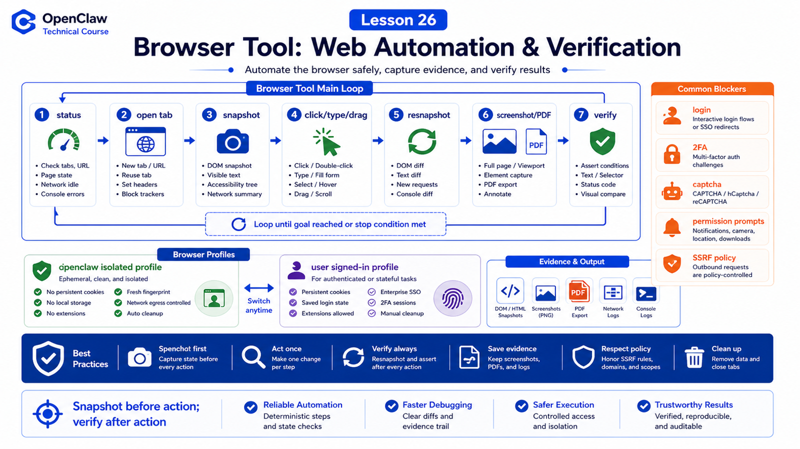

# Browser Tool: Opening Pages, Clicking, Typing, Screenshots, and Verification



Browser Tool lets OpenClaw operate real web pages.

But it is not "let the agent control your daily browser".

The docs describe an OpenClaw-managed Chrome/Brave/Edge/Chromium profile controlled by the agent and isolated from your personal browser.

## The Key Idea: Browser Is an Isolated Automation Surface

Browser Tool handles:

```text
start/connect browser profiles
open and manage tabs
read page snapshots
click/type/drag/select
screenshots and PDFs
console/errors/requests
downloads and file chooser
page-state verification
```

Typical loop:

```text
browser status
  ↓
open tab
  ↓
snapshot
  ↓
act click/type
  ↓
resnapshot
  ↓
screenshot / console / requests
  ↓
final verification
```

## openclaw Profile and user Profile

Common profiles:

```text
openclaw
  dedicated, isolated, agent automation first

user
  attaches to your real signed-in Chrome session when existing login matters
```

Prefer `openclaw` by default. Use `user` only when existing login state matters and the user can handle attach prompts, 2FA, captcha, or blockers.

## Snapshot Is Better Than Screenshot for Acting

Screenshots are for humans.

Snapshots are better for model action because they include structure, interactive elements, refs, text, and roles.

Recommended loop:

```text
open page
  ↓
snapshot
  ↓
choose stable ref / tabId
  ↓
act
  ↓
snapshot again
  ↓
verify change
```

Do not reuse old refs forever. Page changes can make refs stale.

## Click, Type, and Wait

Browser actions should not be blind coordinate clicking.

Better pattern:

```text
snapshot to find element
act by ref or stable selector
wait for page change
resnapshot to verify
recover stale refs once
report manual blockers
```

Manual blockers include:

```text
login
2FA
captcha
camera/microphone permission
payment or sensitive submission
```

The agent should stop and ask instead of guessing.

## Screenshots and Verification

Screenshots can:

```text
confirm rendering
record automation result
capture failure state
compare UI changes
export reports
```

Reliable verification often combines:

```text
snapshot text
console errors
network requests
screenshot
business result
```

A screenshot proves appearance, not necessarily data correctness.

## Configuration and Availability

Browser is a bundled plugin. For the agent to use it:

```text
browser plugin enabled
browser.enabled=true
tool policy allows browser
profile can start or connect
Playwright / CDP capability exists
SSRF policy allows target
```

If the tool is unavailable:

```bash
openclaw browser status
openclaw browser doctor
openclaw browser snapshot
```

## A Real Scenario

User asks:

```text
Open the admin dashboard, filter yesterday's orders, and send me a screenshot.
```

Reasonable path:

```text
1. browser status, confirm profile
2. open dashboard URL
3. snapshot date filter
4. type/click yesterday
5. resnapshot to verify filter
6. screenshot result
7. wait download if needed
8. summarize action and evidence
```

## Common Misunderstandings

### Misunderstanding 1: Browser Tool Is My Chrome

No. Default is the isolated OpenClaw-managed browser.

### Misunderstanding 2: Screenshot Is Verification

It is one piece of evidence. Use DOM, console, network, and business state too.

### Misunderstanding 3: Login and Captcha Can Be Bypassed Automatically

They should be treated as manual blockers.

### Misunderstanding 4: If It Can Open Pages, It Can Open Anything

Not always. SSRF policy, profile, network, and permissions apply.

## Final Summary

Browser Tool is observable web automation.

In one sentence:

```text
Snapshot before action, verify after action, use isolated profiles by default, and stop at manual blockers.
```

## Lesson Homework

1. Explain `openclaw` versus `user` profile.
2. Design a snapshot → click → resnapshot flow.
3. List three browser cases needing human intervention.
4. Explain what screenshot, DOM snapshot, and console errors each prove.

## Next Lesson Preview

Next: Canvas / Artifact, turning results into visible and interactive outputs.

## References

- OpenClaw Docs: [Browser](https://docs.openclaw.ai/tools/browser)
- OpenClaw Docs: [Browser control API](https://docs.openclaw.ai/tools/browser-control)
- OpenClaw Docs: [Browser login](https://docs.openclaw.ai/tools/browser-login)
- OpenClaw Docs: [Browser troubleshooting](https://docs.openclaw.ai/tools/browser-linux-troubleshooting)
