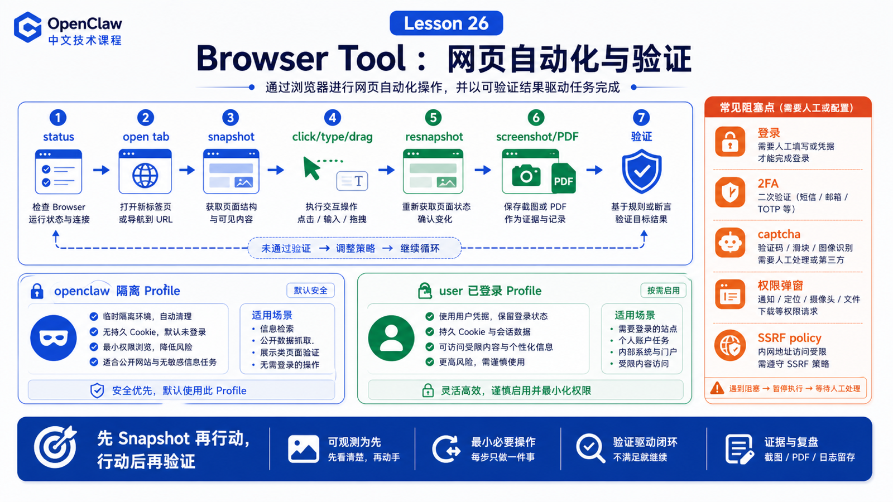

# Browser Tool：网页打开、点击、输入、截图和验证



浏览器工具让 OpenClaw 能操作真实网页。

但它不是“让 Agent 随便控制你的主浏览器”。

官方文档的入门模型很清楚：OpenClaw 可以运行一个专用的 Chrome/Brave/Edge/Chromium profile，由 Agent 控制，并与个人浏览器隔离。

## 先说结论：Browser 是隔离的自动化表面

Browser Tool 负责：

```text
启动/连接浏览器 profile
打开和管理 tab
读取页面 snapshot
执行 click/type/drag/select
截图和导出 PDF
读取 console/errors/requests
处理下载和文件选择
验证页面状态
```

典型链路：

```text
browser status
  ↓
open tab
  ↓
snapshot
  ↓
act click/type
  ↓
resnapshot
  ↓
screenshot / console / requests
  ↓
最终验证
```

## openclaw profile 和 user profile

OpenClaw 区分两类常见 profile：

```text
openclaw
  专用、隔离、Agent 自动化优先

user
  连接真实已登录 Chrome session，适合需要现有登录态且用户在场确认
```

默认应该优先用 `openclaw` profile。只有确实需要已有登录态，并且用户能处理 attach、2FA、captcha 等阻塞时，才考虑 `user` profile。

## Snapshot 比截图更适合行动

截图适合人看。

Snapshot 更适合模型行动，因为它包含页面结构、可交互元素、ref、文本和角色信息。

推荐循环：

```text
打开页面
  ↓
snapshot
  ↓
选择稳定 ref / tabId
  ↓
执行动作
  ↓
重新 snapshot
  ↓
验证变化
```

不要凭旧 ref 一直点击。页面变化后 ref 可能 stale。

## 点击、输入和等待

Browser action 不应该像“盲点坐标”。

更稳的方式是：

```text
先 snapshot 找元素
用 ref 或稳定 selector 操作
动作后等待页面变化
重新 snapshot 验证
失败时恢复一次，再报告人工阻塞
```

如果遇到：

```text
登录
2FA
captcha
摄像头/麦克风权限
支付或敏感提交
```

Agent 应该停下来请求人工处理，而不是猜。

## 截图和验证

Browser Tool 的截图不是装饰。

它可以用于：

```text
确认页面渲染
验证自动化结果
记录失败状态
对比 UI 改动
导出 PDF 或最终报告
```

但真正可靠的验证通常要组合：

```text
snapshot 文本
console errors
network requests
screenshot
业务结果
```

单张截图只能证明“看起来像”，不能证明“数据一定对”。

## 配置和可用性

Browser 是 bundled plugin。要让 Agent 使用它，需要同时满足：

```text
browser plugin enabled
browser.enabled=true
tool policy 允许 browser
profile 可启动或可连接
Playwright / CDP 能力可用
SSRF policy 允许目标地址
```

如果 Agent 说 browser tool 不可用，先查：

```bash
openclaw browser status
openclaw browser doctor
openclaw browser snapshot
```

## 一个真实场景

用户说：

```text
打开后台，把昨天订单筛出来，截图给我确认。
```

合理流程：

```text
1. browser status，确认 profile
2. open 后台 URL
3. snapshot 找日期筛选控件
4. type/click 设置昨天
5. resnapshot 确认筛选条件
6. screenshot 保存结果
7. 如果需要下载，再等待 download
8. 总结操作和验证依据
```

## 常见误解

### 误解一：Browser Tool 就是我的 Chrome

不是。默认是隔离的 OpenClaw-managed browser。

### 误解二：截图就是验证

截图只是证据之一，还要看 DOM、console、network、业务状态。

### 误解三：登录和 captcha 可以自动绕过

不应该。它们通常是人工阻塞。

### 误解四：能打开网页就能访问任何地址

不一定。SSRF policy、profile、网络、权限都会限制。

## 最后总结

Browser Tool 的核心是“可观察的网页自动化”。

一句话总结：

```text
先 snapshot 再行动，行动后再验证；默认使用隔离 profile，遇到人工阻塞就停下来。
```

## 本节作业

1. 用自己的话解释 `openclaw` profile 和 `user` profile。
2. 设计一个 snapshot → click → resnapshot 的浏览器流程。
3. 列出三种需要人工介入的浏览器场景。
4. 思考截图、DOM snapshot、console errors 分别能证明什么。

## 下一节预告

下一节讲 Canvas / Artifact：如何把结果变成可查看、可交互的产物。

## 参考资料

- OpenClaw Docs：[Browser](https://docs.openclaw.ai/tools/browser)
- OpenClaw Docs：[Browser control API](https://docs.openclaw.ai/tools/browser-control)
- OpenClaw Docs：[Browser login](https://docs.openclaw.ai/tools/browser-login)
- OpenClaw Docs：[Browser troubleshooting](https://docs.openclaw.ai/tools/browser-linux-troubleshooting)
