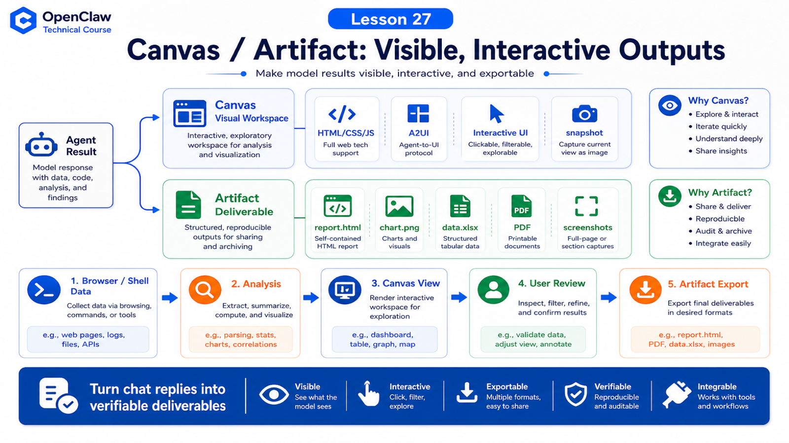

# Canvas / Artifact: Turning Results Into Visible, Interactive Outputs



Many agent tasks hit the same wall:

```text
The result should not be only a chat reply.
```

Examples:

```text
data analysis needs charts
browser automation needs screenshots
product design needs an interactive demo
debugging needs a structured report
workflows need visual boards
```

That is the value of Canvas and artifacts: the result becomes visible, interactive, and reusable.

## The Key Idea: Canvas Is a Visual Workspace, Artifact Is a Deliverable

Useful distinction:

```text
Canvas
  an agent-controlled visual panel for HTML/CSS/JS, A2UI, small interactive surfaces, and temporary workspaces

Artifact
  a deliverable the user can view, download, reuse, or keep editing: HTML, image, spreadsheet, report, chart, screenshot, PDF
```

They are not identical, but they share a goal:

```text
move results out of chat bubbles and into observable, verifiable, iterative surfaces
```

## Where Canvas Sits in OpenClaw

The macOS Canvas docs describe a Canvas panel embedded in the app using `WKWebView`. Canvas files live under Application Support:

```text
~/Library/Application Support/OpenClaw/canvas/<session>/...
```

They are served through a custom URL scheme:

```text
openclaw-canvas://<session>/<path>
```

Examples:

```text
openclaw-canvas://main/
openclaw-canvas://main/assets/app.css
```

Canvas is not a normal web server, and it is not the browser tool. It is a shared visual surface between OpenClaw, the agent, and the user.

## What Canvas Can Do

Canvas supports actions such as:

```text
show / hide panel
navigate to path or URL
evaluate JavaScript
capture snapshot image
auto-reload local canvas files
render A2UI surfaces
```

CLI examples:

```bash
openclaw nodes canvas present --node <id>
openclaw nodes canvas navigate --node <id> --url "/"
openclaw nodes canvas eval --node <id> --js "document.title"
openclaw nodes canvas snapshot --node <id>
```

This lets the agent show what it built instead of only writing files.

## Why Artifacts Matter

Chat is good for explanation, but weak for complex results.

If an agent analyzes sales data and only replies with paragraphs, the user cannot easily verify it.

Better output:

```text
summary.md
chart.png
report.html
data.xlsx
dashboard.html
before-after screenshots
```

Artifact requirements:

```text
viewable
verifiable
saveable
editable
referenceable by later tasks
```

That is why paths, screenshots, reports, and Canvas pages are more useful than "done".

## Canvas vs Browser

Browser Tool operates external web pages.

Canvas displays agent-created or agent-organized results.

Comparison:

```text
Browser
  external sites and real pages
  open, click, type, screenshot, verify

Canvas
  OpenClaw visual workspace
  display, interact, visualize, confirm
```

Example:

```text
Browser extracts dashboard data
  ↓
Agent analyzes it
  ↓
Canvas shows anomaly charts and filters
  ↓
User confirms
  ↓
Artifact exports report
```

## A2UI as Structured UI

Canvas can also render A2UI surfaces.

The docs mention A2UI v0.8 server-to-client messages such as:

```text
surfaceUpdate
beginRendering
dataModelUpdate
deleteSurface
```

Beginner mental model:

```text
not random HTML generated each time
but structured messages describing UI and data updates
```

This matters because agent-generated UI can be updated programmatically instead of rewritten as prose.

## A Real Scenario

User asks:

```text
Analyze yesterday's support tickets, find anomaly categories, and build a filterable result page.
```

Good path:

```text
1. Shell or API tool reads ticket data
2. model classifies anomaly types
3. generate report.json and summary.md
4. create Canvas page with table, filters, charts
5. open Canvas for user review
6. user asks to adjust classification rules
7. agent updates data and UI
8. export final artifact
```

If this were only a chat reply, details would be hard to verify.

Canvas turns it into an observable workflow.

## Delivery Principles

For Canvas / Artifact work:

```text
1. provide an openable file or surface, not only "done"
2. keep source data and generation logic where useful
3. important results should be screenshotable, downloadable, and reviewable
4. interactive UI should handle empty, error, and loading states
5. sensitive data should not be delivered to the wrong channel
```

An artifact is part of the task result, not decoration.

## Common Misunderstandings

### Misunderstanding 1: Canvas Is the Browser

No. Canvas is an OpenClaw app visual workspace. Browser is for external web automation.

### Misunderstanding 2: Artifact Means Attachment

Not exactly. Artifact emphasizes verifiable, iterative, reusable deliverables.

### Misunderstanding 3: Pretty Is Enough

No. It must also be verifiable, traceable, and updatable.

### Misunderstanding 4: Everything Needs Canvas

No. Short answers and simple commands do not. Complex visual or interactive results do.

## Final Summary

Canvas / Artifact moves agents from answering to delivering.

In one sentence:

```text
Browser helps the agent collect and verify external pages, Canvas displays and iterates internal results, and artifacts preserve the deliverable.
```

## Lesson Homework

1. Pick one task that deserves Canvas and explain why chat is not enough.
2. Design an artifact checklist with data, report, and screenshot.
3. Explain Browser versus Canvas.
4. Describe how a Canvas page should handle errors.

## Next Lesson Preview

Next: what to do when tools fail: retry, rollback, human confirmation, and risk warnings.

## References

- OpenClaw Docs: [Canvas](https://docs.openclaw.ai/platforms/mac/canvas)
- OpenClaw Docs: [Canvas plugin](https://docs.openclaw.ai/plugins/reference/canvas)
- OpenClaw Docs: [OpenClaw App SDK API design](https://docs.openclaw.ai/reference/openclaw-sdk-api-design)
- OpenClaw Docs: [Control UI](https://docs.openclaw.ai/web/control-ui)
