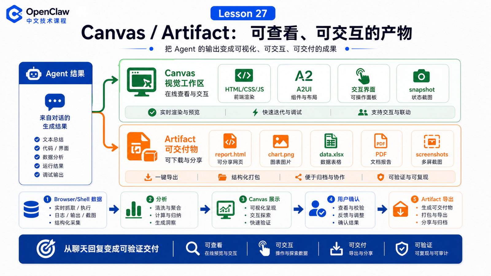

# Canvas / Artifact：把结果变成可查看、可交互的产物



很多 Agent 任务最后都会卡在同一个问题上：

```text
结果不应该只是一段聊天回复。
```

比如：

```text
数据分析结果需要图表
网页自动化结果需要截图
项目设计需要可交互 demo
排查报告需要结构化页面
任务流程需要可视化看板
```

这就是 Canvas / Artifact 的价值：把 Agent 的结果从“说出来”变成“看得见、点得动、能复用的产物”。

## 先说结论：Canvas 是视觉工作区，Artifact 是可交付结果

可以这样区分：

```text
Canvas
  一个由 Agent 控制的视觉面板，用来展示 HTML/CSS/JS、A2UI、小型交互界面和临时工作区。

Artifact
  一份可被用户查看、下载、复用或继续修改的产物，例如 HTML、图片、表格、报告、图表、截图、PDF。
```

它们不是同一个概念，但目标一致：

```text
让结果脱离聊天气泡，进入可观察、可验证、可迭代的界面。
```

## Canvas 在 OpenClaw 里处于什么位置

官方 macOS Canvas 文档说明，Canvas 面板嵌在 macOS app 里，使用 `WKWebView`，是一个轻量视觉工作区。Canvas 文件存放在 Application Support 下：

```text
~/Library/Application Support/OpenClaw/canvas/<session>/...
```

通过自定义 URL scheme 访问：

```text
openclaw-canvas://<session>/<path>
```

例如：

```text
openclaw-canvas://main/
openclaw-canvas://main/assets/app.css
```

这意味着 Canvas 不是普通网页服务器，也不是浏览器工具本身。它是 OpenClaw 给 Agent 和用户共享的可视化表面。

## Canvas 能做什么

Canvas 支持的核心动作包括：

```text
show / hide panel
navigate to path or URL
evaluate JavaScript
capture snapshot image
auto-reload local canvas files
render A2UI surfaces
```

CLI 里可以看到类似命令：

```bash
openclaw nodes canvas present --node <id>
openclaw nodes canvas navigate --node <id> --url "/"
openclaw nodes canvas eval --node <id> --js "document.title"
openclaw nodes canvas snapshot --node <id>
```

这让 Agent 不只是把代码写到文件里，还可以把它展示出来，让用户看到结果。

## Artifact 为什么重要

聊天回复适合解释，但不适合承载复杂结果。

例如，让 Agent 分析销售数据，如果只回一段文字，用户很难复核。

更好的交付是：

```text
summary.md
chart.png
report.html
data.xlsx
dashboard.html
before-after screenshots
```

Artifact 的核心要求是：

```text
可查看
可验证
可保存
可再次编辑
可在后续任务中引用
```

这也是为什么文件路径、截图、报告、Canvas 页面都比“我已经完成”更有价值。

## Canvas 和 Browser 的区别

Browser Tool 用来操作外部网页。

Canvas 用来展示 Agent 生成或组织的结果。

可以这样对比：

```text
Browser
  面向外部网站和真实页面
  重点是打开、点击、输入、截图、验证

Canvas
  面向 OpenClaw 内部视觉工作区
  重点是展示、交互、可视化、用户确认
```

例如：

```text
Browser 抓取后台数据
  ↓
Agent 分析数据
  ↓
Canvas 展示异常图表和过滤器
  ↓
用户确认
  ↓
Artifact 导出报告
```

## A2UI：结构化 UI 的方向

Canvas 还可以承载 A2UI surfaces。

官方文档提到，当前 Canvas 接受 A2UI v0.8 的 server-to-client messages，例如：

```text
surfaceUpdate
beginRendering
dataModelUpdate
deleteSurface
```

你可以先把 A2UI 理解成：

```text
不是让模型随便写一坨 HTML
而是用结构化消息描述界面和数据更新
```

这对未来的 Agent UI 很重要，因为它让“结果界面”可以被程序化更新，而不是每次都靠自然语言重写。

## 一个真实场景

用户说：

```text
帮我分析昨天客服工单，找出异常类型，并做一个可以筛选的结果页。
```

合理链路是：

```text
1. Shell 或 API 工具读取工单数据
2. 模型分类异常类型
3. 生成 report.json 和 summary.md
4. 生成 Canvas 页面：表格、筛选器、统计图
5. 打开 Canvas 给用户确认
6. 用户要求调整分类规则
7. Agent 更新数据和界面
8. 导出最终 Artifact
```

这个任务如果只用聊天回复，就会很难确认细节。

Canvas 把它变成了一个可观察的工作流。

## 产物交付的基本原则

做 Canvas / Artifact 时，要遵守几个原则：

```text
1. 不只说完成，要给可打开的文件或界面
2. 不只给最终图，要保留数据来源和生成逻辑
3. 重要结果要可截图、可下载、可复查
4. 交互界面要能处理空数据、错误状态和加载状态
5. 涉及敏感数据时，不要把内容发到不该去的 channel
```

这和普通文档生成不同。

Artifact 是任务结果的一部分，不是装饰品。

## 常见误解

### 误解一：Canvas 就是浏览器

不是。Canvas 是 OpenClaw app 里的视觉工作区；Browser 是外部网页自动化表面。

### 误解二：Artifact 就是附件

不完全是。Artifact 更强调可复核、可迭代、可继续使用的交付物。

### 误解三：只要结果好看就够了

不够。结果还要可验证、可追踪、可更新。

### 误解四：所有结果都应该做成 Canvas

不是。短答案、简单命令、一次性摘要不需要 Canvas。复杂、可视化、交互式结果才值得。

## 最后总结

Canvas / Artifact 的意义，是把 Agent 的能力从“回答”推进到“交付”。

一句话总结：

```text
Browser 帮 Agent 获取和验证外部页面，Canvas 帮 Agent 展示和迭代内部结果，Artifact 让结果变成可保存的交付物。
```

## 本节作业

1. 找一个适合 Canvas 的任务，说明为什么聊天回复不够。
2. 设计一个 Artifact 清单，至少包含数据、报告和截图。
3. 解释 Browser 和 Canvas 的区别。
4. 思考一个 Canvas 页面应该如何处理错误状态。

## 下一节预告

下一节讲工具失败时怎么办：重试、回滚、人工确认和风险提示。

## 参考资料

- OpenClaw Docs：[Canvas](https://docs.openclaw.ai/platforms/mac/canvas)
- OpenClaw Docs：[Canvas plugin](https://docs.openclaw.ai/plugins/reference/canvas)
- OpenClaw Docs：[OpenClaw App SDK API design](https://docs.openclaw.ai/reference/openclaw-sdk-api-design)
- OpenClaw Docs：[Control UI](https://docs.openclaw.ai/web/control-ui)
