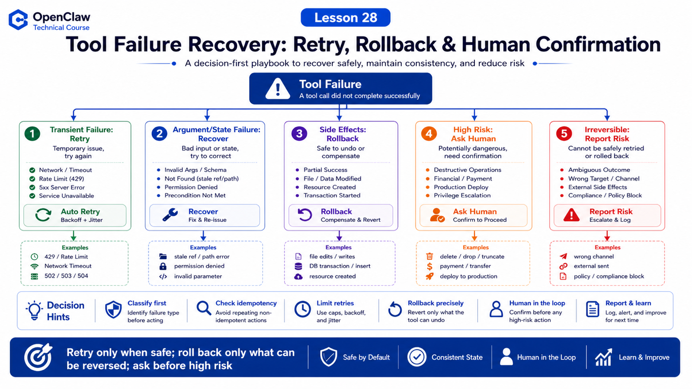

# What to Do When Tools Fail: Retry, Rollback, Human Confirmation, and Risk Warnings



Tool failure is not exceptional.

In real agent systems, it is normal.

Shell times out.

Browser hits login, 2FA, or captcha.

Files are missing.

The model passes wrong arguments.

External APIs return 429.

A mature OpenClaw workflow should not assume tools always succeed. It needs a failure strategy.

## The Key Idea: Classify First, Then Act

Do not retry immediately.

Classify:

```text
transient failure
  network jitter, 429, temporary service outage

argument failure
  wrong path, wrong selector, missing field

permission failure
  approval denied, tool policy, sandbox file boundary

state failure
  page not loaded, session expired, process waiting for input

dangerous failure
  data damage, duplicate submission, wrong channel delivery
```

Then decide:

```text
retry
recover
rollback
ask human
report risk
stop
```

## Retry: Only for Retryable Failures

Good retry cases:

```text
transient network errors
idempotent reads
temporary 5xx
occasional page-load timeout
short provider retries
```

Do not blindly retry:

```text
payments
message sending
deletes
database migrations
form submissions
production deployments
```

Repeated execution can create real side effects.

OpenClaw retry policy emphasizes retrying per request and avoiding duplicated non-idempotent operations.

## Recover: Fix Arguments and State

Many failures need recovery, not repetition.

Browser stale ref:

```text
old snapshot ref expired
  ↓
snapshot again
  ↓
find new ref
  ↓
try once more
```

Shell path error:

```text
file not found
  ↓
pwd / ls / rg to inspect
  ↓
rerun with correct workdir
```

That is smarter than retrying the same broken command three times.

## Rollback: Reliability Needs Reversal

If a tool changed files or system state before failing, consider rollback.

Strategies:

```text
file edits
  use apply_patch, keep diff, reverse patch when appropriate

code changes
  inspect git diff and revert only this task's changes

generated files
  delete or mark temporary artifacts

external systems
  if no reliable undo API exists, do not pretend rollback exists
```

Rollback is not "reset everything".

External systems, databases, messages, payments, and deployments may be irreversible. Then the correct action is stop, report risk, and ask for help.

## Human Confirmation

Ask the human when:

```text
destructive shell command
approval policy requires it
Browser hits login, 2FA, captcha
sensitive data may be sent to a group
important files will be deleted or overwritten
production deploy or payment
user intent is ambiguous
```

Human confirmation is not a failure of automation. It is part of safe automation.

## Risk Warnings: Do Not Wrap Uncertainty as Success

When a tool fails or work is partial, final replies should state:

```text
what completed
what failed
why it failed
side effects
whether retry happened
whether confirmation is needed
recommended next step
```

Do not say:

```text
Done.
```

if the truth is:

```text
page opened, but download failed
report generated, but delivery failed
files edited, but tests failed
```

## Trajectory: The Flight Recorder

OpenClaw trajectory capture acts as a per-session flight recorder. It records prompts, tool calls, runtime events, model state, plugins, usage, and errors.

Use it when you need to answer:

```text
Why did the model call this tool?
Which tool failed?
What was in context?
Did fallback happen?
```

This makes failure reviewable instead of vague.

## A Real Scenario

User says:

```text
Clean temporary files in this project.
```

The agent should not start with:

```bash
rm -rf *
```

Better path:

```text
1. list candidate files
2. distinguish build artifacts, cache, and user files
3. show deletion plan
4. request confirmation when needed
5. execute low-risk or reversible cleanup
6. keep logs
7. report deleted and skipped items
```

If deletion fails, report which file failed and why. Do not expand scope.

## Common Misunderstandings

### Misunderstanding 1: Tool Failure Means Retry

No. First determine idempotency and safety.

### Misunderstanding 2: Rollback Means git reset

No. Roll back only this task's changes and never discard unrelated user work.

### Misunderstanding 3: Human Confirmation Reduces Automation

No. It allows automation to enter higher-risk workflows safely.

### Misunderstanding 4: Apology Is Enough

No. Provide evidence, impact, and next steps.

## Final Summary

Tool failure handling is central to agent reliability.

In one sentence:

```text
Retry only when safe, roll back only what can be reversed, ask before high-risk actions, and report uncertainty clearly.
```

## Lesson Homework

1. List five tool failure types and a response for each.
2. Design a human confirmation flow before deleting files.
3. Explain why messages, payments, and deploys should not be blindly retried.
4. Take one failed task and write completed work, failed work, and risk warning.

## Next Lesson Preview

Next we move into Skills, MCP, and plugin extension: from using OpenClaw skills to building your own.

## References

- OpenClaw Docs: [Retry policy](https://docs.openclaw.ai/concepts/retry)
- OpenClaw Docs: [Exec approvals](https://docs.openclaw.ai/tools/exec-approvals)
- OpenClaw Docs: [Trajectory bundles](https://docs.openclaw.ai/tools/trajectory)
- OpenClaw Docs: [Diagnostics export](https://docs.openclaw.ai/gateway/diagnostics)
- OpenClaw Docs: [apply_patch tool](https://docs.openclaw.ai/tools/apply-patch)

---

Original link: [What to Do When Tools Fail: Retry, Rollback, Human Confirmation, and Risk Warnings](https://en.harries.blog/what-to-do-when-tools-fail-retry-rollback-human-confirmation-and-risk-warnings/)
